# Merge Two Agents Into One Monorepo -- Exhaustive Step-by-Step Plan

This plan contains every file path, every import line, every config value. A cheap LLM can follow it mechanically.

**Audit status:** FINAL -- all source files verified against plan on 2026-04-07. All import paths, `.env` loading, function signatures, and async/sync patterns confirmed correct.

---

## Context

**Source project A:** `c:\Nagdy\Mustafa\MIS\Real Projects\Multi_agents\PO Parsing AI Agent\` (referred to as `PO/`)
**Source project B:** `c:\Nagdy\Mustafa\MIS\Real Projects\Multi_agents\image-analysis-agent\` (referred to as `IMG/`)
**Target agents monorepo root:** `c:\Nagdy\Mustafa\MIS\Real Projects\Multi_agents\` (referred to as `ROOT/`)
**Target GAS repo root:** `c:\Nagdy\Mustafa\MIS\Real Projects\Multi_agents\gas-scripts\` (referred to as `GAS_ROOT/`) -- **separate Git repo, added to agents repo as a Git submodule**

GAS is shared by both agents but lives in its **own separate Git repository**. It is linked to the agents monorepo as a **Git submodule** at `gas-scripts/`. This means:
- `gas-scripts/` appears as a folder inside the agents repo but has its own independent Git history
- Cloning the agents repo with `--recurse-submodules` pulls the GAS code automatically
- GAS is deployed independently via `clasp` and communicates with the agents backend via HTTP webhooks
- The agents repo pins a specific GAS commit; update it with `git submodule update --remote`

---

## Architecture

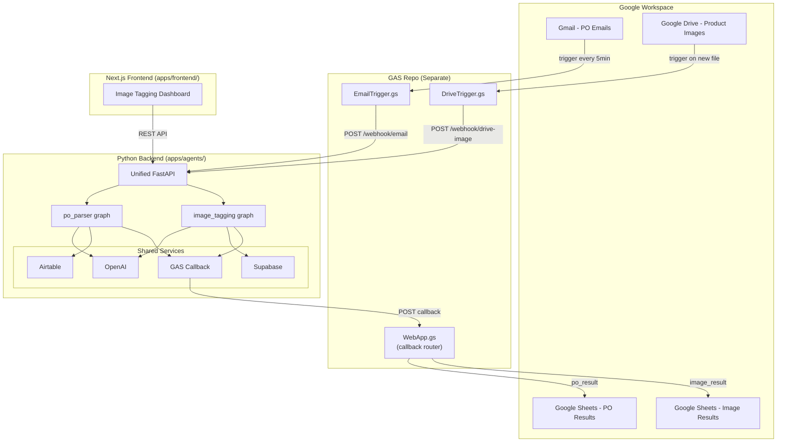

---

## Final File Trees

There are **two separate repos**. Every file listed below must exist after execution. Files marked **(new)** are created from scratch. Files marked **(copy)** are copied verbatim from source. Files marked **(copy+edit)** are copied then specific edits applied.

### Repo 1: Agents Monorepo (`ROOT/`)

```
ROOT/
  .env                                        (new -- merged from PO/.env + IMG/.env, real values)
  .env.example                                (new -- sanitized template, no secrets)
  .gitignore                                  (new)
  docker-compose.yml                          (new)
  README.md                                   (new -- workspace-level README)
  apps/
    agents/
      langgraph.json                          (new)
      requirements.txt                        (new)
      Dockerfile                              (new)
      .dockerignore                           (new)
      README.md                               (new -- agents app README)
      src/
        __init__.py                           (new, empty)
        services/
          __init__.py                         (copy from PO/src/services/__init__.py -- no changes)
          base.py                             (copy from PO/src/services/base.py -- no changes)
          openai/
            __init__.py                       (copy from PO/src/services/openai/__init__.py -- no changes)
            client.py                         (copy from PO/src/services/openai/client.py -- no changes)
            settings.py                       (copy from PO/src/services/openai/settings.py -- no changes)
          supabase/
            __init__.py                       (copy from IMG/backend/src/services/supabase/__init__.py -- no changes)
            client.py                         (copy from IMG/backend/src/services/supabase/client.py -- no changes)
            settings.py                       (copy+edit from IMG/backend/src/services/supabase/settings.py)
          airtable/
            __init__.py                       (copy from PO/src/services/airtable/__init__.py -- no changes)
            client.py                         (copy from PO/src/services/airtable/client.py -- no changes)
            settings.py                       (copy from PO/src/services/airtable/settings.py -- no changes)
          gas_callback/
            __init__.py                       (copy from PO/src/services/gas_callback/__init__.py -- no changes)
            client.py                         (copy from PO/src/services/gas_callback/client.py -- no changes)
            settings.py                       (copy from PO/src/services/gas_callback/settings.py -- no changes)
        po_parser/
          __init__.py                         (copy from PO/ -- no changes)
          po_parser.py                        (copy from PO/ -- no changes)
          graph_builder.py                    (copy from PO/ -- no changes)
          configuration.py                    (copy from PO/ -- no changes)
          settings.py                         (copy from PO/ -- no changes)
          utils.py                            (copy from PO/ -- no changes)
          nodes/
            __init__.py                       (copy -- no changes)
            classifier.py                     (copy -- no changes)
            body_parser.py                    (copy -- no changes)
            consolidator.py                   (copy -- no changes)
            excel_parser.py                   (copy -- no changes)
            extractor.py                      (copy -- no changes)
            gas_callback.py                   (copy -- no changes)
            normalizer.py                     (copy -- no changes)
            pdf_parser.py                     (copy -- no changes)
            routing.py                        (copy -- no changes)
            validator.py                      (copy -- no changes)
            airtable_writer.py                (copy -- no changes)
          prompts/
            __init__.py                       (copy -- no changes)
            classification.py                 (copy -- no changes)
            extraction.py                     (copy -- no changes)
            ocr.py                            (copy -- no changes)
          schemas/
            __init__.py                       (copy -- no changes)
            classification.py                 (copy -- no changes)
            email.py                          (copy -- no changes)
            po.py                             (copy -- no changes)
            routing.py                        (copy -- no changes)
            states.py                         (copy -- no changes)
            validation.py                     (copy -- no changes)
          tools/
            __init__.py                       (copy -- no changes)
            file_helpers.py                   (copy -- no changes)
        image_tagging/
          __init__.py                         (new, empty)
          image_tagging.py                    (copy -- no changes, relative imports)
          graph_builder.py                    (copy -- no changes, relative imports)
          configuration.py                    (copy -- no changes, relative imports)
          settings.py                         (copy+edit -- fix path traversal)
          taxonomy.py                         (copy -- no changes)
          nodes/
            __init__.py                       (copy -- no changes, relative imports)
            preprocessor.py                   (copy -- no changes)
            vision.py                         (copy -- no changes)
            taggers.py                        (copy -- no changes)
            validator.py                      (copy -- no changes)
            confidence.py                     (copy -- no changes)
            aggregator.py                     (copy -- no changes)
          prompts/
            __init__.py                       (copy -- no changes)
            system.py                         (copy -- no changes)
            tagger.py                         (copy -- no changes)
          schemas/
            __init__.py                       (copy -- no changes)
            models.py                         (copy -- no changes)
            states.py                         (copy -- no changes)
        api/
          __init__.py                         (new, empty)
          main.py                             (new)
          middleware.py                        (copy from PO/src/api/middleware.py -- no changes)
      tests/
        __init__.py                           (copy from PO/tests/)
        unit/                                 (copy from PO/tests/unit/)
        integration/                          (copy from PO/tests/integration/)
        sample_pos/                           (copy from PO/tests/sample_pos/)
      docs/
        shared/                               (monorepo-wide docs -- not agent-specific)
          FOLDER_STRUCTURE.md                 (copy from PO/Description/FOLDER_STRUCTURE.md)
          ARCHITECTURE_OVERVIEW.md            (new -- unified architecture with 15 Mermaid diagrams)
        po_parser/                            (copy all from PO/docs/)
        image_tagging/                        (copy all from IMG/documentation/ and IMG/docs/)
    frontend/                                 (full copy of IMG/frontend/)
      Dockerfile
      package.json
      package-lock.json
      next.config.ts                          (copy -- no changes needed)
      tsconfig.json
      postcss.config.mjs
      eslint.config.mjs
      components.json
      .gitignore
      README.md                               (new -- frontend app README)
      src/                                    (full copy)
      public/                                 (full copy)
  scripts/
    test_e2e_mock.py                          (copy from PO/scripts/test_e2e_mock.py)
```

### Repo 2: GAS Scripts (`GAS_ROOT/` = `ROOT/gas-scripts/`)

This is a **separate Git repository** deployed independently via `clasp`.

```
GAS_ROOT/
  shared/
    Config.gs                                 (copy+edit from PO/gas/Config.gs)
    WebApp.gs                                 (new -- multi-agent callback routing)
    LabelManager.gs                           (copy from PO/gas/LabelManager.gs -- no changes)
  po_parser/
    EmailTrigger.gs                           (copy from PO/gas/Code.gs -- rename only)
    SheetsWriter.gs                           (copy from PO/gas/SheetsWriter.gs -- no changes)
    Notifier.gs                               (copy from PO/gas/Notifier.gs -- no changes)
  image_tagger/
    DriveTrigger.gs                           (new)
    SheetsWriter.gs                           (new)
  appsscript.json                             (copy+edit from PO/gas/appsscript.json)
  .clasp.json                                 (copy from PO/gas/.clasp.json)
  .claspignore                                (copy from PO/gas/.claspignore)
  .gitignore                                  (new)
  README.md                                   (new)
```

---

## Step 1: Create the Directory Scaffold

Run these commands from `ROOT/` to create all directories for the **agents monorepo**. Do NOT delete the old project folders yet.

**NOTE: The workspace is Windows (PowerShell).** Use `New-Item -ItemType Directory -Force -Path` or use Git Bash where `mkdir -p` works. The commands below use PowerShell syntax:

```powershell
# Agents monorepo directories
New-Item -ItemType Directory -Force -Path "apps/agents/src/services/openai"
New-Item -ItemType Directory -Force -Path "apps/agents/src/services/supabase"
New-Item -ItemType Directory -Force -Path "apps/agents/src/services/airtable"
New-Item -ItemType Directory -Force -Path "apps/agents/src/services/gas_callback"
New-Item -ItemType Directory -Force -Path "apps/agents/src/po_parser/nodes"
New-Item -ItemType Directory -Force -Path "apps/agents/src/po_parser/prompts"
New-Item -ItemType Directory -Force -Path "apps/agents/src/po_parser/schemas"
New-Item -ItemType Directory -Force -Path "apps/agents/src/po_parser/tools"
New-Item -ItemType Directory -Force -Path "apps/agents/src/image_tagging/nodes"
New-Item -ItemType Directory -Force -Path "apps/agents/src/image_tagging/prompts"
New-Item -ItemType Directory -Force -Path "apps/agents/src/image_tagging/schemas"
New-Item -ItemType Directory -Force -Path "apps/agents/src/api"
New-Item -ItemType Directory -Force -Path "apps/agents/tests/unit"
New-Item -ItemType Directory -Force -Path "apps/agents/tests/integration"
New-Item -ItemType Directory -Force -Path "apps/agents/docs/shared"
New-Item -ItemType Directory -Force -Path "apps/agents/docs/po_parser"
New-Item -ItemType Directory -Force -Path "apps/agents/docs/image_tagging"
New-Item -ItemType Directory -Force -Path "apps/frontend"
New-Item -ItemType Directory -Force -Path "scripts"
```

Create the **GAS repo** scaffold (separate repo):

```powershell
New-Item -ItemType Directory -Force -Path "gas-scripts/shared"
New-Item -ItemType Directory -Force -Path "gas-scripts/po_parser"
New-Item -ItemType Directory -Force -Path "gas-scripts/image_tagger"
```

Create empty `__init__.py` files (agents repo only). Use the file Write tool (NOT shell echo/touch) to create each as a completely empty file:
- `apps/agents/src/__init__.py` -- empty file
- `apps/agents/src/api/__init__.py` -- empty file
- `apps/agents/src/image_tagging/__init__.py` -- empty file
- `apps/agents/tests/__init__.py` -- empty file

NOTE: The `po_parser/` and `services/` packages already have their own `__init__.py` files (copied from source). Do NOT create empty ones that would overwrite them.

---

## Step 2: Copy Shared Services

### 2a. `apps/agents/src/services/base.py`
**Action:** Copy verbatim from `PO/src/services/base.py`. No changes needed -- it only imports from `pydantic_settings`.

### 2b. `apps/agents/src/services/__init__.py`
**Action:** Copy from `PO/src/services/__init__.py`. No changes needed.
Current content: `from src.services.base import load_settings` -- this path is still correct since the working directory is `apps/agents/` and Python path includes it.

### 2c. OpenAI service (`apps/agents/src/services/openai/`)
**Copy all 3 files verbatim (no changes needed):**
- `PO/src/services/openai/settings.py` --> `apps/agents/src/services/openai/settings.py`
- `PO/src/services/openai/client.py` --> `apps/agents/src/services/openai/client.py`
- `PO/src/services/openai/__init__.py` --> `apps/agents/src/services/openai/__init__.py`

All imports (`from src.services.openai.settings`, `from src.services.openai.client`) remain correct. Do NOT edit any of these files.

### 2d. Supabase service (`apps/agents/src/services/supabase/`)
**Copy verbatim (no changes):**
- `IMG/backend/src/services/supabase/client.py` --> `apps/agents/src/services/supabase/client.py` (uses `from .settings import` -- relative, no change)
- `IMG/backend/src/services/supabase/__init__.py` --> `apps/agents/src/services/supabase/__init__.py` (uses `from .client import` and `from .settings import` -- relative, no change)

**Copy + edit:**
- `IMG/backend/src/services/supabase/settings.py` --> `apps/agents/src/services/supabase/settings.py`
  - **Edit:** The file computes `_project_root` by traversing parent directories: `Path(__file__).resolve().parent.parent.parent` (gets to `backend/`) then `.parent` (gets to `image-analysis-agent/`). This is wrong in the new location. Replace the entire `_backend_dir` / `_project_root` / `load_dotenv` block with:
    

```python
    from dotenv import load_dotenv
    load_dotenv()
    

```
    This works because the single `.env` file lives at `ROOT/.env` and `uvicorn` is started from `ROOT/` (via docker-compose) or the user sets `PYTHONPATH`. The `load_dotenv()` call with no args searches upward from the working directory. Remove the `Path` import and the `_backend_dir` / `_project_root` variables.

### 2e. Airtable service (`apps/agents/src/services/airtable/`)
**Copy verbatim (no changes):**
- `PO/src/services/airtable/settings.py` -- uses only `pydantic_settings`, no project imports
- `PO/src/services/airtable/client.py` -- imports `from src.services.airtable.settings import AirtableSettings` which is unchanged
- `PO/src/services/airtable/__init__.py` -- imports from `src.services.airtable.client` and `src.services.airtable.settings`, unchanged

### 2f. GAS Callback service (`apps/agents/src/services/gas_callback/`)
**Copy verbatim (no changes):**
- `PO/src/services/gas_callback/settings.py` -- uses only `pydantic`, `pydantic_settings`, no project imports
- `PO/src/services/gas_callback/client.py` -- imports `from src.services.gas_callback.settings import GASCallbackSettings`, unchanged
- `PO/src/services/gas_callback/__init__.py` -- imports from `src.services.gas_callback.client` and `src.services.gas_callback.settings`, unchanged

---

## Step 3: Copy PO Parser Agent

Copy the entire `PO/src/po_parser/` directory to `apps/agents/src/po_parser/`.

All files use `from src.po_parser.*` absolute imports, which remain correct since the Python path root is `apps/agents/` (via `langgraph.json` `dependencies: ["."]` and `PYTHONPATH`). **No import changes needed** for any `src.po_parser.*` or `src.services.*` import.

**Files to copy verbatim (no changes at all):**
- `po_parser/__init__.py`
- `po_parser/po_parser.py` (imports `from src.po_parser.graph_builder import build_graph` -- correct)
- `po_parser/graph_builder.py` (imports from `src.po_parser.nodes` and `src.po_parser.schemas.states` -- correct)
- `po_parser/configuration.py` (no project imports)
- `po_parser/settings.py` (no project imports)
- `po_parser/utils.py` (no project imports)
- `po_parser/nodes/__init__.py` (all `from src.po_parser.nodes.*` -- correct)
- `po_parser/nodes/classifier.py` (imports from `src.po_parser.*` and `src.services.openai.*` -- correct)
- `po_parser/nodes/body_parser.py` (imports `src.po_parser.schemas.states` -- correct)
- `po_parser/nodes/consolidator.py` (imports `src.po_parser.schemas.states` -- correct)
- `po_parser/nodes/excel_parser.py` (imports `src.po_parser.*` -- correct)
- `po_parser/nodes/extractor.py` (imports from `src.po_parser.*` and `src.services.openai.*` -- correct)
- `po_parser/nodes/gas_callback.py` (imports from `src.po_parser.*` and `src.services.gas_callback.*` -- correct)
- `po_parser/nodes/normalizer.py` (imports `src.po_parser.schemas.*` -- correct)
- `po_parser/nodes/pdf_parser.py` (imports from `src.po_parser.*` and `src.services.openai.*` -- correct)
- `po_parser/nodes/routing.py` (imports `src.po_parser.schemas.states` -- correct)
- `po_parser/nodes/validator.py` (imports from `src.po_parser.*` and `src.services.airtable.*` -- correct)
- `po_parser/nodes/airtable_writer.py` (imports from `src.po_parser.*` and `src.services.airtable.*` -- correct)
- `po_parser/prompts/__init__.py` (imports from `src.po_parser.prompts.*` -- correct)
- `po_parser/prompts/classification.py` (no imports)
- `po_parser/prompts/extraction.py` (no imports)
- `po_parser/prompts/ocr.py` (no imports)
- `po_parser/schemas/__init__.py` (imports from `src.po_parser.schemas.*` -- correct)
- `po_parser/schemas/classification.py` (no project imports)
- `po_parser/schemas/email.py` (no project imports)
- `po_parser/schemas/po.py` (no project imports)
- `po_parser/schemas/routing.py` (no project imports)
- `po_parser/schemas/states.py` (imports from `src.po_parser.schemas.*` -- correct)
- `po_parser/schemas/validation.py` (no project imports)
- `po_parser/tools/__init__.py` (imports from `src.po_parser.tools.file_helpers` -- correct)
- `po_parser/tools/file_helpers.py` (no project imports)

**Summary: ZERO import edits needed for po_parser.** Just copy the entire folder.

---

## Step 4: Copy Image Tagging Agent

Copy the entire `IMG/backend/src/image_tagging/` directory to `apps/agents/src/image_tagging/`.

The image_tagging agent uses **relative imports** internally (e.g. `from .graph_builder import`, `from ..schemas.states import`). These remain correct.

**Files to copy verbatim (no changes):**
- `image_tagging/image_tagging.py` (`from .graph_builder import build_graph` -- relative, correct)
- `image_tagging/graph_builder.py` (all relative imports -- correct)
- `image_tagging/taxonomy.py` (no imports)
- `image_tagging/nodes/__init__.py` (all relative -- correct)
- `image_tagging/nodes/preprocessor.py` (relative -- correct)
- `image_tagging/nodes/vision.py` (relative -- correct)
- `image_tagging/nodes/taggers.py` (relative -- correct)
- `image_tagging/nodes/validator.py` (relative -- correct)
- `image_tagging/nodes/confidence.py` (relative -- correct)
- `image_tagging/nodes/aggregator.py` (relative -- correct)
- `image_tagging/prompts/__init__.py` (relative -- correct)
- `image_tagging/prompts/system.py` (no imports)
- `image_tagging/prompts/tagger.py` (no imports)
- `image_tagging/schemas/__init__.py` (relative -- correct)
- `image_tagging/schemas/models.py` (no project imports)
- `image_tagging/schemas/states.py` (no project imports)

**Files to copy + edit:**

### `image_tagging/settings.py`
The original computes `_project_root` with path traversal to find the `.env` file. Since we now have a single `.env` at `ROOT/`, replace the path computation with simple `load_dotenv()` which searches upward from the working directory.

**Original lines to remove:**
```python
_backend_dir = Path(__file__).resolve().parent.parent.parent
_project_root = _backend_dir.parent
load_dotenv(_project_root / ".env")
```

**Replace with:**
```python
load_dotenv()
```

Also remove the `from pathlib import Path` import since it is no longer needed. Keep the `import os` and `from dotenv import load_dotenv` imports.

**IMPORTANT:** This file has `raise ValueError("OPENAI_API_KEY is required...")` at module level. This means ANY import of `src.image_tagging.*` will crash if `OPENAI_API_KEY` is not in the environment. This is intentional (the agent can't function without it). If you see this error during verification (Step 25), it means `.env` is not being loaded -- make sure you run from `ROOT/` where `.env` lives or set `OPENAI_API_KEY` manually.

### `image_tagging/configuration.py`
No changes needed. It imports `from .settings import OPENAI_MODEL` -- relative, correct.

---

## Step 5: Fix Import Paths in Services

**Result: No changes needed.** All `src.services.*` absolute imports remain valid because the Python path root is `apps/agents/`. All relative imports (`.settings`, `.client`) remain valid because relative positions are unchanged.

The only edit was `supabase/settings.py` in Step 2d (path traversal fix), already covered.

---

## Step 6: Fix Import Paths in po_parser

**Result: No changes needed.** All imports use `src.po_parser.*` and `src.services.*` absolute paths which are unchanged. Covered in Step 3.

---

## Step 7: Fix Import Paths in image_tagging

**Result: Minimal changes.** The only file that needed editing was `settings.py` (Step 4). All other files use relative imports which are position-independent.

The `server.py` file (which had absolute imports like `from src.image_tagging.taxonomy import TAXONOMY` and `from src.services.supabase import SUPABASE_ENABLED`) is NOT being copied -- it is replaced by the unified `api/main.py` in Step 8.

---

## Step 8: Create Unified API

### 8a. `apps/agents/src/api/__init__.py`
Create empty file.

### 8b. `apps/agents/src/api/middleware.py`
Copy verbatim from `PO/src/api/middleware.py`. No changes. It only uses `os`, `hmac`, and `fastapi`.

### 8c. `apps/agents/src/api/main.py` (NEW FILE)

This file merges PO parser's `main.py` and image tagger's `server.py` into one FastAPI app, plus adds a new `/webhook/drive-image` endpoint for GAS.

**Write the EXACT content below as the file. Do NOT modify anything:**

```python
"""Unified FastAPI entry-point for the Multi-Agent Platform.

Combines PO parser webhook and image tagging REST API into one app.
"""
from __future__ import annotations

import asyncio
import base64
import logging
import os
import time
import uuid
from datetime import datetime, timezone
from pathlib import Path

from dotenv import load_dotenv
from fastapi import BackgroundTasks, Depends, FastAPI, File, HTTPException, Request, UploadFile
from fastapi.middleware.cors import CORSMiddleware
from fastapi.responses import JSONResponse
from fastapi.staticfiles import StaticFiles

from src.api.middleware import verify_webhook_secret
from src.po_parser.schemas.email import IncomingEmail

load_dotenv()

_level = getattr(logging, os.getenv("LOG_LEVEL", "INFO").upper(), logging.INFO)
logging.basicConfig(level=_level)
logger = logging.getLogger(__name__)

# uploads/ lives at apps/agents/uploads/
UPLOADS_DIR = Path(__file__).resolve().parent.parent.parent / "uploads"
UPLOADS_DIR.mkdir(parents=True, exist_ok=True)

ALLOWED_IMAGE_EXTENSIONS = {".jpg", ".jpeg", ".png", ".webp"}
ALLOWED_CONTENT_TYPES = {"image/jpeg", "image/png", "image/webp"}

BATCH_STORAGE: dict[str, dict] = {}

app = FastAPI(title="Multi-Agent Platform")


@app.exception_handler(Exception)
async def global_exception_handler(request: Request, exc: Exception):
    logger.exception("Unhandled error: %s", exc)
    return JSONResponse(
        status_code=500,
        content={"detail": str(exc), "type": type(exc).__name__},
    )


app.add_middleware(
    CORSMiddleware,
    allow_origins=["*"],
    allow_credentials=True,
    allow_methods=["*"],
    allow_headers=["*"],
)

app.mount("/uploads", StaticFiles(directory=str(UPLOADS_DIR)), name="uploads")


# ---------------------------------------------------------------------------
# PO Parser endpoints
# ---------------------------------------------------------------------------

def _run_pipeline(email: IncomingEmail) -> None:
    from src.po_parser.po_parser import graph

    initial = {
        "email": email,
        "classification": None,
        "pdf_texts": [],
        "excel_data": [],
        "body_text": None,
        "consolidated_text": None,
        "extracted_po": None,
        "normalized_po": None,
        "validation": None,
        "airtable_record_id": None,
        "airtable_url": None,
        "gas_callback_status": None,
        "errors": [],
        "processing_start_time": time.time(),
    }
    try:
        graph.invoke(initial)
    except Exception:
        logger.exception("Pipeline failed for message_id=%s", email.message_id)


@app.get("/health")
def health() -> dict:
    return {
        "status": "healthy",
        "timestamp": datetime.now(timezone.utc).isoformat(),
    }


@app.post("/webhook/email")
def webhook_email(
    email: IncomingEmail,
    background_tasks: BackgroundTasks,
    _: None = Depends(verify_webhook_secret),
) -> JSONResponse:
    background_tasks.add_task(_run_pipeline, email)
    return JSONResponse(
        status_code=202,
        content={"status": "accepted", "message_id": email.message_id},
    )


# ---------------------------------------------------------------------------
# Image Tagging endpoints
# ---------------------------------------------------------------------------

@app.get("/api/taxonomy")
def get_taxonomy():
    from src.image_tagging.taxonomy import TAXONOMY
    return TAXONOMY


@app.post("/api/analyze-image")
async def analyze_image(request: Request, file: UploadFile = File(..., alias="file")):
    suffix = Path(file.filename or "").suffix.lower()
    if suffix not in ALLOWED_IMAGE_EXTENSIONS:
        raise HTTPException(status_code=400, detail="Invalid file type. Allowed: JPG, PNG, WEBP.")
    if file.content_type and file.content_type not in ALLOWED_CONTENT_TYPES:
        raise HTTPException(status_code=400, detail="Invalid file type. Allowed: JPG, PNG, WEBP.")

    image_id = str(uuid.uuid4())
    filename = f"{image_id}{suffix}"
    filepath = UPLOADS_DIR / filename
    contents = await file.read()
    filepath.write_bytes(contents)

    base_url = str(request.base_url).rstrip("/")
    image_url = f"{base_url}/uploads/{filename}"
    image_base64 = base64.b64encode(contents).decode("utf-8")

    try:
        from src.image_tagging.image_tagging import graph
    except Exception as e:
        raise HTTPException(status_code=500, detail=f"Graph load error: {e}")

    initial_state = {
        "image_id": image_id,
        "image_url": image_url,
        "image_base64": image_base64,
        "partial_tags": [],
    }

    try:
        result = await graph.ainvoke(initial_state)
    except Exception as e:
        raise HTTPException(status_code=500, detail=f"Analysis failed: {e}")

    saved_to_db = False
    try:
        from src.services.supabase import SUPABASE_ENABLED, get_client
        if SUPABASE_ENABLED:
            client = get_client()
            if client:
                tag_record = result.get("tag_record")
                if isinstance(tag_record, dict):
                    client.upsert_tag_record(
                        image_id=result.get("image_id", image_id),
                        tag_record=tag_record,
                        image_url=image_url,
                        needs_review=bool(result.get("flagged_tags")),
                        processing_status=result.get("processing_status", "complete"),
                    )
                    saved_to_db = True
    except Exception as e:
        logger.warning("Failed to save tag record to DB: %s", e)

    validated = result.get("validated_tags") or {}
    partial = result.get("partial_tags") or []
    tags_by_category = {}
    for cat, tag_list in validated.items():
        tags_by_category[cat] = [
            {"value": t.get("value"), "confidence": t.get("confidence", 0)}
            for t in tag_list if isinstance(t, dict)
        ]
    if not tags_by_category and partial:
        for item in partial:
            if isinstance(item, dict) and item.get("category"):
                cat = item["category"]
                scores = item.get("confidence_scores") or {}
                tags_by_category[cat] = [
                    {"value": v, "confidence": scores.get(v, 0)} for v in (item.get("tags") or [])
                ]

    return {
        "image_url": result.get("image_url", image_url),
        "image_id": result.get("image_id", image_id),
        "vision_description": result.get("vision_description", ""),
        "vision_raw_tags": result.get("vision_raw_tags", {}),
        "partial_tags": result.get("partial_tags", []),
        "tags_by_category": tags_by_category,
        "tag_record": result.get("tag_record"),
        "flagged_tags": result.get("flagged_tags", []),
        "processing_status": result.get("processing_status", "complete"),
        "saved_to_db": saved_to_db,
    }


@app.get("/api/tag-image/{image_id}")
def get_tag_image(image_id: str):
    try:
        from src.services.supabase import SUPABASE_ENABLED, get_client
    except ImportError:
        raise HTTPException(status_code=503, detail="Database not available")
    if not SUPABASE_ENABLED:
        raise HTTPException(status_code=503, detail="Database not configured")
    client = get_client()
    if not client:
        raise HTTPException(status_code=503, detail="Database not available")
    row = client.get_tag_record(image_id)
    if row is None:
        raise HTTPException(status_code=404, detail="Image not found")
    return row


@app.get("/api/tag-images")
def list_tag_images(limit: int = 20, offset: int = 0):
    try:
        from src.services.supabase import SUPABASE_ENABLED, get_client
    except ImportError:
        raise HTTPException(status_code=503, detail="Database not available")
    if not SUPABASE_ENABLED:
        raise HTTPException(status_code=503, detail="Database not configured")
    client = get_client()
    if not client:
        raise HTTPException(status_code=503, detail="Database not available")
    rows = client.list_tag_images(limit=limit, offset=offset)
    return {"items": rows, "limit": limit, "offset": offset}


def _parse_filter_params(
    season: str | None = None,
    theme: str | None = None,
    objects: str | None = None,
    dominant_colors: str | None = None,
    design_elements: str | None = None,
    occasion: str | None = None,
    mood: str | None = None,
    product_type: str | None = None,
) -> dict[str, list[str]]:
    filters = {}
    for key, param in [
        ("season", season), ("theme", theme), ("objects", objects),
        ("dominant_colors", dominant_colors), ("design_elements", design_elements),
        ("occasion", occasion), ("mood", mood), ("product_type", product_type),
    ]:
        if param:
            values = [v.strip() for v in param.split(",") if v.strip()]
            if values:
                filters[key] = values
    return filters


@app.get("/api/search-images")
def search_images(
    season: str | None = None,
    theme: str | None = None,
    objects: str | None = None,
    dominant_colors: str | None = None,
    design_elements: str | None = None,
    occasion: str | None = None,
    mood: str | None = None,
    product_type: str | None = None,
    limit: int = 50,
):
    try:
        from src.services.supabase import SUPABASE_ENABLED, get_client
    except ImportError:
        raise HTTPException(status_code=503, detail="Database not available")
    if not SUPABASE_ENABLED:
        raise HTTPException(status_code=503, detail="Database not configured")
    client = get_client()
    if not client:
        raise HTTPException(status_code=503, detail="Database not available")
    filters = _parse_filter_params(
        season=season, theme=theme, objects=objects, dominant_colors=dominant_colors,
        design_elements=design_elements, occasion=occasion, mood=mood, product_type=product_type,
    )
    rows = client.search_images_filtered(filters, limit=limit)
    return {"items": rows, "limit": limit}


@app.get("/api/available-filters")
def available_filters(
    season: str | None = None,
    theme: str | None = None,
    objects: str | None = None,
    dominant_colors: str | None = None,
    design_elements: str | None = None,
    occasion: str | None = None,
    mood: str | None = None,
    product_type: str | None = None,
):
    try:
        from src.services.supabase import SUPABASE_ENABLED, get_client
    except ImportError:
        raise HTTPException(status_code=503, detail="Database not available")
    if not SUPABASE_ENABLED:
        raise HTTPException(status_code=503, detail="Database not configured")
    client = get_client()
    if not client:
        raise HTTPException(status_code=503, detail="Database not available")
    filters = _parse_filter_params(
        season=season, theme=theme, objects=objects, dominant_colors=dominant_colors,
        design_elements=design_elements, occasion=occasion, mood=mood, product_type=product_type,
    )
    return client.get_available_filter_values(filters)


async def _process_one_file(
    request: Request,
    filename_orig: str,
    contents: bytes,
    batch_id: str,
    index: int,
) -> None:
    image_id = ""
    try:
        suffix = Path(filename_orig or "").suffix.lower()
        if suffix not in ALLOWED_IMAGE_EXTENSIONS:
            BATCH_STORAGE[batch_id]["results"][index] = {"image_id": "", "status": "failed", "error": "Invalid file type"}
            BATCH_STORAGE[batch_id]["completed"] += 1
            return
        image_id = str(uuid.uuid4())
        filename = f"{image_id}{suffix}"
        filepath = UPLOADS_DIR / filename
        filepath.write_bytes(contents)
        base_url = str(request.base_url).rstrip("/")
        image_url = f"{base_url}/uploads/{filename}"
        image_base64 = base64.b64encode(contents).decode("utf-8")
        from src.image_tagging.image_tagging import graph
        initial_state = {
            "image_id": image_id,
            "image_url": image_url,
            "image_base64": image_base64,
            "partial_tags": [],
        }
        result = await graph.ainvoke(initial_state)
        tag_record = result.get("tag_record")
        try:
            from src.services.supabase import SUPABASE_ENABLED, get_client
            if SUPABASE_ENABLED and isinstance(tag_record, dict):
                client = get_client()
                if client:
                    client.upsert_tag_record(
                        image_id=image_id,
                        tag_record=tag_record,
                        image_url=image_url,
                        needs_review=bool(result.get("flagged_tags")),
                        processing_status=result.get("processing_status", "complete"),
                    )
        except Exception as e:
            logger.warning("Bulk save to DB failed for %s: %s", image_id, e)
        BATCH_STORAGE[batch_id]["results"][index] = {
            "image_id": image_id,
            "status": "complete",
            "image_url": image_url,
        }
    except Exception as e:
        logger.exception("Bulk process failed for file %s: %s", index, e)
        BATCH_STORAGE[batch_id]["results"][index] = {
            "image_id": image_id or "",
            "status": "failed",
            "error": str(e),
        }
    BATCH_STORAGE[batch_id]["completed"] += 1
    if BATCH_STORAGE[batch_id]["completed"] >= BATCH_STORAGE[batch_id]["total"]:
        BATCH_STORAGE[batch_id]["status"] = "complete"


def _run_bulk_batch(request: Request, batch_id: str, file_list: list[tuple[str, bytes]]):
    async def run():
        for i, (filename_orig, contents) in enumerate(file_list):
            await _process_one_file(request, filename_orig, contents, batch_id, i)
    asyncio.create_task(run())


@app.post("/api/bulk-upload")
async def bulk_upload(request: Request, files: list[UploadFile] = File(..., alias="files")):
    if not files:
        raise HTTPException(status_code=400, detail="At least one file required")
    file_list: list[tuple[str, bytes]] = []
    for f in files:
        contents = await f.read()
        file_list.append((f.filename or "image.jpg", contents))
    batch_id = str(uuid.uuid4())
    total = len(file_list)
    BATCH_STORAGE[batch_id] = {
        "total": total,
        "completed": 0,
        "results": [{"image_id": "", "status": "pending"} for _ in range(total)],
        "status": "processing",
    }
    _run_bulk_batch(request, batch_id, file_list)
    return {"batch_id": batch_id, "total": total, "status": "processing"}


@app.get("/api/bulk-status/{batch_id}")
def bulk_status(batch_id: str):
    if batch_id not in BATCH_STORAGE:
        raise HTTPException(status_code=404, detail="Batch not found")
    return BATCH_STORAGE[batch_id]


# ---------------------------------------------------------------------------
# GAS Drive Image webhook (new endpoint for image tagger GAS integration)
# ---------------------------------------------------------------------------

@app.post("/webhook/drive-image")
async def webhook_drive_image(request: Request, background_tasks: BackgroundTasks):
    """Accept a base64 image from GAS DriveTrigger, process it, and call back GAS with results."""
    body = await request.json()

    secret = body.get("secret") or request.headers.get("x-webhook-secret", "")
    expected = os.getenv("WEBHOOK_SECRET", "")
    if not secret or secret != expected:
        raise HTTPException(status_code=403, detail="Invalid webhook secret")

    image_b64 = body.get("image_base64", "")
    filename_orig = body.get("filename", "image.jpg")
    drive_file_id = body.get("drive_file_id", "")

    if not image_b64:
        raise HTTPException(status_code=400, detail="image_base64 is required")

    contents = base64.b64decode(image_b64)
    suffix = Path(filename_orig).suffix.lower()
    if suffix not in ALLOWED_IMAGE_EXTENSIONS:
        suffix = ".jpg"

    image_id = str(uuid.uuid4())
    filename = f"{image_id}{suffix}"
    filepath = UPLOADS_DIR / filename
    filepath.write_bytes(contents)

    base_url = str(request.base_url).rstrip("/")
    image_url = f"{base_url}/uploads/{filename}"

    async def _process():
        start = time.time()
        try:
            from src.image_tagging.image_tagging import graph
            initial_state = {
                "image_id": image_id,
                "image_url": image_url,
                "image_base64": base64.b64encode(contents).decode("utf-8"),
                "partial_tags": [],
            }
            result = await graph.ainvoke(initial_state)

            try:
                from src.services.supabase import SUPABASE_ENABLED, get_client
                if SUPABASE_ENABLED:
                    client = get_client()
                    if client:
                        tag_record = result.get("tag_record")
                        if isinstance(tag_record, dict):
                            client.upsert_tag_record(
                                image_id=image_id,
                                tag_record=tag_record,
                                image_url=image_url,
                                needs_review=bool(result.get("flagged_tags")),
                                processing_status=result.get("processing_status", "complete"),
                            )
            except Exception as e:
                logger.warning("Drive-image DB save failed: %s", e)

            try:
                from src.services.gas_callback import GASCallbackClient
                gas_client = GASCallbackClient()
                await gas_client.send_results_async({
                    "type": "image_result",
                    "status": "success",
                    "image_id": image_id,
                    "filename": filename_orig,
                    "drive_file_id": drive_file_id,
                    "tag_record": result.get("tag_record"),
                    "confidence": result.get("tag_record", {}).get("confidence"),
                    "processing_status": result.get("processing_status", "complete"),
                    "processing_time_ms": int((time.time() - start) * 1000),
                })
            except Exception as e:
                logger.warning("GAS callback failed for drive-image %s: %s", image_id, e)

        except Exception as e:
            logger.exception("Drive-image processing failed for %s: %s", image_id, e)
            try:
                from src.services.gas_callback import GASCallbackClient
                gas_client = GASCallbackClient()
                await gas_client.send_results_async({
                    "type": "image_result",
                    "status": "error",
                    "image_id": image_id,
                    "filename": filename_orig,
                    "drive_file_id": drive_file_id,
                    "errors": [str(e)],
                    "processing_time_ms": int((time.time() - start) * 1000),
                })
            except Exception:
                logger.exception("GAS error callback also failed for %s", image_id)

    background_tasks.add_task(_process)

    return JSONResponse(
        status_code=202,
        content={"status": "accepted", "image_id": image_id, "drive_file_id": drive_file_id},
    )
```

**IMPORTANT notes about this file:**
- All imports from `src.*` are **absolute** (e.g. `from src.image_tagging.image_tagging import graph`, `from src.services.supabase import ...`). Do NOT convert them to relative.
- Heavy imports (graph, supabase, gas_callback) are done **lazily inside functions** to avoid circular imports and startup cost.
- The GAS callback payload MUST include `"type": "image_result"` for the WebApp.gs router to dispatch correctly. The PO parser callback already defaults to `"po_result"` via `type = payload.type || 'po_result'` in WebApp.gs.
- `UPLOADS_DIR` resolves to `apps/agents/uploads/` because `__file__` is `apps/agents/src/api/main.py` and `parent.parent.parent` goes up 3 levels.

---

## Step 9: Create `apps/agents/langgraph.json`

Write this exact content:
```json
{
  "graphs": {
    "image_tagging": "./src/image_tagging/image_tagging.py:graph",
    "po_parser": "./src/po_parser/po_parser.py:graph"
  },
  "env": "../../.env",
  "python_version": "3.11",
  "dependencies": ["."]
}
```

**IMPORTANT:** The `"env"` path is `"../../.env"` (two levels up) because `langgraph.json` lives at `apps/agents/langgraph.json` and the single `.env` is at `ROOT/.env`. LangGraph Studio opens from `apps/agents/` so it needs `../../.env` to find the env file.

---

## Step 10: Create `apps/agents/requirements.txt`

Merged from both projects. Use the **higher** minimum version when both specify the same package. PO parser has pinned minimums; image agent has unpinned. Use PO parser versions as floor.

```
fastapi>=0.109.0
uvicorn[standard]>=0.27.0
httpx>=0.26.0
python-dotenv>=1.0.0
pydantic>=2.0
pydantic-settings>=2.0
langgraph>=0.2.0
langchain-core>=0.2.0
langchain-openai>=0.1.0
langsmith>=0.1.0
openai>=1.0.0
pdfplumber>=0.11.0
PyMuPDF>=1.24.0
openpyxl>=3.1.0
pandas>=2.0.0
pyairtable>=2.3.0
python-multipart>=0.0.9
Pillow>=10.0.0
psycopg2-binary>=2.9.0
```

Note: `psycopg2-binary` is added from the image agent (Supabase service).

---

## Step 11: Create `apps/agents/Dockerfile`

```dockerfile
FROM python:3.11-slim

WORKDIR /app

ENV PYTHONDONTWRITEBYTECODE=1
ENV PYTHONUNBUFFERED=1

RUN apt-get update && apt-get install -y --no-install-recommends \
    build-essential \
    libpq-dev \
    poppler-utils \
    libmupdf-dev \
    && rm -rf /var/lib/apt/lists/*

COPY requirements.txt .
RUN pip install --no-cache-dir -r requirements.txt

COPY src/ ./src/
COPY langgraph.json ./langgraph.json
RUN mkdir -p uploads

EXPOSE 8000

CMD ["uvicorn", "src.api.main:app", "--host", "0.0.0.0", "--port", "8000"]
```

Key differences from PO parser Dockerfile: added `mkdir -p uploads` for image storage, changed `COPY scripts/` to not copy scripts (they live at monorepo root), entry point is `src.api.main:app`.

---

## Step 12: Create `apps/agents/.dockerignore`

```
.git
.gitignore
.env
**/__pycache__
**/*.pyc
.pytest_cache
.venv
venv
.cursor
*.md
!requirements.txt
uploads/
```

---

## Step 13: Copy Frontend

### 13a. Copy entire `IMG/frontend/` to `apps/frontend/`
Copy all files and folders. The frontend uses no absolute paths to backend code.

### 13b. Edit `apps/frontend/next.config.ts`
No change needed -- it already references `localhost:8000` for image patterns, which remains the same port.

### 13c. Edit `apps/frontend/Dockerfile`
No change needed -- it is self-contained (copies from `.` context, builds standalone).

---

## Step 14: Create GAS Repo -- Copy Existing Files

All GAS work happens in `GAS_ROOT/` (`ROOT/gas-scripts/`), which is a **separate Git repository**.

### 14a. `GAS_ROOT/shared/Config.gs`
Copy from `PO/gas/Config.gs`. Add new config keys for image tagger.

Add after the existing `var TAB_MONITORING = 'Monitoring Logs';` line:
```javascript
var IMAGE_WEBHOOK_URL_KEY = 'IMAGE_WEBHOOK_URL';
var IMAGE_FOLDER_ID_KEY = 'IMAGE_DRIVE_FOLDER_ID';
var IMAGE_SPREADSHEET_ID_KEY = 'IMAGE_SPREADSHEET_ID';
var LABEL_IMAGE_PROCESSED = 'Image-Processed';
var LABEL_IMAGE_FAILED = 'Image-Processing-Failed';

var TAB_IMAGE_DATA = 'Image Tags';
var TAB_IMAGE_MONITORING = 'Image Monitoring';
```

**NOTE:** The image tagger uses a **separate Google Sheet** from the PO parser. The PO parser uses `SPREADSHEET_ID`, the image tagger uses `IMAGE_SPREADSHEET_ID`. These are two different Script Property keys pointing to two different Google Sheets.

Keep all existing content (`getConfig`, `SEARCH_QUERY`, `LABEL_PROCESSED`, `LABEL_FAILED`, `TAB_PO_DATA`, `TAB_PO_ITEMS`, `TAB_MONITORING`).

### 14b. `GAS_ROOT/shared/LabelManager.gs`
Copy verbatim from `PO/gas/LabelManager.gs`. No changes.

### 14c. `GAS_ROOT/po_parser/EmailTrigger.gs`
Copy from `PO/gas/Code.gs`. **Rename only** (file name changes from `Code.gs` to `EmailTrigger.gs`). Content is identical. The functions `processNewEmails`, `postMessageToWebhook`, `installFiveMinuteTrigger` remain unchanged.

### 14d. `GAS_ROOT/po_parser/SheetsWriter.gs`
Copy verbatim from `PO/gas/SheetsWriter.gs`. No changes.

### 14e. `GAS_ROOT/po_parser/Notifier.gs`
Copy verbatim from `PO/gas/Notifier.gs`. No changes.

### 14f. `GAS_ROOT/.clasp.json`
Copy from `PO/gas/.clasp.json`. No changes.

### 14g. `GAS_ROOT/.claspignore`
Copy from `PO/gas/.claspignore`. No changes.

---

## Step 15: Create `GAS_ROOT/image_tagger/DriveTrigger.gs`

New file in the GAS repo. Watches a Google Drive folder for new images and POSTs them to the Python webhook.

```javascript
/**
 * Time-driven: check a Drive folder for new images, POST each to Python webhook.
 * "New" = created after last run timestamp (stored in Script Properties as LAST_IMAGE_CHECK).
 */

function processNewImages() {
  try {
    var webhookUrl = getConfig(IMAGE_WEBHOOK_URL_KEY);
    var secret = getConfig('WEBHOOK_SECRET');
    var folderId = getConfig(IMAGE_DRIVE_FOLDER_ID_KEY);
    var folder = DriveApp.getFolderById(folderId);

    var lastCheck = PropertiesService.getScriptProperties().getProperty('LAST_IMAGE_CHECK');
    var since = lastCheck ? new Date(lastCheck) : new Date(0);
    var now = new Date();

    var files = folder.getFiles();
    var count = 0;
    while (files.hasNext() && count < 10) {
      var file = files.next();
      if (file.getDateCreated() <= since) {
        continue;
      }
      var mimeType = file.getMimeType();
      if (mimeType.indexOf('image/') !== 0) {
        continue;
      }
      postImageToWebhook(file, webhookUrl, secret);
      count++;
    }

    PropertiesService.getScriptProperties().setProperty('LAST_IMAGE_CHECK', now.toISOString());
  } catch (err) {
    Logger.log('processNewImages error: ' + err);
  }
}

function postImageToWebhook(file, webhookUrl, secret) {
  var blob = file.getBlob();
  var payload = {
    filename: file.getName(),
    content_type: file.getMimeType(),
    drive_file_id: file.getId(),
    image_base64: Utilities.base64Encode(blob.getBytes()),
  };

  var options = {
    method: 'post',
    contentType: 'application/json',
    headers: {
      'x-webhook-secret': secret,
    },
    payload: JSON.stringify(payload),
    muteHttpExceptions: true,
  };

  var response = UrlFetchApp.fetch(webhookUrl, options);
  var code = response.getResponseCode();

  if (code < 200 || code >= 300) {
    Logger.log(
      'Image webhook failed for ' + file.getName() + ' HTTP ' + code + ' ' + response.getContentText()
    );
  }
}

/**
 * Install a time-driven trigger every 5 minutes for image processing.
 */
function installImageTrigger() {
  var triggers = ScriptApp.getProjectTriggers();
  for (var i = 0; i < triggers.length; i++) {
    if (triggers[i].getHandlerFunction() === 'processNewImages') {
      ScriptApp.deleteTrigger(triggers[i]);
    }
  }
  ScriptApp.newTrigger('processNewImages').timeBased().everyMinutes(5).create();
}
```

---

## Step 16: Create `GAS_ROOT/shared/WebApp.gs`

New file in the GAS repo replacing `PO/gas/WebApp.gs`. Routes callbacks from both agents.

```javascript
/**
 * Web App: POST JSON from Python callback.
 * Dispatches based on payload.type: "po_result" or "image_result".
 */

function doPost(e) {
  try {
    if (!e.postData || !e.postData.contents) {
      return jsonResponse({ status: 'error', message: 'Empty body' });
    }
    var payload = JSON.parse(e.postData.contents);
    var expected = getConfig('GAS_WEBAPP_SECRET');
    if (!payload.secret || payload.secret !== expected) {
      return jsonResponse({ status: 'error', message: 'Invalid secret' });
    }

    var type = payload.type || 'po_result';

    if (type === 'po_result') {
      return handlePOResult(payload);
    } else if (type === 'image_result') {
      return handleImageResult(payload);
    } else {
      return jsonResponse({ status: 'error', message: 'Unknown type: ' + type });
    }
  } catch (err) {
    Logger.log('doPost error: ' + err);
    return jsonResponse({ status: 'error', message: String(err) });
  }
}

function handlePOResult(payload) {
  if (payload.status === 'success') {
    writePOData(payload);
    var poNum = (payload.po_data && payload.po_data.po_number) || '';
    writePOItems(payload.items || [], poNum);
    writeMonitoringLog(payload, 'success');
    sendPONotification(payload);
    labelMessage(payload.message_id, LABEL_PROCESSED);
  } else {
    writeMonitoringLog(payload, 'error');
    if (payload.message_id) {
      labelMessage(payload.message_id, LABEL_FAILED);
    }
    sendErrorAlert(payload);
  }
  return jsonResponse({ status: 'ok' });
}

function handleImageResult(payload) {
  if (payload.status === 'success') {
    writeImageData(payload);
    writeImageMonitoringLog(payload, 'success');
  } else {
    writeImageMonitoringLog(payload, 'error');
  }
  return jsonResponse({ status: 'ok' });
}

function jsonResponse(obj) {
  return ContentService.createTextOutput(JSON.stringify(obj)).setMimeType(
    ContentService.MimeType.JSON
  );
}
```

---

## Step 17: Create `GAS_ROOT/image_tagger/SheetsWriter.gs`

New file in the GAS repo. Writes image tagging results to a **separate Google Sheet** (different from the PO parser's sheet).

**NOTE:** This file defines its own `getImageSpreadsheet()` function that reads from the `IMAGE_SPREADSHEET_ID` Script Property (NOT the PO parser's `SPREADSHEET_ID`). It reuses `cairoNowString()` from `po_parser/SheetsWriter.gs` since all `.gs` files in a GAS project share the same global scope.

```javascript
var _cachedImageSpreadsheetId = null;
var _cachedImageSpreadsheet = null;

function getImageSpreadsheet() {
  var id = getConfig(IMAGE_SPREADSHEET_ID_KEY);
  if (_cachedImageSpreadsheetId === id && _cachedImageSpreadsheet) {
    return _cachedImageSpreadsheet;
  }
  _cachedImageSpreadsheetId = id;
  _cachedImageSpreadsheet = SpreadsheetApp.openById(id);
  return _cachedImageSpreadsheet;
}

/**
 * Image Tags tab: Image ID, Filename, Drive File ID, Tags JSON, Confidence, Processing Status, Timestamp
 */
function writeImageData(payload) {
  var sheet = getImageSpreadsheet().getSheetByName(TAB_IMAGE_DATA);
  if (!sheet) {
    Logger.log('Sheet tab "' + TAB_IMAGE_DATA + '" not found');
    return;
  }
  sheet.appendRow([
    payload.image_id || '',
    payload.filename || '',
    payload.drive_file_id || '',
    JSON.stringify(payload.tag_record || {}),
    payload.confidence != null ? payload.confidence : '',
    payload.processing_status || '',
    cairoNowString(),
  ]);
}

/**
 * Image Monitoring tab: Timestamp, Image ID, Filename, Status, Processing Time (ms), Errors
 */
function writeImageMonitoringLog(payload, status) {
  var sheet = getImageSpreadsheet().getSheetByName(TAB_IMAGE_MONITORING);
  if (!sheet) {
    Logger.log('Sheet tab "' + TAB_IMAGE_MONITORING + '" not found');
    return;
  }
  sheet.appendRow([
    cairoNowString(),
    payload.image_id || '',
    payload.filename || '',
    status,
    payload.processing_time_ms != null ? payload.processing_time_ms : '',
    JSON.stringify(payload.errors || []),
  ]);
}
```

---

## Step 18: Create `GAS_ROOT/appsscript.json`

Copy from `PO/gas/appsscript.json` and add Google Drive scope. The final content:

```json
{
  "timeZone": "Africa/Cairo",
  "dependencies": {},
  "exceptionLogging": "STACKDRIVER",
  "runtimeVersion": "V8",
  "webapp": {
    "executeAs": "USER_DEPLOYING",
    "access": "ANYONE_ANONYMOUS"
  },
  "oauthScopes": [
    "https://www.googleapis.com/auth/script.scriptapp",
    "https://www.googleapis.com/auth/gmail.readonly",
    "https://www.googleapis.com/auth/gmail.modify",
    "https://www.googleapis.com/auth/gmail.labels",
    "https://www.googleapis.com/auth/gmail.send",
    "https://www.googleapis.com/auth/script.external_request",
    "https://www.googleapis.com/auth/spreadsheets",
    "https://www.googleapis.com/auth/drive.readonly"
  ]
}
```

Only change: added `"https://www.googleapis.com/auth/drive.readonly"` to `oauthScopes`.

---

## Step 18-fin: Finalize GAS Repo (.gitignore, README, Git init)

### `GAS_ROOT/.gitignore`
```gitignore
.clasp.json
node_modules/
.DS_Store
```

### `GAS_ROOT/README.md`

This README is for the GAS repo specifically. It must contain:

**Title:** Multi-Agent GAS Scripts

**Description:** Google Apps Script layer for the Multi-Agent Platform. This repo contains the triggers and callback handlers that connect Google Workspace (Gmail, Drive, Sheets) to the Python backend.

**What it does:**
- **PO Parser trigger** (`po_parser/EmailTrigger.gs`): Scans Gmail every 5 minutes for unread PO emails, POSTs them to the Python webhook
- **Image Tagger trigger** (`image_tagger/DriveTrigger.gs`): Scans a Google Drive folder every 5 minutes for new images, POSTs them (base64) to the Python webhook
- **Callback handler** (`shared/WebApp.gs`): Receives results from Python via `doPost()`, routes to the correct handler based on `payload.type` (`"po_result"` or `"image_result"`), and writes data to Google Sheets

**Folder structure:**
```
shared/          # Shared utilities (Config, WebApp router, LabelManager)
po_parser/       # PO-specific (email trigger, sheets writer, notifier)
image_tagger/    # Image-specific (Drive trigger, sheets writer)
```

**Prerequisites:**
- Node.js (for clasp CLI)
- Google account with Apps Script enabled
- **PO Parser Google Sheet** with tabs: "PO Data", "PO Items", "Monitoring Logs"
- **Image Tagger Google Sheet** (separate spreadsheet) with tabs: "Image Tags", "Image Monitoring"

**Setup:**
```bash
npm install -g @google/clasp
clasp login
# Create a new GAS project or link to existing
clasp create --type webapp  # or clasp clone <SCRIPT_ID>
```

**Script Properties** (set in GAS editor > Project Settings > Script Properties):

| Key | Description | Used by |
|-----|-------------|---------|
| `WEBHOOK_URL` | Python backend URL for PO emails (e.g. `https://yourserver/webhook/email`) | PO Parser |
| `IMAGE_WEBHOOK_URL` | Python backend URL for images (e.g. `https://yourserver/webhook/drive-image`) | Image Tagger |
| `WEBHOOK_SECRET` | Shared secret sent as `x-webhook-secret` header | Both |
| `GAS_WEBAPP_SECRET` | Secret Python sends in callback JSON body | Both |
| `SPREADSHEET_ID` | Google Sheet ID for PO results (tabs: PO Data, PO Items, Monitoring Logs) | PO Parser |
| `IMAGE_SPREADSHEET_ID` | Google Sheet ID for image results (tabs: Image Tags, Image Monitoring) -- **separate sheet** | Image Tagger |
| `NOTIFICATION_RECIPIENTS` | Comma-separated emails for PO notifications | PO Parser |
| `IMAGE_DRIVE_FOLDER_ID` | Google Drive folder ID to watch for images | Image Tagger |

**Deploy:**
```bash
clasp push
clasp deploy
```

**Trigger setup** (run once from the GAS editor):
- `installFiveMinuteTrigger()` -- installs the PO email trigger
- `installImageTrigger()` -- installs the Drive image trigger

**Connection to agents repo:** This repo is included as a Git submodule in the agents monorepo at `gas-scripts/`. It communicates with the Python backend via HTTP webhooks only -- there is no code-level dependency.

### Initialize GAS Git repo

```powershell
cd gas-scripts
git init
git add .
git commit -m "Initial commit: GAS scripts for multi-agent platform (PO parser + image tagger)"
cd ..
```

**Important:** The GAS repo must be initialized and committed BEFORE Step 24 (agents repo init), because Step 24 adds it as a Git submodule. If you plan to push the GAS repo to a remote (GitHub), do that before Step 24 as well, so the submodule URL points to the remote.

---

## Step 19: Create Root `docker-compose.yml`

```yaml
services:
  agents:
    build:
      context: ./apps/agents
      dockerfile: Dockerfile
    ports:
      - "8000:8000"
    env_file:
      - .env
    volumes:
      - agent_uploads:/app/uploads
    restart: unless-stopped

  frontend:
    build:
      context: ./apps/frontend
      dockerfile: Dockerfile
      args:
        NEXT_PUBLIC_API_URL: ${NEXT_PUBLIC_API_URL:-http://localhost:8000}
    ports:
      - "3000:3000"
    env_file:
      - .env
    depends_on:
      - agents
    restart: unless-stopped

  mock-server:
    build:
      context: ./apps/agents
      dockerfile: Dockerfile
    profiles:
      - mock
    ports:
      - "8000:8000"
    env_file:
      - .env
    command: ["python", "scripts/test_e2e_mock.py"]

volumes:
  agent_uploads:
```

Note: All three services read from the single `ROOT/.env` file. The frontend gets `NEXT_PUBLIC_API_URL` from `.env` as a build arg.

---

## Step 20: Create `ROOT/.env` and `ROOT/.env.example`

Single `.env` file at the **repo root** for all apps. Both the Python backend and the Next.js frontend read from this one file.

### 20a. Create `ROOT/.env` (actual secrets -- merged from both projects)

**Action:** Read the two existing `.env` files:
- `PO/` `.env` (at `c:\Nagdy\Mustafa\MIS\Real Projects\Multi_agents\PO Parsing AI Agent\.env`)
- `IMG/` `.env` (at `c:\Nagdy\Mustafa\MIS\Real Projects\Multi_agents\image-analysis-agent\.env`)

Merge them into a single `ROOT/.env` file. The merged file must contain ALL keys from both files. When the same key appears in both (e.g. `OPENAI_API_KEY`, `LANGCHAIN_API_KEY`, `LANGCHAIN_TRACING_V2`), use the value from PO parser's `.env` since it has the more complete set of values. Add any keys that only exist in one file.

The LLM executing this step MUST:
1. Read `PO/.env` at `c:\Nagdy\Mustafa\MIS\Real Projects\Multi_agents\PO Parsing AI Agent\.env`
2. Read `IMG/.env` at `c:\Nagdy\Mustafa\MIS\Real Projects\Multi_agents\image-analysis-agent\.env`
3. Extract the actual secret values from those files
4. Write them into the merged `ROOT/.env` file below

The final `ROOT/.env` must have this exact structure with **real values copied from the source files** (not placeholders):

```
# ============================================================
# Multi-Agent Platform -- Single Environment File
# ============================================================

# --- GAS <-> Python secrets ---
WEBHOOK_SECRET=             <-- copy value of WEBHOOK_SECRET from PO/.env
GAS_WEBAPP_SECRET=          <-- copy value of GAS_WEBAPP_SECRET from PO/.env
GAS_WEBAPP_URL=             <-- copy value of GAS_WEBAPP_URL from PO/.env

# --- OpenAI ---
OPENAI_API_KEY=             <-- copy value of OPENAI_API_KEY from PO/.env (same key in both files)
OPENAI_CLASSIFICATION_MODEL=gpt-4o-mini
OPENAI_EXTRACTION_MODEL=gpt-4o-mini
OPENAI_OCR_MODEL=gpt-4o
OPENAI_MODEL=gpt-4o
OPENAI_MAX_TOKENS=4096
OPENAI_TEMPERATURE=0

# --- LangSmith ---
LANGCHAIN_TRACING_V2=true
LANGCHAIN_API_KEY=          <-- copy value of LANGCHAIN_API_KEY from PO/.env (same key in both files)
LANGCHAIN_PROJECT=multi-agent-platform

# --- Airtable (PO parser) ---
AIRTABLE_API_KEY=           <-- copy value of AIRTABLE_API_KEY from PO/.env
AIRTABLE_BASE_ID=           <-- copy value of AIRTABLE_BASE_ID from PO/.env
AIRTABLE_PO_TABLE=Customer POs
AIRTABLE_ITEMS_TABLE=PO Items
AIRTABLE_ATTACHMENTS_FIELD=Attachments

# --- Supabase / PostgreSQL (Image tagger) ---
DATABASE_URI=               <-- copy value of DATABASE_URI from IMG/.env

# --- Frontend ---
NEXT_PUBLIC_API_URL=http://localhost:8000

# --- Runtime ---
LOG_LEVEL=INFO
```

**CRITICAL:** Every line marked with `<-- copy value of ...` must have its `<-- copy value ...` comment REMOVED and replaced with the actual value read from the source file. The final file must be a valid `.env` with no comments on value lines. For example, if PO/.env has `WEBHOOK_SECRET=change-me-webhook`, the line in ROOT/.env must be exactly `WEBHOOK_SECRET=change-me-webhook`.

### 20b. Create `ROOT/.env.example` (template for others -- no secrets)

This is a sanitized template. Same structure as `.env` but with empty/placeholder values for secrets:

```
# ============================================================
# Multi-Agent Platform -- Single Environment File
# Copy to .env in the repo root: cp .env.example .env
# All services (agents backend, frontend, docker-compose) read from this file.
# ============================================================

# --- GAS <-> Python secrets ---
WEBHOOK_SECRET=change-me-webhook
GAS_WEBAPP_SECRET=change-me-gas-callback
GAS_WEBAPP_URL=https://script.google.com/macros/s/XXXX/exec

# --- OpenAI ---
OPENAI_API_KEY=
OPENAI_CLASSIFICATION_MODEL=gpt-4o-mini
OPENAI_EXTRACTION_MODEL=gpt-4o-mini
OPENAI_OCR_MODEL=gpt-4o
OPENAI_MODEL=gpt-4o
OPENAI_MAX_TOKENS=4096
OPENAI_TEMPERATURE=0

# --- LangSmith (optional) ---
LANGCHAIN_TRACING_V2=false
LANGCHAIN_API_KEY=
LANGCHAIN_PROJECT=multi-agent-platform

# --- Airtable (PO parser) ---
AIRTABLE_API_KEY=
AIRTABLE_BASE_ID=
AIRTABLE_PO_TABLE=Customer POs
AIRTABLE_ITEMS_TABLE=PO Items
AIRTABLE_ATTACHMENTS_FIELD=

# --- Supabase / PostgreSQL (Image tagger) ---
DATABASE_URI=

# --- Frontend ---
NEXT_PUBLIC_API_URL=http://localhost:8000

# --- Runtime ---
LOG_LEVEL=INFO
```

**Important notes on the single .env approach:**
- `docker-compose.yml` references `env_file: .env` (root level) for all services
- Docker: env vars are injected as real environment variables by docker-compose. `pydantic_settings` classes read env vars directly (they don't need `env_file=".env"` to work when env vars are already set). `load_dotenv()` also becomes a no-op since the vars are already in the environment.
- Local development (no Docker): run `uvicorn` from `ROOT/` so `load_dotenv()` finds `ROOT/.env`. The `pydantic_settings` classes have `env_file=".env"` which also resolves relative to the working directory.
- The Dockerfile copies no `.env` file -- it is injected at runtime via `docker-compose` or manual `--env-file`
- The frontend reads `NEXT_PUBLIC_API_URL` as a build-time arg from docker-compose (which reads it from `.env`)
- **No changes needed** to `pydantic_settings` `env_file=".env"` in service settings files -- this works because (a) in Docker, env vars are pre-set by docker-compose, and (b) locally, you run from `ROOT/` where `.env` lives

---

## Step 21: Create Root `.gitignore`

This is for the **agents monorepo** (`ROOT/`). The GAS repo has its own `.gitignore` (Step 18b).

```gitignore
# Environment and secrets
.env
.env.local
.env.*.local

# Python
__pycache__/
*.py[cod]
*$py.class
*.so
.venv/
venv/
ENV/
.pytest_cache/

# Node / Next.js
node_modules/
.next/
out/
build/
*.tsbuildinfo

# IDE and OS
.idea/
.vscode/
.cursor/
*.swp
.DS_Store
Thumbs.db

# Uploads
apps/agents/uploads/*
!apps/agents/uploads/.gitkeep

# Logs
*.log
npm-debug.log*

# Coverage
.coverage
htmlcov/

# Old project folders (remove these lines after deleting old folders)
PO Parsing AI Agent/
image-analysis-agent/
```

---

## Step 22: Copy Tests and Docs

### Tests
- Copy `PO/tests/` contents to `apps/agents/tests/` (has `__init__.py`, `unit/README.md`, `integration/README.md`, `sample_pos/README.md`)
- Copy `PO/scripts/test_e2e_mock.py` to `scripts/test_e2e_mock.py`

### Docs -- Two Subfolders

The `docs/` folder has **two subfolders**, one per agent, plus a shared `FOLDER_STRUCTURE.md` at the root.

**`apps/agents/docs/po_parser/`** -- copy the entire contents of `PO/docs/` into this subfolder. This includes:
- `PO/docs/documentations/` --> `apps/agents/docs/po_parser/documentations/` (ARCHITECTURE.md, PROJECT_OVERVIEW.md, API_REFERENCE.md, etc.)
- `PO/docs/setup/` --> `apps/agents/docs/po_parser/setup/` (00_PREREQUISITES.md through 14_PHASE_1_5_VERIFICATION.md)
- `PO/docs/curriculum/` --> `apps/agents/docs/po_parser/curriculum/`
- `PO/docs/README.md` --> `apps/agents/docs/po_parser/README.md`

**`apps/agents/docs/image_tagging/`** -- copy docs from the image analysis agent into this subfolder:
- `IMG/documentation/` --> `apps/agents/docs/image_tagging/documentation/` (01-project-overview.md through 20-development-phases.md, etc.)
- `IMG/docs/` --> `apps/agents/docs/image_tagging/guides/` (quickstart/, architecture/, plans/, curriculum/, reports/, code-walkthrough/, etc.)

**`apps/agents/docs/shared/FOLDER_STRUCTURE.md`** -- copy from `PO/Description/FOLDER_STRUCTURE.md` (the shared blueprint for the monorepo structure)

---

## Step 22b: Create `apps/agents/docs/shared/ARCHITECTURE_OVERVIEW.md`

This is a **new unified architecture document** with comprehensive Mermaid diagrams showing how both agents work together in the monorepo, how the backend connects to all external systems, and the internal graph flows of each agent.

**Write this EXACT file content:**

`

```markdown
# Multi-Agent Platform -- Architecture Overview

This document provides a comprehensive visual guide to the entire platform: how both AI agents share a single backend, how GAS triggers and callbacks flow, and the internal LangGraph pipeline of each agent.

---

## 1. System-Level Architecture

The platform has three deployment units: a unified Python backend, a Next.js frontend, and a Google Apps Script project (separate repo). All communication between GAS and Python is via HTTP webhooks.

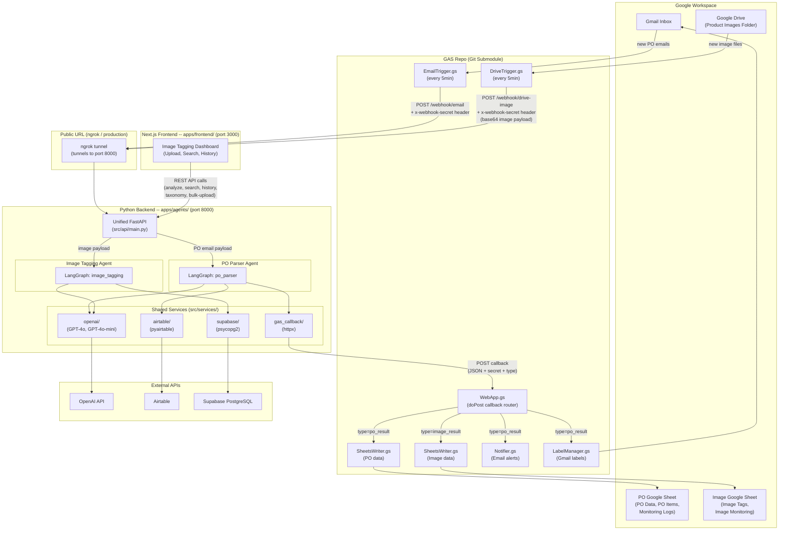

---

## 2. Port and URL Map

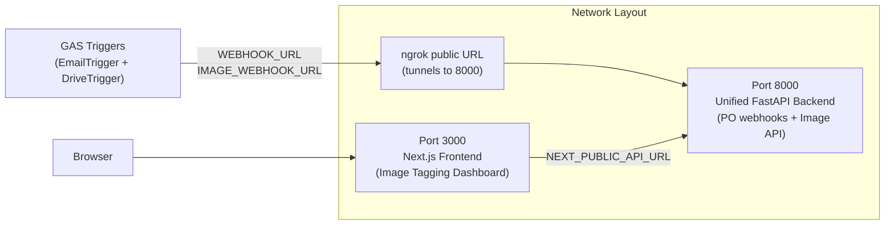

Both GAS triggers use the **same ngrok tunnel** (port 8000) with **different paths**:
- PO Parser: `https://<ngrok>/webhook/email`
- Image Tagger: `https://<ngrok>/webhook/drive-image`

---

## 3. API Endpoint Map

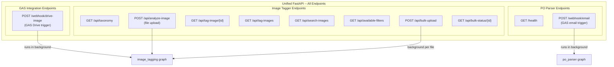

---

## 4. PO Parser Agent -- Full Pipeline

### 4a. End-to-End Sequence

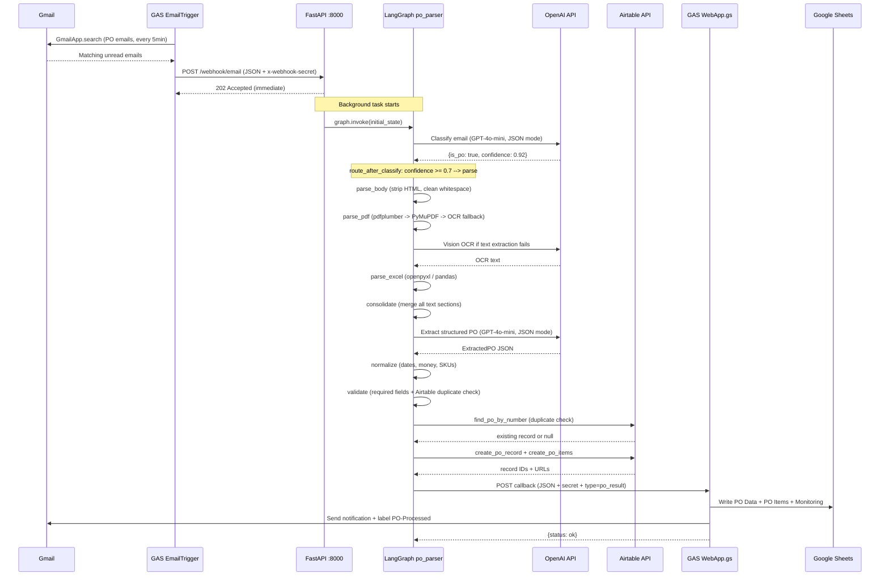

### 4b. LangGraph Node Flow

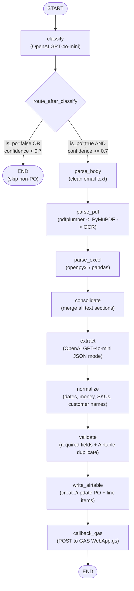

### 4c. PO Parser State Fields

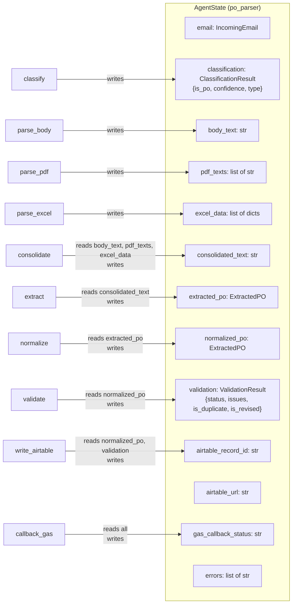

---

## 5. Image Tagging Agent -- Full Pipeline

### 5a. End-to-End Sequence (Browser Upload)

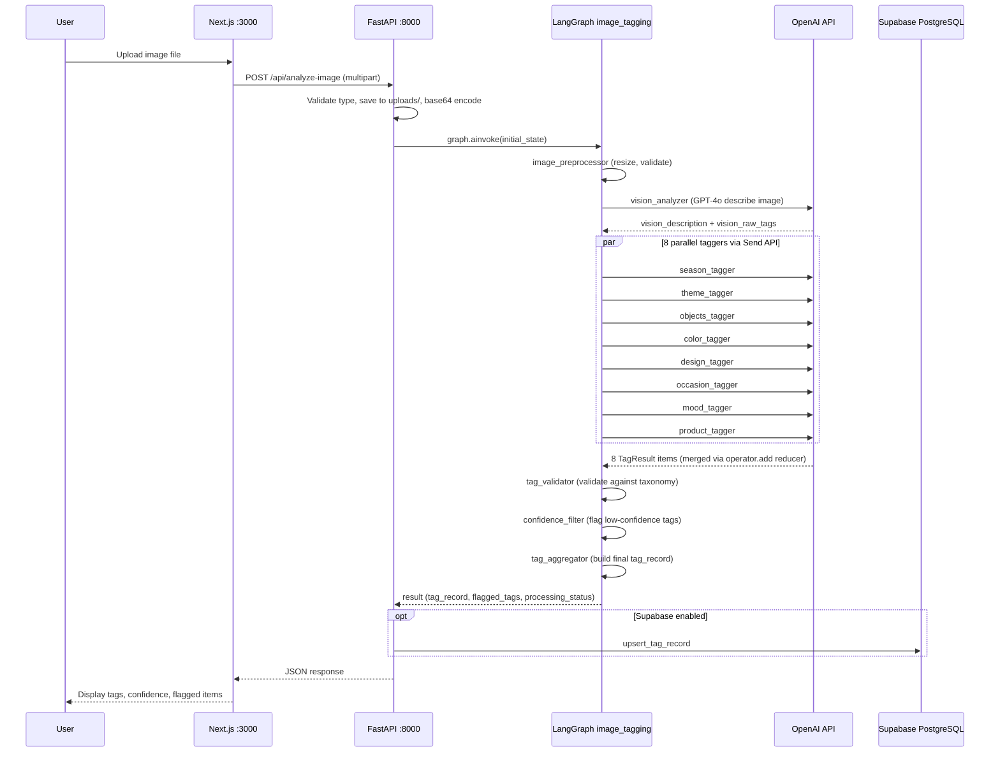

### 5b. End-to-End Sequence (GAS Drive Trigger)

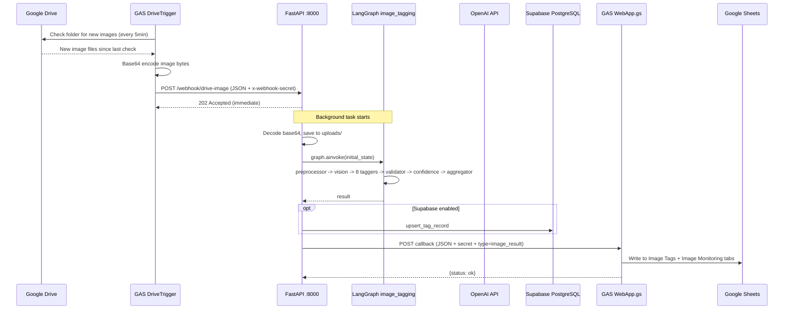

### 5c. LangGraph Node Flow

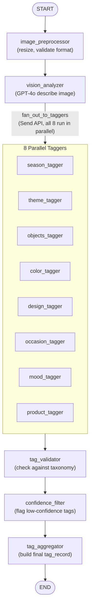

### 5d. Image Tagging State Fields

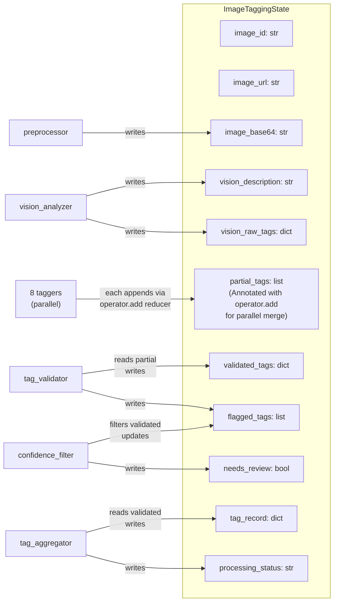

---

## 6. Shared Services Detail

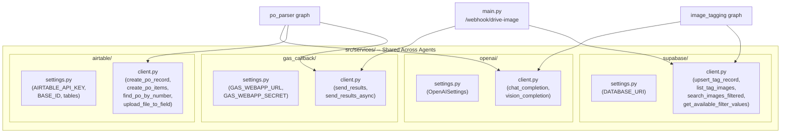

---

## 7. GAS Callback Routing

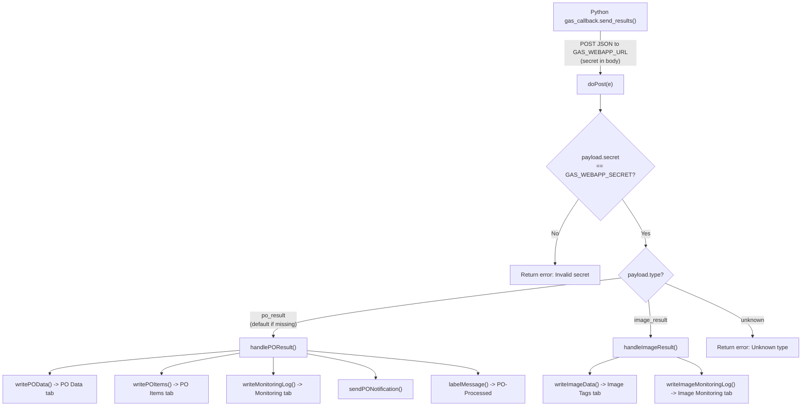

---

## 8. Data Persistence Map

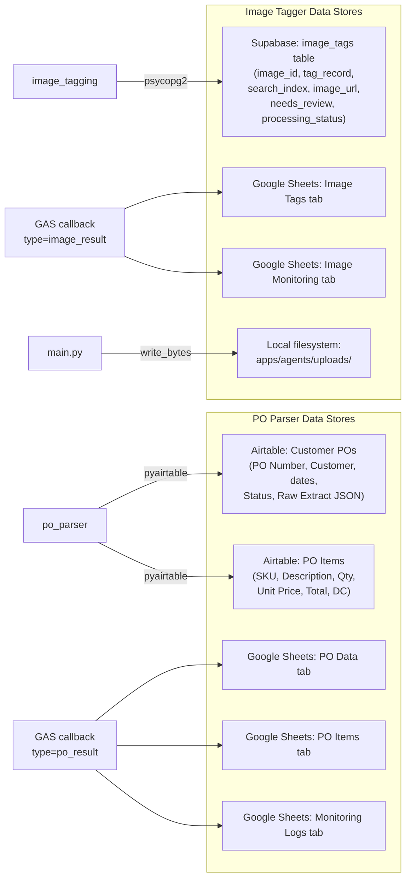

---

## 9. Security and Authentication

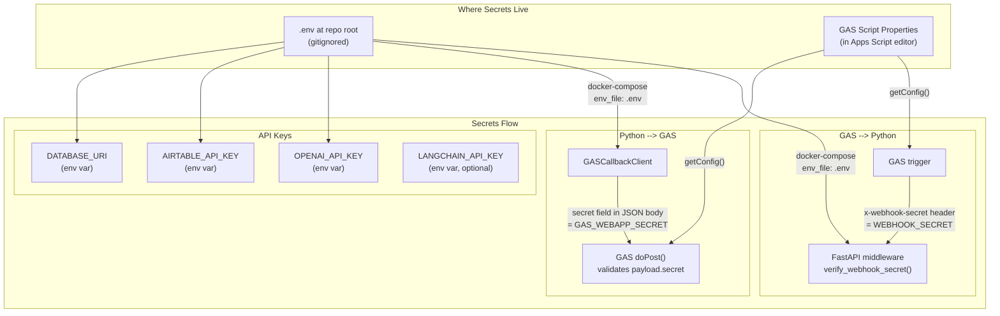

---

## 10. Deployment Architecture

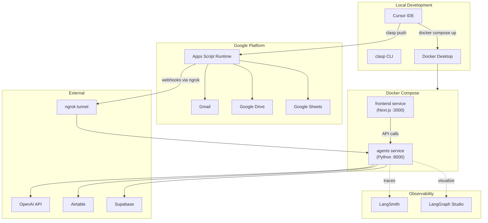
`

```

**This file goes at:** `apps/agents/docs/shared/ARCHITECTURE_OVERVIEW.md`

**What it covers (10 diagrams total):**
1. System-Level Architecture -- everything connected, all three deployment units
2. Port and URL Map -- how ngrok, port 8000, and port 3000 relate
3. API Endpoint Map -- all routes grouped by agent
4. PO Parser full sequence diagram -- Gmail to Sheets end-to-end
5. PO Parser LangGraph node flow -- 10 nodes with conditional routing
6. PO Parser state fields -- what each node reads/writes
7. Image Tagger sequence (browser upload) -- user to DB end-to-end
8. Image Tagger sequence (GAS Drive trigger) -- Drive to Sheets end-to-end
9. Image Tagger LangGraph node flow -- 12 nodes with parallel fan-out
10. Image Tagger state fields -- with operator.add reducer explanation
Plus: Shared Services detail, GAS Callback routing, Data Persistence map, Security flow, and Deployment architecture

---

## Step 23a: Create `ROOT/README.md` (Workspace-Level README)

This is the top-level README that anyone sees first when they clone the repo. It must contain:

**Title:** Multi-Agent Platform

**Description:** A monorepo hosting two LangGraph-based AI agents with a shared Python backend, a Next.js frontend, and a Google Apps Script integration layer (Git submodule).

**Agents overview (brief, 2-3 sentences each):**
- **PO Parser Agent** -- Automates purchase order intake from Gmail. Classifies emails, parses PDF/Excel/body text with OpenAI, validates data, writes to Airtable, and reports results to Google Sheets via GAS callback.
- **Image Tagging Agent** -- AI-powered product image tagging. Receives images via upload or Google Drive (via GAS), runs a multi-step LangGraph pipeline with GPT-4o vision, persists results to PostgreSQL/Supabase, and serves them through a Next.js dashboard.

**Architecture diagram:** Copy the mermaid diagram from this plan.

**Repository structure:**
```
ROOT/
  .env.example          # Single env file for all apps (copy to .env)
  docker-compose.yml    # Orchestrates backend + frontend
  apps/
    agents/             # Python backend (FastAPI + LangGraph)
    frontend/           # Next.js dashboard (image tagger UI)
  gas-scripts/          # Git submodule: Google Apps Script triggers & callbacks
  scripts/              # Utility scripts (e2e mock, etc.)
```

**Prerequisites:**
- Python 3.11+
- Node.js 20+
- Docker and Docker Compose
- (Optional) Google Apps Script CLI (`clasp`) for GAS deployment

**Quick start:**
```bash
# Clone with submodules
git clone --recurse-submodules <REPO_URL>
cd Multi_agents

# .env is already configured. To start fresh: cp .env.example .env and fill in values.

# Run with Docker
docker compose up --build

# Backend: http://localhost:8000
# Frontend: http://localhost:3000
```

**Local development (without Docker):**
```bash
# Backend
cd apps/agents
pip install -r requirements.txt
uvicorn src.api.main:app --host 0.0.0.0 --port 8000 --reload

# Frontend (separate terminal)
cd apps/frontend
npm install
npm run dev
```
Note: Run uvicorn from `ROOT/` or set `PYTHONPATH=apps/agents` so Python finds the `src` package and `load_dotenv()` finds `ROOT/.env`.

**LangGraph Studio:** Open the `apps/agents/` folder in LangGraph Studio. It reads `langgraph.json` which registers both agents.

**GAS (Git submodule):** The `gas-scripts/` folder is a Git submodule. See `gas-scripts/README.md` for setup instructions. If you cloned without `--recurse-submodules`, run: `git submodule update --init`.

**Environment variables:** All configuration is in a single `.env` file at the repo root. See `.env.example` for all available variables with descriptions.

**Documentation:**
- PO Parser docs: `apps/agents/docs/po_parser/`
- Image Tagger docs: `apps/agents/docs/image_tagging/`
- Monorepo-wide docs (architecture, folder structure): `apps/agents/docs/shared/`

---

## Step 23b: Create `apps/agents/README.md` (Agents App README)

This README is for the Python backend specifically. It must contain:

**Title:** Agents Backend

**Description:** Unified FastAPI application hosting two LangGraph AI agents and shared services.

**Agents:**
- `src/po_parser/` -- PO Parser Agent (LangGraph graph registered as `po_parser` in `langgraph.json`)
- `src/image_tagging/` -- Image Tagging Agent (LangGraph graph registered as `image_tagging` in `langgraph.json`)

**Shared services** (`src/services/`):
- `openai/` -- OpenAI API client (structured outputs, vision, OCR)
- `supabase/` -- PostgreSQL client for image tag persistence
- `airtable/` -- Airtable client for PO data storage
- `gas_callback/` -- HTTP client for GAS Web App callbacks

**API endpoints:**
- `GET /health` -- Health check
- `POST /webhook/email` -- GAS email trigger (PO parser)
- `POST /webhook/drive-image` -- GAS Drive trigger (image tagger)
- `GET /api/taxonomy` -- Tag taxonomy
- `POST /api/analyze-image` -- Upload and analyze image
- `GET /api/tag-image/{image_id}` -- Get tag record
- `GET /api/tag-images` -- List tagged images
- `GET /api/search-images` -- Search by tag filters
- `GET /api/available-filters` -- Cascading filter values
- `POST /api/bulk-upload` -- Bulk image upload
- `GET /api/bulk-status/{batch_id}` -- Bulk job status

**Local development:**
```bash
pip install -r requirements.txt
# Run from the repo root so load_dotenv() finds ROOT/.env
cd ../../  # back to ROOT/
uvicorn src.api.main:app --app-dir apps/agents --host 0.0.0.0 --port 8000 --reload
```

**LangGraph Studio:** Open this folder (`apps/agents/`) directly in LangGraph Studio to inspect and debug both agent graphs.

**Tests:** `tests/unit/`, `tests/integration/`

**Docs:** `docs/shared/` (architecture, folder structure), `docs/po_parser/`, `docs/image_tagging/`

---

## Step 23c: Create `apps/frontend/README.md` (Frontend App README)

This README is for the Next.js frontend specifically. It must contain:

**Title:** Image Tagging Dashboard

**Description:** Next.js 16 + React 19 frontend for the Image Tagging Agent. Upload product images, view AI-generated tags, browse history, and search by tag filters.

**Tech stack:** Next.js 16, React 19, TypeScript, Tailwind CSS 4, shadcn/ui components, Framer Motion, Lucide icons, Sonner toasts

**Environment:** The frontend needs `NEXT_PUBLIC_API_URL` to point to the backend. This is set in the repo root `.env` file and injected via Docker Compose as a build arg.

**Local development:**
```bash
npm install
NEXT_PUBLIC_API_URL=http://localhost:8000 npm run dev
# Open http://localhost:3000
```

**Docker:** Built automatically by `docker compose up --build` from the repo root. The `NEXT_PUBLIC_API_URL` build arg is read from `ROOT/.env`.

**Pages:**
- `/` -- Home: upload single image, view analysis results
- `/search` -- Search: filter and browse tagged images

---

## Step 24: Initialize Agents Git Repo and Add GAS Submodule

The GAS repo was already initialized in Step 18-fin. Now initialize the agents monorepo and link GAS as a submodule.

### 24a. Initialize the agents monorepo

Run from `ROOT/` (the workspace root `c:\Nagdy\Mustafa\MIS\Real Projects\Multi_agents\`):

```powershell
git init
git add .
git commit -m "Initial commit: merge image-tagging and PO-parser agents into monorepo"
```

### 24b. Add GAS repo as a Git submodule

**Option A -- if GAS repo is pushed to a remote (recommended):**
```powershell
git submodule add <GAS_REMOTE_URL> gas-scripts
git commit -m "Add gas-scripts as Git submodule"
```
Replace `<GAS_REMOTE_URL>` with the GitHub/GitLab URL of the GAS repo (e.g. `https://github.com/youruser/gas-scripts.git`).

**Option B -- if GAS repo is local only (no remote yet):**
```powershell
git submodule add ./gas-scripts gas-scripts
git commit -m "Add gas-scripts as Git submodule (local path)"
```
Note: local-path submodules work for development but should be updated to a remote URL before sharing.

### 24c. Verify submodule is linked

```powershell
git submodule status
```
This should show the GAS repo commit hash and path `gas-scripts`.

### Cloning instructions (for README)

Anyone cloning the agents repo should use:
```bash
git clone --recurse-submodules <AGENTS_REPO_URL>
```
Or if already cloned without submodules:
```bash
git submodule update --init
```

Do NOT commit the old project folders (`image-analysis-agent/`, `PO Parsing AI Agent/`). They are listed in `.gitignore`. Delete them after verifying the monorepo works.

---

## Step 25: Verify

### 25a. Install dependencies and test imports

From `ROOT/` directory, run (PowerShell):

```powershell
cd apps/agents
pip install -r requirements.txt
cd ..\..\

# Set PYTHONPATH so Python finds the src package (Windows PowerShell)
$env:PYTHONPATH = "apps/agents"

# Test imports (must all print OK without errors)
python -c "from src.po_parser.po_parser import graph; print('PO parser OK')"
python -c "from src.image_tagging.image_tagging import graph; print('Image tagger OK')"
python -c "from src.api.main import app; print('API OK')"
```

### 25b. Verify .env loading

```powershell
# From ROOT/ (where .env lives)
python -c "from dotenv import load_dotenv; load_dotenv(); import os; print('OPENAI_API_KEY set:', bool(os.getenv('OPENAI_API_KEY')))"
```

### 25c. Verify GAS submodule

```powershell
git submodule status
# Should show a commit hash and 'gas-scripts'
Test-Path gas-scripts/shared/Config.gs
# Should return True
```

### 25d. Verify Docker build (optional)

```powershell
docker compose build
docker compose up -d
# Check http://localhost:8000/health returns {"status": "healthy", ...}
# Check http://localhost:3000 loads the frontend
docker compose down
```

---

## Summary of ALL Edits

### Files that need content edits (only 2):

1. **`apps/agents/src/services/supabase/settings.py`** -- remove `Path` traversal, use `load_dotenv()` with no args
2. **`apps/agents/src/image_tagging/settings.py`** -- remove `Path` traversal, use `load_dotenv()` with no args

Everything else is either unchanged (PO parser uses `src.*` absolute imports that remain valid) or uses relative imports (image tagger internals) that are position-independent.

### .env strategy:

- Single `.env` at `ROOT/` for all apps
- `docker-compose.yml` passes it to all services via `env_file: .env`
- Python `load_dotenv()` with no args finds `ROOT/.env` when running from ROOT
- `pydantic_settings` classes read env vars directly (already set by docker-compose or load_dotenv)
- Frontend gets `NEXT_PUBLIC_API_URL` as a docker-compose build arg from `.env`
- GAS uses Script Properties (no .env file) -- configured in the GAS editor

### READMEs (4 total):

1. `ROOT/README.md` -- workspace overview, quick start, architecture diagram
2. `apps/agents/README.md` -- Python backend, API endpoints, agent details
3. `apps/frontend/README.md` -- Next.js dashboard, local dev instructions
4. `gas-scripts/README.md` -- GAS setup, Script Properties reference, deploy commands

### GAS callback `type` field (design decision):

The PO parser's existing `gas_callback.py` sends callback payloads to GAS **without** a `type` field. This works because `WebApp.gs` defaults to `var type = payload.type || 'po_result'`. The new image tagger endpoint explicitly sends `"type": "image_result"`. If a future agent is added, it must include a `"type": "<agent_name>_result"` field and a corresponding handler must be added to `WebApp.gs`.

---

## Step 26: Create `.cursor/rules` Files

Create 4 Cursor rule files so that any future LLM session in this workspace automatically knows the project conventions and avoids common pitfalls.

### 26a. Create `.cursor/rules/monorepo-structure.mdc`

```
---
description: Explains the monorepo layout, where each component lives
globs:
alwaysApply: true
---

# Monorepo Structure

This workspace is a multi-agent monorepo with the following layout:

- `apps/agents/` -- Python backend (FastAPI + LangGraph). Contains two AI agents and shared services.
  - `src/po_parser/` -- PO Parser agent (email intake, PDF/Excel parsing, Airtable output)
  - `src/image_tagging/` -- Image Tagging agent (GPT-4o vision, Supabase persistence)
  - `src/services/` -- Shared services (openai, supabase, airtable, gas_callback)
  - `src/api/main.py` -- Unified FastAPI entry-point combining BOTH agents' endpoints
- `apps/frontend/` -- Next.js 16 dashboard for image tagging only
- `gas-scripts/` -- Git submodule (separate repo). Google Apps Script triggers and callback handlers. Communicates with Python backend via HTTP webhooks ONLY. No code-level dependency.
- `.env` -- Single environment file at repo root for ALL apps (backend + frontend). GAS uses Script Properties, not .env.
- `docker-compose.yml` -- Orchestrates backend and frontend services

IMPORTANT rules:
- NEVER move or create a second `.env` file. All env vars live in `ROOT/.env`.
- NEVER edit `gas-scripts/` files as part of agents repo changes -- it's a separate Git repo.
- The Python `PYTHONPATH` root is `apps/agents/`. All absolute imports start with `src.`.
- The unified API is at `src/api/main.py`. NEVER create separate FastAPI apps for each agent.
```

### 26b. Create `.cursor/rules/import-conventions.mdc`

```
---
description: Python import rules for po_parser, image_tagging, and services
globs: apps/agents/src/**/*.py
alwaysApply: false
---

# Import Conventions

The Python path root is `apps/agents/`. All absolute imports start with `src.`.

## po_parser agent (`src/po_parser/`)
- Uses ABSOLUTE imports: `from src.po_parser.schemas.states import ...`, `from src.services.openai import ...`
- NEVER convert these to relative imports. The entire po_parser was designed with absolute `src.*` paths.

## image_tagging agent (`src/image_tagging/`)
- Uses RELATIVE imports internally: `from .graph_builder import ...`, `from ..schemas.states import ...`
- NEVER convert these to absolute imports. Relative imports keep image_tagging self-contained.
- Exception: `settings.py` imports `from dotenv import load_dotenv` (third-party, not relative).

## Shared services (`src/services/`)
- Services use a MIX: absolute for cross-service refs (`from src.services.base import ...`), relative for intra-service refs (`from .settings import ...`).
- When adding a new service, follow the existing pattern: `__init__.py` re-exports, `settings.py` uses pydantic_settings, `client.py` has the logic.

## Unified API (`src/api/main.py`)
- ALWAYS use absolute imports (`from src.po_parser.po_parser import graph`, `from src.services.supabase import ...`).
- Heavy imports (graphs, service clients) must be LAZY (inside functions) to avoid circular imports and reduce startup time.

## Common mistakes to AVOID:
- Do NOT add `sys.path.append` or manipulate `sys.path`. The PYTHONPATH is set by docker-compose/langgraph.json.
- Do NOT use `from image_tagging.xxx import ...` (missing `src.` prefix).
- Do NOT use `from backend.src.xxx import ...` (old path from image-analysis-agent repo).
```

### 26c. Create `.cursor/rules/env-and-settings.mdc`

```
---
description: Environment variable and settings configuration rules
globs: "**/.env*,**/settings.py,**/docker-compose.yml"
alwaysApply: false
---

# Environment Variables and Settings

## Single .env file
- There is ONE `.env` file at the repo root (`ROOT/.env`).
- ALL services read from this file: Python backend (via docker-compose env injection or load_dotenv), frontend (via docker-compose build args).
- NEVER create `.env` files inside `apps/agents/` or `apps/frontend/`.
- `.env.example` at the root is the sanitized template (committed to Git). `.env` itself is in `.gitignore`.

## Python settings pattern
- Each service has a `settings.py` that defines a `pydantic_settings.BaseSettings` subclass.
- Call `load_dotenv()` with NO arguments. It searches upward from the working directory to find `.env`.
- NEVER use `Path(__file__).parent...` traversal to locate `.env`. This breaks when the directory depth changes.
- NEVER hardcode API keys or secrets in Python code. Always use env vars.
- In Docker: env vars are pre-set by docker-compose's `env_file: .env`, so `load_dotenv()` is a harmless no-op.
- Locally: run uvicorn from `ROOT/` so `load_dotenv()` finds `ROOT/.env`.

## Adding a new env var
1. Add it to `ROOT/.env` and `ROOT/.env.example`
2. If used by Python: add a field to the appropriate `settings.py` pydantic class
3. If used by frontend: prefix with `NEXT_PUBLIC_` and add to docker-compose build args
4. If used by GAS: add as a Script Property in the GAS editor (GAS does NOT read .env)

## langgraph.json env path
- `apps/agents/langgraph.json` has `"env": "../../.env"` (relative to its own location, pointing to ROOT/.env).
```

### 26d. Create `.cursor/rules/gas-integration.mdc`

```
---
description: Google Apps Script integration rules and callback protocol
globs: gas-scripts/**/*.gs,apps/agents/src/api/main.py,apps/agents/src/services/gas_callback/**
alwaysApply: false
---

# GAS Integration

## Architecture
- GAS is a SEPARATE Git repo included as a Git submodule at `gas-scripts/`.
- Communication is HTTP-only: GAS --> Python (webhook POST) and Python --> GAS (callback POST).
- There is NO code-level dependency between Python and GAS. They share only env vars / Script Properties for secrets and URLs.

## Webhook protocol (GAS --> Python)
- PO Parser: GAS `EmailTrigger.gs` POSTs to `POST /webhook/email` with `x-webhook-secret` header.
- Image Tagger: GAS `DriveTrigger.gs` POSTs to `POST /webhook/drive-image` with `x-webhook-secret` header.
- Both webhooks validate the secret against `WEBHOOK_SECRET` env var.

## Callback protocol (Python --> GAS)
- Python sends results back to GAS Web App via `gas_callback` service (POST to `GAS_WEBAPP_URL`).
- The callback JSON payload MUST include:
  - `"secret"`: value of `GAS_WEBAPP_SECRET` env var (validated by GAS)
  - `"type"`: routing key for GAS WebApp.gs dispatcher
    - `"po_result"` for PO parser callbacks (this is also the DEFAULT if type is missing)
    - `"image_result"` for image tagger callbacks
- If you add a new agent, you MUST:
  1. Add a new `"type": "<agent>_result"` value
  2. Add a `handle<Agent>Result(payload)` function in GAS
  3. Add the routing case in `WebApp.gs`'s `doPost` function

## Common mistakes to AVOID:
- Do NOT import GAS code from Python or vice versa.
- Do NOT forget the `"type"` field in callback payloads -- GAS defaults to `"po_result"` if missing.
- Do NOT modify `gas-scripts/` and commit it as part of the agents repo. Changes to GAS must be committed in the gas-scripts submodule separately.
- Do NOT put GAS secrets in `.env`. GAS reads from Script Properties in the Apps Script editor.
```

### 26e. Create `.cursor/rules/folder-structure-blueprint.mdc`

This rule embeds the canonical folder structure blueprint so the LLM always knows the correct patterns when adding new agents, services, nodes, or tools.

```
---
description: Canonical folder structure blueprint for adding new agents, services, and components
globs: apps/agents/src/**
alwaysApply: false
---

# LangGraph Multi-Agent Folder Structure Blueprint

When adding new agents, services, or components, ALWAYS follow this canonical structure. This is the authoritative reference for how the monorepo is organized.

## Agent Package Template

Every agent lives at `apps/agents/src/<agent_name>/` and MUST have this structure:

```
src/<agent_name>/
├── __init__.py
├── <agent_name>.py     # Graph entry point: `graph = build_graph()`
├── graph_builder.py    # Graph construction (nodes, edges, conditionals)
├── configuration.py    # Runtime configuration (LangGraph configurable)
├── settings.py         # Agent-level env vars (pydantic_settings)
├── utils.py            # Agent-specific utilities (optional)
│
├── nodes/              # Graph nodes: pure functions (state) → dict
│   ├── __init__.py     # Re-export all node functions
│   ├── routing.py      # Conditional routing logic
│   └── <domain>.py     # Domain-specific nodes
│
├── prompts/            # Prompt templates
│   ├── __init__.py
│   ├── system.py       # System prompts
│   └── <task>.py       # Task-specific prompts
│
├── schemas/            # State & data models
│   ├── __init__.py
│   ├── states.py       # Graph state definitions (TypedDict / Pydantic)
│   └── routing.py      # Routing enums / models
│
└── tools/              # Agent-specific tools (optional)
    ├── __init__.py
    └── <tool_name>.py
```

## Shared Service Template

Every shared service lives at `apps/agents/src/services/<service_name>/` and MUST have:

```
src/services/<service_name>/
├── __init__.py         # Re-exports: client class + settings class
├── client.py           # API client / integration logic
└── settings.py         # pydantic_settings.BaseSettings subclass
```

Rule of thumb: If two agents need the same API client, it belongs in `services/`. If only one agent uses it, keep it in that agent's `tools/` folder.

## Graph Construction Pattern

```python
# <agent_name>.py — Entry point (what langgraph.json points to)
from .<agent_name>.graph_builder import build_graph  # relative import for image_tagging style
# OR
from src.<agent_name>.graph_builder import build_graph  # absolute import for po_parser style

graph = build_graph()

# graph_builder.py — All wiring in one place
def build_graph():
    builder = StateGraph(AgentState)
    builder.add_node("node_a", node_a_fn)
    builder.add_node("node_b", node_b_fn)
    builder.add_edge("node_a", "node_b")
    ...
    return builder.compile(checkpointer=...)
```

## Adding a New Agent Checklist

1. Create `src/<agent_name>/` with the subfolder structure above
2. Export compiled graph from `<agent_name>.py`
3. Register in `langgraph.json`:
   

```json
   { "graphs": { "<agent_name>": "./src/<agent_name>/<agent_name>.py:graph" } }
   

```
4. Add API endpoints in `src/api/main.py` (lazy imports inside endpoint functions)
5. Add tests in `tests/`
6. Add docs in `docs/<agent_name>/`

## Adding a New Shared Service Checklist

1. Create `src/services/<service_name>/` with `__init__.py`, `client.py`, `settings.py`
2. Add env vars to `ROOT/.env` and `ROOT/.env.example`
3. Each agent that uses it imports from `src.services.<service_name>`
4. Add setup guide in `docs/`
```