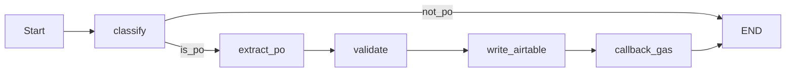
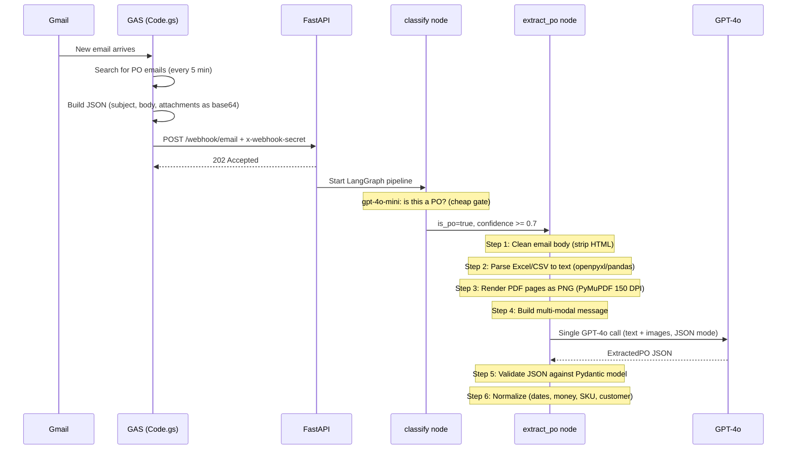

# PO Parser: Single-Node Extraction Redesign

## New Graph (5 nodes)



**`classify`** stays unchanged (gpt-4o-mini, cheap gate).

**`extract_po`** is the new single node that replaces 6 nodes (`parse_body`, `parse_pdf`, `parse_excel`, `consolidate`, `extract`, `normalize`). It:

1. Strips HTML from email body (existing `body_parser` logic)
2. Parses Excel/CSV attachments to text via openpyxl/pandas (existing `excel_parser` logic)
3. For PDF attachments: renders each page as an image (PyMuPDF `get_pixmap`)
4. Builds **one multi-modal LLM call** to GPT-4o:
   - System prompt with the `ExtractedPO` JSON schema (updated from existing `EXTRACTION_SYSTEM_PROMPT`)
   - User message containing:
     - Email body as text
     - Excel data as text/JSON
     - PDF pages as `image_url` content blocks (base64 PNG)
   - Response: structured `ExtractedPO` JSON
5. Validates the JSON against the Pydantic `ExtractedPO` model (retry once on failure)
6. Runs deterministic normalization (dates, money, SKU, customer — existing `normalizer` logic)

**`validate`**, **`write_airtable`**, **`callback_gas`** stay unchanged.

## Detailed Flow: Email to Structured JSON

### End-to-end sequence



### Inside `extract_po` — step by step

**Step 1 — Clean email body** (no LLM):
- If body contains HTML tags, strip them (regex)
- Normalize whitespace, collapse blank lines
- Result: clean plain text string

**Step 2 — Parse spreadsheet attachments** (no LLM):
- Loop through attachments, find `.xlsx`, `.xls`, `.csv` by extension/MIME
- Excel: openpyxl reads cells, normalize headers (`"P.O. #"` -> `"po_number"`, `"Qty"` -> `"quantity"`)
- CSV: pandas `read_csv`, same header normalization
- Result: JSON text like `[{"sku":"12345","quantity":24,"unit_price":10.5}, ...]`

**Step 3 — Render PDF pages as images** (no LLM):
- Loop through attachments, find PDFs by extension/MIME
- Decode base64 -> write to temp file
- PyMuPDF (`fitz`) renders each page at 150 DPI as PNG
- Base64-encode each PNG -> `data:image/png;base64,...`
- Clean up temp files

**Step 4 — Build multi-modal LLM message**:

The user message is a **content array** mixing text and images:

```
messages = [
    {"role": "system", "content": EXTRACTION_SYSTEM_PROMPT},
    {"role": "user", "content": [
        {"type": "text",      "text": "EMAIL BODY:\n<cleaned body>"},
        {"type": "text",      "text": "SPREADSHEET DATA:\n<JSON rows>"},
        {"type": "image_url", "image_url": {"url": "data:image/png;base64,<page1>"}},
        {"type": "image_url", "image_url": {"url": "data:image/png;base64,<page2>"}},
        ...
    ]}
]
```

**Step 5 — Call GPT-4o** (single LLM call):
- `response_format = {"type": "json_object"}` forces valid JSON
- Parse response into `ExtractedPO` Pydantic model
- If Pydantic validation fails, retry once with stricter prompt suffix

**Step 6 — Normalize** (no LLM, deterministic):
- Dates: try multiple formats (`MM/DD/YYYY`, `DD-MMM-YY`, `B %d, %Y`, etc.) -> ISO `YYYY-MM-DD`
- Money: strip `$`, commas, whitespace -> float
- SKU: uppercase, trim whitespace
- Customer: title case, strip suffixes ("Inc.", "LLC", "Corp.")
- Currency: default to "USD" if null/empty

### How GPT-4o processes mixed input

GPT-4o sees **all sources at once** in its context window and acts like a human reviewer:

- **Email body (text)**: Provides context — who sent the PO, special instructions, payment terms, notes not in the PDF
- **PDF pages (images)**: The primary PO document — GPT-4o "reads" tables, headers, formatting, even handwritten notes and stamps, just as a human would
- **Excel/CSV (text)**: Precise cell values — exact quantities, SKUs, and prices with no OCR ambiguity

When data overlaps between sources, the model cross-validates. When data exists in only one source, it takes whatever is available. This gives better extraction quality than the old text-only approach because the LLM sees the original document layout.

## Key Design Decisions

- **PDF handling**: Always render as images for GPT-4o vision (no pdfplumber/PyMuPDF text extraction, no separate OCR path). This simplifies the code significantly — one path instead of three fallback tiers.
- **Excel/CSV handling**: Still parsed to text with Python (openpyxl/pandas) because binary files can't be sent as images and parsed text gives the LLM exact cell values.
- **Model**: `extract_po` uses **GPT-4o** (not mini) since it needs vision capability for PDF images. The extraction prompt already works with gpt-4o.
- **Normalization**: Stays as Python code (deterministic), runs inside `extract_po` after LLM response — no reason to make a separate node for 30 lines of date/money cleanup.

## State Schema Changes

Remove intermediate fields that are no longer exposed between nodes:
- Remove: `body_text`, `pdf_texts`, `excel_data`, `consolidated_text`
- Keep: `extracted_po`, `normalized_po` (or just `extracted_po` if we normalize in-place)

Simplified [states.py](apps/agents/src/po_parser/schemas/states.py):

```python
class AgentState(TypedDict):
    email: IncomingEmail
    classification: Optional[ClassificationResult]
    extracted_po: Optional[ExtractedPO]
    normalized_po: Optional[ExtractedPO]
    validation: Optional[ValidationResult]
    airtable_record_id: Optional[str]
    airtable_url: Optional[str]
    gas_callback_status: Optional[str]
    errors: list[str]
    processing_start_time: float
```

## Files to Change

- **[graph_builder.py](apps/agents/src/po_parser/graph_builder.py)** — Replace 10-node chain with 5-node chain
- **New: `nodes/extract_po.py`** — The single extraction node combining parsing + LLM + normalization
- **[nodes/__init__.py](apps/agents/src/po_parser/nodes/__init__.py)** — Export `extract_po_node`, remove old node exports
- **[states.py](apps/agents/src/po_parser/schemas/states.py)** — Remove intermediate state fields
- **[prompts/extraction.py](apps/agents/src/po_parser/prompts/extraction.py)** — Update prompt to mention it may receive images + text (minor wording)
- **[settings.py](apps/agents/src/services/openai/settings.py)** — Add `extraction_vision_model` field defaulting to `gpt-4o` (since extraction now needs vision)

## Files to Keep (no changes)

- `nodes/classifier.py`, `nodes/routing.py` — classify stays as-is
- `nodes/validator.py` — validate stays as-is
- `nodes/airtable_writer.py` — write stays as-is
- `nodes/gas_callback.py` — callback stays as-is
- `schemas/po.py` — `ExtractedPO` schema unchanged
- `tools/file_helpers.py` — still needed for temp file handling

## Files to Remove (dead code after refactor)

- `nodes/body_parser.py` — logic moved into `extract_po.py`
- `nodes/pdf_parser.py` — logic replaced by image rendering in `extract_po.py`
- `nodes/excel_parser.py` — logic moved into `extract_po.py`
- `nodes/consolidator.py` — no longer needed
- `nodes/normalizer.py` — logic moved into `extract_po.py`
- `nodes/extractor.py` — logic moved into `extract_po.py`
- `prompts/ocr.py` — no separate OCR step anymore

## Cost Impact

- **Before**: classify (gpt-4o-mini ~$0.001) + extract (gpt-4o-mini ~$0.01-0.02) + OCR only when needed (gpt-4o ~$0.05-0.10/page, rare) = **~$0.01-0.03 typical**
- **After**: classify (gpt-4o-mini ~$0.001) + extract_po (gpt-4o vision ~$0.05-0.10/page) = **~$0.05-0.30 depending on page count**
- Trade-off: higher cost for simpler, more maintainable code and consistent extraction quality

## Documentation Updates

All docs must be rewritten to reflect the new 5-node architecture:

- **[DATA_FLOW.md](apps/agents/docs/po_parser/documentations/DATA_FLOW.md)**:
  - Replace 10-node numbered journey with 5-node journey
  - Update all mermaid flowcharts (end-to-end, Python processing subflow, error flow)
  - Update the sequence diagram
  - Update JSON examples at each stage (remove intermediate states)
  - Add the detailed `extract_po` internals (how text + images are assembled)
  - Update processing time estimates (vision calls are slower)

- **[ARCHITECTURE.md](apps/agents/docs/po_parser/documentations/ARCHITECTURE.md)**:
  - Update LangGraph section: 5 named nodes instead of 10
  - Update shared services: note that OpenAI client now uses `vision_completion` for extraction (not just OCR)
  - Update technology choices: add GPT-4o vision rationale for extraction
  - Update cost ballpark: ~$0.05-0.30 per PO instead of ~$0.01-0.03
  - Update all mermaid diagrams (component flow, sequence, deployment)
  - Remove references to pdfplumber text extraction path and OCR fallback chain

- **[LANGGRAPH_REFERENCE.md](apps/agents/docs/po_parser/documentations/LANGGRAPH_REFERENCE.md)** (if exists):
  - Update node list, edge definitions, state schema reference
