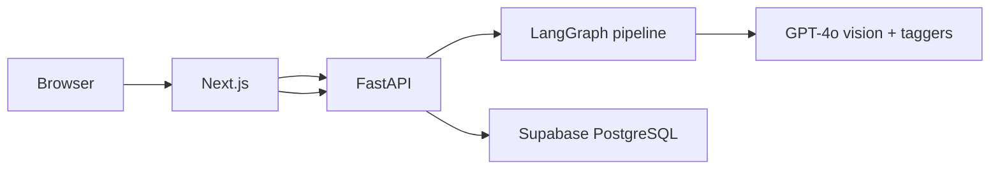
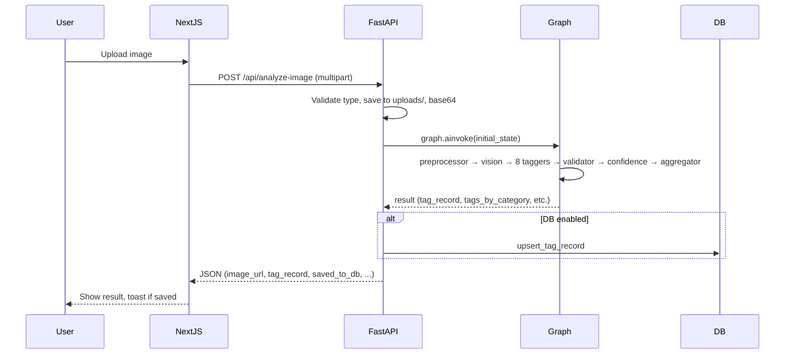
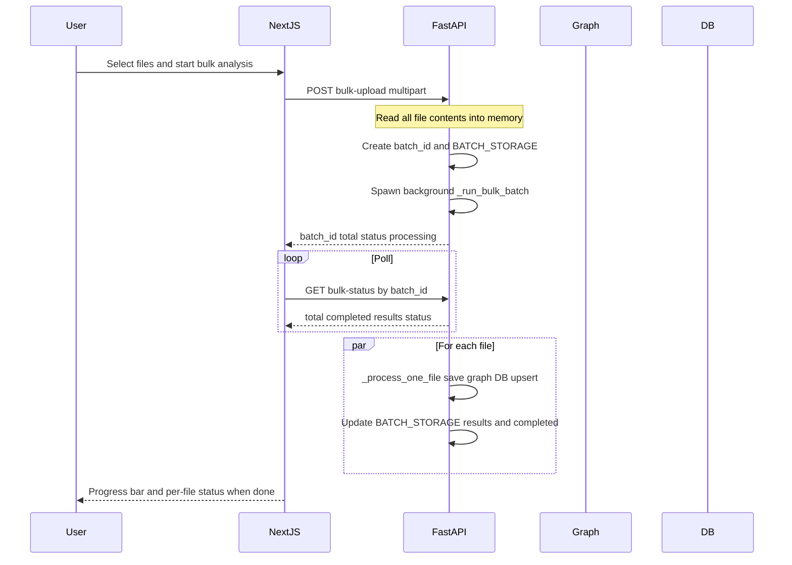
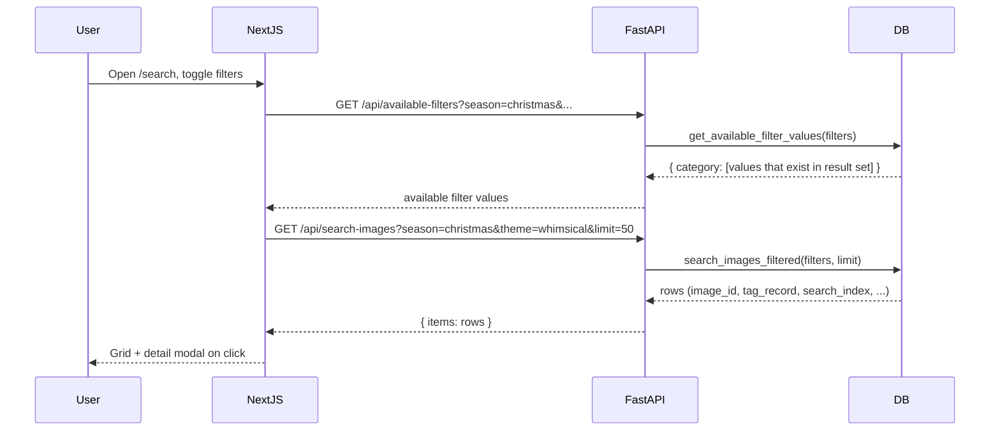

# 02 — Architecture

This document describes the high-level system architecture, request lifecycles for single analyze, bulk upload, and search, and how components interact.

---

## High-level system diagram

- **Browser:** User uploads images, views results, searches, browses history.
- **Next.js:** Serves the UI, calls backend APIs (analyze, tag-images, search-images, bulk-upload, bulk-status, taxonomy, available-filters).
- **FastAPI:** CORS, routes, file save, base64 encoding, graph invocation, optional DB write/read, static `/uploads`.
- **LangGraph pipeline:** Preprocessor → vision → 8 parallel taggers → validator → confidence filter → aggregator. See [03-langgraph-pipeline.md](03-langgraph-pipeline.md).
- **GPT-4o:** Vision analysis and per-category tagging via langchain-openai.
- **Supabase:** Optional; stores `image_tags` (tag_record, search_index, image_url, etc.); used for history, search, and cascading filters.

---

## Single image analyze — request lifecycle

1. User selects a file; frontend sends `POST /api/analyze-image` with the file.
2. Server validates extension/content-type, saves to `backend/uploads/`, builds `image_id` and `image_url`, base64-encodes contents.
3. Server builds `initial_state` with `image_id`, `image_url`, `image_base64`, `partial_tags: []` and calls `graph.ainvoke(initial_state)`.
4. Graph runs all nodes; result includes `tag_record`, `validated_tags`, `flagged_tags`, `processing_status`.
5. If Supabase is enabled, server calls `client.upsert_tag_record(...)`; response includes `saved_to_db: true/false`.
6. Server maps result to API response (`tags_by_category` from validated or partial) and returns JSON to frontend.

---

## Bulk upload — request lifecycle

- Frontend sends all files in one request; server reads body immediately and stores `(filename, contents)` so the background task does not depend on request stream.
- Server creates a batch entry in `BATCH_STORAGE` and starts a background task that processes each file (save, graph, optional DB). Frontend polls `GET /api/bulk-status/{batch_id}` until `status` is `complete` or all items are done.

---

## Search — request lifecycle

- Search page keeps `filters` state; when filters change, it fetches both `available-filters` (for cascading options) and `search-images` (for results).
- Backend uses `search_index @> ARRAY[values]` for containment; `get_available_filter_values` returns only values that appear in the current result set given the current filters.

---

## Component interaction map

| Component | Location | Interacts with |
|-----------|----------|----------------|
| **ImageUploader** | frontend | POST /api/analyze-image; sets result for DashboardResult. |
| **BulkUploader** | frontend | POST /api/bulk-upload, GET /api/bulk-status/{batch_id}. |
| **DashboardResult** | frontend | Consumes analyze response; shows tag_record, flagged_tags, saved badge. |
| **HistoryGrid** | frontend | GET /api/tag-images. |
| **FilterSidebar** | frontend | GET /api/taxonomy; setFilters (parent fetches search + available-filters). |
| **SearchResults** | frontend | Receives results from parent; onSelectItem opens DetailModal. |
| **DetailModal** | frontend | Receives one row; displays tag_record, flagged_tags. |
| **server.py** | backend | graph (image_tagging.graph), Supabase get_client, BATCH_STORAGE. |
| **graph** | backend | image_preprocessor, vision_analyzer, ALL_TAGGERS, validate_tags, filter_by_confidence, aggregate_tags. |
| **SupabaseClient** | backend | PostgreSQL via psycopg2; upsert_tag_record, list_tag_images, search_images_filtered, get_available_filter_values. |

---

## Data flow summary

- **Single analyze:** File → FastAPI (save, base64) → LangGraph state → nodes update state → result → optional DB upsert → response to frontend.
- **Bulk:** Files → FastAPI (in-memory list) → background task per file (same as single) → BATCH_STORAGE updated → frontend polls status.
- **Search:** Filters (query params) → FastAPI → SupabaseClient.search_images_filtered (and get_available_filter_values) → JSON to frontend.

See [03-langgraph-pipeline.md](03-langgraph-pipeline.md) for the agent graph and [17-api-reference.md](17-api-reference.md) for endpoint details.
