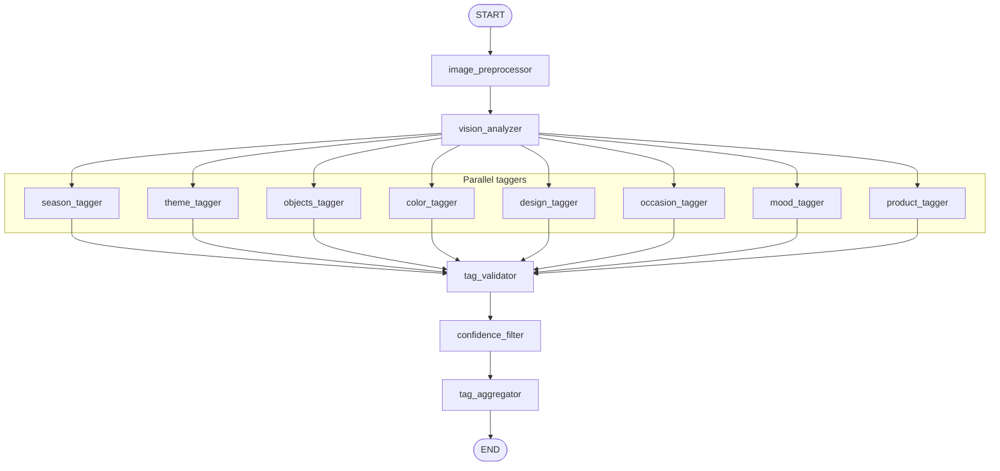

# 03 — LangGraph Pipeline

This document describes the full agent graph structure, the `graph_builder.py` implementation (including `fan_out_to_taggers` and the Send API), how the graph is compiled and invoked, and state merge semantics.

---

## Agent graph diagram



- **START** → **image_preprocessor** → **vision_analyzer** (linear).
- **vision_analyzer** has a **conditional edge** that fans out to all 8 tagger nodes via LangGraph’s **Send** API; they run in parallel.
- All taggers converge at **tag_validator** → **confidence_filter** → **tag_aggregator** → **END**.

---

## Code location

- **Graph definition:** `backend/src/image_tagging/graph_builder.py`
- **Compiled graph export:** `backend/src/image_tagging/image_tagging.py`
- **Invocation:** `backend/src/server.py` (in `analyze_image` and in `_process_one_file` for bulk)

---

## graph_builder.py — step-by-step

### 1. Imports

```python
from langgraph.graph import END, START, StateGraph
from langgraph.types import Send

from .nodes import (
    image_preprocessor,
    vision_analyzer,
    validate_tags,
    filter_by_confidence,
    aggregate_tags,
    ALL_TAGGERS,
    TAGGER_NODE_NAMES,
)
from .schemas.states import ImageTaggingState
```

- `StateGraph(ImageTaggingState)` defines the state schema.
- `Send` is used to fan out from vision to multiple tagger nodes.

### 2. fan_out_to_taggers

```python
def fan_out_to_taggers(state: ImageTaggingState):
    """Return one Send per tagger so all 8 run in parallel."""
    return [Send(name, state) for name in TAGGER_NODE_NAMES]
```

- `TAGGER_NODE_NAMES` is the list: `["season_tagger", "theme_tagger", "objects_tagger", "color_tagger", "design_tagger", "occasion_tagger", "mood_tagger", "product_tagger"]`.
- Each `Send(node_name, state)` schedules that node with the current state. LangGraph runs these in parallel and merges their outputs using the state reducers (e.g. `operator.add` for `partial_tags`).

### 3. build_graph()

- **Create graph:** `builder = StateGraph(ImageTaggingState)`.
- **Add nodes:**
  - `builder.add_node("image_preprocessor", image_preprocessor)`
  - `builder.add_node("vision_analyzer", vision_analyzer)`
  - For each `(name, fn)` in `ALL_TAGGERS.items()`: `builder.add_node(name, fn)` (the 8 taggers).
  - `builder.add_node("tag_validator", validate_tags)`
  - `builder.add_node("confidence_filter", filter_by_confidence)`
  - `builder.add_node("tag_aggregator", aggregate_tags)`
- **Edges:**
  - `builder.add_edge(START, "image_preprocessor")`
  - `builder.add_edge("image_preprocessor", "vision_analyzer")`
  - `builder.add_conditional_edges("vision_analyzer", fan_out_to_taggers)` — this is the fan-out; the function returns a list of `Send`, so all 8 taggers run next.
  - For each `name` in `TAGGER_NODE_NAMES`: `builder.add_edge(name, "tag_validator")`
  - `builder.add_edge("tag_validator", "confidence_filter")`
  - `builder.add_edge("confidence_filter", "tag_aggregator")`
  - `builder.add_edge("tag_aggregator", END)`
- **Compile and return:** `return builder.compile()`.

---

## image_tagging.py — compiled graph export

```python
from .graph_builder import build_graph

graph = build_graph()

__all__ = ["graph", "build_graph"]
```

- `graph` is the compiled runnable. The server imports it with:

  `from src.image_tagging.image_tagging import graph`

- Invocation: `result = await graph.ainvoke(initial_state)`.

- **initial_state** (from server) typically contains: `image_id`, `image_url`, `image_base64`, `partial_tags: []`. Other fields are optional; nodes fill them in.

---

## How the server invokes the graph

In `server.py`:

```python
initial_state = {
    "image_id": image_id,
    "image_url": image_url,
    "image_base64": image_base64,
    "partial_tags": [],
}
result = await graph.ainvoke(initial_state)
```

- The same pattern is used in `_process_one_file` for bulk upload: each file gets its own `initial_state` and `graph.ainvoke` call.
- The returned `result` is the final state dict after all nodes have run (or after failure); it includes `tag_record`, `validated_tags`, `flagged_tags`, `processing_status`, `vision_description`, etc.

---

## State merge semantics (reducer for partial_tags)

In `backend/src/image_tagging/schemas/states.py`, `ImageTaggingState` defines:

```python
partial_tags: Annotated[list, operator.add]
```

- **Meaning:** When multiple nodes (the 8 taggers) each return a dict that includes `"partial_tags": [item]`, LangGraph does not replace the list; it **reduces** by applying `operator.add` (list concatenation).
- So the first tagger adds one element, the second adds another, … and after all 8 run, `partial_tags` is a list of 8 items (one `TagResult` per category).
- Without this reducer, the last tagger to finish would overwrite the others. With it, all tagger outputs are accumulated. See [04-agent-state.md](04-agent-state.md) for full state field semantics.

---

## Summary

| Step | What happens |
|------|----------------|
| 1 | Server builds initial_state (image_id, image_url, image_base64, partial_tags=[]). |
| 2 | graph.ainvoke(initial_state) runs. |
| 3 | image_preprocessor runs (sync); updates image_base64, metadata (or fails). |
| 4 | vision_analyzer runs (async); updates vision_description, vision_raw_tags. |
| 5 | fan_out_to_taggers returns 8 Send(season_tagger, state), …; all 8 run in parallel. |
| 6 | Each tagger returns {"partial_tags": [one TagResult]}; reducer merges into one list of 8. |
| 7 | tag_validator runs; expects all 8 categories; produces validated_tags, flagged_tags. |
| 8 | confidence_filter runs; moves low-confidence to flagged_tags, sets needs_review. |
| 9 | tag_aggregator runs; builds tag_record, sets processing_status. |
| 10 | END; result is the final state returned to the server. |
