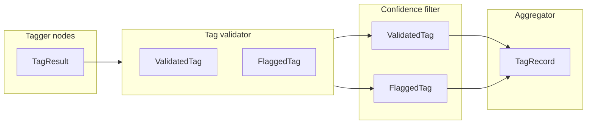

# 05 — Agent Data Models

This document is a full reference for the Pydantic models used in the agent: `TagResult`, `ValidatedTag`, `FlaggedTag`, `HierarchicalTag`, `TagRecord`, and `TaggerOutput`. For each we list fields, who creates/consumes it, and example JSON. We also show a complete `TagRecord` example and a relationship diagram from taggers → validator → aggregator.

---

## File

All models live in **`backend/src/image_tagging/schemas/models.py`**.

---

## TagResult

**Purpose:** Output from a single tagger node; one category’s tags and confidence scores.

| Field | Type | Purpose |
|-------|------|---------|
| category | str | e.g. "season", "theme", "objects" |
| tags | list[str] | Allowed values from taxonomy for this category |
| confidence_scores | dict[str, float] | value → score (e.g. 0.9) |

- **Created by:** Each of the 8 tagger nodes (`run_tagger` → `TagResult(...).model_dump()`), then returned as the single element in `partial_tags` for that node.
- **Consumed by:** Tag validator reads `partial_tags` (list of TagResult dicts) and validates each value.

**Example JSON:**

```json
{
  "category": "season",
  "tags": ["christmas"],
  "confidence_scores": { "christmas": 0.92 }
}
```

---

## ValidatedTag

**Purpose:** A tag that passed taxonomy validation; may include parent for hierarchical categories.

| Field | Type | Purpose |
|-------|------|---------|
| value | str | The tag value (child for hierarchical) |
| confidence | float | 0–1 |
| parent | Optional[str] | Parent key for hierarchical (e.g. "red_family"); null for flat |

- **Created by:** Tag validator (`_validate_value`) for each tag in `partial_tags` that is valid.
- **Consumed by:** Confidence filter (reads validated_tags, may move some to flagged); aggregator (reads validated_tags to build TagRecord).

**Example JSON:**

```json
{ "value": "crimson", "confidence": 0.9, "parent": "red_family" }
```

```json
{ "value": "christmas", "confidence": 0.92, "parent": null }
```

---

## FlaggedTag

**Purpose:** A tag that was rejected (invalid taxonomy) or moved out (low confidence).

| Field | Type | Purpose |
|-------|------|---------|
| category | str | Category name |
| value | str | The tag value |
| confidence | float | Score when flagged |
| reason | str | "invalid_taxonomy_value" or "low_confidence" |

- **Created by:** Tag validator (invalid value), confidence filter (below threshold).
- **Consumed by:** Aggregator (sets needs_review if any flagged); server (returned in API and stored in DB).

**Example JSON:**

```json
{ "category": "product_type", "value": "unknown_type", "confidence": 0.6, "reason": "invalid_taxonomy_value" }
```

```json
{ "category": "season", "value": "easter", "confidence": 0.55, "reason": "low_confidence" }
```

---

## HierarchicalTag

**Purpose:** Parent/child pair for hierarchical categories (objects, dominant_colors, product_type).

| Field | Type | Purpose |
|-------|------|---------|
| parent | str | e.g. "objects_items", "red_family" |
| child | str | e.g. "ribbon", "crimson" |

- **Created by:** Aggregator when building `TagRecord` from `validated_tags` for objects, dominant_colors, and product_type.
- **Consumed by:** TagRecord; DB (inside tag_record JSONB); frontend (display, search_index).

**Example JSON:**

```json
{ "parent": "objects_items", "child": "ribbon" }
```

---

## TagRecord

**Purpose:** Final assembled record for one image: all categories in the shape used by the API and DB.

| Field | Type | Purpose |
|-------|------|---------|
| image_id | str | Unique image id |
| season | list[str] | Flat list |
| theme | list[str] | Flat list |
| objects | list[HierarchicalTag] | Parent/child pairs |
| dominant_colors | list[HierarchicalTag] | Parent/child pairs |
| design_elements | list[str] | Flat list |
| occasion | list[str] | Flat list |
| mood | list[str] | Flat list |
| product_type | Optional[HierarchicalTag] | Single parent/child or None |
| needs_review | bool | True if any flagged or many low-confidence |
| processed_at | str | UTC ISO timestamp |

- **Created by:** Tag aggregator (`aggregate_tags` builds it from `validated_tags`).
- **Consumed by:** Server (response, DB upsert); frontend (display, search).

**Full example:**

```json
{
  "image_id": "a1b2c3d4-e5f6-7890-abcd-ef1234567890",
  "season": ["christmas"],
  "theme": ["traditional", "elegant_luxury"],
  "objects": [
    { "parent": "objects_items", "child": "gift_box" },
    { "parent": "objects_items", "child": "ribbon" },
    { "parent": "plants_nature", "child": "holly" }
  ],
  "dominant_colors": [
    { "parent": "red_family", "child": "crimson" },
    { "parent": "metallic_family", "child": "gold_metallic" }
  ],
  "design_elements": ["foil_metallic", "centered_motif", "border_frame"],
  "occasion": ["gifting_general"],
  "mood": ["joyful_fun"],
  "product_type": { "parent": "gift_bag", "child": "gift_bag_medium" },
  "needs_review": false,
  "processed_at": "2025-03-17T12:00:00.000000+00:00"
}
```

---

## TaggerOutput

**Purpose:** Structured LLM output from a category tagger before filtering (internal to taggers).

| Field | Type | Purpose |
|-------|------|---------|
| tags | list[str] | Raw tags from LLM |
| confidence_scores | dict[str, float] | value → score |
| reasoning | str | Optional explanation from LLM |

- **Created by:** `_parse_tagger_response(text)` in taggers.py after parsing JSON from the LLM.
- **Consumed by:** `run_tagger` filters to allowed values and confidence > 0.5, then builds `TagResult` from it.

**Example JSON:**

```json
{
  "tags": ["christmas", "winter"],
  "confidence_scores": { "christmas": 0.92, "winter": 0.4 },
  "reasoning": "Red and green, holly, ribbon suggest Christmas."
}
```

(winter would be dropped: not in season taxonomy or below 0.5.)

---

## Relationship diagram



- **Taggers** produce **TagResult** (in `partial_tags`).
- **Validator** turns each tag into **ValidatedTag** or **FlaggedTag**.
- **Confidence filter** keeps or moves **ValidatedTag**s and appends to **FlaggedTag**s.
- **Aggregator** reads **validated_tags** (and **flagged_tags** for needs_review) and builds **TagRecord** (using **HierarchicalTag** for objects, dominant_colors, product_type).

See [04-agent-state.md](04-agent-state.md) for how these fit into state and [12-node-validator.md](12-node-validator.md), [13-node-confidence-filter.md](13-node-confidence-filter.md), [14-node-aggregator.md](14-node-aggregator.md) for node logic.
