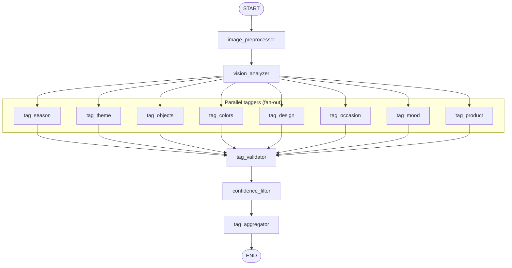

# LangGraph pipeline structure

This diagram matches the graph built in `backend/src/image_tagging/graph_builder.py`: linear start, fan-out to eight taggers, then linear validator → confidence filter → aggregator → END.

## Flow summary

| Step | Node(s) | Role |
|------|---------|------|
| 1 | `image_preprocessor` | Validate image, resize, set base64 |
| 2 | `vision_analyzer` | One GPT-4o vision call → vision_description, vision_raw_tags |
| 3 | `tag_season` … `tag_product` | Eight parallel LLM calls; each appends to partial_tags |
| 4 | `tag_validator` | Validate partial_tags against taxonomy → validated_tags, flagged_tags |
| 5 | `confidence_filter` | Apply thresholds → update validated/flagged, set needs_review |
| 6 | `tag_aggregator` | Build tag_record, set processing_status → END |

The fan-out is implemented with LangGraph’s `add_conditional_edges("vision_analyzer", fan_out_to_taggers)`, where `fan_out_to_taggers` returns a list of `Send(node_name, state)` for each of the eight tagger nodes.
