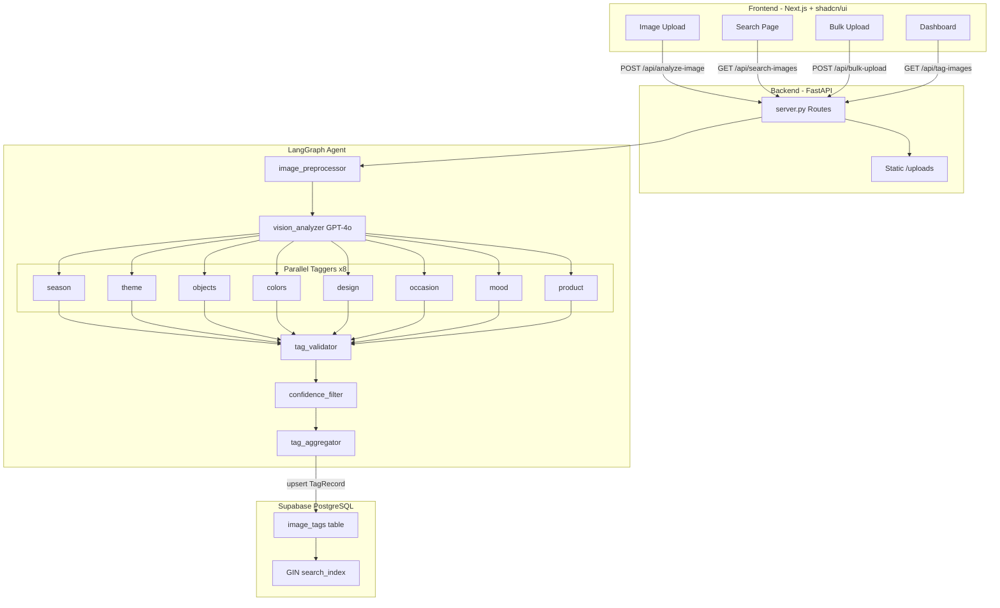

# System architecture

High-level flow: browser → Next.js → FastAPI → LangGraph agent → (optional) Supabase.

## Diagram

## Tech stack

- **Frontend:** Next.js 16 (App Router), React 19, TypeScript, Tailwind v4, shadcn/ui, Framer Motion, Lucide, react-dropzone.
- **Backend:** Python 3.11, FastAPI, LangGraph, langchain-openai (GPT-4o vision), Pillow, python-dotenv, psycopg2.
- **Database:** Supabase (PostgreSQL); JSONB `tag_record`, GIN-indexed `search_index` array for filtered search.
- **Tracing:** LangSmith optional via `LANGCHAIN_API_KEY` / `LANGCHAIN_TRACING_V2`.

## Rationale

- **LangGraph:** Structured pipeline (preprocess → vision → parallel taggers → validate → filter → aggregate) with clear state and fan-out.
- **GPT-4o:** Strong vision and JSON output for product-image tagging.
- **Supabase:** Managed Postgres, simple connection string, GIN indexes for array containment search.
- **Next.js + shadcn:** Fast UI, accessible components, dark theme, good DX.
