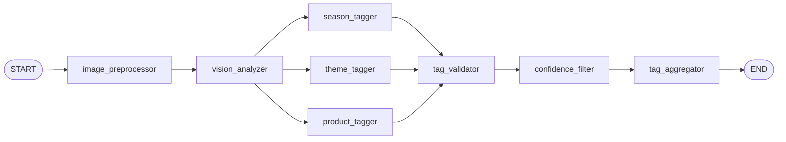

# Lab 03 — Graph Starts

**Estimated time:** 30 min  
**Difficulty:** Intermediate

When the server calls `graph.ainvoke(initial_state)`, it is using a **compiled graph** built from a **StateGraph**: nodes (functions) and edges (what runs next). This lab shows where that graph comes from and how it is wired so that execution flows from preprocessor → vision → 8 taggers → validator → confidence → aggregator.

---

## Learning objectives

- Understand how the graph is created at import time (`image_tagging.py` → `build_graph()`).
- See the **state schema** (`ImageTaggingState`): TypedDict, optional keys, and the **reducer** for `partial_tags`.
- See how **StateGraph** is built: add_node, add_edge, add_conditional_edges, and **compile()**.

---

## Prerequisites

- [02-server-receives-image.md](02-server-receives-image.md) — the server has built `initial_state` and is about to call `graph.ainvoke(initial_state)`.

---

## Step 1 — Where the graph object comes from

The server imports `graph` from `src.image_tagging.image_tagging`. That module builds the graph once when it is first loaded.

**Snippet (lines 1–7 in image_tagging.py)**

```python
"""Compiled graph export for image tagging pipeline."""
from .graph_builder import build_graph

graph = build_graph()

__all__ = ["graph", "build_graph"]
```

**What is happening**

- `from .graph_builder import build_graph` imports the function that constructs the graph.
- `graph = build_graph()` **calls** that function. So the first time any code imports `image_tagging` (e.g. the server when handling the first request), `build_graph()` runs and returns a **compiled** graph. The result is stored in `graph`.
- Later, the server calls `graph.ainvoke(initial_state)`. The same compiled graph is reused for every request.

**Source:** [backend/src/image_tagging/image_tagging.py](../../backend/src/image_tagging/image_tagging.py) (lines 1–7)

> **Glossary:** **compile** — Turning the graph (nodes + edges) into a runnable object. After compile, you can call `ainvoke(state)` to run the pipeline.

> **Next:** The graph is built in `build_graph()` in graph_builder.py. First we need the state schema — see Step 2.

---

## Step 2 — State schema: ImageTaggingState

Every node receives the current state and returns a dict of updates. LangGraph merges those updates into the state. The **state schema** declares the keys and, for `partial_tags`, a **reducer** so that multiple nodes can append to the same list.

**Snippet (lines 1–21 in states.py)**

```python
"""Graph state definition for image tagging."""
from typing import Annotated, Literal, Optional, TypedDict
import operator


class ImageTaggingState(TypedDict, total=False):
    """State passed through the LangGraph pipeline."""
    image_id: str
    image_url: str
    image_base64: Optional[str]
    metadata: dict
    vision_description: str
    vision_raw_tags: dict
    partial_tags: Annotated[list, operator.add]
    validated_tags: dict
    flagged_tags: list
    tag_record: dict
    needs_review: bool
    processing_status: Literal["pending", "complete", "needs_review", "failed"]
    error: Optional[str]
```

**What is happening**

- **TypedDict** — A type that describes a dict’s keys and value types. At runtime it is still a normal dict; the type checker uses it for validation and autocomplete. Each node returns a dict that may contain only some of these keys.
- **total=False** — Every key is optional. Nodes only return the keys they change; they do not have to return the full state.
- **partial_tags: Annotated[list, operator.add]** — This is the **reducer**. For most keys, a node’s return value **overwrites** the previous value. For `partial_tags`, LangGraph **merges** by applying `operator.add`: `new_list = current["partial_tags"] + node_output["partial_tags"]`. So when each of the 8 taggers returns `{"partial_tags": [one_item]}`, the eight lists are concatenated into one list of 8 items. Without the reducer, the last tagger would overwrite the others.

**Source:** [backend/src/image_tagging/schemas/states.py](../../backend/src/image_tagging/schemas/states.py) (lines 1–21)

> **Glossary:** **TypedDict** — A Python type that describes the shape of a dict (keys and value types). **reducer** — A rule for merging updates into state instead of overwriting (e.g. append for lists).

> **Why This Way?** Eight taggers run in parallel; each returns one TagResult. If we did not use a reducer, each would overwrite `partial_tags` and we would end up with only one category. The reducer lets all eight results accumulate.

---

## Step 3 — StateGraph and nodes

`build_graph()` creates a **StateGraph** with the state type, then registers every node (function) that will run in the pipeline.

**Snippet (lines 22–33 in graph_builder.py)**

```python
def build_graph():
    """Full pipeline with parallel taggers and validator/confidence/aggregator."""
    builder = StateGraph(ImageTaggingState)

    builder.add_node("image_preprocessor", image_preprocessor)
    builder.add_node("vision_analyzer", vision_analyzer)
    for name, fn in ALL_TAGGERS.items():
        builder.add_node(name, fn)
    builder.add_node("tag_validator", validate_tags)
    builder.add_node("confidence_filter", filter_by_confidence)
    builder.add_node("tag_aggregator", aggregate_tags)
```

**What is happening**

- **StateGraph(ImageTaggingState)** — Creates a new graph that will pass state dicts matching `ImageTaggingState`. The graph does not create the state; the caller (the server) provides `initial_state`, and nodes return updates that are merged in.
- **add_node(name, fn)** — Registers a function as a node. When the graph runs this node, it will call `fn(state)` (or `await fn(state)` if async) and merge the returned dict into the state. The names are used in edges. `image_preprocessor` and `vision_analyzer` are the first two nodes. Then the 8 taggers from `ALL_TAGGERS` (e.g. `season_tagger`, `theme_tagger`, ...). Then `tag_validator`, `confidence_filter`, `tag_aggregator`.

**Source:** [backend/src/image_tagging/graph_builder.py](../../backend/src/image_tagging/graph_builder.py) (lines 22–33)

> **Glossary:** **node** — One step in the graph; a function that takes state and returns a dict of updates. **StateGraph** — LangGraph’s builder for defining a graph over a typed state.

---

## Step 4 — Edges: linear and conditional

Edges define the order of execution: after a node runs, which node runs next? The graph has one **conditional** edge: after the vision analyzer, we **fan out** to all 8 taggers.

**Snippet (lines 35–42 in graph_builder.py)**

```python
    builder.add_edge(START, "image_preprocessor")
    builder.add_edge("image_preprocessor", "vision_analyzer")
    builder.add_conditional_edges("vision_analyzer", fan_out_to_taggers)
    for name in TAGGER_NODE_NAMES:
        builder.add_edge(name, "tag_validator")
    builder.add_edge("tag_validator", "confidence_filter")
    builder.add_edge("confidence_filter", "tag_aggregator")
    builder.add_edge("tag_aggregator", END)
```

**What is happening**

- **add_edge(START, "image_preprocessor")** — When the graph starts, the first node is `image_preprocessor`. So `ainvoke(initial_state)` begins by calling the preprocessor with that state.
- **add_edge("image_preprocessor", "vision_analyzer")** — After the preprocessor returns, the vision_analyzer runs (with the updated state).
- **add_conditional_edges("vision_analyzer", fan_out_to_taggers)** — After the vision_analyzer, instead of a single next node, we call `fan_out_to_taggers(state)`. That function returns a list of **Send** objects (Lab 06). Each Send schedules one tagger with the same state. So all 8 taggers run next (in parallel when using async).
- **add_edge(name, "tag_validator")** for each tagger name — When any tagger finishes, the next node is always `tag_validator`. LangGraph waits until all 8 taggers have run (and the reducer has merged their `partial_tags`), then runs the validator once.
- **add_edge("tag_validator", "confidence_filter")** — Then confidence filter, then aggregator.
- **add_edge("tag_aggregator", END)** — After the aggregator, the graph ends. The final state (including `tag_record`, `processing_status`) is returned to the server.

**Source:** [backend/src/image_tagging/graph_builder.py](../../backend/src/image_tagging/graph_builder.py) (lines 35–42)



> **Next:** Execution at runtime starts at the preprocessor. See [04-preprocessor-runs.md](04-preprocessor-runs.md). How `fan_out_to_taggers` and Send work is detailed in [06-taggers-fan-out.md](06-taggers-fan-out.md).

---

## Step 5 — fan_out_to_taggers (preview)

This function is used by the conditional edge after the vision node. It returns one **Send** per tagger so the runtime can schedule all 8.

**Snippet (lines 17–19 in graph_builder.py)**

```python
def fan_out_to_taggers(state: ImageTaggingState):
    """Return one Send per tagger so all 8 run in parallel."""
    return [Send(name, state) for name in TAGGER_NODE_NAMES]
```

**What is happening**

- **TAGGER_NODE_NAMES** is a list of 8 strings: `["season_tagger", "theme_tagger", "objects_tagger", "color_tagger", "design_tagger", "occasion_tagger", "mood_tagger", "product_tagger"]`.
- **Send(name, state)** — LangGraph’s way to say “run node `name` with this `state`.” We pass the **same** state to each (the state after the vision node: it has `vision_description` and `vision_raw_tags`).
- Returning a list of Sends means “run all of these.” The runtime runs them (in parallel when possible); when **all** are done, the reducer has merged all 8 `partial_tags` updates, and the next edge is from any tagger to `tag_validator`, so the validator runs once.

**Source:** [backend/src/image_tagging/graph_builder.py](../../backend/src/image_tagging/graph_builder.py) (lines 17–19)

---

## Step 6 — compile()

At the end of `build_graph()`, we compile the builder into a runnable graph.

**Snippet (lines 44–45 in graph_builder.py)**

```python
    return builder.compile()
```

**What is happening**

- **compile()** — Converts the StateGraph (nodes + edges) into a single callable object. That object has methods like `ainvoke(initial_state)` (async) and `invoke(initial_state)` (sync). When you call `ainvoke`, it runs the preprocessor, then vision, then fans out to taggers, then validator, confidence, aggregator, and returns the final state.

> **Next:** When the server called `await graph.ainvoke(initial_state)` in Lab 02, the first node that runs is **image_preprocessor**. See [04-preprocessor-runs.md](04-preprocessor-runs.md).

---

## Lab summary

1. **graph** is created once when `image_tagging` is imported: `graph = build_graph()`.
2. **ImageTaggingState** defines the state shape and the **reducer** for `partial_tags` so 8 taggers can append their result.
3. **build_graph()** creates a StateGraph, adds 12 nodes (preprocessor, vision, 8 taggers, validator, confidence, aggregator), and adds edges: START → preprocessor → vision → (conditional) 8 taggers → validator → confidence → aggregator → END.
4. **fan_out_to_taggers** returns a list of Send so all 8 taggers run with the same state; their `partial_tags` are merged by the reducer.
5. **compile()** produces the runnable graph used by the server. The first node executed when you call `ainvoke` is the preprocessor.

---

## Exercises

1. What would happen if we removed the reducer from `partial_tags` and made it a normal list?
2. Why does the conditional edge pass the **same** state to every tagger instead of different state?
3. How many times does `tag_validator` run for one image? Why?

---

## Next lab

Go to [04-preprocessor-runs.md](04-preprocessor-runs.md) to see the first node that runs: decode base64, resize image if needed, re-encode to JPEG, and return updated state.
