# Code Walkthrough — Lab Manual

This folder is the **hands-on companion** to [docs/curriculum/](../curriculum/). The curriculum teaches *concepts*; the walkthrough traces *actual code execution* snippet-by-snippet — like stepping through a debugger on paper. When you run the app and click "Analyze," the labs show exactly which file and which lines run next, what data looks like at each step, and what can go wrong.

**Assumed background:** No prior backend, frontend, or agent coding experience. Start with [00-prerequisites.md](00-prerequisites.md) if any of those are new to you.

---

## How to use the labs

1. **Order:** Work through labs in number order (00 → 01 → … → 20). Each lab’s "Prerequisites" lists earlier labs you should have read.
2. **Code:** Open the project in your editor and use the "Source" links under each snippet to jump to the real file and line numbers.
3. **Flow:** Use the "Next" arrows at the end of each step to see where execution continues (often in another file).
4. **Appendices:** Use [A-glossary.md](A-glossary.md), [B-full-state-tracker.md](B-full-state-tracker.md), and [C-file-map.md](C-file-map.md) for reference anytime.

**Estimated time:** About 8–12 hours to read all labs once; longer if you run the code and try the exercises.

---

## Legend — box types used in every lab

Each lab uses the same kinds of callout boxes. Here is what they mean:

| Box | Purpose |
|-----|--------|
| **Glossary** | Defines a term the first time it appears (e.g. *endpoint*, *hook*, *reducer*). |
| **File Type** | Explains a file extension or type when you first see it (e.g. `.tsx`, `.py`, TypedDict). |
| **State Tracker** | Shows the full state dict at this point: which fields are set and which are still empty. |
| **I/O Snapshot** | Example JSON (or data) going **into** a function and **out** of it. |
| **Error Path** | What happens when something fails at this step (e.g. network error, invalid file). |
| **Why This Way?** | Explains a design decision (e.g. why use a reducer, why retry 3 times). |
| **Next** | Where execution continues next (link to Lab N, Step M). |

---

## Master flow — single image upload

When a user uploads one image and clicks "Analyze," execution moves through these labs in order:

```mermaid
flowchart LR
  L01[Lab 01 User clicks]
  L02[Lab 02 Server receives]
  L03[Lab 03 Graph starts]
  L04[Lab 04 Preprocessor]
  L05[Lab 05 Vision GPT-4o]
  L06[Lab 06 Taggers fan-out]
  L07[Lab 07 Inside a tagger]
  L08[Lab 08 Validator]
  L09[Lab 09 Confidence]
  L10[Lab 10 Aggregator]
  L11[Lab 11 Server saves]
  L12[Lab 12 Frontend result]

  L01 --> L02 --> L03 --> L04 --> L05 --> L06 --> L07
  L07 --> L08 --> L09 --> L10 --> L11 --> L12
```

- **Labs 01–02:** Frontend sends file → backend receives it.
- **Labs 03–10:** Backend runs the LangGraph pipeline (preprocessor → vision → 8 taggers → validator → confidence → aggregator).
- **Labs 11–12:** Backend saves to DB (if enabled) and responds → frontend shows the result.

---

## Other flows

- **Search:** Labs 13 → 14 → 15 (filters, backend search, results and modal).
- **Bulk upload:** Labs 16 → 17 (upload + background processing, then polling until complete).
- **Deep dives:** Labs 18 (database), 19 (taxonomy and config), 20 (prompts and LLM calls) can be read after the main flows or when you need detail on those parts.

---

## Lab index

| Lab | File | Topic |
|-----|------|--------|
| 0 | [00-prerequisites.md](00-prerequisites.md) | Before you start — Python, JS, HTTP, JSON, async, React, API, DB, Docker |
| 1 | [01-user-clicks-analyze.md](01-user-clicks-analyze.md) | Frontend: ImageUploader → handleAnalyze → fetch POST |
| 2 | [02-server-receives-image.md](02-server-receives-image.md) | Backend: analyze_image validates and saves file |
| 3 | [03-graph-starts.md](03-graph-starts.md) | Graph import, StateGraph, compile |
| 4 | [04-preprocessor-runs.md](04-preprocessor-runs.md) | Decode, resize, re-encode image |
| 5 | [05-vision-calls-gpt4o.md](05-vision-calls-gpt4o.md) | Multimodal message, retry, parse |
| 6 | [06-taggers-fan-out.md](06-taggers-fan-out.md) | Send API, 8 parallel taggers, reducer |
| 7 | [07-inside-a-tagger.md](07-inside-a-tagger.md) | run_tagger step by step, all 8 taggers |
| 8 | [08-validator-checks-tags.md](08-validator-checks-tags.md) | validate_tags, flat vs hierarchical |
| 9 | [09-confidence-filters.md](09-confidence-filters.md) | Thresholds, overrides, needs_review |
| 10 | [10-aggregator-builds-record.md](10-aggregator-builds-record.md) | TagRecord, processing_status |
| 11 | [11-server-saves-and-responds.md](11-server-saves-and-responds.md) | DB upsert, build response |
| 12 | [12-frontend-shows-result.md](12-frontend-shows-result.md) | DashboardResult and sub-components |
| 13 | [13-search-page-and-filters.md](13-search-page-and-filters.md) | Search page, FilterSidebar, buildQuery |
| 14 | [14-search-backend-and-db.md](14-search-backend-and-db.md) | search_images, @> containment |
| 15 | [15-search-results-and-modal.md](15-search-results-and-modal.md) | SearchResults, DetailModal |
| 16 | [16-bulk-upload-and-background.md](16-bulk-upload-and-background.md) | BulkUploader, BATCH_STORAGE, background task |
| 17 | [17-bulk-polling-and-completion.md](17-bulk-polling-and-completion.md) | Polling, progress, completion |
| 18 | [18-database-deep-dive.md](18-database-deep-dive.md) | migration.sql, SupabaseClient |
| 19 | [19-taxonomy-and-config.md](19-taxonomy-and-config.md) | TAXONOMY, configuration |
| 20 | [20-prompts-and-llm-calls.md](20-prompts-and-llm-calls.md) | System prompt, tagger prompt, ChatOpenAI |
| A | [A-glossary.md](A-glossary.md) | Full glossary |
| B | [B-full-state-tracker.md](B-full-state-tracker.md) | State at every node boundary |
| C | [C-file-map.md](C-file-map.md) | Every source file and which labs use it |

Start with [00-prerequisites.md](00-prerequisites.md), then [01-user-clicks-analyze.md](01-user-clicks-analyze.md).
