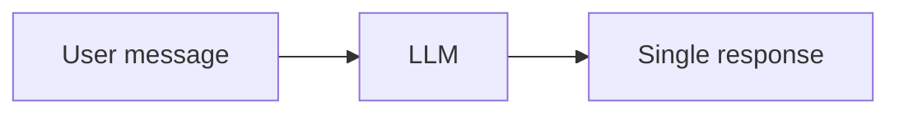
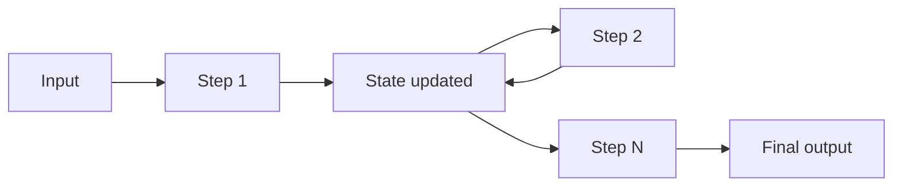
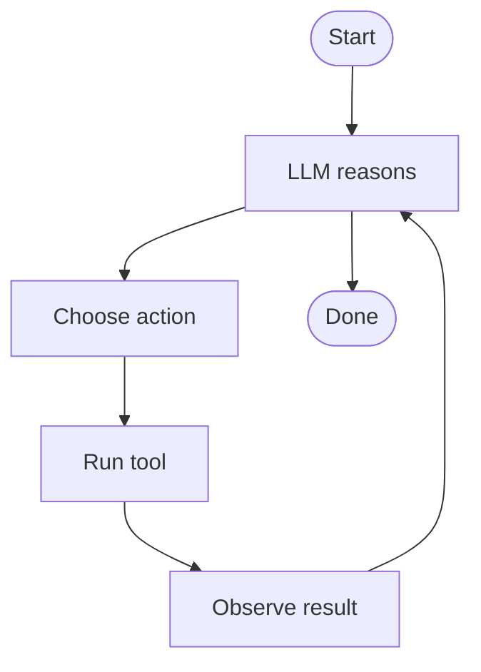
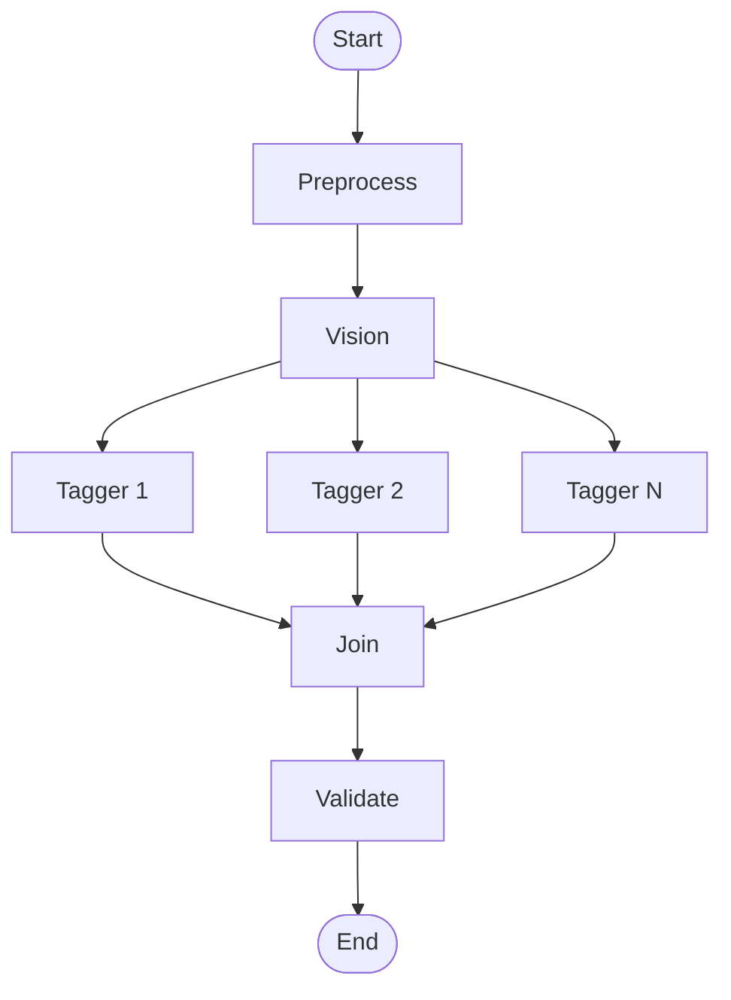

# 01 — What Is an AI Agent?

This lesson introduces AI agents at an undergraduate level: how they differ from plain chatbots, why they matter in information systems, and the main architecture patterns you will see in this project and in future ones.

---

## What you will learn

- The difference between a **chatbot** (single turn, input–output) and an **agent** (stateful, multi-step, possibly tool-using).
- The role of **state**, **tools**, and **LLM reasoning loops** in agents.
- Why agents matter in **MIS** (Management Information Systems).
- Three common **agent architectures**: ReAct-style loops, plan-and-execute, and **DAG/pipeline** (the pattern used in this project).

---

## Concepts

### Chatbot vs agent

A **chatbot** typically takes one user message, sends it to an LLM, and returns one response. There is no persistent memory between turns beyond what you put in the chat history. The flow is:

An **agent** maintains **state** (data that accumulates or changes over steps), runs **multiple steps** (often involving calls to an LLM, tools, or external APIs), and may **loop** until a goal is met or a stopping condition is reached. The flow looks more like:

So: **chatbot = one shot; agent = stateful multi-step process.**

### State, tools, and reasoning loops

- **State** — A shared data structure (e.g. a dictionary or typed object) that each step can read and update. In our project, state holds the image, the vision description, partial tag results, validated tags, and the final tag record.
- **Tools** — Functions or APIs the agent can call (e.g. search, database lookup, image processing). The LLM may “decide” to use a tool; the result is fed back into state and possibly into the next LLM call. This project uses a **fixed pipeline** (no LLM-chosen tools); every run goes through the same steps.
- **Reasoning loop** — In ReAct-style agents, the model repeatedly: Reason (think), Act (call a tool), Observe (see the result), then repeat until done. In a **pipeline** (DAG), there is no loop: the graph runs once from start to end, and each node runs in a defined order (or in parallel where the graph allows).

### Why agents matter in MIS

In **Management Information Systems**, we often need to:

- Ingest unstructured data (documents, images, emails).
- Turn it into **structured** data (tags, categories, entities) for storage, search, and reporting.
- Apply business rules (validation, confidence thresholds, human review).

Agents are a good fit when the pipeline has several stages (e.g. “see” the image, “tag” by category, “validate,” “filter,” “aggregate”). They make the workflow explicit, testable, and easier to change (e.g. add a new tag category or a new validation step). This project is an example: an **image-tagging agent** that turns product images into structured tags for search and analytics.

### Agent architecture types

Different designs suit different problems:

**1. ReAct (Reason + Act) loop**

The LLM repeatedly chooses an action (e.g. use a tool), the system runs it, and the result is fed back. The loop continues until the model outputs “done” or a final answer.

**2. Plan-and-execute**

The LLM first produces a plan (a list of steps); then a separate executor runs those steps (possibly calling tools or other services). Good when the sequence of steps can be decided up front.

**3. DAG / pipeline (this project)**

The workflow is a **directed acyclic graph**: nodes (e.g. preprocess, vision, taggers, validator, aggregator) and edges that define order and parallelism. There is **no** loop; the graph runs once. Flow can **fan out** (e.g. eight taggers in parallel) and then **join** (e.g. all feed into the validator). This is what LangGraph implements in our project.

---

## Key takeaways

- An **agent** is a stateful, multi-step system; a **chatbot** is typically a single request–response.
- **State** holds data across steps; **tools** let the agent interact with external systems; **reasoning loops** (in ReAct) or **fixed graphs** (in a DAG) define how steps run.
- In MIS, agents help turn unstructured data into structured data and apply business logic.
- This project uses a **DAG/pipeline** architecture: a fixed graph (LangGraph) with parallel taggers and no LLM-driven tool loop.

---

## Exercises

1. In one sentence, state the main difference between “user asks, LLM answers” and “user gives input, agent runs a multi-step pipeline and returns a result.”
2. Give an example of “state” in our image-tagging agent: name three pieces of data that are stored in state and updated by different steps.
3. Why might a company prefer a pipeline (DAG) over a ReAct loop for “tag every image with the same set of categories”?

---

## Next

Go to [02-project-overview-and-architecture.md](02-project-overview-and-architecture.md) to see how this project is built end to end: the four layers, request lifecycles, and a full architecture diagram.
