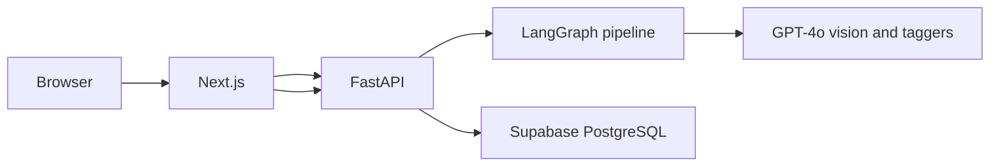
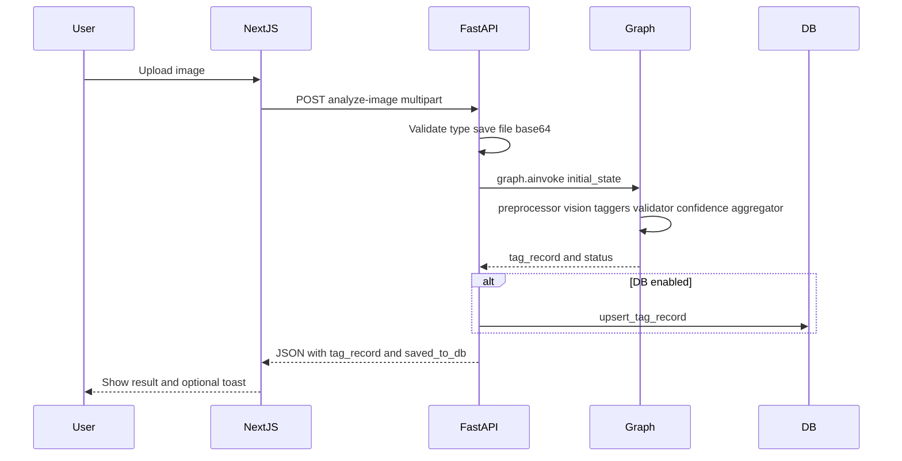
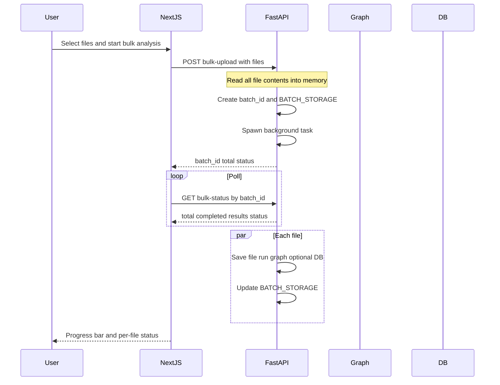
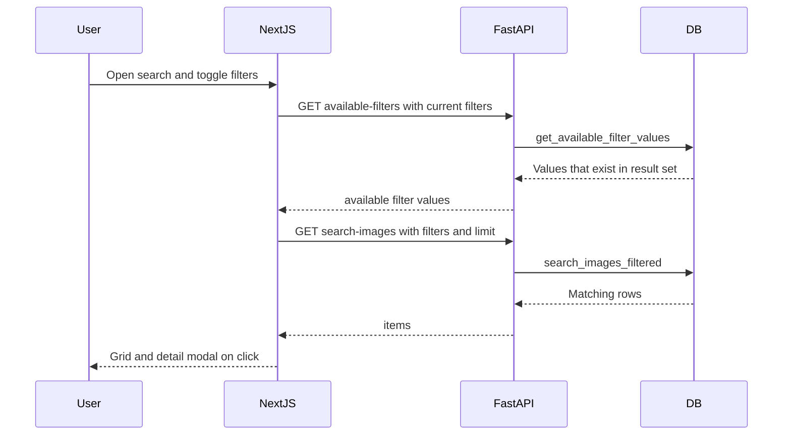

# 02 — Project Overview and Architecture

This lesson describes what the Image Analysis Agent does end to end, the four layers of the system, the request lifecycles for single analyze, bulk upload, and search, and a glossary of terms you will use in the rest of the curriculum.

---

## What you will learn

- What the project does (features and user flows).
- The **four layers**: browser, Next.js, FastAPI, LangGraph + GPT-4o, and Supabase.
- How a single image analyze request flows from upload to result.
- How bulk upload and search work at a high level.
- Key terms: state, node, taxonomy, tag record, confidence, and others.

---

## What the project does

The **Image Analysis Agent** is a full-stack application that:

1. Lets users **upload** product images (one at a time or in bulk).
2. Runs each image through an **AI pipeline** that produces **structured tags** in eight categories: season, theme, objects, dominant colors, design elements, occasion, mood, and product type.
3. **Validates** tags against a fixed taxonomy and **filters** by confidence.
4. Optionally **saves** results to a database and lets users **search** and **browse** tagged images with filters.

So: **unstructured image in → structured tag record out**, with optional persistence and search.

---

## System architecture: four layers

The system is built in four main layers. Data flows from the user’s browser down to the database and back.

| Layer | Role |
|-------|------|
| **Browser** | User uploads images, sees results, uses search and history. |
| **Next.js** | Serves the UI and calls the backend (analyze, tag-images, search, bulk-upload, bulk-status, taxonomy, available-filters). |
| **FastAPI** | Handles CORS, routes, file save, base64 encoding, **invokes the LangGraph pipeline**, optional DB read/write, and serves static uploads. |
| **LangGraph + GPT-4o** | The agent: preprocessor → vision → 8 parallel taggers → validator → confidence filter → aggregator. GPT-4o is used for vision and for each tag category. |
| **Supabase** | Optional PostgreSQL: stores `image_tags` (tag_record, search_index, etc.) for history and filtered search. |

---

## Single image analyze — request lifecycle

When a user uploads one image and clicks analyze, this is the flow:

In short:

1. User selects a file; frontend sends **POST /api/analyze-image** with the file.
2. Server validates type, saves to `backend/uploads/`, builds `image_id` and `image_url`, base64-encodes the file.
3. Server builds **initial_state** (image_id, image_url, image_base64, partial_tags: []) and calls **graph.ainvoke(initial_state)**.
4. The graph runs all nodes; the result includes **tag_record**, **validated_tags**, **flagged_tags**, **processing_status**.
5. If the database is enabled, the server calls **upsert_tag_record** and sets **saved_to_db** in the response.
6. Server builds the API response (e.g. tags_by_category) and returns JSON to the frontend.

---

## Bulk upload — request lifecycle

For multiple files, the server processes them in the background and the frontend polls for status.

- The server reads all file contents in the request handler and passes them to a **background task** so the stream is not needed after the request ends.
- The frontend **polls GET /api/bulk-status/{batch_id}** until the batch is complete and then shows “View in history.”

---

## Search — request lifecycle

Search uses the database to filter by tags and to drive cascading filter options.

- When filters change, the frontend fetches both **available-filters** (for cascading options) and **search-images** (for the grid).
- The backend uses PostgreSQL **array containment** (`search_index @> array`) so results must contain all selected tag values (AND logic).

---

## Key terms glossary

You will see these terms throughout the curriculum:

| Term | Meaning |
|------|--------|
| **State** | The shared data structure (e.g. `ImageTaggingState`) that every graph node reads and updates. |
| **Node** | One step in the graph (e.g. vision_analyzer, tag_season); an async function that takes state and returns a dict of updates. |
| **Taxonomy** | The fixed set of allowed tag values per category (flat lists or hierarchical parent/child). |
| **Tag record** | The final structured object (season, theme, objects, dominant_colors, etc.) produced by the aggregator and optionally stored in the DB. |
| **Confidence** | A score between 0 and 1 for each tag; tags below a threshold can be moved to “flagged” and trigger needs_review. |
| **partial_tags** | List of per-category results from the taggers before validation; merged using a reducer (operator.add). |
| **validated_tags** | After the validator: category → list of { value, confidence, parent? }; only taxonomy-valid tags. |
| **flagged_tags** | Tags that were invalid (taxonomy) or below the confidence threshold; used for needs_review. |
| **search_index** | A flat array of all tag values (and parents for hierarchical categories) used for fast containment search in the DB. |

---

## In this project

- **Backend entry:** `backend/src/server.py` — FastAPI app, all routes, graph import and invocation.
- **Agent package:** `backend/src/image_tagging/` — graph_builder, nodes, prompts, schemas, taxonomy, configuration.
- **Database client:** `backend/src/services/supabase/client.py` — upsert, list, search, available filter values.
- **Frontend:** `frontend/src/app/` — pages (home, search), layout, error boundary; `frontend/src/components/` — uploaders, result, filters, grid, modal.

---

## Key takeaways

- The project turns **images into structured tag records** via a **LangGraph pipeline** (preprocessor → vision → 8 taggers → validator → confidence → aggregator).
- **Four layers:** Browser → Next.js → FastAPI → LangGraph/GPT-4o; FastAPI also talks to Supabase when the DB is enabled.
- **Single analyze:** Upload → save + base64 → graph.ainvoke → optional DB → JSON response.
- **Bulk:** Files sent once; server runs a background task per file; frontend polls bulk-status.
- **Search:** Filters and results come from the DB via search_images_filtered and get_available_filter_values; filters are cascading.

---

## Exercises

1. List the four layers and one responsibility of each.
2. Why does the server read all bulk-upload file contents before starting the background task?
3. In one sentence, what is “cascading” in the search filters?

---

## Next

Go to [03-python-fastapi-foundations.md](03-python-fastapi-foundations.md) to learn the Python and FastAPI basics used in the backend: async/await, routes, file upload, middleware, and how the server is structured.
