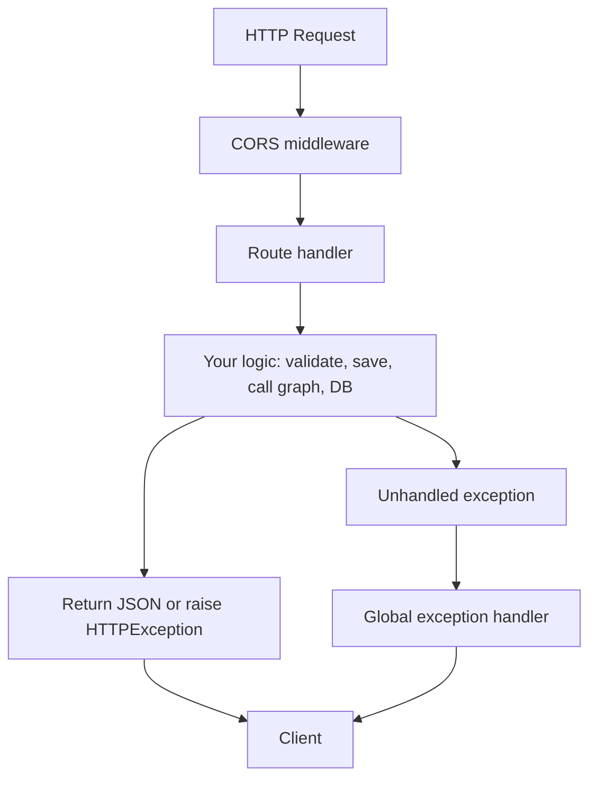
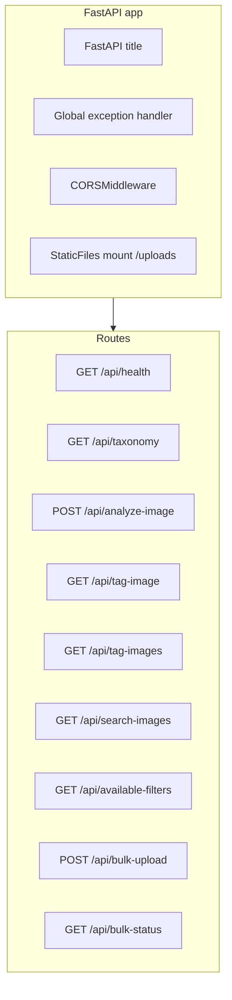

# 03 — Python and FastAPI Foundations

This lesson covers the Python and FastAPI concepts you need to read and modify the backend: async/await, virtual environments and dependencies, FastAPI routes and request/response, file upload, middleware (CORS), static files, exception handlers, and background tasks.

---

## What you will learn

- **Python:** `async`/`await`, virtual environments, `pip`, loading env with `dotenv`.
- **FastAPI:** Creating an app, defining routes (GET/POST), request parameters and `UploadFile`, raising `HTTPException`, middleware (CORS), mounting static files, global exception handler.
- How **server.py** is structured: app creation, middleware order, routes, and background tasks with `asyncio.create_task`.

---

## Concepts

### Python async/await

In Python, **async** functions run in an **event loop** and can **await** other async operations (I/O, network, other async functions) without blocking the thread. FastAPI runs your route handlers as async when you define them with `async def`; then `await file.read()` or `await graph.ainvoke(...)` lets the server handle other requests while waiting.

- Use `async def` for route handlers that do I/O or call async code.
- Use `await` for reading the upload file, calling the graph, or any async function.

### Virtual environments and dependencies

- A **virtual environment** (e.g. `python -m venv .venv`) isolates project dependencies from the system Python.
- **pip** installs packages from `requirements.txt`; the backend uses FastAPI, LangGraph, langchain-openai, Pydantic, etc.
- **dotenv** loads environment variables from a `.env` file (e.g. `OPENAI_API_KEY`, `DATABASE_URI`) so the code can use `os.getenv(...)` without hardcoding secrets.

### FastAPI basics

- **FastAPI()** creates the application. You then add **routes** with decorators: `@app.get("/path")`, `@app.post("/path")`.
- **Request** and **response:** Route handlers can take `Request`, `UploadFile`, query/path parameters. Return a dict (JSON) or raise **HTTPException(status_code=..., detail="...")** for errors.
- **File upload:** Use `UploadFile = File(...)` to receive uploaded files; call `await file.read()` to get bytes. The filename and content_type are available on the `UploadFile` object.
- **Middleware** runs for every request before/after the route. Order matters: the last added runs first (around the request). **CORS** middleware allows the browser to call your API from another origin (e.g. Next.js on port 3000 calling FastAPI on port 8000).
- **Static files:** `app.mount("/uploads", StaticFiles(directory=...))` serves files from a folder under a URL path.
- **Exception handler:** `@app.exception_handler(Exception)` catches any unhandled exception and returns a consistent JSON response (e.g. 500 with detail and type).

### Background tasks

- For long-running work that should not block the HTTP response (e.g. processing many files), you can start an **asyncio task** with `asyncio.create_task(some_async_function())`. The handler returns immediately; the task runs in the background. In this project, bulk upload reads all file contents in the handler, then starts a background task that processes each file (save, graph, DB) and updates `BATCH_STORAGE`.

---

## Request lifecycle (high level)



Middleware runs first; then the matching route runs; if an exception is not caught, the global handler returns 500 JSON.

---

## In this project: server.py structure

**File:** `backend/src/server.py`



What happens in code:

1. **Imports and constants** — `asyncio`, `base64`, `logging`, `uuid`, `Path`; `FastAPI`, `File`, `HTTPException`, `Request`, `UploadFile`, `JSONResponse`; `CORSMiddleware`, `StaticFiles`. `BATCH_STORAGE` is a module-level dict for bulk batch state. `UPLOADS_DIR` is set from `Path(__file__).resolve().parent.parent / "uploads"` and created with `mkdir(parents=True, exist_ok=True)`.

2. **App and exception handler** — `app = FastAPI(title="...")`. Then `@app.exception_handler(Exception)` so any uncaught exception becomes a 500 response with `{"detail": str(exc), "type": type(exc).__name__}`.

3. **Middleware** — `app.add_middleware(CORSMiddleware, allow_origins=["*"], allow_credentials=True, allow_methods=["*"], allow_headers=["*"])`.

4. **Static files** — `app.mount("/uploads", StaticFiles(directory=str(UPLOADS_DIR)), name="uploads")` so that `GET /uploads/{filename}` serves files from the uploads folder.

5. **Routes** — Health and taxonomy are synchronous GET. **analyze-image** is async: it receives `UploadFile`, validates suffix and content_type, saves the file, builds image_url and base64, imports the graph, builds `initial_state`, calls `await graph.ainvoke(initial_state)`, optionally upserts to the DB, then builds and returns the JSON response. **Bulk upload** reads all file contents with `await f.read()`, creates a batch_id and an entry in `BATCH_STORAGE`, starts `_run_bulk_batch` via `asyncio.create_task(run())`, and returns immediately with batch_id and total. **Bulk status** returns `BATCH_STORAGE[batch_id]` or 404.

---

## Key code snippets

**File validation and save (analyze-image):**

```python
suffix = Path(file.filename or "").suffix.lower()
if suffix not in ALLOWED_IMAGE_EXTENSIONS:
    raise HTTPException(status_code=400, detail="Invalid file type. Allowed: JPG, PNG, WEBP.")
contents = await file.read()
filepath.write_bytes(contents)
```

**Invoking the graph:**

```python
initial_state = {"image_id": image_id, "image_url": image_url, "image_base64": image_base64, "partial_tags": []}
result = await graph.ainvoke(initial_state)
```

**Background task (bulk):**

```python
async def run():
    for i, (filename_orig, contents) in enumerate(file_list):
        await _process_one_file(request, filename_orig, contents, batch_id, i)
asyncio.create_task(run())
```

---

## Key takeaways

- Use **async def** and **await** for routes that do I/O or call the graph; FastAPI runs them in the event loop.
- **UploadFile** and **await file.read()** give you the uploaded bytes; validate extension and content_type before saving.
- **Middleware** (e.g. CORS) and **exception handler** are registered on the app and apply to all requests.
- **StaticFiles** mount serves the uploads directory under `/uploads`.
- **Background work** that must not block the response is started with **asyncio.create_task**; the handler returns right after starting the task.

---

## Exercises

1. Why is `await file.read()` used instead of `file.read()` in the analyze-image route?
2. What would happen if the bulk-upload handler did not read file contents before calling `asyncio.create_task`?
3. Add a new GET route `/api/hello` that returns `{"message": "Hello"}` and confirm it in the browser or with curl.

---

## Next

Go to [04-langgraph-core-concepts.md](04-langgraph-core-concepts.md) to learn LangGraph’s core ideas: StateGraph, state, nodes, edges, reducers, and the Send API for fan-out.
