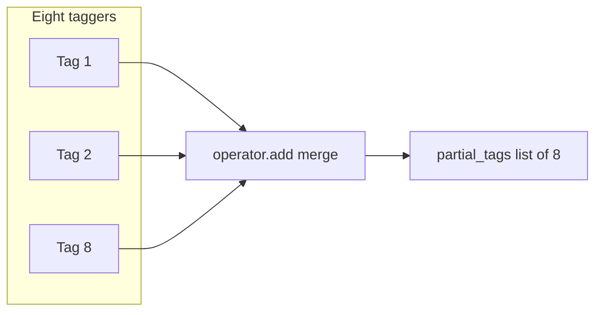
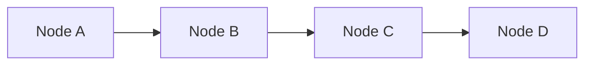
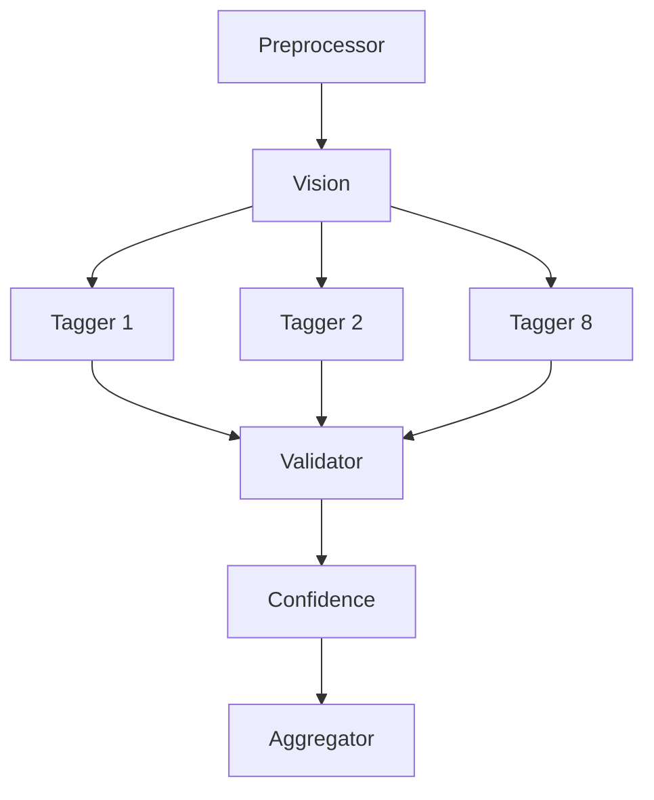

# 04 — LangGraph Core Concepts

This lesson explains what LangGraph is, why we use it instead of a simple chain of functions, and its core concepts: StateGraph, state (TypedDict), nodes, edges (linear and conditional), reducers, the Send API for fan-out, and how to compile and invoke the graph.

---

## What you will learn

- What **LangGraph** is and when it is useful (vs a plain chain of functions).
- **StateGraph** and **state**: a single shared TypedDict that nodes read and update.
- **Nodes**: functions that take state and return a dict of updates; LangGraph merges updates into the state.
- **Edges**: linear (always go to one node) and **conditional** (decide next node(s); can return multiple **Send** for parallelism).
- **Reducers**: how `Annotated[list, operator.add]` merges list updates (e.g. partial_tags from many taggers).
- **Compile** and **ainvoke**: how the graph is built and run.

---

## Concepts

### What LangGraph is and why use it

**LangGraph** is a library for building **stateful, multi-step workflows** (graphs) where each step can call LLMs, tools, or any Python logic. You define:

- A **state** type (what data flows through the graph).
- **Nodes** (functions that take state and return updates).
- **Edges** (which node runs next: one, or several in parallel via conditional edges).

The library handles running the graph, merging each node’s updates into the state, and passing state to the next node(s). So you get a clear pipeline (or DAG) instead of hand-written chains and state passing.

**Compared to a plain chain of functions:** With a chain you would manually call step1(), step2(), step3() and pass state between them. LangGraph gives you a single **compiled graph** that knows the topology, supports **conditional edges** (e.g. “after vision, run these 8 nodes in parallel”), and **reducers** so that multiple nodes can contribute to the same list (e.g. partial_tags) without overwriting each other.

### State and StateGraph

- **State** is a single dictionary-like object (here, a TypedDict) that every node receives and can update. Nodes do **not** receive “the whole world”; they receive the current state and return a **dict of updates**. LangGraph **merges** those updates into the state (by key; for lists you can use a reducer).
- **StateGraph(StateType)** creates a graph that will pass that state type from node to node. You then add nodes and edges; the result is a runnable graph.

### Nodes

- A **node** is a function that takes the current **state** and returns a **dict** of updates, e.g. `{"vision_description": "...", "vision_raw_tags": {...}}`. It can be sync or async.
- LangGraph **does not** replace the whole state with this dict; it **merges** the dict into the state. So the next node sees the previous state plus these updates. The only exception is when a key has a **reducer** (see below).

### Edges

- **add_edge(from_node, to_node)** — deterministic: after `from_node`, always go to `to_node`. Can use special `START` and `END` for entry and exit.
- **add_conditional_edges(from_node, function)** — the function receives state and returns either the next node name or a list of **Send(next_node, state)**. Returning multiple `Send` means **multiple branches** run next (e.g. eight taggers); LangGraph runs them and merges their updates using the reducers you defined.

### Reducers (e.g. partial_tags)

- By default, a node’s update for a key **overwrites** the previous value. For **partial_tags**, we want **eight** taggers each to **append** one item, not overwrite. So we declare the field with a **reducer**: `Annotated[list, operator.add]`. LangGraph then **merges** updates by **adding** (concatenating) lists instead of replacing. So each tagger returns `{"partial_tags": [one_tag_result]}`; after all eight run, state["partial_tags"] is the concatenation of eight one-element lists.

### Send API and fan-out

- **Send(node_name, state)** is used in conditional edges to say “run this node with this state.” If the conditional edge function returns **multiple** Send (e.g. one per tagger), LangGraph runs those nodes (typically in parallel) and merges their updates. So “fan-out” is: one node (vision) → conditional edge returns 8 Send → 8 taggers run → their outputs are merged (partial_tags via reducer) → then the graph continues to the next single node (validator).

### Compile and ainvoke

- **builder.compile()** turns the StateGraph into a **compiled graph** object that you can run.
- **await graph.ainvoke(initial_state)** runs the graph with the given initial state and returns the **final state** after all nodes have run. So the server passes `initial_state` (image_id, image_url, image_base64, partial_tags=[]) and gets back the same state dict with all fields filled (tag_record, processing_status, etc.).

---

## Linear graph vs fan-out graph

**Linear (no parallelism):**

**Fan-out then join (our agent):**

Vision runs once; then the conditional edge returns 8 Send, so 8 taggers run (in parallel); their partial_tags are merged with the reducer; then the validator runs once on the full list.

---

## In this project

- **State type:** `backend/src/image_tagging/schemas/states.py` — `ImageTaggingState` is a TypedDict with `total=False` (all keys optional). The only reducer is `partial_tags: Annotated[list, operator.add]`.
- **Graph definition:** `backend/src/image_tagging/graph_builder.py` — `build_graph()` creates a StateGraph(ImageTaggingState), adds 12 nodes (preprocessor, vision, 8 taggers, validator, confidence_filter, tag_aggregator), then adds edges: START → preprocessor → vision → conditional_edges(fan_out_to_taggers) → each tagger → validator → confidence_filter → tag_aggregator → END.
- **Fan-out function:** `fan_out_to_taggers(state)` returns `[Send(name, state) for name in TAGGER_NODE_NAMES]`, so all 8 taggers are scheduled with the same state.
- **Compiled graph:** `backend/src/image_tagging/image_tagging.py` — `graph = build_graph()`; the server imports `graph` and calls `await graph.ainvoke(initial_state)`.

---

## Key takeaways

- LangGraph models a **pipeline (or DAG)** with **state**, **nodes**, and **edges**; it merges node outputs into state and supports **conditional edges** and **parallel branches** via Send.
- **State** is one TypedDict; nodes return **updates** (dict), not the full state; use a **reducer** (e.g. `operator.add` for a list) when multiple nodes must **append** to the same key.
- **Fan-out** is implemented by a conditional edge that returns multiple **Send**; after those nodes run, their updates are merged and the graph continues (e.g. to the validator).
- **compile()** produces a runnable graph; **ainvoke(initial_state)** runs it and returns the final state.

---

## Exercises

1. Why can’t we use a single “tag_all” node that calls the LLM eight times sequentially instead of eight parallel taggers? (Think about reducer and state.)
2. What would happen to partial_tags if we did not use `Annotated[list, operator.add]`?
3. In the graph, which node runs first after the vision_analyzer, and how many times does it run (once or eight times)?

---

## Next

Go to [05-state-and-data-models.md](05-state-and-data-models.md) to see every field in ImageTaggingState, how the reducer works in detail, and the Pydantic models (TagResult, ValidatedTag, TagRecord, etc.) that flow through the pipeline.
