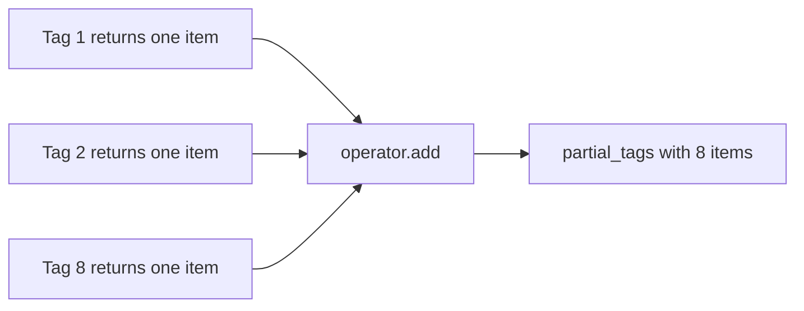
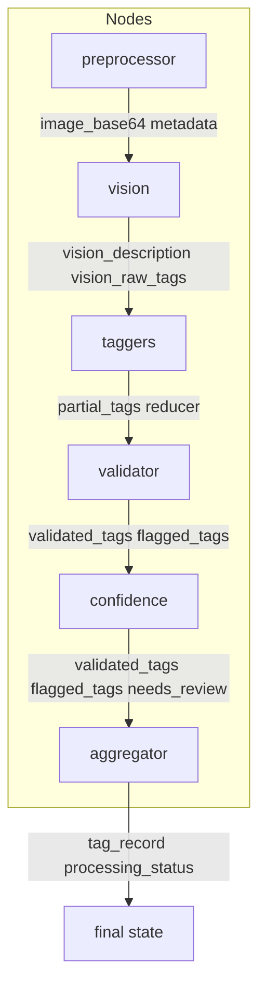
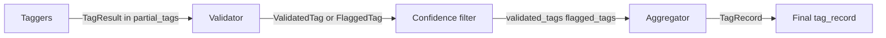

# 05 — State and Data Models

This lesson walks through every field in `ImageTaggingState`, explains the `partial_tags` reducer in detail, introduces the Pydantic models (TagResult, ValidatedTag, FlaggedTag, HierarchicalTag, TagRecord, TaggerOutput), and shows how data transforms from taggers to validator to aggregator. It includes a state lifecycle table (which node writes which field).

---

## What you will learn

- Every field in **ImageTaggingState**: type, who writes it, who reads it.
- How the **partial_tags** reducer works and why it is needed.
- The **Pydantic models** used in the pipeline and who creates/consumes each.
- The **data flow**: TagResult (from taggers) → ValidatedTag (from validator) → part of TagRecord (from aggregator).
- A **field × node** lifecycle table.

---

## Concepts

### TypedDict and total=False

- **ImageTaggingState** is a **TypedDict**: it defines the **shape** of the state dict (key names and value types) for type checkers and documentation. At runtime it is still a normal dict.
- **total=False** means every key is **optional**. Nodes only set the keys they update; they do not have to return the entire state. LangGraph merges each node’s return dict into the current state by key.

### Reducer for partial_tags

- Normally, a node’s update **overwrites** the previous value for that key. For **partial_tags**, we have **eight** taggers each returning `{"partial_tags": [one_item]}`. Without a reducer, the last tagger to finish would overwrite the others, and we would lose seven categories.
- The state declares **partial_tags** with a **reducer**: `Annotated[list, operator.add]`. LangGraph then **merges** updates to this key by **adding** (concatenating) lists: `state["partial_tags"] = state["partial_tags"] + node_output["partial_tags"]`. So after all eight taggers run, we have a list of eight elements (one per category).

---

## ImageTaggingState: field by field

**File:** `backend/src/image_tagging/schemas/states.py`

| Field | Type | Written by | Read by |
|-------|------|------------|---------|
| image_id | str | Server (initial_state) | Aggregator, server response |
| image_url | str | Server | Server response |
| image_base64 | Optional[str] | Server, preprocessor (replaces) | Preprocessor, vision_analyzer |
| metadata | dict | Preprocessor | — |
| vision_description | str | vision_analyzer | All taggers |
| vision_raw_tags | dict | vision_analyzer | — |
| partial_tags | list | Taggers (reducer) | tag_validator |
| validated_tags | dict | tag_validator, confidence_filter | confidence_filter, aggregator |
| flagged_tags | list | tag_validator, confidence_filter | Aggregator, server |
| tag_record | dict | tag_aggregator | Server |
| needs_review | bool | confidence_filter | Aggregator |
| processing_status | Literal[...] | preprocessor, vision_analyzer, tag_aggregator | Server |
| error | Optional[str] | preprocessor, vision_analyzer (on failure) | Aggregator |

---

## State lifecycle: which node writes what

| Field | preprocessor | vision | taggers | validator | confidence | aggregator |
|-------|--------------|--------|---------|-----------|------------|------------|
| image_base64 | W | R | — | — | — | — |
| metadata | W | — | — | — | — | — |
| vision_description | — | W | R | — | — | — |
| vision_raw_tags | — | W | — | — | — | — |
| partial_tags | — | — | W (reducer) | R | — | — |
| validated_tags | — | — | — | W | R,W | R |
| flagged_tags | — | — | — | W | R,W | R |
| needs_review | — | — | — | — | W | R |
| tag_record | — | — | — | — | — | W |
| processing_status | W | W | — | — | — | W |
| error | W | W | — | — | — | R |

W = writes, R = reads.

---

## Pydantic models: who creates and consumes

**File:** `backend/src/image_tagging/schemas/models.py`

### TagResult

- **Purpose:** Output from a single tagger node (one category).
- **Fields:** category (str), tags (list[str]), confidence_scores (dict[str, float]).
- **Created by:** Each of the 8 taggers; appended to partial_tags as one element.
- **Consumed by:** tag_validator (reads partial_tags and validates each TagResult).

### ValidatedTag

- **Purpose:** A tag that passed taxonomy validation; may have a parent for hierarchical categories.
- **Fields:** value (str), confidence (float), parent (Optional[str]).
- **Created by:** tag_validator (for each valid tag in partial_tags).
- **Consumed by:** confidence_filter (may move some to flagged); aggregator (builds TagRecord from validated_tags).

### FlaggedTag

- **Purpose:** A tag that was invalid (taxonomy) or below the confidence threshold.
- **Fields:** category, value, confidence, reason (e.g. "invalid_taxonomy_value", "low_confidence").
- **Created by:** tag_validator (invalid), confidence_filter (low confidence).
- **Consumed by:** Aggregator (sets needs_review); server (returned in API).

### HierarchicalTag

- **Purpose:** Parent/child pair for objects, dominant_colors, product_type.
- **Fields:** parent (str), child (str).
- **Created by:** Aggregator when building TagRecord from validated_tags.
- **Consumed by:** TagRecord; DB; frontend.

### TagRecord

- **Purpose:** Final assembled record for one image: all eight categories in the shape stored and displayed.
- **Fields:** image_id, season, theme, objects, dominant_colors, design_elements, occasion, mood, product_type, needs_review, processed_at.
- **Created by:** tag_aggregator.
- **Consumed by:** Server (response, DB upsert); frontend.

### TaggerOutput

- **Purpose:** Raw parsed output from the tagger LLM (before filtering to allowed values and confidence).
- **Fields:** tags, confidence_scores, reasoning.
- **Created by:** _parse_tagger_response in taggers.py.
- **Consumed by:** run_tagger (filters and builds TagResult).

---

## Data transformation flow

- **Taggers** produce **TagResult** (category, tags, confidence_scores) and append one per category to partial_tags via the reducer.
- **Validator** turns each tag into either **ValidatedTag** (in validated_tags) or **FlaggedTag** (in flagged_tags).
- **Confidence filter** keeps or moves ValidatedTags by threshold; appends low-confidence to flagged_tags; sets needs_review.
- **Aggregator** reads validated_tags (and flagged_tags for needs_review) and builds **TagRecord** (flat lists and HierarchicalTags for objects, dominant_colors, product_type).

---

## In this project

- **State definition:** `backend/src/image_tagging/schemas/states.py` — ImageTaggingState with partial_tags reducer.
- **Models:** `backend/src/image_tagging/schemas/models.py` — TagResult, ValidatedTag, FlaggedTag, HierarchicalTag, TagRecord, TaggerOutput. Nodes use `.model_dump()` to put Pydantic models into state as dicts.

---

## Key takeaways

- **State** is one TypedDict; each node returns a **dict of updates**; only **partial_tags** uses a reducer (operator.add) so eight taggers can append.
- **TagResult** flows from taggers into partial_tags; **ValidatedTag** and **FlaggedTag** from validator and confidence filter; **TagRecord** is built by the aggregator from validated_tags.
- The **lifecycle table** shows which node writes which field; the **data flow diagram** shows how models transform from taggers to final tag_record.

---

## Exercises

1. Why does the validator not write to partial_tags?
2. Give an example of a ValidatedTag with parent set and one with parent None.
3. Which model has a "reason" field and what are the two possible values in this project?

---

## Next

Go to [06-graph-builder-walkthrough.md](06-graph-builder-walkthrough.md) for a line-by-line walkthrough of graph_builder.py: how the graph is built, how conditional edges and Send create the parallel taggers, and how the server invokes the compiled graph.
