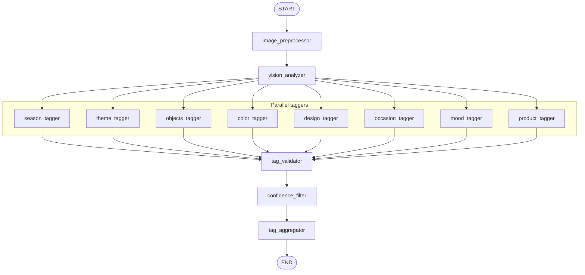
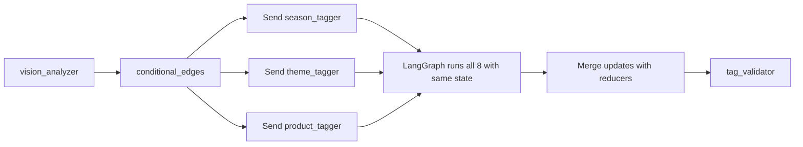

# 06 — Graph Builder Walkthrough

This lesson is a line-by-line walkthrough of `graph_builder.py`: how the StateGraph is created, how each node is added, how edges connect START to the preprocessor, then to vision, then via a conditional edge to all eight taggers, and finally to the validator, confidence filter, and aggregator. It also shows how the compiled graph is exported and invoked by the server.

---

## What you will learn

- The **exact code** in graph_builder.py that builds the pipeline.
- How **add_node** and **add_edge** define the topology.
- How **add_conditional_edges** with **fan_out_to_taggers** and **Send** create eight parallel branches.
- How **compile()** produces the runnable and how the server calls **ainvoke**.

---

## Full agent graph (annotated)



- **START** → **image_preprocessor** → **vision_analyzer** (linear).
- **vision_analyzer** has a **conditional edge** that returns 8 **Send**; all 8 taggers run (in parallel).
- All taggers feed **tag_validator** → **confidence_filter** → **tag_aggregator** → **END**.

---

## How Send creates parallel branches

When the conditional edge function returns **multiple Send**:



LangGraph schedules each Send as a separate branch; when all branches complete, it merges their updates (here, partial_tags via operator.add) and then runs the next node (tag_validator) once with the merged state.

---

## graph_builder.py: step-by-step

**File:** `backend/src/image_tagging/graph_builder.py`

### 1. Imports

```python
from langgraph.graph import END, START, StateGraph
from langgraph.types import Send

from .nodes import (
    image_preprocessor,
    vision_analyzer,
    validate_tags,
    filter_by_confidence,
    aggregate_tags,
    ALL_TAGGERS,
    TAGGER_NODE_NAMES,
)
from .schemas.states import ImageTaggingState
```

- **END, START** — Special nodes for graph entry and exit.
- **StateGraph** — The graph class that takes the state type.
- **Send** — Used to schedule multiple next nodes (fan-out).
- **ALL_TAGGERS** — Dict mapping node name to function (e.g. "season_tagger" → tag_season).
- **TAGGER_NODE_NAMES** — List of 8 names in order: season_tagger, theme_tagger, objects_tagger, color_tagger, design_tagger, occasion_tagger, mood_tagger, product_tagger.

### 2. fan_out_to_taggers

```python
def fan_out_to_taggers(state: ImageTaggingState):
    """Return one Send per tagger so all 8 run in parallel."""
    return [Send(name, state) for name in TAGGER_NODE_NAMES]
```

- This function is used as the **conditional edge** after vision_analyzer. It receives the current state and returns a **list of Send**. Each Send(name, state) means “run node `name` with this state.” LangGraph runs all of them (typically in parallel) and merges their outputs.

### 3. build_graph — create graph and add nodes

```python
def build_graph():
    builder = StateGraph(ImageTaggingState)

    builder.add_node("image_preprocessor", image_preprocessor)
    builder.add_node("vision_analyzer", vision_analyzer)
    for name, fn in ALL_TAGGERS.items():
        builder.add_node(name, fn)
    builder.add_node("tag_validator", validate_tags)
    builder.add_node("confidence_filter", filter_by_confidence)
    builder.add_node("tag_aggregator", aggregate_tags)
```

- **StateGraph(ImageTaggingState)** — The graph will pass and merge state of this type.
- **add_node(id, callable)** — Registers a node. The callable can be sync (e.g. image_preprocessor) or async (e.g. vision_analyzer, taggers, validator, confidence, aggregator). The 8 taggers are added in a loop from ALL_TAGGERS.

### 4. Add edges

```python
    builder.add_edge(START, "image_preprocessor")
    builder.add_edge("image_preprocessor", "vision_analyzer")
    builder.add_conditional_edges("vision_analyzer", fan_out_to_taggers)
    for name in TAGGER_NODE_NAMES:
        builder.add_edge(name, "tag_validator")
    builder.add_edge("tag_validator", "confidence_filter")
    builder.add_edge("confidence_filter", "tag_aggregator")
    builder.add_edge("tag_aggregator", END)

    return builder.compile()
```

- **add_edge(START, "image_preprocessor")** — First node after START is the preprocessor.
- **add_edge("image_preprocessor", "vision_analyzer")** — Then vision runs once.
- **add_conditional_edges("vision_analyzer", fan_out_to_taggers)** — After vision, the function is called; it returns 8 Send, so 8 taggers run next.
- **add_edge(name, "tag_validator")** for each tagger name — When each tagger finishes, the next node is tag_validator. LangGraph waits for all 8 to finish, merges their partial_tags, then runs tag_validator once.
- **add_edge("tag_validator", "confidence_filter")** — Then confidence_filter.
- **add_edge("confidence_filter", "tag_aggregator")** — Then tag_aggregator.
- **add_edge("tag_aggregator", END)** — Then the graph ends.
- **builder.compile()** — Returns the compiled runnable graph.

---

## Compiled graph export and invocation

**File:** `backend/src/image_tagging/image_tagging.py`

```python
from .graph_builder import build_graph

graph = build_graph()

__all__ = ["graph", "build_graph"]
```

- **graph** is the compiled graph. The server imports it with:
  `from src.image_tagging.image_tagging import graph`
- **Invocation** (in server.py): `result = await graph.ainvoke(initial_state)`. The server builds initial_state with image_id, image_url, image_base64, partial_tags=[]. The returned result is the final state dict (tag_record, processing_status, etc.).

---

## In this project

- **Graph definition:** `backend/src/image_tagging/graph_builder.py` — build_graph().
- **Export:** `backend/src/image_tagging/image_tagging.py` — graph = build_graph().
- **Invocation:** `backend/src/server.py` — in analyze_image (single) and in _process_one_file (bulk).

---

## Key takeaways

- The graph is built by **adding nodes** (12 total: preprocessor, vision, 8 taggers, validator, confidence_filter, tag_aggregator) and **edges** (linear from START to vision, conditional from vision to 8 taggers, then each tagger to validator, then linear to END).
- **fan_out_to_taggers** returns a list of **Send** so all 8 taggers run after vision; their **partial_tags** are merged with the reducer.
- **compile()** produces the runnable; the server calls **ainvoke(initial_state)** and gets the final state.

---

## Exercises

1. How would you add a ninth tagger (e.g. "brand")? List the exact changes in graph_builder.py and in the nodes package.
2. What would happen if you added an edge from vision_analyzer directly to tag_validator (skipping the taggers)?
3. Why does the validator run only once even though eight edges point to it?

---

## Next

Go to [07-preprocessor-and-vision.md](07-preprocessor-and-vision.md) to see how the preprocessor validates and resizes the image and how the vision node builds the GPT-4o request, retries on failure, and parses the JSON response.
