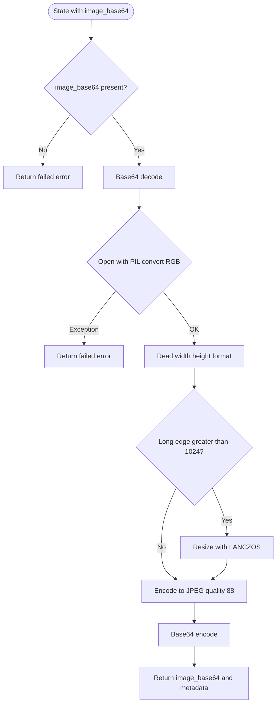
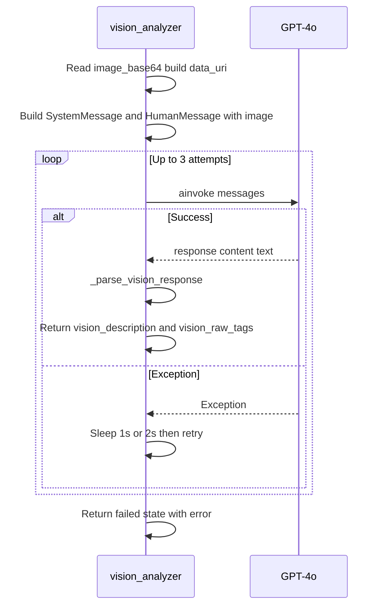

# 07 — Preprocessor and Vision Node

This lesson covers the first two nodes of the pipeline: the **preprocessor** (validate image, resize, re-encode as base64) and the **vision analyzer** (one GPT-4o vision call that produces a text description and raw JSON). You will see the exact code, the retry logic, and how the vision response is parsed so the taggers can use it.

---

## What you will learn

- **Preprocessor:** What it does step by step (decode, open with PIL, resize, re-encode), constants (MAX_LONG_EDGE), and error handling. It is **synchronous**.
- **Vision node:** How the **multimodal message** is built (system prompt + user message with text and image_url), how **retry with exponential backoff** works, and how **_parse_vision_response** extracts the description and raw JSON. It is **async**.
- The **system prompt** that tells the model what JSON to return and why only **vision_description** is passed to the taggers.

---

## Concepts

### Why preprocess the image?

- The server sends **raw file bytes** as base64 in state. The preprocessor **validates** that the data is decodable and openable as an image, **resizes** if the image is too large (to control token/cost and latency), and **re-encodes** as JPEG so downstream nodes and the vision API get a consistent format. So the preprocessor ensures a single, valid image input for the vision call.

### Why a separate vision step?

- GPT-4o can take **both** image and text. We use **one** vision call to get a **structured text description** (and extra fields in JSON). All **eight taggers** then use **only the text** (vision_description); they do not receive the image again. This keeps token usage lower and makes the pipeline simple: one expensive vision call, then eight cheaper text-only calls.

### Retry and robustness

- Network and API calls can fail. The vision node **retries** up to 3 times with **exponential backoff** (1s, then 2s). If all attempts fail, it returns a failed state with an error message so the graph can still finish and the API can return a sensible response.

---

## Preprocessor: flowchart



---

## Preprocessor: code and behavior

**File:** `backend/src/image_tagging/nodes/preprocessor.py`

- **Signature:** `def image_preprocessor(state: ImageTaggingState) -> dict[str, Any]` — **sync** (no async).
- **Constants:** `MAX_LONG_EDGE = 1024`; images with a longer side above 1024 are resized proportionally. `ALLOWED_EXTENSIONS` is for reference (server does extension check before the graph).

**Steps in code:**

1. **Read image_base64** from state; if missing, return `{"processing_status": "failed", "error": "Missing image_base64 in state"}`.
2. **Base64-decode**; on exception return failed with "Invalid base64".
3. **Open with PIL:** `Image.open(io.BytesIO(raw)).convert("RGB")`; on exception return failed with "Unsupported image format".
4. **Resize if needed:** `long_edge = max(width, height)`; if `long_edge > MAX_LONG_EDGE`, compute ratio, new dimensions, `img.resize((new_w, new_h), Image.Resampling.LANCZOS)`.
5. **Re-encode:** Write to `BytesIO` as JPEG quality 88, base64-encode, and return `{"image_base64": new_base64, "metadata": {"width", "height", "format"}}`.

**Success return:** New base64 string (possibly resized) and metadata. **Error return:** Always includes `processing_status: "failed"` and `error` message.

---

## Vision node: sequence (simplified)



---

## Vision node: code and behavior

**File:** `backend/src/image_tagging/nodes/vision.py`

- **Signature:** `async def vision_analyzer(state: ImageTaggingState) -> dict[str, Any]`.

**Steps:**

1. **Read image_base64**; if missing, return failed state with empty vision_description and vision_raw_tags.
2. **Build data URI:** `data_uri = f"data:image/jpeg;base64,{image_base64}"`.
3. **Build messages:**  
   - `SystemMessage(content=VISION_ANALYZER_PROMPT)`  
   - `HumanMessage(content=[{"type": "text", "text": "Analyze this image and return the JSON object."}, {"type": "image_url", "image_url": {"url": data_uri}}])`.
4. **Create LLM:** `ChatOpenAI(model=OPENAI_MODEL, api_key=OPENAI_API_KEY)`.
5. **Retry loop:** Up to 3 attempts; `response = await llm.ainvoke(messages)`; on exception, sleep `1 * (2**attempt)` then retry; on last failure return failed state.
6. **Parse:** `description, raw = _parse_vision_response(text)`.
7. **Return:** `{"vision_description": description, "vision_raw_tags": raw}`.

**_parse_vision_response(text):** Strip whitespace; if text starts with markdown code fence (```), remove first and last line; try `json.loads(stripped)`; set `description = raw.get("visual_description", "")` or use full stripped text if JSON fails; return `(description, raw)`.

---

## System prompt (vision)

**File:** `backend/src/image_tagging/prompts/system.py`

The prompt tells the model to act as a **visual product analyst** and return **only valid JSON** with fields such as:

- **visual_description** — 2–3 sentence description (this becomes **vision_description** in state and is used by all taggers).
- **dominant_mood**, **visible_subjects**, **color_observations**, **design_observations**, **seasonal_indicators**, **style_indicators**, **text_present** — stored in **vision_raw_tags**; only vision_description is passed to the taggers.

---

## In this project

- **Preprocessor:** `backend/src/image_tagging/nodes/preprocessor.py` — sync; returns new image_base64 and metadata or failed state.
- **Vision:** `backend/src/image_tagging/nodes/vision.py` — async; builds messages, retries, parses; returns vision_description and vision_raw_tags (or failed state).
- **Prompt:** `backend/src/image_tagging/prompts/system.py` — VISION_ANALYZER_PROMPT.

---

## Key takeaways

- The **preprocessor** validates and resizes the image and re-encodes it as base64; it is sync and runs first.
- The **vision node** sends one **multimodal** request (system prompt + user message with text and image_url) to GPT-4o, retries up to 3 times with backoff, and parses JSON (with optional code-fence stripping). Only **vision_description** is used by the taggers; **vision_raw_tags** holds the full JSON.
- **Retry** and **parse** logic make the pipeline robust to transient API errors and to markdown-wrapped JSON.

---

## Exercises

1. Why does the preprocessor re-encode the image as JPEG even if the original was PNG?
2. What would happen if _parse_vision_response did not strip markdown code fences?
3. If the vision call fails on all 3 attempts, does the graph still run the taggers? (Check what state they receive.)

---

## Next

Go to [08-taggers-taxonomy-and-prompts.md](08-taggers-taxonomy-and-prompts.md) to see how the eight taggers use vision_description and the taxonomy to produce partial_tags, and how the tagger prompt and confidence filtering work.
