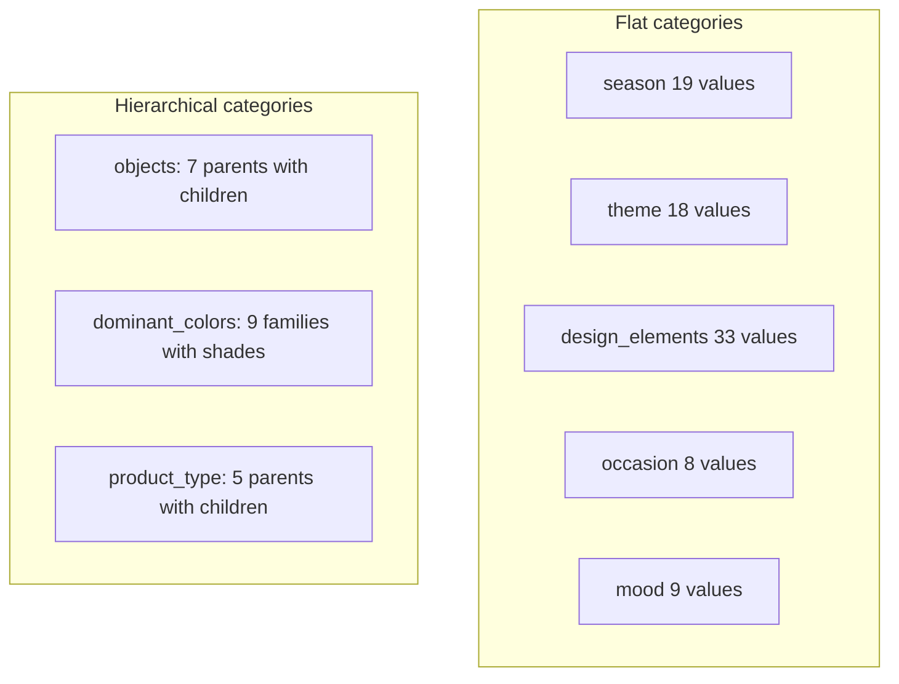
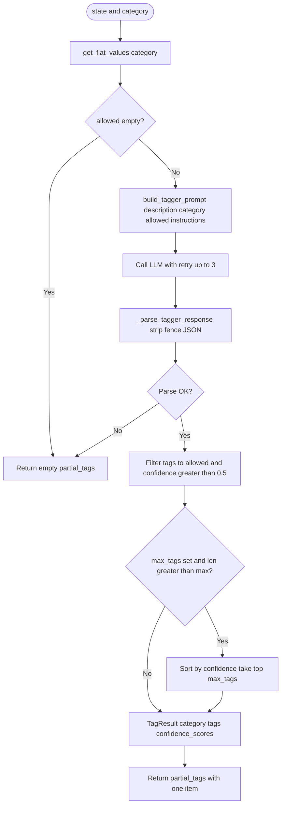

# 08 — Taggers, Taxonomy, and Prompts

This lesson covers how the eight tagger nodes work: the **taxonomy** (flat and hierarchical categories), the generic **run_tagger** function (prompt, LLM call, parse, filter, cap), the **tagger prompt** template and confidence scale, and the specific **instructions** and **max_tags** for each of the eight taggers.

---

## What you will learn

- **Taxonomy:** Flat categories (season, theme, design_elements, occasion, mood) vs **hierarchical** (objects, dominant_colors, product_type). How **get_flat_values** and **get_parent_for_child** work.
- **run_tagger:** The 9 steps from vision_description to one TagResult in partial_tags: get allowed values, build prompt, call LLM with retry, parse JSON, filter to allowed and confidence > 0.5, optional max_tags cap, return partial_tags.
- **Prompt engineering:** The tagger prompt template (role, rules, allowed values, description, optional instructions). The confidence scale (0.9+, 0.7–0.9, 0.5–0.7).
- **All 8 taggers:** Category, custom instructions, and max_tags for each.

---

## Concepts

### Why a taxonomy?

- The taggers must output **only** values that the rest of the system understands (validator, aggregator, search). The **taxonomy** is the single source of truth: a fixed set of allowed values per category. The LLM is given this list in the prompt; the code also **filters** the LLM output to allowed values and drops tags with confidence ≤ 0.5 so invalid or low-confidence tags never enter state.

### Flat vs hierarchical categories

- **Flat:** The category is a list of strings (e.g. season = [christmas, hanukkah, ...]). The tagger returns those strings; the validator checks `value in list`.
- **Hierarchical:** The category is a dict of **parent → list of children** (e.g. objects: characters → [santa, elf, ...], objects_items → [gift_box, ribbon, ...]). The tagger returns **child** values (e.g. santa, ribbon). The validator uses **get_parent_for_child** to check the value and to attach the parent for the aggregator. The aggregator then builds HierarchicalTag(parent, child) for storage and search.

### run_tagger in one sentence

- **Input:** state (with vision_description), category name, optional instructions, optional max_tags. **Output:** One TagResult in partial_tags (or empty on failure). The function gets allowed values from the taxonomy, builds a text prompt with the image description and allowed values, calls the LLM once, parses JSON, filters to allowed and confidence > 0.5, optionally caps the number of tags, and returns `{"partial_tags": [result]}`.

---

## Taxonomy structure (conceptual)

- **get_flat_values(category):** For flat categories returns the list; for hierarchical returns a single flat list of **all children** (so the tagger sees e.g. santa, gift_box, ribbon, crimson, navy, ...).
- **get_parent_for_child(category, child):** For hierarchical categories returns the parent key (e.g. get_parent_for_child("objects", "ribbon") → "objects_items"); for flat returns None. Used by the validator and aggregator.

**File:** `backend/src/image_tagging/taxonomy.py` — TAXONOMY dict, get_flat_values, get_parent_for_child.

---

## run_tagger: flowchart

---

## run_tagger: code steps

**File:** `backend/src/image_tagging/nodes/taggers.py`

1. **Read vision_description** from state; if category not in TAXONOMY or get_flat_values returns empty, return empty partial_tags (one TagResult with empty tags).
2. **Build prompt:** `build_tagger_prompt(description, category, allowed, instructions)` — see below.
3. **Call LLM:** ChatOpenAI, `ainvoke([{"role": "user", "content": prompt}])`, retry up to 3 times with sleep 1s, 2s; on final failure return empty partial_tags.
4. **Parse:** `_parse_tagger_response(text)` strips markdown fence, json.loads, returns TaggerOutput(tags, confidence_scores, reasoning) or None; if None return empty partial_tags.
5. **Filter:** Keep only tags in `allowed`; keep only confidence_scores for allowed keys with value > 0.5; then keep only tags whose confidence_scores entry is > 0.5.
6. **Cap:** If max_tags is set and len(tags) > max_tags, sort by confidence descending, take first max_tags, and restrict confidence_scores to those tags.
7. **Build and return:** `TagResult(category=category, tags=tags, confidence_scores=confidence_scores).model_dump()` inside `{"partial_tags": [result]}`.

---

## Tagger prompt template

**File:** `backend/src/image_tagging/prompts/tagger.py`

**build_tagger_prompt(description, category, allowed_values, instructions=None)**

- **Role:** "You are a product tagging assistant. Based on the image description below, select the most applicable tags for the \"{category}\" category."
- **Rules:** Only use values from the allowed list; return JSON with structure `{"tags": ["value1", "value2"], "confidence_scores": {"value1": 0.95, "value2": 0.72}, "reasoning": "..."}`; include a tag only if confidence > 0.5; confidence scale: 0.9+ = clearly visible, 0.7–0.9 = likely present, 0.5–0.7 = possibly present; return only valid JSON, no markdown.
- **Allowed values:** Comma-separated list injected into the prompt.
- **Image description:** The vision_description from state.
- **Additional instructions:** Optional string appended when provided (e.g. "Select all aesthetic themes that apply." for theme).

---

## All eight taggers: summary

| Tagger | Category | Instructions | max_tags |
|--------|----------|--------------|----------|
| tag_season | season | — | None |
| tag_theme | theme | Select all aesthetic themes that apply | None |
| tag_objects | objects | Hierarchical; return child values (e.g. santa, ribbon) | 10 (MAX_OBJECTS) |
| tag_colors | dominant_colors | Up to 5; specific shade names (e.g. crimson, navy) | 5 (MAX_COLORS) |
| tag_design | design_elements | Patterns, textures, layout, typography | None |
| tag_occasion | occasion | Occasions or use cases | None |
| tag_mood | mood | Moods or tones | None |
| tag_product | product_type | Single most likely; one child value (e.g. gift_bag_medium) | 1 |

- **tag_season:** `return await run_tagger(state, "season")`.
- **tag_theme:** `run_tagger(state, "theme", instructions="Select all aesthetic themes that apply.")`.
- **tag_objects:** run_tagger with "objects", instructions for hierarchical child values, max_tags=MAX_OBJECTS (10).
- **tag_colors:** "dominant_colors", instructions for shade names, max_tags=MAX_COLORS (5).
- **tag_design:** "design_elements", instructions for patterns/textures/layout/typography.
- **tag_occasion:** "occasion", instructions for occasions/use cases.
- **tag_mood:** "mood", instructions for moods/tones.
- **tag_product:** "product_type", instructions for single most likely product, max_tags=1.

---

## In this project

- **Taxonomy:** `backend/src/image_tagging/taxonomy.py` — TAXONOMY, get_flat_values, get_parent_for_child.
- **Taggers:** `backend/src/image_tagging/nodes/taggers.py` — run_tagger, _parse_tagger_response, tag_season through tag_product, ALL_TAGGERS, TAGGER_NODE_NAMES.
- **Prompt:** `backend/src/image_tagging/prompts/tagger.py` — build_tagger_prompt.
- **Configuration:** MAX_OBJECTS and MAX_COLORS come from `backend/src/image_tagging/configuration.py`.

---

## Key takeaways

- **Taxonomy** defines allowed values per category; flat categories are lists, hierarchical are dicts of parent → children; get_flat_values gives the tagger a flat list of allowed values; get_parent_for_child is used later for validation and aggregation.
- **run_tagger** gets allowed values, builds the prompt, calls the LLM with retry, parses JSON, filters to allowed and confidence > 0.5, optionally caps by max_tags, and returns one TagResult in partial_tags.
- **Prompt** includes role, rules, allowed values, and image description; optional **instructions** tailor behavior per category (e.g. "select all" vs "single most likely").
- Each of the **8 taggers** is a thin wrapper around run_tagger with the right category, instructions, and max_tags.

---

## Exercises

1. For the "objects" category, why does the tagger return child values (e.g. ribbon) and not parent names (e.g. objects_items)?
2. What happens if the LLM returns a tag that is not in the allowed list?
3. Write the call to run_tagger you would use to add a new "brand" category with max 2 tags and instruction "Select up to two brand names if visible."

---

## Next

Go to [09-validation-confidence-aggregation.md](09-validation-confidence-aggregation.md) to see how the validator checks every tag against the taxonomy, how the confidence filter applies per-category thresholds and sets needs_review, and how the aggregator builds the final TagRecord from validated_tags.
