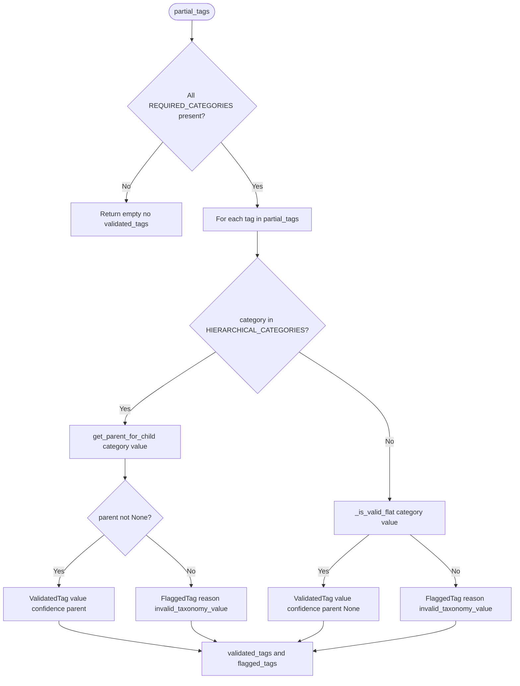
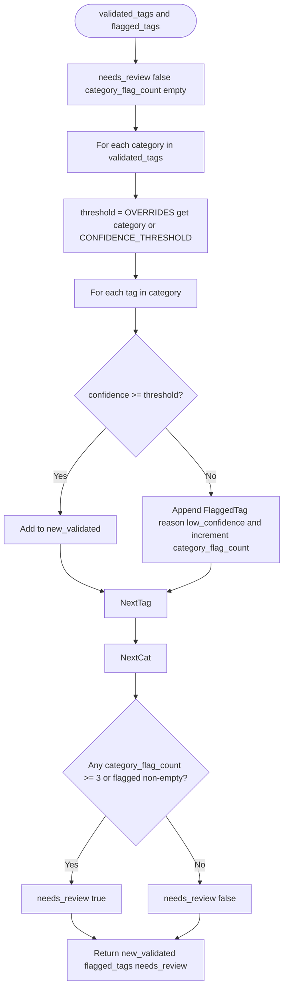
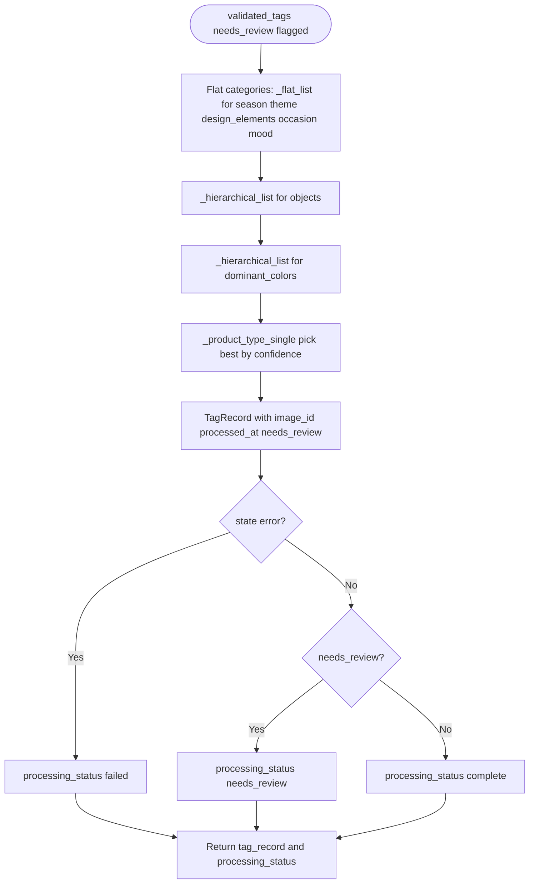

# 09 — Validation, Confidence Filter, and Aggregation

This lesson covers the three nodes that turn **partial_tags** into the final **tag_record**: the **validator** (checks every tag against the taxonomy and produces validated_tags and flagged_tags), the **confidence filter** (applies per-category thresholds and sets needs_review), and the **aggregator** (builds the TagRecord with flat lists and HierarchicalTags and sets processing_status).

---

## What you will learn

- **Validator:** REQUIRED_CATEGORIES gate (all 8 categories must be present), flat vs hierarchical validation with _validate_value, FlaggedTag reasons (invalid_taxonomy_value). Output: validated_tags (dict category → list of ValidatedTag) and flagged_tags (list of FlaggedTag).
- **Confidence filter:** CONFIDENCE_THRESHOLD (default 0.65), CATEGORY_CONFIDENCE_OVERRIDES (e.g. product_type 0.80, season 0.60), NEEDS_REVIEW_THRESHOLD (3 flags per category). Tags below threshold move to flagged_tags with reason low_confidence; needs_review is set if any category has ≥3 flags or any flagged_tags exist.
- **Aggregator:** Building TagRecord from validated_tags: _flat_list for flat categories, _hierarchical_list for objects/dominant_colors, _product_type_single (best by confidence) for product_type. processing_status: complete, needs_review, or failed.

---

## Concepts

### Why validate again after taggers?

- The taggers already filter to allowed values and confidence > 0.5, but the validator is the **single place** that enforces taxonomy correctness and attaches **parent** for hierarchical categories. It ensures validated_tags only contains taxonomy-valid entries and that any invalid or low-confidence tag is recorded in flagged_tags for transparency and optional human review.

### Why a separate confidence filter?

- Taggers use a fixed 0.5 cutoff; the **confidence filter** applies a **configurable** default (0.65) and **per-category overrides** (e.g. product_type 0.80) so that critical categories can be stricter. Tags that pass validation but are below the threshold are moved to flagged_tags with reason low_confidence, and needs_review is set when there are many flags or any flags at all, so the UI can highlight items for review.

### Why an aggregator node?

- validated_tags is a dict of category → list of {value, confidence, parent?}. The **aggregator** maps this into the **TagRecord** schema: flat lists for season, theme, design_elements, occasion, mood; HierarchicalTag lists for objects and dominant_colors; a single HierarchicalTag for product_type (best by confidence). It also sets needs_review and processing_status so the API and frontend know the final state.

---

## Validator: decision flow

- **REQUIRED_CATEGORIES:** season, theme, objects, dominant_colors, design_elements, occasion, mood, product_type. If the set of categories in partial_tags is not exactly this, the validator returns {} and does not run (so the pipeline does not overwrite with incomplete data).
- **HIERARCHICAL_CATEGORIES:** objects, dominant_colors, product_type. For these, _validate_value uses get_parent_for_child; if parent is None the value is invalid.

---

## Validator: code reference

**File:** `backend/src/image_tagging/nodes/validator.py`

- **_is_valid_flat(category, value):** TAXONOMY.get(category) is a list and value in list.
- **_is_valid_hierarchical(category, value):** get_parent_for_child(category, value) is not None.
- **_validate_value(category, value, confidence):** For hierarchical: if parent is None return (None, FlaggedTag(..., reason="invalid_taxonomy_value")); else return (ValidatedTag(value, confidence, parent=parent), None). For flat: if _is_valid_flat return (ValidatedTag(value, confidence, parent=None), None); else return (None, FlaggedTag(..., reason="invalid_taxonomy_value")).
- **validate_tags(state):** If categories_seen != REQUIRED_CATEGORIES return {}. Else iterate partial_tags, for each tag call _validate_value, append to validated[category] or flagged. Return {"validated_tags": validated, "flagged_tags": flagged}.

---

## Confidence filter: flow

- **CONFIDENCE_THRESHOLD:** 0.65 (configuration.py).
- **CATEGORY_CONFIDENCE_OVERRIDES:** product_type 0.80, season 0.60 — so product_type and season use different thresholds.
- **NEEDS_REVIEW_THRESHOLD:** 3 — if any single category has 3 or more tags moved to flagged, needs_review becomes true; also if there are any flagged_tags at all.

**File:** `backend/src/image_tagging/nodes/confidence.py` — filter_by_confidence(state). **File:** `backend/src/image_tagging/configuration.py` — CONFIDENCE_THRESHOLD, NEEDS_REVIEW_THRESHOLD, CATEGORY_CONFIDENCE_OVERRIDES.

---

## Aggregator: building TagRecord

- **_flat_list(validated, category):** Returns list of value strings from validated[category].
- **_hierarchical_list(validated, category):** Returns list of {parent, child} from validated[category] using each tag's parent or get_parent_for_child; aggregator wraps these as HierarchicalTag.
- **_product_type_single(validated):** From validated["product_type"] picks the tag with highest confidence; returns one {parent, child} or None. TagRecord.product_type is one HierarchicalTag or None.

**File:** `backend/src/image_tagging/nodes/aggregator.py` — aggregate_tags(state).

---

## End-to-end: partial_tags to tag_record

1. **partial_tags** (8 TagResults, one per category) → **validate_tags** → validated_tags (dict category → list of ValidatedTag), flagged_tags (invalid_taxonomy_value).
2. **filter_by_confidence** → validated_tags trimmed (tags below threshold removed), those tags appended to flagged_tags (low_confidence), needs_review set.
3. **aggregate_tags** → TagRecord(season, theme, objects, dominant_colors, design_elements, occasion, mood, product_type, needs_review, processed_at), processing_status set.

---

## In this project

- **Validator:** `backend/src/image_tagging/nodes/validator.py` — REQUIRED_CATEGORIES, HIERARCHICAL_CATEGORIES, _validate_value, validate_tags.
- **Confidence:** `backend/src/image_tagging/nodes/confidence.py` — filter_by_confidence; `backend/src/image_tagging/configuration.py` — CONFIDENCE_THRESHOLD, NEEDS_REVIEW_THRESHOLD, CATEGORY_CONFIDENCE_OVERRIDES.
- **Aggregator:** `backend/src/image_tagging/nodes/aggregator.py` — _flat_list, _hierarchical_list, _product_type_single, aggregate_tags.

---

## Key takeaways

- The **validator** ensures only taxonomy-valid tags enter validated_tags and attaches parent for hierarchical categories; invalid tags go to flagged_tags with reason invalid_taxonomy_value. It runs only when all REQUIRED_CATEGORIES are present.
- The **confidence filter** applies a default and per-category thresholds; tags below threshold go to flagged_tags with reason low_confidence; needs_review is set when there are many flags or any flags.
- The **aggregator** builds the final TagRecord from validated_tags using flat lists, hierarchical lists, and a single product_type; it sets processing_status to complete, needs_review, or failed.

---

## Exercises

1. Why does the validator return {} when not all REQUIRED_CATEGORIES are present?
2. If product_type has two tags with confidence 0.85 and 0.75, and the override is 0.80, what happens to each after the confidence filter?
3. In the aggregator, why does product_type get a single HierarchicalTag instead of a list?

---

## Next

Go to [10-api-design-and-endpoints.md](10-api-design-and-endpoints.md) to see every API endpoint (health, taxonomy, analyze-image, tag-image, tag-images, search-images, available-filters, bulk-upload, bulk-status), how the server ties the graph to the database, and how errors and filters are handled.
