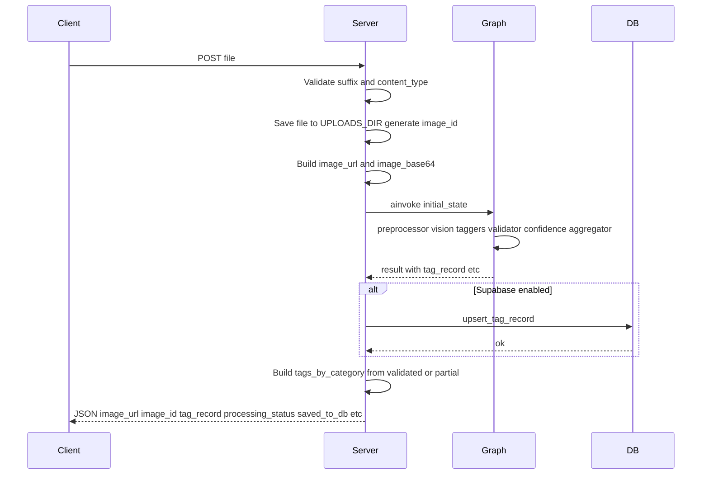
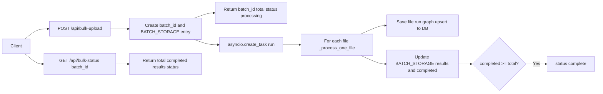

# 10 — API Design and Endpoints

This lesson covers the REST API exposed by the FastAPI server: design principles, every endpoint (health, taxonomy, analyze-image, tag-image, tag-images, search-images, available-filters, bulk-upload, bulk-status), the global exception handler, filter parsing, and how the server ties the LangGraph pipeline to database persistence. It also explains **BATCH_STORAGE** for in-memory bulk state and the bulk background task.

---

## What you will learn

- **REST principles:** Clear routes, appropriate status codes (200, 400, 404, 500, 503), structured error responses. How the server validates file types and returns consistent JSON.
- **Endpoints:** GET /api/health, GET /api/taxonomy, POST /api/analyze-image (full lifecycle: save file, run graph, persist, return), GET /api/tag-image/{image_id}, GET /api/tag-images, GET /api/search-images (with filter query params), GET /api/available-filters (cascading), POST /api/bulk-upload, GET /api/bulk-status/{batch_id}.
- **Server internals:** Global exception handler, _parse_filter_params (comma-separated query params → filters dict), BATCH_STORAGE for bulk state, background task with asyncio.create_task for bulk processing.
- **How graph and DB connect:** analyze-image builds initial_state, calls graph.ainvoke, then if Supabase is enabled calls client.upsert_tag_record; bulk does the same per file in _process_one_file.

---

## Concepts

### REST and status codes

- **200 OK:** Successful GET or POST returning data.
- **400 Bad Request:** Invalid input (e.g. wrong file type, no files in bulk).
- **404 Not Found:** Resource missing (e.g. image_id not in DB, batch_id not in BATCH_STORAGE).
- **500 Internal Server Error:** Unhandled exception; the global handler returns JSON with detail and type.
- **503 Service Unavailable:** Database not configured or not available (tag-image, tag-images, search-images, available-filters).

Using the right status code helps clients distinguish "bad request" from "server error" from "dependency unavailable."

### Single analyze vs bulk

- **Single:** POST /api/analyze-image — one file, synchronous: save file, run graph, (optionally) persist to DB, return full result. The client waits for the whole pipeline.
- **Bulk:** POST /api/bulk-upload — multiple files, returns immediately with batch_id and status "processing"; a **background task** processes each file (save, graph, persist) and updates **BATCH_STORAGE[batch_id]**. The client **polls** GET /api/bulk-status/{batch_id} to get total, completed, results, and status until status is "complete".

### Filter params and cascading

- **search-images** and **available-filters** accept the same query params: season, theme, objects, dominant_colors, design_elements, occasion, mood, product_type. Each can be comma-separated (e.g. season=christmas,hanukkah). **_parse_filter_params** turns these into a dict category → list of values. Search uses AND across categories (match all selected values). **available-filters** returns which values are still possible given the current selection (cascading filters for the UI).

---

## Endpoints summary

| Method | Path | Purpose |
|--------|------|---------|
| GET | /api/health | Liveness; returns {"status": "healthy"} |
| GET | /api/taxonomy | Full TAXONOMY (categories and allowed values) |
| POST | /api/analyze-image | Upload one image; run graph; persist if DB enabled; return full result |
| GET | /api/tag-image/{image_id} | Get one stored tag record; 503 if DB disabled, 404 if not found |
| GET | /api/tag-images | List recently tagged images (limit, offset); 503 if DB disabled |
| GET | /api/search-images | Search by filter params (AND); 503 if DB disabled |
| GET | /api/available-filters | Cascading filter values for current selection; 503 if DB disabled |
| POST | /api/bulk-upload | Submit multiple files; returns batch_id; starts background processing |
| GET | /api/bulk-status/{batch_id} | Poll batch progress: total, completed, results, status |

---

## POST /api/analyze-image: lifecycle

- **initial_state:** image_id, image_url, image_base64, partial_tags: [].
- **Response:** image_url, image_id, vision_description, vision_raw_tags, partial_tags, tags_by_category, tag_record, flagged_tags, processing_status, saved_to_db. DB save failures are logged but do not change the response status.

---

## Bulk upload and BATCH_STORAGE

- **BATCH_STORAGE[batch_id]** = { total, completed, results: [{ image_id, status, image_url? | error? }, ...], status: "processing" | "complete" }.
- **_process_one_file** saves the file, runs the graph, optionally upserts to DB, and writes to BATCH_STORAGE[batch_id]["results"][index] and increments completed; when completed >= total, status is set to "complete".
- **_run_bulk_batch** is an async function that runs in the background; it is started with asyncio.create_task(run()) so the POST returns immediately.

---

## Global exception handler and _parse_filter_params

- **Global handler:** `@app.exception_handler(Exception)` logs the exception and returns JSONResponse(status_code=500, content={"detail": str(exc), "type": type(exc).__name__}). So any unhandled error becomes a 500 with a consistent shape.
- **_parse_filter_params:** Takes optional query params (season, theme, objects, dominant_colors, design_elements, occasion, mood, product_type). For each param that is present, splits by comma, strips, and builds filters[key] = list of values. Used by search_images and available_filters.

---

## In this project

- **Server:** `backend/src/server.py` — app, CORS, static /uploads, health, taxonomy, analyze_image, get_tag_image, list_tag_images, _parse_filter_params, search_images, available_filters, _process_one_file, _run_bulk_batch, bulk_upload, bulk_status.
- **DB integration:** analyze_image and _process_one_file import SUPABASE_ENABLED and get_client from src.services.supabase and call client.upsert_tag_record when enabled.

---

## Key takeaways

- The API uses **REST-style** routes and status codes; **503** when the database is disabled or unavailable; **404** for missing image or batch; **400** for invalid input; **500** for unhandled errors with a global handler.
- **POST /api/analyze-image** implements the full lifecycle: validate file, save, run graph, persist if DB enabled, and return a rich result including tag_record and saved_to_db.
- **Bulk** is asynchronous: POST returns batch_id and status; a **background task** updates **BATCH_STORAGE**; the client **polls** GET /api/bulk-status/{batch_id} until status is "complete".
- **Filter params** are comma-separated and parsed by _parse_filter_params; search and available-filters use the same params for consistency.

---

## Exercises

1. Why does the server return 503 for tag-image when the database is disabled instead of 500?
2. What would happen if two clients uploaded the same filename in bulk — would image_id collide?
3. If the graph raises an exception in analyze-image, does the saved file remain on disk? What does the client receive?

---

## Next

Go to [11-database-persistence-and-search.md](11-database-persistence-and-search.md) to see the PostgreSQL/Supabase schema (image_tags table, JSONB, indexes), the client (connection, build_search_index, upsert, search_images_filtered, get_available_filter_values), and how search uses the containment operator.
