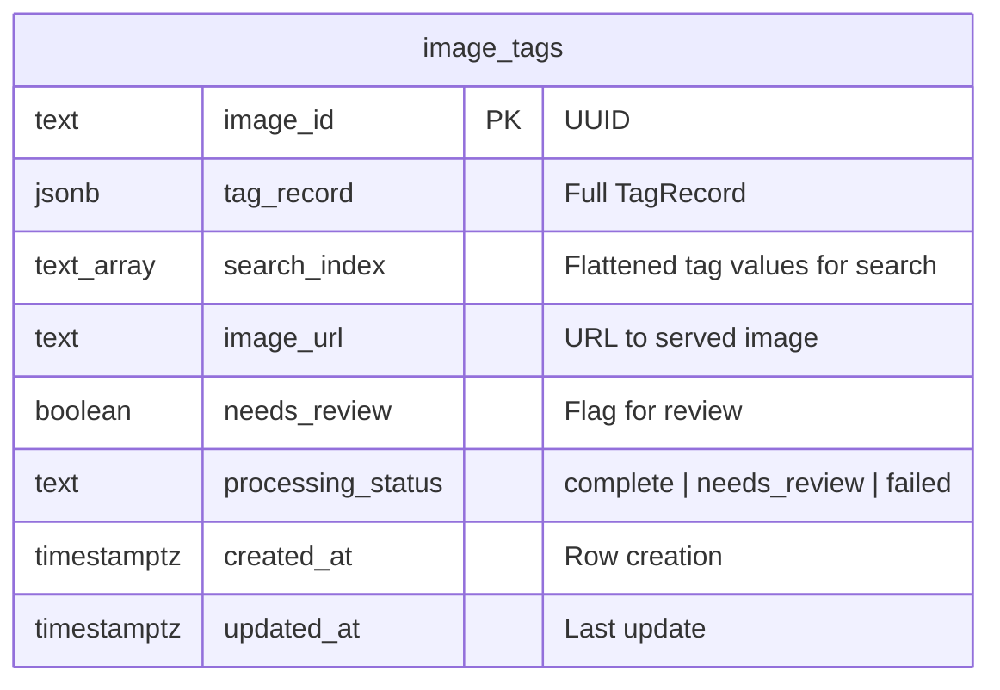
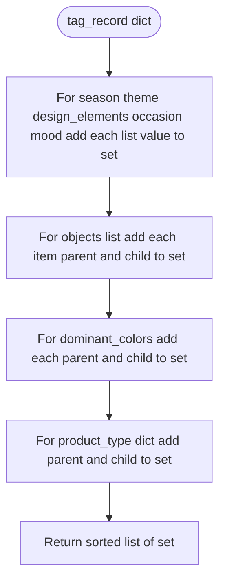
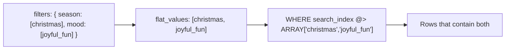

# 11 — Database Persistence and Search

This lesson covers why the application uses a database, the **PostgreSQL** schema (image_tags table, JSONB, TEXT[], GIN indexes), the **Supabase client** (connection retry, build_search_index, upsert, search_images_filtered, get_available_filter_values), and how search uses the **containment operator** (@>) on the flattened search_index. Settings and **SUPABASE_ENABLED** are also explained.

---

## What you will learn

- **Why a database:** Persistence across restarts, search by tags, and history (list recent images). The graph produces tag_record in memory; the server writes it to the DB when Supabase is enabled so the frontend can search and display stored results.
- **Schema:** image_tags table: image_id (PK), tag_record (JSONB), search_index (TEXT[]), image_url, needs_review, processing_status, created_at, updated_at. GIN indexes on search_index and tag_record for fast containment and JSON queries.
- **build_search_index:** Flatten tag_record into a sorted list of strings: flat categories (season, theme, design_elements, occasion, mood) as values; objects and dominant_colors as parent and child; product_type as parent and child. This list is stored in search_index for efficient filtering.
- **Search and cascading:** search_images_filtered uses WHERE search_index @> %s::text[] (containment: row must contain all requested values). get_available_filter_values runs search then collects unique values per category from tag_record for cascading filter UI.
- **Client behavior:** Connection with retries; upsert (INSERT ON CONFLICT DO UPDATE); get_client returns None when SUPABASE_ENABLED is false or connection fails.

---

## Concepts

### Why persist tag_record?

- The LangGraph pipeline runs in memory and returns tag_record. Without a database, results would be lost when the server restarts or when the user navigates away. Storing in **PostgreSQL** (via Supabase) gives persistence, enables **search by tags** (e.g. "all images with season=christmas and mood=joyful_fun"), and supports **list recent** and **get one by image_id** for the UI.

### Why a flattened search_index?

- tag_record is a nested structure (lists, HierarchicalTag with parent/child). PostgreSQL can query JSONB with operators, but for **AND across many categories** (e.g. season + theme + mood) a flat **TEXT[]** array of all tag values is simpler: we build **search_index** once at upsert time, then use the **@> (containment)** operator: search_index @> ARRAY['christmas', 'joyful_fun'] returns rows whose search_index contains both values. A **GIN index** on search_index makes this fast.

### Cascading filters

- **get_available_filter_values(filters)** first runs **search_images_filtered(filters)** to get rows matching the current selection, then scans their tag_record to collect **unique values per category**. The UI can then show "for the current filters, which season/theme/mood/... values still exist?" so users can narrow down without empty result sets.

---

## image_tags table schema

- **Indexes:** GIN on search_index (for @> containment), GIN on tag_record (for JSONB queries if needed).
- **migration.sql:** `backend/src/services/supabase/migration.sql` — run once in Supabase SQL editor or on first setup.

---

## build_search_index: flattening

- **Output:** A list of strings (e.g. christmas, traditional, ribbon, crimson, joyful_fun, gift_bag_medium, ...). Stored in the **search_index** column as TEXT[] so that **search_index @> ARRAY['christmas', 'ribbon']** means "this row has both christmas and ribbon in its flattened tags."

**File:** `backend/src/services/supabase/client.py` — function build_search_index(tag_record).

---

## Search: containment query

- **search_images_filtered(filters, limit):** Collects all filter values into a flat list **flat_values**. If empty, returns list_tag_images(limit). Otherwise runs:
  - `SELECT ... FROM image_tags WHERE search_index @> %s::text[] ORDER BY created_at DESC LIMIT %s` with (flat_values, limit).
- **@>** is the PostgreSQL **array containment** operator: the row's search_index must contain **every** element in flat_values. So AND across categories is achieved by passing all selected values in one array.

---

## Client methods and get_client

- **_conn(retries, delay):** psycopg2.connect with retry loop; on failure after retries raises. Used by all methods.
- **upsert_tag_record(image_id, tag_record, image_url, needs_review, processing_status):** build_search_index(tag_record), then INSERT ... ON CONFLICT (image_id) DO UPDATE SET ... so the same image_id updates the row.
- **get_tag_record(image_id):** SELECT one row; return dict or None.
- **list_tag_images(limit, offset):** SELECT ORDER BY created_at DESC.
- **search_images_filtered(filters, limit):** Build flat_values from filters, query with @>.
- **get_available_filter_values(filters):** Call search_images_filtered(filters, 500), then iterate rows and collect unique values per category from tag_record; return { category: sorted(list of values) }.
- **get_client():** Returns SupabaseClient() if SUPABASE_ENABLED and DATABASE_URI are set; on exception returns None. The server checks SUPABASE_ENABLED before calling get_client and returns 503 when DB is not configured.

---

## Settings

- **SUPABASE_ENABLED:** Typically from env; when false, the server does not attempt DB connection and endpoints that require DB return 503.
- **DATABASE_URI:** PostgreSQL connection string (e.g. from Supabase project settings). Used by SupabaseClient.

**File:** `backend/src/services/supabase/settings.py` (or project settings) — SUPABASE_ENABLED, DATABASE_URI.

---

## In this project

- **Migration:** `backend/src/services/supabase/migration.sql` — CREATE TABLE image_tags, CREATE INDEX.
- **Client:** `backend/src/services/supabase/client.py` — build_search_index, SupabaseClient, get_client.

---

## Key takeaways

- The **database** stores tag_record and a flattened **search_index** for persistence and fast tag-based search. **GIN** indexes support containment and JSONB queries.
- **build_search_index** turns tag_record into a sorted list of all tag values (flat and hierarchical); this list is stored as **search_index** and queried with **@>** for AND logic across categories.
- **search_images_filtered** and **get_available_filter_values** use the same filter parsing; the latter runs search then aggregates unique values per category for **cascading** filter UIs.
- **Connection retries** and **get_client** returning None keep the app running when the DB is unavailable; the API signals 503 so clients can handle it.

---

## Exercises

1. Why store both tag_record (JSONB) and search_index (TEXT[])? Why not only JSONB?
2. If a user selects no filters and calls search-images, what SQL is effectively run?
3. How would you change the schema to support "OR within category, AND across categories"?

---

## Next

Go to [12-frontend-nextjs-and-components.md](12-frontend-nextjs-and-components.md) to see the Next.js App Router structure, the two pages (/ and /search), key components (ImageUploader, BulkUploader, DashboardResult, FilterSidebar, SearchResults, etc.), data flow for single analyze, search, and bulk, and how the frontend calls the backend.
