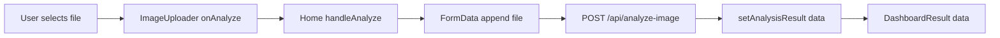
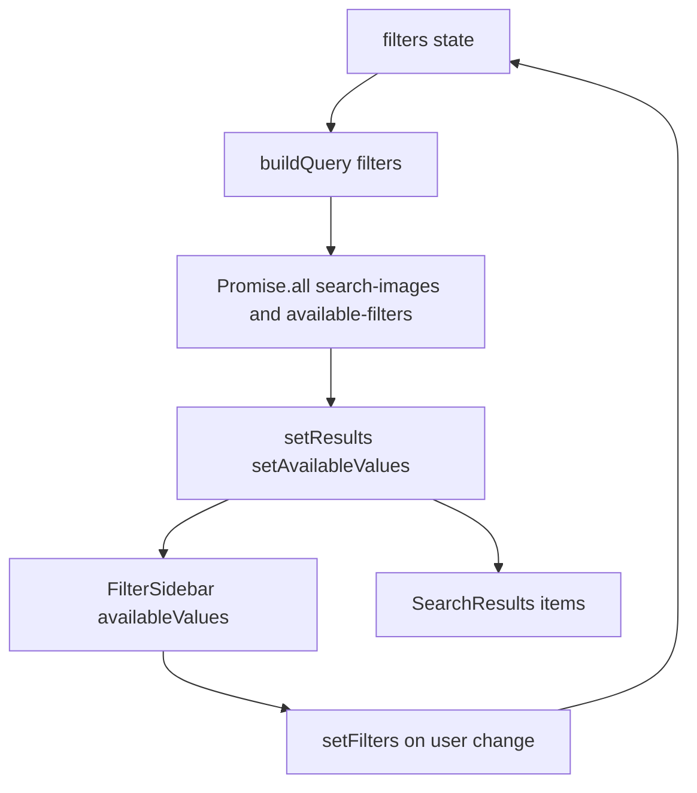
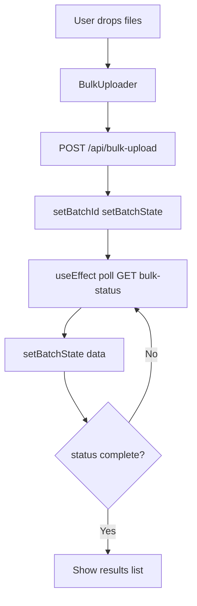

# 12 — Frontend: Next.js and Components

This lesson covers the **Next.js App Router** structure (layout, pages), the two main pages (**/** and **/search**), key **components** and their roles (ImageUploader, BulkUploader, DashboardResult, TagCategories, FilterSidebar, SearchResults, DetailModal, HistoryGrid), **data flow** for single analyze, search, and bulk, **TypeScript types** (lib/types.ts), styling with **Tailwind** and **shadcn/ui**, and how the frontend calls the backend (fetch, FormData, polling).

---

## What you will learn

- **App Router:** Root layout (ThemeProvider, Navbar, Toaster), app/page.tsx (home) and app/search/page.tsx (search). Error boundary (error.tsx). "use client" where state and browser APIs are used.
- **Components:** ImageUploader (dropzone, single file, onAnalyze), BulkUploader (multi-file, POST bulk-upload, poll bulk-status), DashboardResult (tags, vision snippet, flagged, confidence ring, replace image), TagCategories (display tags by category), FilterSidebar (cascading filters, available-filters API), SearchResults (grid of rows, onSelectItem), DetailModal (full tag record for a row), HistoryGrid (GET tag-images, grid of recent).
- **Data flow:** Single analyze: file → FormData → POST analyze-image → set result → DashboardResult. Search: filters state → buildQuery → GET search-images and GET available-filters in parallel → set results and availableValues → FilterSidebar + SearchResults. Bulk: files → POST bulk-upload → batch_id → poll GET bulk-status until complete → show results.
- **Types and API:** AnalyzeImageResponse, TagImageRow, TagRecord, etc. in lib/types.ts. API_BASE_URL from NEXT_PUBLIC_API_URL or localhost:8000. fetch with FormData for uploads; polling with setInterval for bulk status.

---

## Concepts

### Next.js App Router

- **app/** is the route directory: **app/layout.tsx** wraps all pages (html, body, theme, navbar, toaster); **app/page.tsx** is the home route (**/**); **app/search/page.tsx** is **/search**. **error.tsx** provides an error boundary so runtime errors can be caught and displayed. Pages that use **useState**, **useEffect**, or **fetch** are **"use client"** so they run on the client; the layout can stay server-rendered.

### Component responsibilities

- **ImageUploader:** Accept one file (dropzone), validate type/size, call **onAnalyze(file)** when user confirms. Parent (Home) builds FormData and POSTs to analyze-image.
- **BulkUploader:** Accept multiple files, POST to bulk-upload, store batch_id, **poll** GET bulk-status every 2s until status is "complete", then show list of results (image_id, status, image_url or error).
- **DashboardResult:** Receives AnalyzeImageResponse; shows image, TagCategories (tags_by_category), vision snippet (dominant_mood, visible_subjects, etc.), FlaggedTags, ConfidenceRing, and a "Replace image" button that calls onReplaceImage.
- **FilterSidebar:** Holds filters state (category → selected values); fetches **available-filters** with current filters so options are cascading; on change updates filters so SearchPage refetches search-images and available-filters.
- **SearchResults:** Receives items (TagImageRow[]), loading; shows grid of thumbnails with sample tags; on click calls onSelectItem(row). DetailModal shows full tag_record and metadata for the selected row.
- **HistoryGrid:** On mount fetches GET tag-images?limit=20&offset=0; shows grid of recent images with sample tags; 503 is handled by showing empty list.

### Data flow diagrams

**Single analyze:**

**Search:**

**Bulk:**

---

## Pages and layout

- **layout.tsx:** Root layout with Inter font, ThemeProvider (dark default), Navbar, {children}, Toaster. Metadata title/description.
- **page.tsx (Home):** State: isProcessing, currentStep, analysisResult, error. Renders ImageUploader (handleAnalyze), BulkUploader, error div, and when result exists DashboardResult (onReplaceImage). HistoryGrid at bottom. ProcessingOverlay shows step progress during analyze.
- **search/page.tsx:** State: filters, results, availableValues, loading, sidebarCollapsed, selectedRow. fetchSearchAndAvailable(filters) runs on mount and when filters change; calls search-images and available-filters with buildQuery(filters). Renders FilterSidebar, SearchResults, DetailModal (selectedRow).

---

## TypeScript types (lib/types.ts)

- **PartialTagResult,** **TagWithConfidence,** **HierarchicalTag,** **TagRecord,** **FlaggedTag** — mirror backend schemas.
- **AnalyzeImageResponse** — image_url, image_id, vision_description, vision_raw_tags, tags_by_category, tag_record, flagged_tags, processing_status, saved_to_db.
- **TagImageRow** — image_id, tag_record, search_index, image_url, needs_review, processing_status, created_at, updated_at (GET tag-images / search-images).
- **TagImagesListResponse** — items, limit, offset.

---

## Styling and API base URL

- **Tailwind** and **shadcn/ui** (Card, Button, Badge, Skeleton, etc.) are used for layout and components. **formatTagLabel** (lib/formatTag.ts) turns snake_case values into readable labels.
- **API_BASE_URL:** `process.env.NEXT_PUBLIC_API_URL || "http://localhost:8000"`. Build-time or runtime (depending on Next config) so the frontend knows where to send requests. For Docker, NEXT_PUBLIC_API_URL is set at build to the backend URL.

---

## In this project

- **Layout and pages:** `frontend/src/app/layout.tsx`, `frontend/src/app/page.tsx`, `frontend/src/app/search/page.tsx`, `frontend/src/app/error.tsx`.
- **Components:** `frontend/src/components/ImageUploader.tsx`, `BulkUploader.tsx`, `DashboardResult.tsx`, `TagCategories.tsx`, `FilterSidebar.tsx`, `SearchResults.tsx`, `DetailModal.tsx`, `HistoryGrid.tsx`, plus FlaggedTags, JsonViewer, ConfidenceRing, Navbar, ProcessingOverlay, ThemeToggle, ui/*.
- **Lib:** `frontend/src/lib/types.ts`, `frontend/src/lib/constants.ts`, `frontend/src/lib/formatTag.ts`, `frontend/src/lib/utils.ts`.

---

## Key takeaways

- The frontend uses **Next.js App Router** with a root layout and two main pages: home (single + bulk upload, result, history) and search (filters, results grid, detail modal).
- **Single analyze** flows: ImageUploader → FormData → POST analyze-image → DashboardResult. **Search** flows: filters → buildQuery → parallel fetch search-images and available-filters → FilterSidebar + SearchResults. **Bulk** flows: BulkUploader → POST bulk-upload → poll bulk-status → show results.
- **TypeScript types** in lib/types.ts align with API responses. **API_BASE_URL** is used for all fetch calls; bulk status uses polling.

---

## Exercises

1. Why does the home page use "use client"?
2. When the user changes a filter on the search page, what two API calls are triggered and in what order?
3. How does BulkUploader know when to stop polling?

---

## Next

Go to [13-docker-and-deployment.md](13-docker-and-deployment.md) to see the backend and frontend Dockerfiles, docker-compose.yml (services, ports, env, volumes), build args (NEXT_PUBLIC_API_URL), and production considerations.
