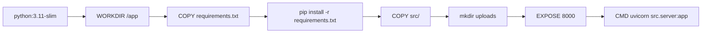
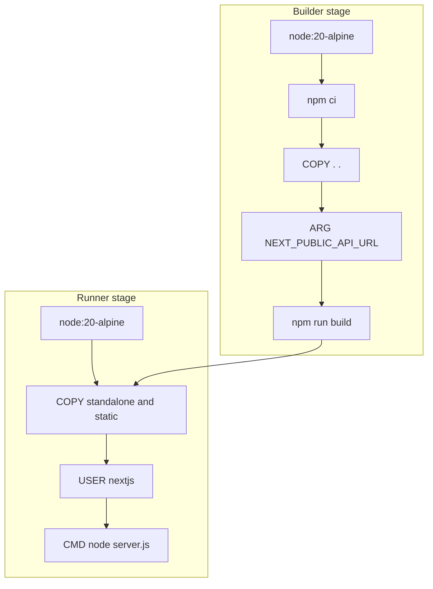
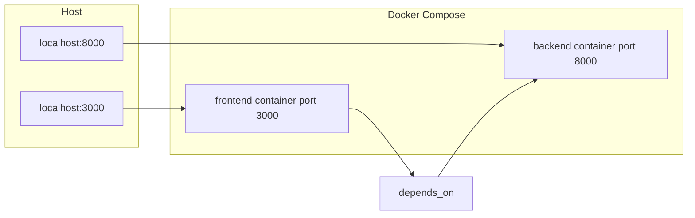

# 13 — Docker and Deployment

This lesson covers **what Docker is and why** we use it (reproducibility, isolation), the **backend Dockerfile** (Python 3.11-slim, pip install, uvicorn), the **frontend Dockerfile** (multi-stage: Node builder + production runner, standalone output), **docker-compose.yml** (services, ports, env_file, volumes, depends_on), **build args** (NEXT_PUBLIC_API_URL), and **commands** (docker compose up --build, down, logs). It also mentions **.dockerignore** and **production considerations**.

---

## What you will learn

- **Docker basics:** Containers package an app and its runtime so it runs the same everywhere. The backend runs in a Python image; the frontend runs in a Node image. **docker-compose** orchestrates both services and their ports, env, and volumes.
- **Backend Dockerfile:** FROM python:3.11-slim, WORKDIR /app, COPY requirements.txt, pip install, COPY src/, EXPOSE 8000, CMD uvicorn src.server:app --host 0.0.0.0 --port 8000.
- **Frontend Dockerfile:** Multi-stage. **Builder:** node:20-alpine, npm ci, COPY ., ARG/ENV NEXT_PUBLIC_API_URL, npm run build. **Runner:** node:20-alpine, copy .next/standalone and .next/static, USER nextjs, EXPOSE 3000, CMD node server.js. Standalone output is configured in next.config (output: "standalone").
- **docker-compose.yml:** backend (build ./backend, port 8000, env_file .env, volume backend_uploads); frontend (build ./frontend, build args NEXT_PUBLIC_API_URL, port 3000, depends_on backend). volumes: backend_uploads for persistent uploads.
- **Commands:** docker compose up --build to build and run; docker compose down to stop; docker compose logs to view output. Production: set NEXT_PUBLIC_API_URL to the public API URL at build time; use secrets for API keys; consider reverse proxy (e.g. nginx) and HTTPS.

---

## Concepts

### Why Docker?

- **Reproducibility:** The same Dockerfile and compose file produce the same environment on any machine (dev, CI, production). No "works on my machine" from different Python or Node versions.
- **Isolation:** Backend and frontend run in separate containers; dependencies do not conflict. The backend can have its own Python packages; the frontend its own node_modules.
- **Deployment:** Many hosts (AWS, GCP, Azure, VPS) run Docker. You build the images once and run them with the same compose or orchestration (e.g. Kubernetes) so deployment is consistent.

### Multi-stage build (frontend)

- **Stage 1 (builder):** Installs dependencies, copies source, sets NEXT_PUBLIC_API_URL, runs npm run build. The output includes .next/standalone (a minimal Node server and static assets) when Next.js is configured with output: "standalone".
- **Stage 2 (runner):** Only copies the standalone output and static files into a clean image. No devDependencies or source code. Smaller image and fewer attack surfaces. The app runs with `node server.js`.

### NEXT_PUBLIC_API_URL at build time

- Next.js inlines **NEXT_PUBLIC_*** variables at **build time**. The browser uses this URL to call the API. In docker-compose we pass NEXT_PUBLIC_API_URL: http://localhost:8000 so the frontend, when opened on the host, can reach the backend on port 8000. In production you would set it to the public API URL (e.g. https://api.example.com) when building the frontend image.

---

## Backend Dockerfile (structure)

- **File:** `backend/Dockerfile`. No multi-stage needed for a simple Python app; the same image runs uvicorn. Uploads directory is created so the app can write files; in compose a volume mounts so uploads persist across container restarts.

---

## Frontend Dockerfile (multi-stage)

- **Builder:** Installs deps, builds Next.js with NEXT_PUBLIC_API_URL. **Runner:** Copies only .next/standalone and .next/static (and public if used), runs as non-root user nextjs. **next.config.ts** must set `output: "standalone"` so `npm run build` produces the standalone server.

---

## docker-compose: services and ports

- **backend:** build context ./backend, ports 8000:8000, env_file .env, volume backend_uploads mounted at /app/uploads. restart: unless-stopped.
- **frontend:** build context ./frontend, build args NEXT_PUBLIC_API_URL: http://localhost:8000, ports 3000:3000, depends_on backend, restart: unless-stopped.
- **volumes:** backend_uploads keeps uploaded files when the backend container is recreated.

---

## Commands and production notes

- **Build and run:** `docker compose up --build` — builds both images (if needed) and starts both services. Frontend at http://localhost:3000, backend at http://localhost:8000.
- **Stop:** `docker compose down` — stops and removes containers. Add `-v` to remove volumes (e.g. backend_uploads).
- **Logs:** `docker compose logs -f` — follow logs from both services; `docker compose logs -f backend` for backend only.
- **.dockerignore:** Exclude node_modules, .git, .env.local, .next (from builder context) to speed builds and avoid copying secrets. Backend can ignore __pycache__, .venv.
- **Production:** Use a production-grade env file or secrets for OPENAI_API_KEY and DATABASE_URI. Set NEXT_PUBLIC_API_URL to the public API URL when building the frontend. Consider a reverse proxy (nginx, Caddy) in front of backend and frontend for TLS and single entry point.

---

## In this project

- **Backend Dockerfile:** `backend/Dockerfile`.
- **Frontend Dockerfile:** `frontend/Dockerfile`; **next.config.ts** with `output: "standalone"`.
- **Compose:** `docker-compose.yml` at project root.

---

## Key takeaways

- **Docker** provides reproducible, isolated runtimes for backend and frontend. The **backend** image is a single stage (Python + uvicorn); the **frontend** uses a **multi-stage** build so the final image only contains the standalone Next.js output.
- **docker-compose** defines both services, ports, env_file, volumes, and depends_on. **NEXT_PUBLIC_API_URL** is passed as a build arg so the frontend knows the API URL at build time.
- **Commands:** up --build, down, logs. **Production:** set API URL and secrets appropriately; use volumes for persistence; consider a reverse proxy and HTTPS.

---

## Exercises

1. Why does the frontend Dockerfile use two stages instead of one?
2. If you deploy the frontend to a different host than the backend, what must you change when building the frontend image?
3. What happens to uploaded images if you run `docker compose down -v`?

---

## Next

Go to [14-end-to-end-and-future-projects.md](14-end-to-end-and-future-projects.md) for the full end-to-end trace (user upload → response → UI), a checklist of what you learned, how to apply these patterns to new projects, and recommended next steps and resources.
