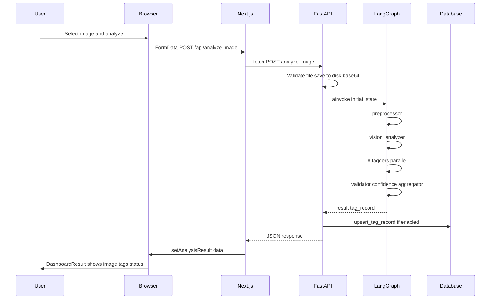

# 14 — End-to-End Trace and Future Projects

This lesson ties everything together: a **full end-to-end trace** from user upload to UI render, a **checklist** of what you learned, **how to apply** these patterns to new domains (different images, LLMs, databases, new tag categories, human-in-the-loop), and **recommended next steps** and resources (LangGraph, FastAPI, Next.js, prompt engineering).

---

## What you will learn

- **End-to-end trace:** User selects image in browser → frontend POSTs to FastAPI → server saves file, builds initial_state, runs LangGraph (preprocessor → vision → 8 taggers → validator → confidence → aggregator) → server optionally persists to DB → response to frontend → UI renders result (DashboardResult, tags, flagged, status).
- **What you learned:** A concise checklist covering agents vs chatbots, project architecture, FastAPI, LangGraph (state, nodes, edges, reducers, Send), state and data models, graph builder, preprocessor and vision, taggers and taxonomy, validation and aggregation, API design, database and search, frontend pages and components, Docker and deployment.
- **Applying the pattern:** Adapt to different domains (e.g. medical images, documents, e-commerce), swap LLM or vision model, use a different database, add new tag categories or human-in-the-loop review. The same pipeline structure (preprocess → analyze → tag → validate → aggregate → persist) applies.
- **Next steps:** LangGraph docs, FastAPI docs, Next.js docs, prompt engineering guides; ideas for extending the project (new categories, review UI, metrics).

---

## Full end-to-end trace

- **Single flow:** One image, one request, one graph run, one response, one DB upsert (if enabled). The frontend shows the result on the same page; HistoryGrid and Search (if DB enabled) can show the new image after refresh or refetch.

---

## What you learned — checklist

- **Agents:** Difference between chatbots (stateless Q&A) and agents (state, tools, reasoning loops); ReAct, plan-and-execute, and DAG/pipeline architectures; why agents matter in MIS.
- **Architecture:** Four layers (browser, Next.js, FastAPI, LangGraph + DB); request lifecycles for single analyze, bulk, and search; glossary (state, node, taxonomy, tag record, confidence).
- **FastAPI:** Async/await, routes, UploadFile, CORS, static files, exception handler, background tasks; how the server is structured.
- **LangGraph:** StateGraph, state (TypedDict), nodes, edges, conditional edges, reducers (Annotated with operator.add), Send API for fan-out, compile, ainvoke.
- **State and data models:** ImageTaggingState fields; partial_tags reducer; Pydantic models (TagResult, ValidatedTag, FlaggedTag, HierarchicalTag, TagRecord, TaggerOutput); data flow from taggers to validator to aggregator.
- **Graph builder:** How the graph is built (add_node, add_edge, add_conditional_edges, fan_out_to_taggers), how Send creates parallel branches, how the server invokes the graph.
- **Preprocessor and vision:** Preprocessor steps (decode, open, resize, encode); vision message build, retry, _parse_vision_response; system prompt and vision_description vs vision_raw_tags.
- **Taggers and taxonomy:** Flat vs hierarchical categories; get_flat_values, get_parent_for_child; run_tagger steps; prompt template and confidence scale; all 8 taggers and their instructions/max_tags.
- **Validation and aggregation:** Validator (REQUIRED_CATEGORIES, _validate_value, FlaggedTag); confidence filter (thresholds, overrides, needs_review); aggregator (TagRecord, processing_status).
- **API:** All endpoints; BATCH_STORAGE and bulk background task; _parse_filter_params; global exception handler; how graph and DB connect.
- **Database:** image_tags schema; build_search_index; search_index @> containment; get_available_filter_values for cascading; connection retries and SUPABASE_ENABLED.
- **Frontend:** App Router, two pages (/ and /search); ImageUploader, BulkUploader, DashboardResult, FilterSidebar, SearchResults, DetailModal, HistoryGrid; data flow for analyze, search, bulk; types and API_BASE_URL.
- **Docker:** Backend and frontend Dockerfiles; docker-compose services, ports, env, volumes; NEXT_PUBLIC_API_URL; multi-stage frontend build; basic commands and production notes.

---

## Applying the pattern to new projects

- **Different domains:** Use the same pipeline (preprocess → vision/analyze → taggers → validate → aggregate → persist). For **medical images**, change taxonomy and prompts to medical terms; for **documents**, add an OCR or layout step and document-specific categories; for **e-commerce**, keep product_type and add brand, price_range, etc.
- **Different LLMs:** Swap ChatOpenAI for another provider (e.g. Anthropic, local model). The vision node and taggers only need a compatible interface (messages in, content out). Adjust prompts and retry logic as needed.
- **Different database:** Replace Supabase client with another PostgreSQL client or a different DB (MongoDB, etc.). Keep the same logical operations: upsert by image_id, search by tag values, list recent. build_search_index–style flattening can be adapted to the new store.
- **New tag categories:** Add a category to the taxonomy, add a tagger node (run_tagger with new category), add the node to the graph and to REQUIRED_CATEGORIES, extend TagRecord and aggregator, add migration/index for search if needed. Frontend: add category to FilterSidebar and TagCategories.
- **Human-in-the-loop:** Use needs_review and flagged_tags to drive a review queue in the UI. Add an endpoint to update tag_record after human edit and persist; optionally re-run validation/aggregation or store overrides separately.

---

## Recommended next steps and resources

- **LangGraph:** Official LangGraph documentation and tutorials for state graphs, conditional edges, and multi-agent patterns.
- **FastAPI:** FastAPI docs for dependency injection, background tasks, and testing.
- **Next.js:** App Router docs, data fetching, and deployment (Vercel, Docker).
- **Prompt engineering:** Guides on system prompts, few-shot examples, and structured output (JSON) for vision and taggers.
- **Extend this project:** Add a new category (e.g. brand or material); build a simple review page for needs_review items; add basic metrics (counts by category, confidence distribution); experiment with a different vision or tagger model.

---

## In this project

- The **full stack** is in this repo: backend (FastAPI + LangGraph), frontend (Next.js), Docker, and docs. Use the curriculum lessons as a reference when modifying or extending the system.

---

## Key takeaways

- **End-to-end:** One request flows from browser → Next.js → FastAPI → LangGraph (all nodes) → DB (if enabled) → response → UI. Understanding this flow helps when debugging or adding features.
- **Transferable patterns:** Pipeline DAG, taxonomy-driven tagging, validation/confidence/aggregation, REST API, flattened search index, and containerized deployment can be reused in many AI-powered applications.
- **Next steps:** Deepen your knowledge with official docs and try small extensions (new category, review UI, different model) to solidify what you learned.

---

## Exercises

1. Trace a single tag (e.g. season=christmas) from the vision node output to the final tag_record and search_index. Which nodes touch it?
2. If you wanted to add a "brand" category (flat, max 2 tags), list the files you would change and in what order.
3. Suggest one way to add a "human approved" flag to a tag_record and how the API and UI could use it.

---

You have completed the **Comprehensive Undergraduate Curriculum**. Revisit any lesson for deeper dives into concepts or code. Good luck building your next AI agent project.
