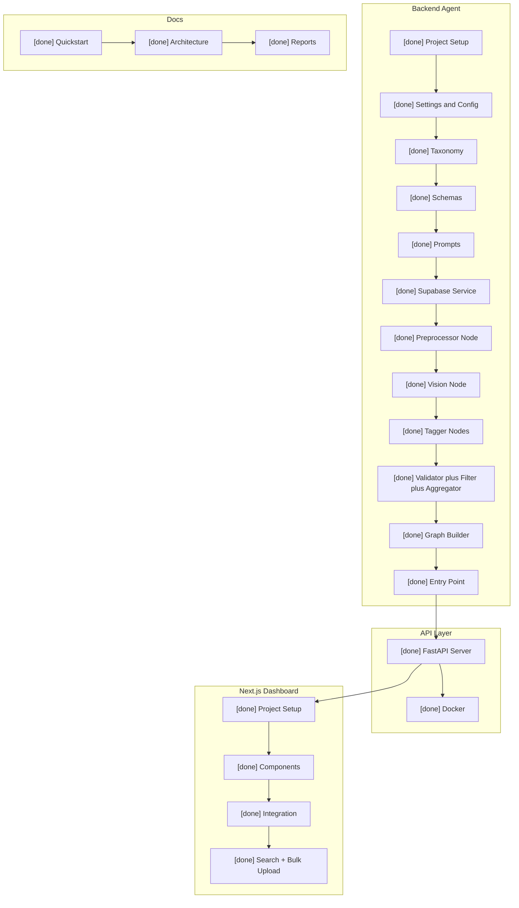

# Implementation Progress

```mermaid
flowchart TD
    subgraph Backend ["Backend Agent"]
        A["[done] Project Setup"]
        B["[done] Settings and Config"]
        C["[done] Taxonomy"]
        D["[done] Schemas"]
        E["[done] Prompts"]
        F["[done] Supabase Service"]
        G["[done] Preprocessor Node"]
        H["[done] Vision Node"]
        I["[done] Tagger Nodes"]
        J["[done] Validator plus Filter plus Aggregator"]
        K["[done] Graph Builder"]
        L["[done] Entry Point"]
        A --> B --> C --> D --> E --> F --> G --> H --> I --> J --> K --> L
    end

    subgraph API ["API Layer"]
        M["[done] FastAPI Server"]
        N["[done] Docker"]
        L --> M --> N
    end

    subgraph Frontend ["Next.js Dashboard"]
        O["[done] Project Setup"]
        P["[done] Components"]
        Q["[done] Integration"]
        R["[done] Search + Bulk Upload"]
        M --> O --> P --> Q --> R
    end

    subgraph Documentation ["Docs"]
        R2["[done] Quickstart"]
        S["[done] Architecture"]
        T["[done] Reports"]
        R2 --> S --> T
    end
```

**Last updated:** 2025-03-17  
**Currently working on:** Phase 6 complete (Polish + documentation)
