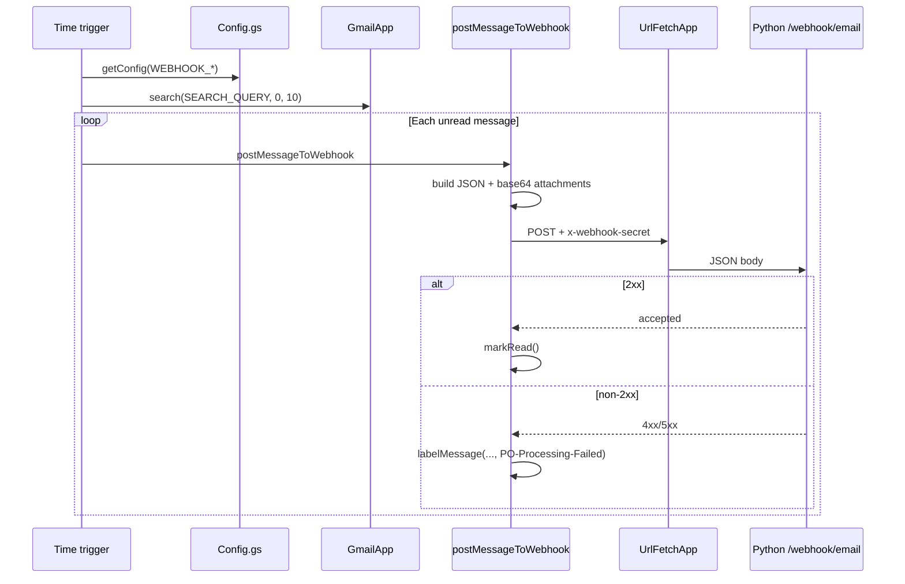

# A PO email arrives

Runtime walkthrough **step 01**: Gmail search, Apps Script trigger, JSON payload, POST to the Python webhook.

Plan reference: [Curriculum — `01_GAS_TRIGGER_FLOW`](../../.cursor/plans/po_parsing_ai_agent_211da517.plan.md) (search the plan for that heading).

---

## 1. `gas/Config.gs` (loads first when any function runs)

- **`getConfig(key)`** reads **Script properties** via `PropertiesService.getScriptProperties().getProperty(key)`. If the key is missing, it throws `Missing Script Property: {key}` so misconfiguration fails fast.
- **Documented property keys** (comments at top of file): `WEBHOOK_URL`, `WEBHOOK_SECRET`, `GAS_WEBAPP_SECRET`, `SPREADSHEET_ID`, `NOTIFICATION_RECIPIENTS`. You set these in the GAS editor under **Project Settings → Script properties**.
- **Constants:**
  - **`SEARCH_QUERY`** — Full string is in [`Config.gs`](../../gas/Config.gs) (~**L19–L20**). In plain language:
    - **Subject (positive):** `subject:(PO OR "Purchase Order")` — Gmail matches the **subject line** if it contains the token **PO** *or* the exact phrase **Purchase Order** (the quotes mean phrase match, not two separate arbitrary words).
    - **Unread:** `is:unread`.
    - **Exclude processed / failed labels:** `-label:PO-Processed -label:PO-Processing-Failed`.
    - **Exclude our own notification emails:** `-subject:"PO Processed:" -subject:"PO Processing FAILED:" -from:me` (stops GAS from re-processing notifier messages it sent).
    - Senior FYI (short note + line refs): [NOTE_search_query_gmail.md](NOTE_search_query_gmail.md).
  - **`LABEL_PROCESSED`** / **`LABEL_FAILED`** — label names used later (callback and failure paths).
  - **`TAB_PO_DATA`**, **`TAB_PO_ITEMS`**, **`TAB_MONITORING`** — sheet tab names used by `SheetsWriter.gs`.

---

## 2. `gas/appsscript.json` (manifest)

- **`timeZone`:** `Africa/Cairo` — used for `Utilities.formatDate` in Sheets logging and similar.
- **`runtimeVersion`:** `V8`.
- **`webapp`:** `executeAs: USER_DEPLOYING`, `access: ANYONE_ANONYMOUS` — required so the Python server can POST to `doPost` without Google sign-in (secret is validated in JSON body).
- **`oauthScopes`** (why each matters):
  - `script.scriptapp` — triggers, ScriptApp APIs.
  - `gmail.readonly` — read messages / search.
  - `gmail.modify` — mark read, label threads.
  - `gmail.labels` — create/apply labels.
  - `gmail.send` — notification emails.
  - `script.external_request` — `UrlFetchApp` to Python.
  - `spreadsheets` — open spreadsheet by ID and append rows.

---

## 3. `gas/LabelManager.gs`

- **`getOrCreateLabel(labelName)`** — returns existing `GmailLabel` or creates it.
- **`labelMessage(messageId, labelName)`** — loads the message by id, gets its **thread**, applies the label to the **thread** (Gmail labels are thread-level).

**Note:** Step 01’s trigger path does **not** call `LabelManager` on success; success is **`message.markRead()`** in `Code.gs`. Labels are applied on webhook failure here, and on success/failure in `WebApp.gs` after the Python callback.

---

## 4. `gas/Code.gs` — `processNewEmails()`

1. **`getConfig('WEBHOOK_URL')`** and **`getConfig('WEBHOOK_SECRET')`**.
2. **`GmailApp.search(SEARCH_QUERY, 0, 10)`** — at most **10 threads** per run (plan: stay within ~6-minute quota).
3. For each **thread**, iterate **`thread.getMessages()`**; skip messages where **`!message.isUnread()`**.
4. For each unread message, **`postMessageToWebhook(message, webhookUrl, secret)`**:
   - **`message.getAttachments()`** — each attachment becomes `{ filename, content_type, data_base64 }` with **`Utilities.base64Encode(att.getBytes())`** (same alphabet Python decodes with `base64.b64decode`).
   - **Payload fields:** `subject`, **`message.getPlainBody()`** as `body` (plain text; if the source is HTML-only, body may be empty), `sender`, **`message.getDate().toISOString()`** as `timestamp`, `message_id`, `attachments`.
   - **`UrlFetchApp.fetch(webhookUrl, { method: 'post', contentType: 'application/json', headers: { 'x-webhook-secret': secret }, payload: JSON.stringify(payload), muteHttpExceptions: true })`**.
   - If HTTP status is **not** 2xx: log response, **`labelMessage(message.getId(), LABEL_FAILED)`**, return.
   - If success: **`message.markRead()`**.

**`installFiveMinuteTrigger()`** (run once from editor): removes existing `processNewEmails` triggers, creates a time-based trigger every 5 minutes.

---

## 5. Data at this point (JSON leaving GAS)

Example shape (field names must match [`IncomingEmail`](../../src/po_parser/schemas/email.py)):

```json
{
  "subject": "PO 12345 - Acme Corp",
  "body": "Please see attached PO...",
  "sender": "buyer@example.com",
  "timestamp": "2026-04-05T10:00:00.000Z",
  "message_id": "18f1a2b3c4d5e6f7",
  "attachments": [
    {
      "filename": "PO_12345.pdf",
      "content_type": "application/pdf",
      "data_base64": "JVBERi0xLjQK..."
    }
  ]
}
```

---

## Diagram — GAS trigger flow



**Next step:** [02_API_INTAKE.md](02_API_INTAKE.md).
