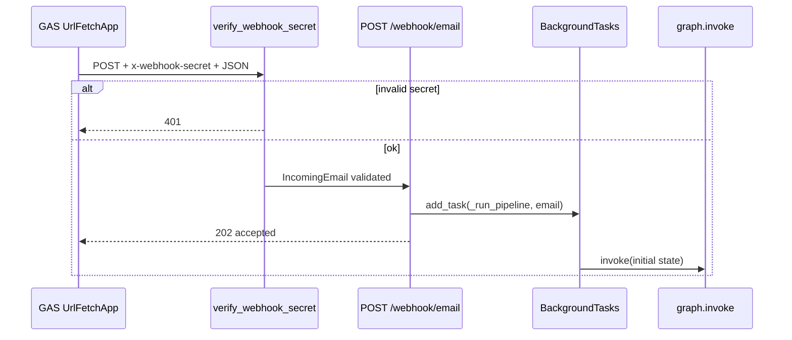

# Python receives the webhook

Runtime walkthrough **step 02**: FastAPI receives the GAS POST, verifies the shared secret, validates the body as `IncomingEmail`, returns **202** immediately, and runs the LangGraph pipeline in a **background task**.

Plan reference: [Curriculum — `02_API_INTAKE`](../../.cursor/plans/po_parsing_ai_agent_211da517.plan.md).

---

## 1. `src/api/middleware.py`

- Dependency **`verify_webhook_secret`** runs before the route handler.
- Reads header **`x-webhook-secret`** (FastAPI alias for the hyphenated name).
- Compares to environment variable **`WEBHOOK_SECRET`** using **`hmac.compare_digest`** on UTF-8 bytes (timing-safe).
- **401** if either side is missing or the digest does not match.

---

## 2. `src/api/main.py`

- **`GET /health`** — returns `{ "status": "healthy", "timestamp": <UTC ISO8601> }`.
- **`POST /webhook/email`**:
  - **`Depends(verify_webhook_secret)`** — auth first.
  - Request body is parsed and validated as **`IncomingEmail`** (`email: IncomingEmail`). Invalid JSON or wrong types yield **422** (FastAPI / Pydantic).
  - **`background_tasks.add_task(_run_pipeline, email)`** — work is **not** awaited on the request thread.
  - Returns **`JSONResponse(status_code=202, {"status": "accepted", "message_id": email.message_id})`** so GAS gets a quick response.

**`_run_pipeline(email)`** (sync, runs in FastAPI’s background worker):

- Imports **`graph`** from **`src.po_parser.po_parser`** (compiled `StateGraph`).
- Builds the **initial `AgentState` dict** with:
  - `email` set to the validated model.
  - `classification`, `body_text`, `consolidated_text`, `extracted_po`, `normalized_po`, `validation`, `airtable_record_id`, `airtable_url`, `gas_callback_status` set to **`None`** where applicable.
  - `pdf_texts` and `excel_data` as empty lists.
  - `errors` as `[]`.
  - `processing_start_time` as **`time.time()`** (used later for callback timing).
- Calls **`graph.invoke(initial)`** (synchronous invoke; plan text sometimes says `ainvoke` — current code uses **`invoke`**).
- Top-level **exceptions** log via **`logger.exception`** (pipeline errors do not become HTTP errors because the response was already 202).

---

## 3. `src/po_parser/schemas/email.py` (support)

- **`Attachment`:** `filename: str`, `content_type: str`, `data_base64: str`.
- **`IncomingEmail`:** `subject`, `body`, `sender`, `timestamp`, `message_id` (all `str`), **`attachments: list[Attachment]`** defaulting to `[]`.

This is the contract GAS must satisfy; extra JSON keys are ignored by default Pydantic v2 behavior unless configured otherwise.

---

## 4. Data at this point

After validation you have an **`IncomingEmail`** instance in memory — same fields as the JSON, with types guaranteed. That object is what `_run_pipeline` places in **`state["email"]`** for the graph.

---

## Diagram — API intake

**Next step:** [03_GRAPH_INITIALIZATION.md](03_GRAPH_INITIALIZATION.md).
