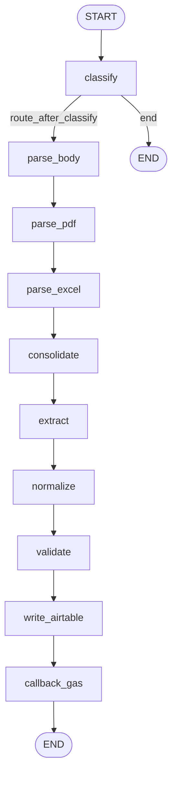

# The LangGraph pipeline starts

Runtime walkthrough **step 03**: how LangGraph Studio finds the graph, how `graph` is built, and the **`AgentState`** shape before nodes run.

Plan reference: [Curriculum — `03_GRAPH_INITIALIZATION`](../../.cursor/plans/po_parsing_ai_agent_211da517.plan.md).

---

## 1. `langgraph.json`

Registers the compiled graph for LangGraph tooling / Studio:

```json
{
  "graphs": {
    "po_parser": "./src/po_parser/po_parser.py:graph"
  }
}
```

The value is **`module_path:attribute`** — here the **`graph`** object defined in `po_parser.py`.

---

## 2. `src/po_parser/po_parser.py`

- Imports **`build_graph`** from **`graph_builder`**.
- At import time: **`graph = build_graph()`** — a single compiled graph reused by FastAPI and Studio.

---

## 3. `src/po_parser/graph_builder.py`

- **`StateGraph(AgentState)`** — state schema is the **`AgentState`** `TypedDict`.
- **Nodes added** (names → functions):  
  `classify`, `parse_body`, `parse_pdf`, `parse_excel`, `consolidate`, `extract`, `normalize`, `validate`, `write_airtable`, `callback_gas`.
- **Edges:**
  - **`START` → `classify`** (entry point; plan text sometimes says `set_entry_point("classify")` — LangGraph v0.2+ uses `add_edge(START, "classify")`).
  - **Conditional from `classify`:** **`route_after_classify`** maps to **`parse`** → `parse_body`, **`end`** → **`END`**.
  - **Sequential chain:**  
    `parse_body` → `parse_pdf` → `parse_excel` → `consolidate` → `extract` → `normalize` → `validate` → `write_airtable` → `callback_gas` → **`END`**.

**Plan vs code:** The plan mentions **`route_parsers()`** and parallel parsers. The **current** graph runs the three parsers **one after another** (still valid LangGraph; different parallelism story).

- **`return gb.compile()`** — compiled graph returned to `po_parser.py`.

---

## 4. `src/po_parser/schemas/states.py` (`AgentState`)

| Field | Type | Written by (typical) | Read by |
|-------|------|----------------------|---------|
| `email` | `IncomingEmail` | API (initial) | Most nodes |
| `classification` | `ClassificationResult \| None` | `classify` | Routing, downstream |
| `pdf_texts` | `list[str]` | `parse_pdf` | `consolidate` |
| `excel_data` | `list[dict]` | `parse_excel` | `consolidate` |
| `body_text` | `str \| None` | `parse_body` | `consolidate` |
| `consolidated_text` | `str \| None` | `consolidate` | `extract` |
| `extracted_po` | `ExtractedPO \| None` | `extract` | `normalize` |
| `normalized_po` | `ExtractedPO \| None` | `normalize` | `validate`, `write_airtable`, `callback_gas` |
| `validation` | `ValidationResult \| None` | `validate` | `write_airtable`, `callback_gas` |
| `airtable_record_id` | `str \| None` | `write_airtable` | `callback_gas` (indirect via URL) |
| `airtable_url` | `str \| None` | `write_airtable` | `callback_gas` |
| `gas_callback_status` | `str \| None` | `callback_gas` | Final state |
| `errors` | `list[str]` | Many nodes append | `callback_gas` payload |
| `processing_start_time` | `float` | API (initial) | `callback_gas` |

LangGraph merges each node’s returned **`dict`** into state (keys must match `AgentState`).

---

## 5. `src/po_parser/nodes/__init__.py`

Re-exports node callables and **`route_after_classify`** so `graph_builder` imports from a single package surface (`from src.po_parser.nodes import ...`).

---

## 6. `src/po_parser/nodes/routing.py`

- **`route_after_classify(state) -> str`**
  - If `classification` is **`None`**, or **`not is_po`**, or **`confidence < 0.7`** → **`"end"`** (graph stops).
  - Else → **`"parse"`** → next node is **`parse_body`**.

---

## 7. Data at this point (initial state)

Same structure as `_run_pipeline` in `main.py`: email populated; lists empty or `None` for later fields; `errors` empty; `processing_start_time` set.

---

## Diagram — full graph (you are at entry)



**Next step:** [04_CLASSIFICATION.md](04_CLASSIFICATION.md).
