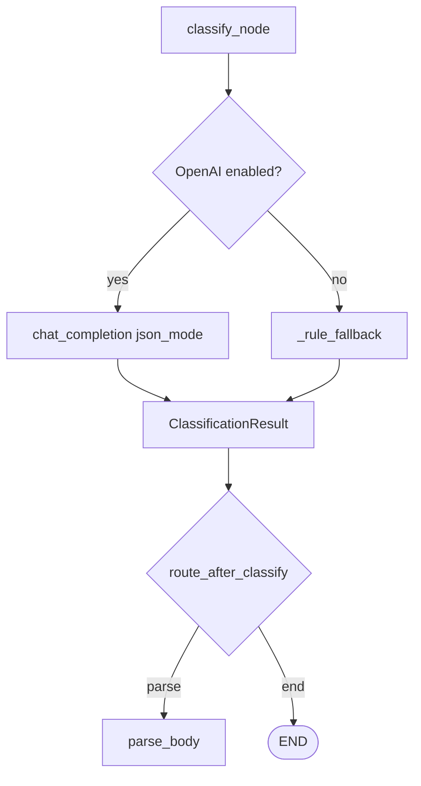

# Is this a PO email?

Runtime walkthrough **step 04**: **`classify`** node, classification prompts, **`ClassificationResult`**, OpenAI client/settings, and **`route_after_classify`**.

Plan reference: [Curriculum — `04_CLASSIFICATION`](../../.cursor/plans/po_parsing_ai_agent_211da517.plan.md).

---

## 1. `src/po_parser/nodes/classifier.py` — `classify_node`

1. Reads **`state["email"]`**: subject, sender, attachments, body.
2. **`clamp_text(body, 500)`** — only the first 500 characters go into the user prompt (see `utils.py`). Expanded summary: [NOTE_clamp_text_classification.md](NOTE_clamp_text_classification.md).
3. Builds attachment filename list for the prompt (or `"(none)"`).
4. **`CLASSIFICATION_USER_TEMPLATE.format(...)`** with `subject`, `sender`, `attachment_filenames`, `body_snippet`.
5. **`messages`** = system + user, then **`OpenAIClient.chat_completion(..., model=cli.settings.classification_model, json_mode=True)`**.
6. **`json.loads(raw)`** → builds **`ClassificationResult(is_po=..., confidence=..., type=...)`**.
7. Returns **`{"classification": result}`**.

**If OpenAI is disabled** (`OPENAI_API_KEY` unset → client `enabled` is false): returns **`_rule_fallback(state)`** — heuristic on subject + attachment extensions.

**On exception:** logs, appends **`classification: {e}`** to **`errors`**, still returns **`classification`** from **`_rule_fallback`** (plan text sometimes says `classification=None`; current code **does not** leave it `None` on failure).

---

## 2. `src/po_parser/prompts/classification.py`

**`CLASSIFICATION_SYSTEM_PROMPT`** — instructs the model to return JSON with:

- **`is_po`** (boolean)
- **`confidence`** (0.0–1.0)
- **`type`**: `purchase_order` | `invoice` | `shipping` | `other` | null

Includes PO vs non-PO signals.

**`CLASSIFICATION_USER_TEMPLATE`** — supplies:

```
Subject: {subject}
From: {sender}
Attachment names: {attachment_filenames}

Body (first 500 chars):
{body_snippet}
```

### Full prompt source (matches `classification.py`)

```text
CLASSIFICATION_SYSTEM_PROMPT = """You classify whether an email is a purchase order (PO) or PO-like business document.
Return a JSON object with exactly these keys:
- "is_po" (boolean): true if this is a purchase order, replenishment order, or buying request with SKUs/quantities/pricing intent.
- "confidence" (number 0.0-1.0): your confidence in the classification.
- "type" (string or null): one of "purchase_order", "invoice", "shipping", "other", or null.

PO signals: subject/body mentions PO, purchase order, reorder, SKU lines, quantities, ship dates, buyer/vendor context.
NOT a PO: invoices as final bills only, shipping tracking with no order lines, marketing, generic questions."""

CLASSIFICATION_USER_TEMPLATE = """Subject: {subject}
From: {sender}
Attachment names: {attachment_filenames}

Body (first 500 chars):
{body_snippet}
"""
```

---

## 3. `src/po_parser/schemas/classification.py`

**`ClassificationResult`** (Pydantic): `is_po: bool`, `confidence` in **[0, 1]**, `type: Optional[str]`.

---

## 4. `src/services/openai/client.py` — `OpenAIClient`

- **`chat_completion(messages, model=None, json_mode=False)`** — calls **`chat.completions.create`** with `max_tokens` / `temperature` from settings; if **`json_mode`**, sets **`response_format: {type: json_object}`**.
- **`RateLimitError`:** logs, sleeps 2s, **one retry**.
- **`vision_completion`** — used by PDF OCR path (step 05).

---

## 5. `src/services/openai/settings.py` — `OpenAISettings`

- Env prefix **`OPENAI_`** (via pydantic-settings).
- Fields: **`api_key`**, **`classification_model`** (default `gpt-4o-mini`), **`extraction_model`**, **`ocr_model`** (default `gpt-4o`), **`max_tokens`**, **`temperature`**.

---

## 6. Routing after classify

**`route_after_classify`:** `end` if no classification, not PO, or confidence **< 0.7**; else **`parse`** → **`parse_body`**.

---

## 7. Data at this point

State includes **`classification`**; parsers not run yet if routing went to **`end`**.

---

## Diagram



**Next step:** [05_PARSING.md](05_PARSING.md).
