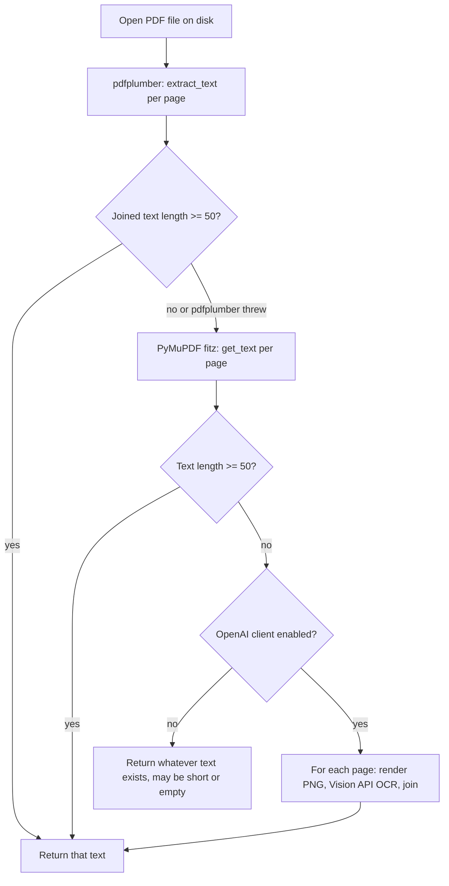

# Extracting raw text from documents

Runtime walkthrough **step 05**: **`parse_body`**, **`parse_pdf`**, **`parse_excel`**, prompts and file helpers. In **this codebase** these run **sequentially** (not parallel LangGraph branches).

Plan reference: [Curriculum — `05_PARSING`](../../.cursor/plans/po_parsing_ai_agent_211da517.plan.md).

---

## 1. `src/po_parser/nodes/body_parser.py`

- Reads **`state["email"].body`** (or `""`).
- If the body looks like HTML (`<` and `>` present): strips `<script>` / `<style>`, removes tags, **`html.unescape`**.
- Collapses excessive whitespace/newlines.
- Returns **`{"body_text": body}`** (or empty string on error, with **`errors`** appended).

---

## 2. `src/po_parser/nodes/pdf_parser.py`

For each attachment where content type or filename suggests PDF:

1. **`b64decode_bytes(att.data_base64)`** → **`write_temp_bytes(".pdf", raw)`** temp path.
2. **`_extract_pdf_text(path)`**:
   - **pdfplumber:** open PDF, **`extract_text()`** per page, join. If total text length **≥ 50**, return.
   - Else **PyMuPDF (`fitz`):** native text per page; if **≥ 50** chars, return.
   - If still short and OpenAI enabled: **per-page OCR** — render page to PNG (`get_pixmap(dpi=150)`), base64 data URL, **`vision_completion`** with OCR prompts; concatenate page texts.
3. Successful extracts are prefixed with **`## {filename}`** and collected in **`pdf_texts`**.
4. **`unlink_silent(path)`** in `finally`.

**Errors:** per-file exceptions append **`pdf_parser {filename}: ...`** to **`errors`**.

---

## 3. `src/po_parser/prompts/ocr.py`

### Full prompt source (matches `ocr.py`)

```text
OCR_SYSTEM_PROMPT = """You read document images and return plain text only.
Preserve table structure using spaces or line breaks. No commentary."""

OCR_USER_PROMPT = "Read all text from this document image. Preserve tables and formatting."
```

---

## 4. `src/po_parser/tools/file_helpers.py`

- **`b64decode_bytes`** — `base64.b64decode(..., validate=False)` (matches GAS encoding).
- **`write_temp_bytes(suffix, data)`** — `NamedTemporaryFile(delete=False)`; caller must delete.
- **`unlink_silent(path)`** — ignore `OSError`.

---

## 5. `src/po_parser/nodes/excel_parser.py`

For each attachment that looks like spreadsheet (extension `.xlsx` / `.xls` / `.xlsm` / `.csv` or MIME hints):

- Decode base64 → temp file (`.csv` or actual extension).
- **CSV:** **`pandas.read_csv`**, normalize column headers via **`_norm_header`** (aliases e.g. `P.O. #` → `po_number`, `Qty` → `quantity`).
- **Excel:** **`openpyxl.load_workbook`** read-only, **`data_only=True`**, iterate sheets: first row = headers, following rows = dicts keyed by normalized header names.
- Returns **`{"excel_data": blocks, "errors": errs}`** where each **block** is:

```python
{
  "filename": "<original name>",
  "sheets": [
    {"sheet_name": "...", "rows": [ {...}, ... ]}
  ]
}
```

**Plan note:** The plan described `excel_data` as a flatter shape; **implement this structure** when reading `consolidator.py`.

---

## 6. Data at this point

- **`body_text`:** cleaned string.
- **`pdf_texts`:** list of strings (each may start with `## filename`).
- **`excel_data`:** list of `{filename, sheets}` dicts.

---

## Diagrams — parser chain vs PDF fallbacks

The old single diagram mixed **two different ideas**; read them separately:

1. **Graph order (three LangGraph nodes)** — always runs **parse_body → parse_pdf → parse_excel** when classification sent you down the parse path. Each node only *does work* for its own kind of data (body vs PDF attachments vs spreadsheet attachments); others no-op or skip.
2. **Inside one PDF (`_extract_pdf_text`)** — only runs **inside** `parse_pdf`, **per PDF file**. It tries cheaper text extraction first, then Vision OCR only if the text is still too short.

### A — LangGraph: three nodes in sequence


- **`parse_body`:** fills **`body_text`** from the email body.
- **`parse_pdf`:** for each PDF attachment, runs the fallback chain below; fills **`pdf_texts`**.
- **`parse_excel`:** for each spreadsheet/CSV attachment; fills **`excel_data`**.

### B — Inside `parse_pdf`: `_extract_pdf_text` for one file

Source: [`pdf_parser.py`](../../src/po_parser/nodes/pdf_parser.py) **`_extract_pdf_text`** (roughly **L34–L84**).



**Why 50?** Heuristic: below ~50 characters, the PDF is likely a scan or image-only; the code then tries OCR. The number is in code at **`pdf_parser.py` L39–L40, L51–L52**.

**Next step:** [06_CONSOLIDATION.md](06_CONSOLIDATION.md).
