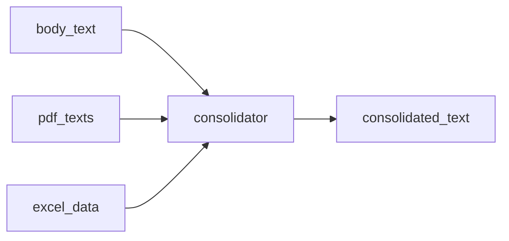

# Merging all sources into one

Runtime walkthrough **step 06**: **`consolidator_node`** builds one text document for the extractor.

Plan reference: [Curriculum — `06_CONSOLIDATION`](../../.cursor/plans/po_parsing_ai_agent_211da517.plan.md).

---

## 1. `src/po_parser/nodes/consolidator.py`

1. **`body_text`** (or empty) → section **`SECTION "EMAIL BODY"`**.
2. Each string in **`pdf_texts`** → **`SECTION "PDF ATTACHMENT [1]"`**, **`[2]`**, … (**1-based** indices in the label).
3. Each **`excel_data`** block: for each sheet, append  
   **`SECTION "SPREADSHEET {filename} — Sheet {name}"`**  
   plus **`json.dumps(rows, default=str, indent=2)`**.
4. Sections joined with **`"\n\n---\n\n"`**.
5. Returns **`{"consolidated_text": merged}`**.

**Empty sources:** email body section is always present (may be empty); PDF/Excel sections only when data exists.

**Plan vs code:** The plan asked the consolidator to set a **`source_type`** field (`email` / `pdf` / `spreadsheet` / `mixed`). The **current** consolidator only returns **`consolidated_text`**. **`source_type`** is expected from the **LLM** in **`ExtractedPO`** (see extraction prompt).

**On exception:** falls back to **`body_text` or ""** and appends to **`errors`**.

---

## 2. Data at this point — realistic example

```text
SECTION "EMAIL BODY"
Please ship per attached PO.

---

SECTION "PDF ATTACHMENT [1]"
## PO_12345.pdf
PURCHASE ORDER
PO Number: 12345
...

---

SECTION "SPREADSHEET lines.xlsx — Sheet Sheet1"
[
  {
    "po_number": "12345",
    "sku": "ABC-1",
    "quantity": 10
  }
]
```

---

## Diagram



**Next step:** [07_EXTRACTION.md](07_EXTRACTION.md).
