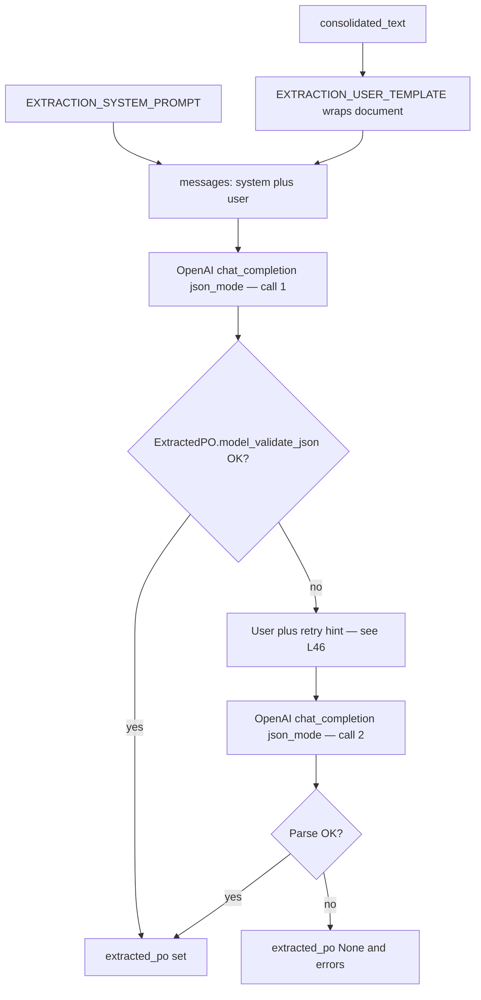

# AI extracts structured PO data

Runtime walkthrough **step 07**: **`extractor_node`**, extraction prompts, **`ExtractedPO`** / **`POItem`** / **`Destination`**.

Plan reference: [Curriculum — `07_EXTRACTION`](../../.cursor/plans/po_parsing_ai_agent_211da517.plan.md).

---

## 1. `src/po_parser/nodes/extractor.py`

1. Reads **`state.get("consolidated_text") or ""`**.
2. **`EXTRACTION_USER_TEMPLATE.format(consolidated_text=text)`** wraps content in  
   `--- BEGIN DOCUMENT ---` / `--- END DOCUMENT ---`.
3. **`chat_completion(..., model=extraction_model, json_mode=True)`**.
4. **`ExtractedPO.model_validate_json(raw)`** — if that fails, **one retry** with extra user line:  
   `Output valid JSON only matching the schema. No markdown.`
5. Returns **`{"extracted_po": po}`** or **`{"extracted_po": None, "errors": ...}`** if no API key, or both attempts fail.

**Plan alignment:** “Retries once with stricter prompt” — **implemented** as the second user message, not a separate system prompt.

---

## 2. `src/po_parser/prompts/extraction.py`

**`EXTRACTION_SYSTEM_PROMPT`** — requires **one JSON object only**, **`null`** for unknowns, do not invent SKUs/amounts. Embeds the schema summary:

- Header-level: `po_number`, `customer`, `po_date`, `ship_date`, `cancel_date`, `items[]`, `destinations[]`, `total_amount`, `currency`, `payment_terms`, `ship_to`, `bill_to`, `source_type` (`pdf` | `spreadsheet` | `email` | `mixed` | null), `raw_confidence`.
- Each **item:** `sku`, `description`, `quantity`, `unit_price`, `total_price`, `destination`.
- Each **destination:** `dc_name`, `address`.

**`EXTRACTION_USER_TEMPLATE`:**

```
--- BEGIN DOCUMENT ---
{consolidated_text}
--- END DOCUMENT ---
```

### Full prompt source (matches `extraction.py`)

```text
EXTRACTION_SYSTEM_PROMPT = """You extract structured purchase order data from messy text. Output ONE JSON object only (no markdown).
Use null for unknown fields. Do not invent SKUs or amounts.

Schema (all keys required in JSON; use null where unknown):
{
  "po_number": string|null,
  "customer": string|null,
  "po_date": string|null,
  "ship_date": string|null,
  "cancel_date": string|null,
  "items": [
    {
      "sku": string|null,
      "description": string|null,
      "quantity": number|null,
      "unit_price": number|null,
      "total_price": number|null,
      "destination": string|null
    }
  ],
  "destinations": [ { "dc_name": string|null, "address": string|null } ],
  "total_amount": number|null,
  "currency": string,
  "payment_terms": string|null,
  "ship_to": string|null,
  "bill_to": string|null,
  "source_type": "pdf"|"spreadsheet"|"email"|"mixed"|null,
  "raw_confidence": number|null
}"""

EXTRACTION_USER_TEMPLATE = """--- BEGIN DOCUMENT ---
{consolidated_text}
--- END DOCUMENT ---
"""
```

---

## 3. `src/po_parser/schemas/po.py`

- **`Destination`:** optional `dc_name`, `address`.
- **`POItem`:** optional `sku`, `description`, `quantity`, `unit_price`, `total_price`, `destination`.
- **`ExtractedPO`:** optional PO header fields, **`items`** and **`destinations`** default to empty lists, **`currency`** is optional with default **`"USD"`** and a validator that coerces `null`/empty to **`"USD"`** (see [`po.py`](../../src/po_parser/schemas/po.py)).

---

## 4. Data at this point — example `ExtractedPO` (illustrative)

```json
{
  "po_number": "PO-778899",
  "customer": "Acme Retail",
  "po_date": "04/05/2026",
  "ship_date": null,
  "cancel_date": null,
  "items": [
    {
      "sku": "SKU-1001",
      "description": "Widget A",
      "quantity": 24,
      "unit_price": 12.5,
      "total_price": 300.0,
      "destination": "DC-East"
    }
  ],
  "destinations": [],
  "total_amount": 300.0,
  "currency": "USD",
  "payment_terms": "Net 30",
  "ship_to": "123 Warehouse Rd",
  "bill_to": null,
  "source_type": "mixed",
  "raw_confidence": 0.88
}
```

---

## Diagram — extractor flow

**Source:** [`extractor.py`](../../src/po_parser/nodes/extractor.py) **`extractor_node`** (~**L23–L61**).

### How to read it

The diagram is **one left-to-right pipeline** for the **`extract` node**. It is **not** multiple parallel branches competing—it shows **what gets combined** before the API call, then **validate → retry or success**.

| Box / step | Meaning |
|------------|--------|
| **`consolidated_text`** | Output of the previous step ([`06_CONSOLIDATION.md`](06_CONSOLIDATION.md)): one big string (email body + PDF blocks + spreadsheet JSON). |
| **`EXTRACTION_USER_TEMPLATE`** | Wraps that text between `--- BEGIN DOCUMENT ---` / `--- END DOCUMENT ---`. |
| **`EXTRACTION_SYSTEM_PROMPT`** | Tells the model the JSON schema and rules (one object, `null` for unknowns, etc.). |
| **`messages`** | The chat payload: **system** = extraction rules, **user** = wrapped document. Same shape as [`extractor.py` L27–L30](../../src/po_parser/nodes/extractor.py). |
| **`OpenAI json_mode`** | `chat_completion(..., json_mode=True)` — model is asked to return a JSON object. |
| **`model_validate_json`** | `ExtractedPO.model_validate_json(raw)` — Pydantic parses the string into **`ExtractedPO`**. If this **throws**, the code does **not** continue to `ExtractedPO` yet. |
| **`retry user hint`** | **Second** request: same system prompt, but the user message = first user text **plus** one line: *Output valid JSON only matching the schema. No markdown.* ([`extractor.py` L46–L50](../../src/po_parser/nodes/extractor.py)). Only **one** retry. |
| **`ExtractedPO`** | Success: valid structured PO object in state. |

**Flow in words:** Build **messages** → call **OpenAI** → **`ExtractedPO.model_validate_json(raw)`**. If that **throws**, append the retry line to the user content, call **OpenAI** a **second** time, parse again. If parsing still fails, the **`except`** path returns **`extracted_po: None`** and appends to **`errors`**.



**Next step:** [08_NORMALIZATION.md](08_NORMALIZATION.md).
