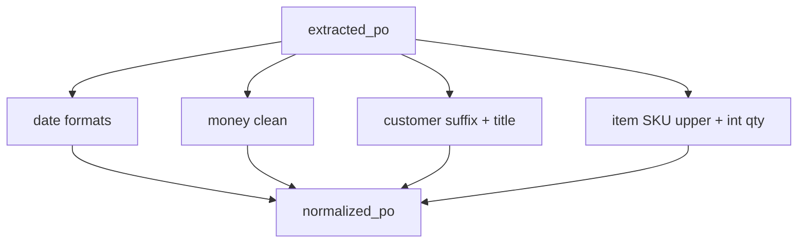

# Standardizing the data

Runtime walkthrough **step 08**: **`normalizer_node`** — dates, money, customer string, line items.

Plan reference: [Curriculum — `08_NORMALIZATION`](../../.cursor/plans/po_parsing_ai_agent_211da517.plan.md).

---

## 1. `src/po_parser/nodes/normalizer.py`

If **`extracted_po` is `None`:** returns **`{"normalized_po": None}`** (no-op).

Otherwise builds a new **`ExtractedPO`**:

- **`po_number`:** strip; empty → `None`.
- **`customer`:** **`_clean_customer`** — strip suffixes **` Inc.`**, **` LLC`**, **` Corp.`**, **` Corporation`**, **` Ltd.`** (exact suffix match), then **`.title()`**.
- **Dates (`po_date`, `ship_date`, `cancel_date`):** **`_parse_date`** tries, in order:  
  `%Y-%m-%d`, `%m/%d/%Y`, `%m/%d/%y`, `%d-%b-%y`, `%d-%b-%Y`, `%B %d, %Y`, `%b %d, %Y` → output **`YYYY-MM-DD`** (`date.isoformat()`). If none match, **returns the original string** (plan: business dates as dates; unparseable strings pass through).
- **`total_amount`**, item **`unit_price`** / **`total_price`:** **`_clean_money`** — strip `$`, comma, whitespace; parse float.
- **`currency`:** uppercased, default **`USD`**.
- **Items (`_norm_item`):** SKU **uppercase** and strip (plan mentioned stripping leading zeros — **not** in current code). **`quantity`** cast to **`int`**. Money fields via **`_clean_money`**.

**On exception:** logs, returns **`normalized_po: po`** (unchanged) and appends **`errors`**.

---

## 2. Timezone strategy (recap)

- **PO dates** in extracted/normalized data: **date-only strings** when parsing succeeds — no timezone.
- **Processing timestamps** elsewhere (e.g. Airtable writer): **UTC ISO8601**.
- **GAS / Sheets:** **`Africa/Cairo`** for display strings (`SheetsWriter.cairoNowString`).

---

## 3. Data at this point — before / after (illustrative)

| Field | Raw extracted | Normalized |
|-------|----------------|------------|
| `po_date` | `04/05/2026` | `2026-04-05` |
| `customer` | `ACME INC.` | `Acme` (suffix rule dependent) |
| `items[0].unit_price` | `"$1,234.50"` | `1234.5` |

---

## Diagram

**Next step:** [09_VALIDATION.md](09_VALIDATION.md).
