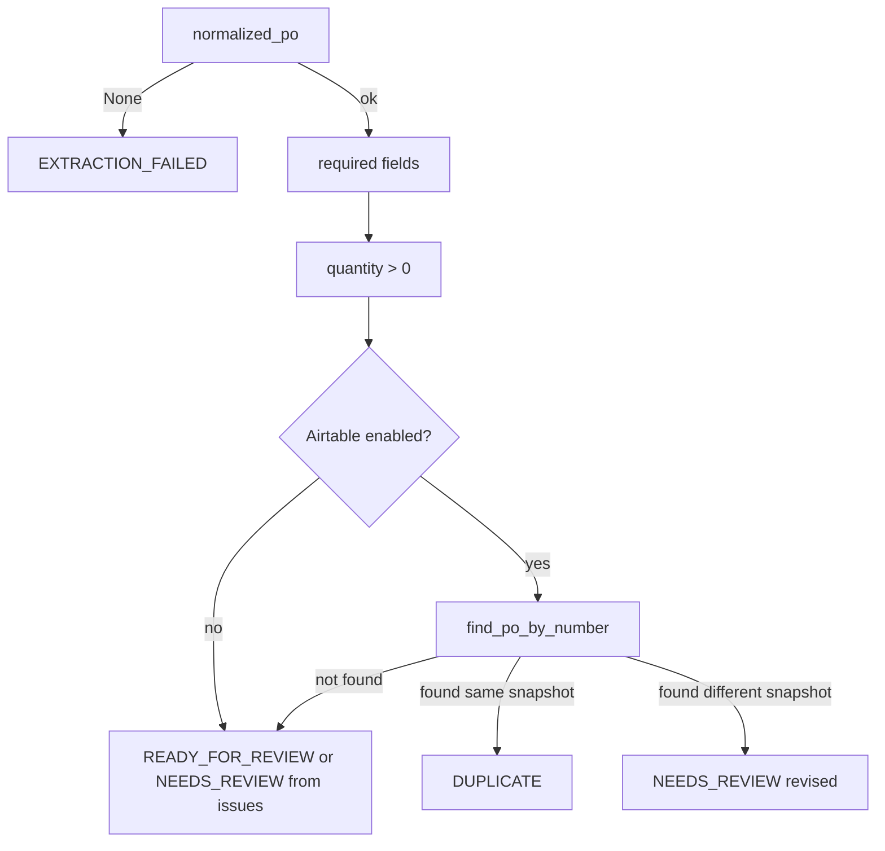

# Checking the data

Runtime walkthrough **step 09**: **`validator_node`**, **`ValidationResult`**, Airtable **`find_po_by_number`**.

Plan reference: [Curriculum — `09_VALIDATION`](../../.cursor/plans/po_parsing_ai_agent_211da517.plan.md).

---

## 1. `src/po_parser/nodes/validator.py`

**If `normalized_po` is `None`:** returns **`ValidationResult(status=EXTRACTION_FAILED, issues=["No PO data extracted"])`**.

Otherwise:

1. **Required fields:** empty **`po_number`** → issue **“Missing PO Number”**; empty **`customer`** → **“Missing Customer”**.
2. **Quantities:** for each line, if **`quantity` is not `None` and `<= 0`**, add **“Line N: quantity must be > 0”**.
3. **Default status:** **`READY_FOR_REVIEW`**.
4. **Duplicate / revised (Airtable):** if client **`enabled`** and PO number non-empty:
   - **`find_po_by_number(po_number.strip())`**
   - If record found: store **`existing_record_id`**, load **`Raw Extract JSON`** from Airtable fields, parse JSON.
   - Compare **`_snapshot(po)`** (po_number, customer, items dump) to previous snapshot with **`json.dumps(..., sort_keys=True)`**:
     - **Equal** → **`DUPLICATE`**, **`is_duplicate=True`**
     - **Different** → **`NEEDS_REVIEW`**, **`is_revised=True`**, issue about same PO number differing
   - On lookup exception: log warning, append issue, set **`NEEDS_REVIEW`**
5. If there are **issues** and status was still **`READY_FOR_REVIEW`**, bump to **`NEEDS_REVIEW`**.

Returns **`{"validation": ValidationResult(...)}`**.

---

## 2. `src/po_parser/schemas/validation.py`

**`ValidationStatus`** enum values:

- **`READY_FOR_REVIEW`**
- **`NEEDS_REVIEW`**
- **`DUPLICATE`**
- **`EXTRACTION_FAILED`**

**`ValidationResult`:** `status`, `issues[]`, `is_duplicate`, `is_revised`, `existing_record_id`.

---

## 3. `src/services/airtable/client.py` — `find_po_by_number`

- Escapes single quotes in the PO number for formula safety: **`_escape_formula_value`**.
- Formula: **`{PO Number}='escaped_value'`** (field name must match your Airtable primary table).
- **`first(formula=formula)`** returns one record or `None`.

---

## 4. `src/services/airtable/settings.py`

- **`AIRTABLE_*`** env vars: **`api_key`**, **`base_id`**, **`po_table`** (default **`Customer POs`**), **`items_table`** (default **`PO Items`**), optional **`attachments_field`**.

---

## 5. Data at this point

Example: **`status=READY_FOR_REVIEW`**, empty **`issues`**, **`is_duplicate=False`**, after a clean new PO with Airtable empty or disabled.

---

## Diagram — validation decision tree

**Next step:** [10_AIRTABLE_OUTPUT.md](10_AIRTABLE_OUTPUT.md).
