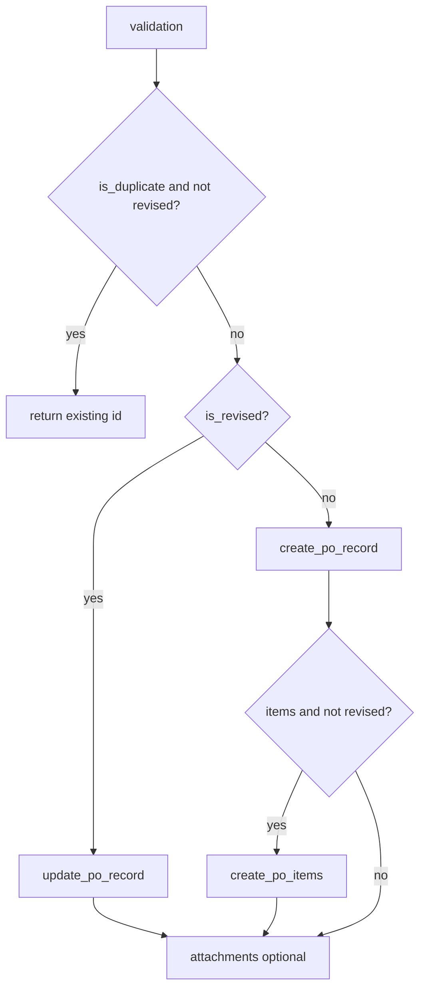

# Writing to Airtable

Runtime walkthrough **step 10**: **`airtable_writer_node`**, Airtable client methods, field mapping, optional attachment uploads.

Plan reference: [Curriculum — `10_AIRTABLE_OUTPUT`](../../.cursor/plans/po_parsing_ai_agent_211da517.plan.md).

---

## 1. `src/po_parser/nodes/airtable_writer.py`

**Guards:**

- Missing **`normalized_po`** or **`validation`** → **`airtable_record_id` / `airtable_url` = `None`**.
- Airtable not configured (`!at.enabled`) → append error, return `None`s.

**Duplicate shortcut:** If **`val.is_duplicate`** and **not** **`val.is_revised`** and **`existing_record_id`** set → returns that id and a **short URL** `https://airtable.com/{base_id}/{rid}` (see **implementation note** below).

**Otherwise** builds **`fields`** for the **Customer POs** table:

| Airtable field | Source |
|----------------|--------|
| `PO Number` | `po.po_number` |
| `Customer` | `po.customer` |
| `PO Date` | `po.po_date` |
| `Ship Date` | `po.ship_date` |
| `Status` | always **`"Needs Review"`** at write time |
| `Source Type` | `po.source_type` or **`"email"`** |
| `Email Subject` | `email.subject` |
| `Sender` | `email.sender` |
| `Raw Extract JSON` | `json.dumps(po.model_dump())` |
| `Validation Status` | `val.status.value` |
| `Confidence` | `classification.confidence` if present |
| `Processing Timestamp` | UTC **`datetime.now(timezone.utc).isoformat()`** |
| `Notes` | `""` |

- If **`is_revised`** and **`existing_record_id`:** **`update_po_record(id, fields)`**.
- Else: **`create_po_record(fields)`** → new **`rid`**.

**Line items:** For each normalized item, build row dict with Airtable field names:

- `SKU`, `Description`, `Quantity`, `Unit Price`, `Total Price`, `Destination / DC`

**`create_po_items(rid, item_rows)`** is called only when **`item_rows` non-empty and `not val.is_revised`** — revised updates in the current code **do not** re-append line items via this path (plan may assume a different policy).

**Attachments:** If **`AIRTABLE_ATTACHMENTS_FIELD`** is set, each webhook attachment is decoded and **`upload_file_to_field(rid, field_name, filename, bytes, content_type)`**.

Errors append to **`errors`**; node still returns record id/url when the main write succeeded.

---

## 2. `src/services/airtable/client.py` (support)

- **`create_po_record` / `update_po_record`** — pyairtable **`create` / `update`** on PO table.
- **`create_po_items`:** each item dict gets **`"Linked PO": [po_record_id]`** for linked-record syntax.

**Field names** must match Airtable exactly (case-sensitive).

---

## 3. Airtable table schemas (expected)

Aligned with settings defaults:

- **Table `Customer POs` (or `po_table`):** at minimum the fields listed above; **`PO Number`** used in **`find_po_by_number`** formula **`{PO Number}`**.
- **Table `PO Items` (or `items_table`):** SKU, description, quantity, prices, destination, link field **`Linked PO`**.

Full column reference: [SERVICES_REFERENCE.md](../documentations/SERVICES_REFERENCE.md) / setup docs.

---

## 4. Data at this point

**`airtable_record_id`**, **`airtable_url`** set (or `None` on failure). State carries forward to **`callback_gas`**.

---

## 5. Implementation note — record URLs

`record_url()` exists on the client for table-qualified links; the writer currently builds **`https://airtable.com/{base_id}/{record_id}`**. Your browser may redirect; for bookmarks, prefer the table-specific URL pattern documented in Airtable.

---

## Diagram

**Next step:** [11_GAS_CALLBACK_FLOW.md](11_GAS_CALLBACK_FLOW.md).
