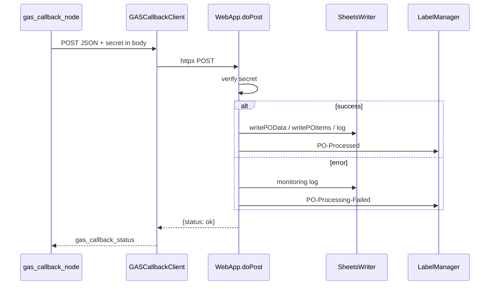

# Sending results back to Google

Runtime walkthrough **step 11**: **`gas_callback_node`**, **`GASCallbackClient`**, **`WebApp.gs`**, **`SheetsWriter.gs`**, **`Notifier.gs`**, **`LabelManager.gs`**.

Plan reference: [Curriculum — `11_GAS_CALLBACK_FLOW`](../../.cursor/plans/po_parsing_ai_agent_211da517.plan.md).

---

## 1. `src/po_parser/nodes/gas_callback.py`

**Success vs error:**

- **`success`** when **`normalized_po`** and **`validation`** exist and **`validation.status != EXTRACTION_FAILED`**.
- Otherwise **`status` = `"error"`** in the JSON payload.

**Payload** (before client adds secret):

| Key | Content |
|-----|---------|
| `message_id` | Gmail message id |
| `status` | `"success"` or `"error"` |
| `po_data` | `normalized_po.model_dump()` or `{}` |
| `items` | list of dicts (sku, description, quantity, unit_price, total_price, destination) |
| `validation` | `{status: val.status.value, issues: val.issues}` |
| `confidence` | classifier confidence or `0.0` |
| `airtable_url` | string from state or `""` |
| `processing_time_ms` | `(time.time() - processing_start_time) * 1000` as int |
| `errors` | cumulative `state["errors"]` |

**`GASCallbackClient.send_results(payload)`** runs **`asyncio.run(send_results_async(...))`** from the sync node.

**Response handling:** if JSON **`status`** is **`ok`** or **`success`** (case-insensitive) → **`gas_callback_status: "ok"`**; else **`"error"`** and append to **`errors`**.

**Plan note:** Plan said return **`gas_callback_status: "sent"`**; code uses **`"ok"`** / **`"error"`**.

---

## 2. `src/services/gas_callback/client.py`

- Copies payload, sets **`body["secret"] = webapp_secret`** (GAS **`doPost`** cannot rely on custom headers for auth).
- **`httpx.AsyncClient.post(webapp_url, json=body)`** — **up to 2 attempts**, **2s sleep** between on failure.
- Returns parsed JSON or `{status, body}` on non-JSON response.

---

## 3. `src/services/gas_callback/settings.py`

- **`GAS_WEBAPP_URL`**, **`GAS_WEBAPP_SECRET`**, **`timeout`** (default 30s).

---

## 4. `gas/WebApp.gs` — `doPost(e)`

1. Parse **`e.postData.contents`** as JSON.
2. **`payload.secret === getConfig('GAS_WEBAPP_SECRET')`** — mismatch → JSON error response.
3. **`payload.status === 'success'`**:
   - **`writePOData(payload)`**
   - **`writePOItems(payload.items, po_number from po_data)`**
   - **`writeMonitoringLog(payload, 'success')`**
   - **`sendPONotification(payload)`**
   - **`labelMessage(payload.message_id, LABEL_PROCESSED)`**
4. Else (error path): **`writeMonitoringLog(..., 'error')`**, label failed if `message_id`, **`sendErrorAlert(payload)`**.
5. Returns **`jsonResponse({ status: 'ok' })`** on normal completion.

---

## 5. `gas/SheetsWriter.gs`

**`writePOData`** — appends one row to **`TAB_PO_DATA`**:

1. PO Number  
2. Customer  
3. PO Date  
4. Ship Date  
5. Validation status  
6. Source type  
7. *(empty column)*  
8. *(empty column)*  
9. Confidence  
10. Validation status (repeated in current script)  
11. Processing timestamp (**`cairoNowString()`**)  
12. Airtable URL  

**`writePOItems`** — for each item: PO Number, SKU, Description, Quantity, Unit Price, Total Price, Destination/DC, Cairo timestamp.

**`writeMonitoringLog`** — Cairo timestamp, message_id, placeholders, status, confidence, parse status, processing_time_ms, JSON errors array, empty node column.

Column layouts are documented in **`docs/setup/09_GOOGLE_SHEETS_SETUP.md`**.

---

## 6. `gas/Notifier.gs`

- **`sendPONotification`** — HTML email to **`NOTIFICATION_RECIPIENTS`** with PO number, customer, validation status, confidence, source type, Airtable link.
- **`sendErrorAlert`** — subject includes message id, body includes errors JSON.

---

## 7. `gas/LabelManager.gs`

Applies **`PO-Processed`** or **`PO-Processing-Failed`** to the **thread** containing the message.

---

## 8. Data at this point

End of graph: **`AgentState`** should be fully populated (except fields unused on early **`END`**). **`gas_callback_status`** reflects callback outcome.

---

## Diagram

**Next step:** [12_ERROR_AND_EDGE_CASES.md](12_ERROR_AND_EDGE_CASES.md).
