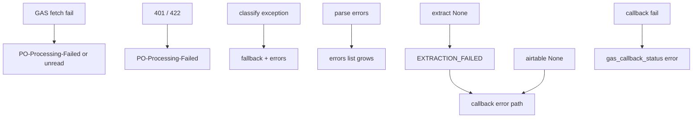

# When things go wrong

Runtime walkthrough **step 12**: failure modes by stage — where errors are caught, what lands in **`state["errors"]`**, whether the graph continues, and what the user sees (Gmail label, Sheets, email).

Plan reference: [Curriculum — `12_ERROR_AND_EDGE_CASES`](../../.cursor/plans/po_parsing_ai_agent_211da517.plan.md).  
Deeper tables: [EDGE_CASES.md](../documentations/EDGE_CASES.md), [ERROR_HANDLING.md](../documentations/ERROR_HANDLING.md).

---

## 1. GAS trigger fails (Step 01)

**Situation:** `UrlFetchApp.fetch` throws (network/DNS) or returns non-2xx.

**Where caught:** `postMessageToWebhook` checks HTTP code; throws are not shown in snippet — uncaught errors bubble to `processNewEmails` **`catch`**, which only **`Logger.log`**.

**`state["errors"]`:** Python never runs — N/A.

**Pipeline:** Stops on GAS side; message may stay unread if exception before fetch completes.

**User-visible:** On **non-2xx**, **`labelMessage(..., PO-Processing-Failed)`**. On uncaught exception in outer `try`, **no** automatic failure label from that path (check logs).

---

## 2. Auth fails (Step 02)

**Situation:** Wrong or missing **`x-webhook-secret`**.

**Where caught:** **`verify_webhook_secret`** → **401**.

**`state["errors"]`:** N/A (body not accepted).

**Pipeline:** Stops before `_run_pipeline`.

**User-visible:** GAS receives **401**, labels **PO-Processing-Failed** (see `Code.gs`).

---

## 3. Pydantic validation fails (Step 02)

**Situation:** Malformed JSON or wrong types vs **`IncomingEmail`**.

**Where caught:** FastAPI — **422**.

**Pipeline:** No graph run.

**User-visible:** GAS non-2xx → **PO-Processing-Failed** label.

---

## 4. Classification fails (Step 04)

**Situation:** OpenAI **`APIError`** or JSON parse issues inside **`classify_node`**.

**Where caught:** **`except` in `classify_node`**.

**`state["errors"]`:** Appends **`classification: {e}`**.

**Pipeline:** Still returns **`classification`** from **`_rule_fallback`** — routing may continue to **`parse`** if heuristic passes confidence threshold (fallback can return **`confidence=0.6`** when subject/attachments match rules). If fallback says not PO, graph goes to **`END`**.

**Plan delta:** Plan said “classification=None → END”; code uses **fallback**, not `None`.

---

## 5. PDF parsing fails (Step 05)

**Situation:** Corrupt file, decode error, etc.

**Where caught:** Per-attachment **`try/except` in `pdf_parser_node`**.

**`state["errors"]`:** **`pdf_parser {filename}: ...`**.

**Pipeline:** Continues; other attachments and other parsers still run.

---

## 6. OCR weak result (Step 05)

**Situation:** Vision returns very little text (plan mentioned **< 50 chars** as a flag).

**Where:** No explicit “< 50 chars” flag in Python beyond pdfplumber/PyMuPDF length checks driving OCR; OCR output is used as-is.

**Pipeline:** Continues; consolidation may be thin; extraction may yield sparse **`ExtractedPO`**.

---

## 7. Extraction fails (Step 07)

**Situation:** Invalid JSON twice, or missing API key.

**Where caught:** **`extractor_node`**.

**`state["errors"]`:** e.g. **`extractor: OPENAI_API_KEY not set`**, **`Extraction failed: invalid JSON...`**.

**Pipeline:** **`extracted_po: None`** → normalizer returns **`normalized_po: None`** → validator returns **`EXTRACTION_FAILED`** → writer skips meaningful write → callback **`status: "error"`** path in GAS.

---

## 8. Airtable write fails (Step 10)

**Situation:** API errors, auth, field mismatch.

**Where caught:** **`except` in `airtable_writer_node`**.

**`state["errors"]`:** **`airtable_writer: ...`**.

**Pipeline:** **`airtable_record_id` / `airtable_url` = `None`**; **`callback_gas` still runs** (unless graph aborted elsewhere).

**Retries:** Writer does **not** retry; Airtable client **`find_po_by_number`** logs and returns `None` on failure.

---

## 9. GAS callback fails (Step 11)

**Situation:** Web App down, timeout, invalid secret on GAS side.

**Where caught:** **`gas_callback_node`** / **`GASCallbackClient`** (two HTTP attempts).

**`state["errors"]`:** callback failure appended.

**`gas_callback_status`:** **`error`**.

**User-visible:** **GAS never runs success path** — email **not** labeled **PO-Processed** by callback (may still be **read** from step 01 success). Operations alert email if **`sendErrorAlert`** runs only when **`doPost`** treats payload as error — if Python cannot reach GAS, **no** GAS-side notification.

---

## 10. Edge cases (plan list)

**Multiple POs in one email, revised POs, body-only POs, mixed attachments** — behavior is spread across **classifier**, **parsers**, **validator** (duplicate/revised), and **extractor** prompt. See:

- [EDGE_CASES.md](../documentations/EDGE_CASES.md)
- [DATA_FLOW.md](../documentations/DATA_FLOW.md)

For each scenario, prefer those references for tables and narratives; this file focuses on **error propagation**.

---

## Per-error checklist (from plan)

For each failure, the plan asked to record:

| Question | Answer location |
|----------|-----------------|
| Where caught? | Sections 1–9 above + `try/except` in each node file |
| Added to `state["errors"]`? | Usually string messages; see node returns |
| Continue or stop? | Graph runs to **`callback_gas`** unless **`END`** after classify |
| User sees? | GAS labels (`Code.gs` / `WebApp.gs`), Sheets rows, **`Notifier` emails |

---

## Diagram — error propagation (high level)

**Curriculum complete.** Return to [README.md](README.md) or [DATA_FLOW.md](../documentations/DATA_FLOW.md) for a single-threaded overview.
