# Runtime curriculum — follow the data

This is **not** a reference manual. It is a **runtime walkthrough**: each numbered file follows the data as it moves through the system in **execution order**, so you can line it up with a debugger or logs.

**Purpose:** Understand how a PO email travels from Gmail through Python (LangGraph) to Airtable and back to Google (Sheets, labels, notifications).

**Who this is for:** Developers joining the project, reviewers, or anyone who wants a line-by-line journey through what runs when.

**How to read:** Open `01_…` through `12_…` in order. Each file picks up where the previous one ended.

**Senior / review bundle:** Short implementation FYIs and a rolling index of extra notes (`NOTE_*.md`) — [SENIOR_FYI_NOTES.md](SENIOR_FYI_NOTES.md).

**How this differs from** [`docs/documentations/`](../documentations/README.md): documentations are **reference** (look up a topic by name). This folder is a **walkthrough** (follow the payload and state forward).

**Source of truth for scope:** [`.cursor/plans/po_parsing_ai_agent_211da517.plan.md`](../../.cursor/plans/po_parsing_ai_agent_211da517.plan.md) — section **Curriculum Plan (`docs/curriculum/`)**. Where the **implementation** differs from an older plan sentence, these pages call that out.

Cross-cutting narrative (steps 1–12 in one doc): [DATA_FLOW.md](../documentations/DATA_FLOW.md).

---

## Index

| Step | File | Focus |
|------|------|--------|
| 01 | [01_GAS_TRIGGER_FLOW.md](01_GAS_TRIGGER_FLOW.md) | Gmail → GAS → JSON POST to Python |
| 02 | [02_API_INTAKE.md](02_API_INTAKE.md) | Webhook auth, Pydantic validation, background pipeline |
| 03 | [03_GRAPH_INITIALIZATION.md](03_GRAPH_INITIALIZATION.md) | `langgraph.json`, `graph`, `StateGraph`, `AgentState` |
| 04 | [04_CLASSIFICATION.md](04_CLASSIFICATION.md) | Classifier node, prompts, OpenAI, routing |
| 05 | [05_PARSING.md](05_PARSING.md) | Body / PDF / Excel parsers, OCR, helpers |
| 06 | [06_CONSOLIDATION.md](06_CONSOLIDATION.md) | Single consolidated document for the LLM |
| 07 | [07_EXTRACTION.md](07_EXTRACTION.md) | Extraction prompt, JSON → `ExtractedPO` |
| 08 | [08_NORMALIZATION.md](08_NORMALIZATION.md) | Dates, money, customer, SKUs |
| 09 | [09_VALIDATION.md](09_VALIDATION.md) | Rules, Airtable duplicate / revised detection |
| 10 | [10_AIRTABLE_OUTPUT.md](10_AIRTABLE_OUTPUT.md) | Create/update PO, line items, attachments |
| 11 | [11_GAS_CALLBACK_FLOW.md](11_GAS_CALLBACK_FLOW.md) | Callback client, `doPost`, Sheets, email, labels |
| 12 | [12_ERROR_AND_EDGE_CASES.md](12_ERROR_AND_EDGE_CASES.md) | Failures, `state["errors"]`, user-visible effects |

---

## Curriculum overview (from project plan)

```mermaid
flowchart LR
    subgraph step01 ["01: GAS Trigger"]
        Gmail[Gmail] --> GASCode[Code.gs]
    end
    subgraph step02 ["02: API Intake"]
        GASCode --> FastAPI[main.py]
    end
    subgraph step03 ["03: Graph Init"]
        FastAPI --> Graph[po_parser.py]
    end
    subgraph step04 ["04: Classification"]
        Graph --> Classify[classifier.py]
    end
    subgraph step05 ["05: Parsing"]
        Classify --> Parsers[body/pdf/excel]
    end
    subgraph step06 ["06: Consolidation"]
        Parsers --> Consolidate[consolidator.py]
    end
    subgraph step07 ["07: Extraction"]
        Consolidate --> Extract[extractor.py]
    end
    subgraph step08 ["08: Normalization"]
        Extract --> Normalize[normalizer.py]
    end
    subgraph step09 ["09: Validation"]
        Normalize --> Validate[validator.py]
    end
    subgraph step10 ["10: Airtable"]
        Validate --> AirtableW[airtable_writer.py]
    end
    subgraph step11 ["11: GAS Callback"]
        AirtableW --> Callback[gas_callback.py]
        Callback --> GASWebApp[WebApp.gs]
    end
    subgraph step12 ["12: Errors"]
        ErrorNode["Error paths"]
    end
```

**Implementation note:** Parsers run **sequentially** in code (`parse_body` → `parse_pdf` → `parse_excel`), not as parallel LangGraph branches. The diagram still matches the logical “three sources” story from the plan.
