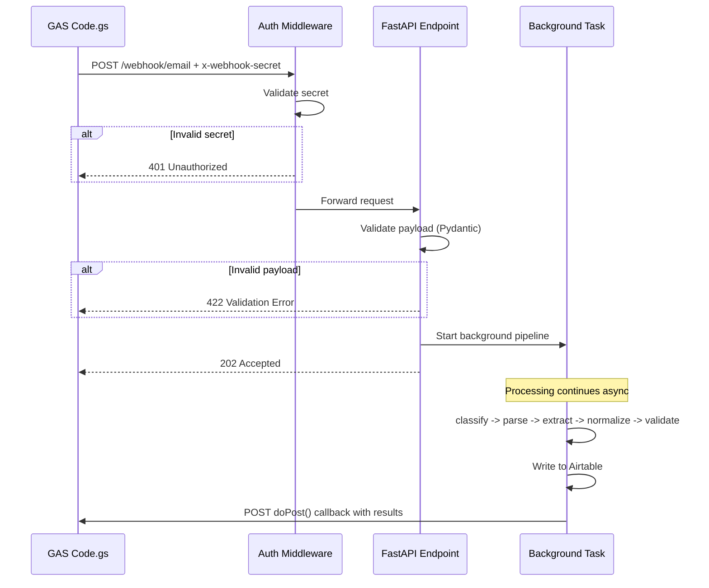

# API reference (Python)

Base URL examples: **`http://localhost:8000`** (local Docker), or **`https://your-host`** (production). This file follows the **Documentation Plan** in [`.cursor/plans/po_parsing_ai_agent_211da517.plan.md`](../../.cursor/plans/po_parsing_ai_agent_211da517.plan.md) (`API_REFERENCE.md`).

## Authentication

- **`POST /webhook/email`** requires header **`x-webhook-secret`** equal to env **`WEBHOOK_SECRET`**.
- Comparison uses **`hmac.compare_digest`** in `src/api/middleware.py` (timing-safe).
- Missing or wrong secret → **401** with FastAPI `detail` string (`Missing webhook secret` / `Invalid webhook secret`).

## Error response shape

- **401 / 422 / others:** FastAPI default `{"detail": ...}` (string or validation error list).
- **422** body example: `{"detail":[{"loc":["body","field"],"msg":"...","type":"..."}]}`

## Rate limiting and payload size

- **GAS → Python:** roughly **5-minute** trigger interval × up to **10** threads × messages → on the order of **~12 requests/hour** to the webhook under heavy load; no application-level rate limiter is required on Python for normal use.
- **Attachments:** base64 inflates size (~4/3). A **10MB** file is ~**13.3MB** base64. **UrlFetchApp** limit **50MB**. **Uvicorn** default body limits are large (~100MB class); tune if you expose the API publicly.

## `GET /health`

**Auth:** none.

**Response** (`200`): production image (`uvicorn src.api.main:app`):

```json
{
  "status": "healthy",
  "timestamp": "2026-04-05T12:00:00.000000+00:00"
}
```

**Mock profile:** `docker compose --profile mock` runs `scripts/test_e2e_mock.py`, whose `/health` also includes `"mode": "mock"`. See [TESTING_GUIDE.md](TESTING_GUIDE.md).

## `POST /webhook/email`

**Auth:** header `x-webhook-secret` must equal `WEBHOOK_SECRET` (constant-time compare via `hmac.compare_digest`). Missing or wrong secret → **401** with detail `Missing webhook secret` or `Invalid webhook secret`.

**Body:** JSON validated as `IncomingEmail` (Pydantic). Invalid shape → **422**.

**Success:** **202** `application/json`:

```json
{
  "status": "accepted",
  "message_id": "<gmail message id>"
}
```

The LangGraph pipeline runs in a **BackgroundTasks** worker after the response is sent (avoids GAS `UrlFetchApp` timeouts on long runs).

**Note:** The mock server may accept the same path with a stubbed pipeline; use production profile for real OpenAI/Airtable behavior.

### Example `curl` (plan)

```bash
curl -X POST http://localhost:8000/webhook/email \
  -H "x-webhook-secret: your_secret" \
  -H "Content-Type: application/json" \
  -d "{\"subject\":\"PO 12345\",\"body\":\"...\",\"sender\":\"buyer@company.com\",\"timestamp\":\"2026-04-05T10:30:00Z\",\"message_id\":\"abc123\",\"attachments\":[]}"
```

## Related code

- `src/api/main.py` — routes and `_run_pipeline`.
- `src/api/middleware.py` — `verify_webhook_secret`.

## Diagram from project plan

Source: [`.cursor/plans/po_parsing_ai_agent_211da517.plan.md`](../../.cursor/plans/po_parsing_ai_agent_211da517.plan.md) (`API_REFERENCE.md` — API request/response flow).


