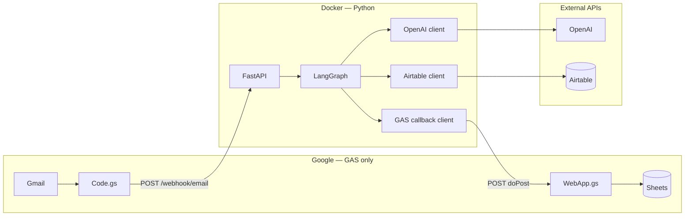
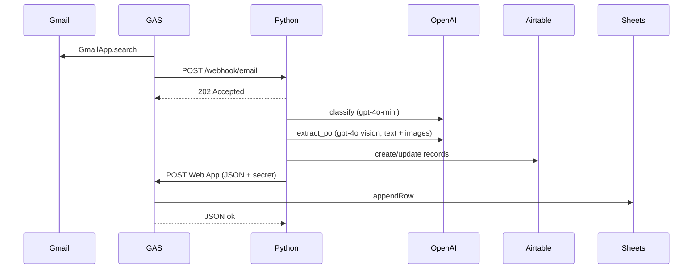
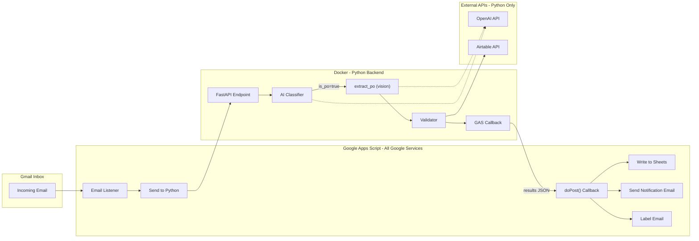
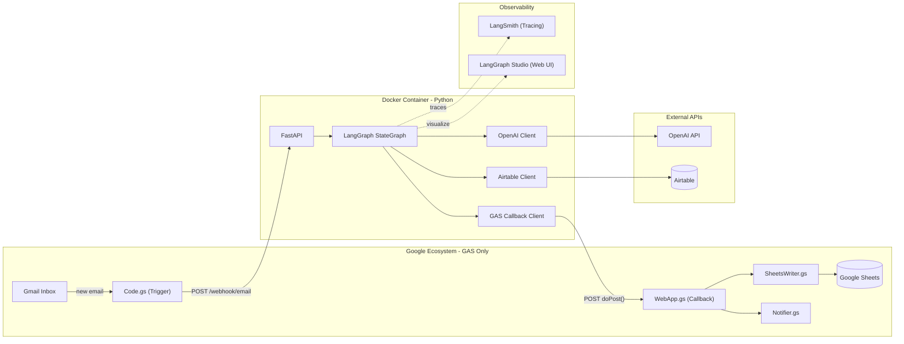
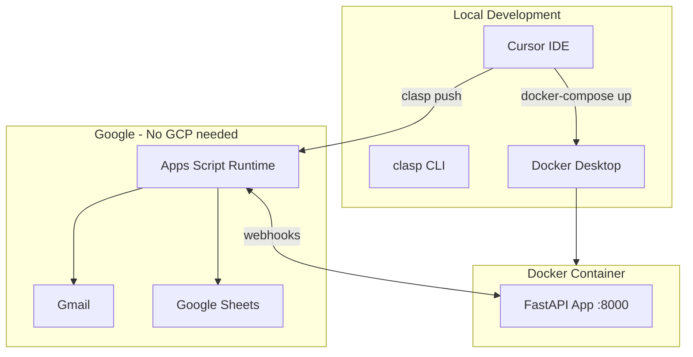

# Architecture

## Components

### GAS email listener and Google sidecar (six `*.gs` files)

All Google service interactions live here — Gmail read/search, outbound webhook to Python, inbound Web App callback, Sheets writes, notification email, thread labels. Developed locally with **clasp**, deployed with **`clasp push`**. No GCP project is required for this architecture.

| File | Role |
|------|------|
| `Config.gs` | Script Properties via `getConfig()`, Gmail search query, tab names, label names |
| `Code.gs` | `processNewEmails()` — search, build JSON, `UrlFetchApp` to Python, `markRead` on 2xx |
| `WebApp.gs` | `doPost(e)` — validate `payload.secret`, dispatch Sheets/notifier/labels |
| `SheetsWriter.gs` | Append rows to **PO Data**, **PO Items**, **Monitoring Logs** |
| `Notifier.gs` | `GmailApp.sendEmail` HTML notifications |
| `LabelManager.gs` | `PO-Processed` / `PO-Processing-Failed` |

### FastAPI API layer (`src/api/`)

Receives **`POST /webhook/email`**, validates auth via **`x-webhook-secret`**, validates body with **Pydantic**, starts work in a **background task**, returns **202** immediately so GAS `UrlFetchApp` does not time out. **`GET /health`** returns JSON with `status` and UTC `timestamp`.

### LangGraph (`src/po_parser/`)

- **`graph_builder.py`** — builds `StateGraph(AgentState)` with **5 nodes**.
- **`po_parser.py`** — `graph = build_graph()` exported for Studio (`langgraph.json`).

The graph has **5** named nodes: `classify`, `extract_po`, `validate`, `write_airtable`, `callback_gas`, plus **`route_after_classify`** for conditional routing to `END` vs `extract_po`.

### Shared services (`src/services/`)

Each area uses **`client.py`** + **`settings.py`** with **`pydantic-settings`** (env-driven).

| Service | Role |
|---------|------|
| `openai/` | `chat_completion` (JSON mode for classify and multi-modal extraction), `vision_completion` (legacy, kept for image tagging agent); **RateLimitError** retry once; client wrapped with **`langsmith.wrappers.wrap_openai`** when `LANGCHAIN_TRACING_V2=true` |
| `airtable/` | Create/update PO, line items, `find_po_by_number`, optional **`upload_file_to_field`**; at init, **`_resolve_table_ids()`** resolves table/view IDs from env or API |
| `gas_callback/` | **`send_results_async`** / **`send_results`** — `httpx.AsyncClient`; **`secret`** in JSON body (GAS `doPost` contract) |

### Observability

- **LangSmith** — traces LLM and graph activity when `LANGCHAIN_TRACING_V2` and related env vars are set.
- **LangGraph Studio** — discovers the graph via root **`langgraph.json`** → `./src/po_parser/po_parser.py:graph`.

## Technology choices (rationale)

| Choice | Why |
|--------|-----|
| **Python 3.11** | Mature stack for AI, PDF rendering, Excel parsing, and HTTP services. |
| **FastAPI** | Async-capable app, Pydantic validation, OpenAPI, **BackgroundTasks** for long graph runs. |
| **LangGraph** | Typed shared state, conditional edges, Studio visualization, LangSmith integration. |
| **GAS (not Google APIs from Python)** | No GCP project or service accounts for Gmail/Sheets; script owner OAuth; simpler ops. |
| **GPT-4o (vision)** | Multi-modal extraction — reads PDF images + text + spreadsheet data in a single call. Handles scanned PDFs natively without a separate OCR pipeline. |
| **GPT-4o-mini** | Cost-effective classification gate with JSON mode. |
| **PyMuPDF** | Fast PDF-to-image rendering (150 DPI PNGs) for the vision model. |
| **openpyxl / pandas** | Precise spreadsheet cell reading — exact values without OCR ambiguity. |
| **Docker** | Reproducible runtime and dependencies for local and deployment. |

Cost ballpark (indicative, check current OpenAI pricing): **~$0.05–0.30 per PO** depending on page count (GPT-4o vision). Classification adds ~$0.001 (gpt-4o-mini).

## Scalability and limits

- **FastAPI** returns **202** quickly; heavy work runs in a background worker (sync `graph.invoke`).
- **GAS** ~**6 minute** execution cap; **max 10 threads** per `processNewEmails` run mitigates timeouts.
- **Airtable** REST guideline ~**5 requests/second** per base — writer uses sequential calls.
- **GPT-4o vision** — token costs scale with page count. Large PDFs (10+ pages) may approach context limits.
- **Future hosting:** plan mentions AWS/GCP or similar for a stable public URL instead of ngrok.

## Security

- **GAS → Python:** `WEBHOOK_SECRET` in header `x-webhook-secret`.
- **Python → GAS:** `GAS_WEBAPP_SECRET` in JSON **`secret`** (GAS `doPost` cannot rely on custom headers).
- Secrets in `.env` (gitignored) and GAS Script Properties — not in code.

## Deployment

- **Docker** Compose profiles: `mock` (`scripts/test_e2e_mock.py`) vs `production` (`uvicorn src.api.main:app`). Same host port **8000** — run one profile at a time.
- GAS calls a **public** Python URL (ngrok in dev, real host in prod).

### End-to-end component flow

### Full system architecture (component view)

### Deployment architecture

