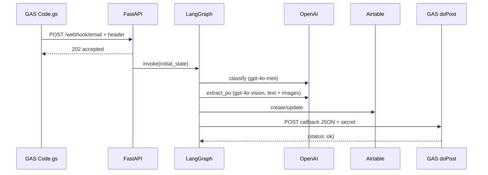
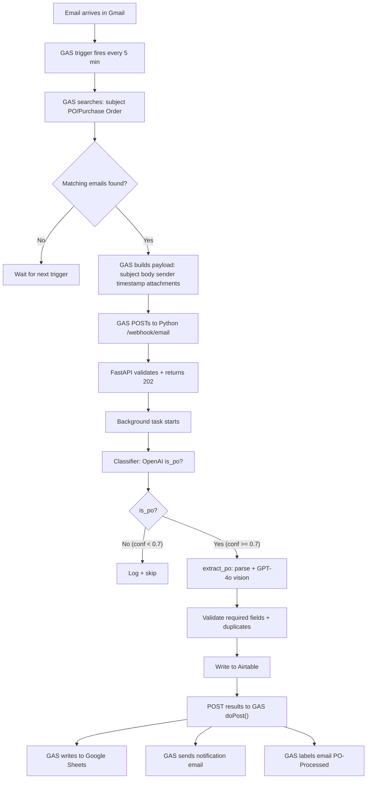
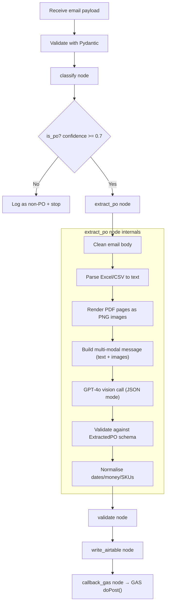
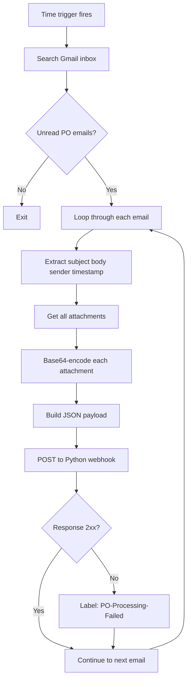
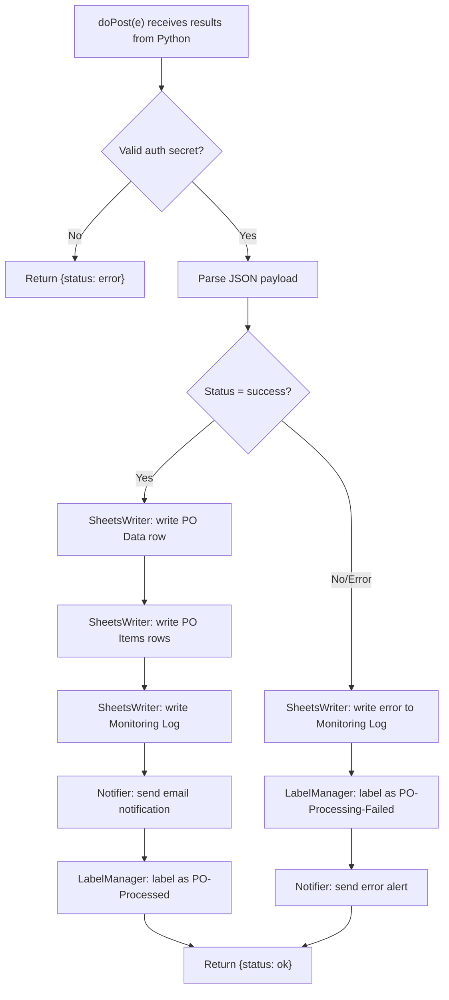
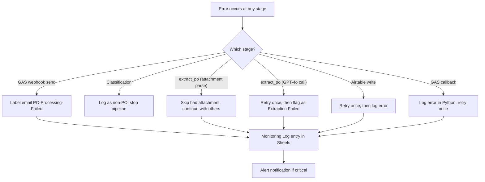

# Data Flow

## Numbered journey (5-node pipeline)

1. Email arrives in the Gmail inbox.
2. GAS time trigger (e.g. every **5 minutes**) runs `processNewEmails` and searches:
   `subject:(PO OR "Purchase Order") is:unread -label:PO-Processed -label:PO-Processing-Failed -subject:"PO Processed:" -subject:"PO Processing FAILED:" -from:me`
3. GAS builds JSON: `subject`, `body`, `sender`, `timestamp`, `message_id`, `attachments[]` with `filename`, `content_type`, `data_base64`.
4. GAS **`POST`**s to Python **`/webhook/email`** with header **`x-webhook-secret`**.
5. FastAPI validates auth + **Pydantic** body, returns **202**, enqueues **background** pipeline run.
6. **Classifier** calls OpenAI with **`classification_model`** (gpt-4o-mini); result `{is_po, confidence, type}`.
7. **`extract_po`** — single node that:
   - Cleans email body (strip HTML, normalise whitespace)
   - Parses Excel/CSV attachments to text (openpyxl/pandas)
   - Renders PDF pages as PNG images (PyMuPDF at 150 DPI)
   - Sends **one multi-modal GPT-4o call** with text + images in JSON mode
   - Validates response against `ExtractedPO` Pydantic model (retry once on parse failure)
   - Runs deterministic normalisation (dates, money, SKU, customer)
8. **Validator** checks required fields, Airtable duplicate/revision by PO number.
9. **Airtable writer** creates/updates **Customer POs** and **PO Items** (and optional attachment uploads).
10. **GAS callback** **`POST`**s to Web App `doPost`; GAS writes **Sheets**, sends **notification**, applies **labels**.

## Processing time (order-of-magnitude)

Rough per-PO wall time when APIs are healthy: GAS trigger ~**2s**, classification ~**1s**, `extract_po` (PDF rendering + GPT-4o vision) **5–15s** (depends on page count), validation ~**1s** (Airtable lookup), Airtable write ~**1s**, GAS callback ~**2s** → often **~12–25s** total, excluding queueing.

## Error flow (summary)

Failures at each stage are described in [ERROR_HANDLING.md](ERROR_HANDLING.md). Typical patterns: GAS webhook failure → **PO-Processing-Failed** label; bad attachment → skip and continue; extraction failure → validation/callback **error** path; callback failure → logged in Python `errors` and `gas_callback_status`.

## JSON examples at each stage

### GAS → Python (`IncomingEmail`)

```json
{
  "subject": "PO 00011830728 - Greenbrier",
  "body": "Please find attached PO...",
  "sender": "buyer@retailer.com",
  "timestamp": "2026-04-05T14:30:00.000Z",
  "message_id": "18abc123def",
  "attachments": [
    {
      "filename": "PO_00011830728.pdf",
      "content_type": "application/pdf",
      "data_base64": "JVBERi0x..."
    }
  ]
}
```

### Classification result (`ClassificationResult`)

```json
{
  "is_po": true,
  "confidence": 0.92,
  "type": "purchase_order"
}
```

### Extraction result (`ExtractedPO`) — illustrative

```json
{
  "po_number": "00011830728",
  "customer": "Greenbrier International",
  "po_date": "2026-03-15",
  "ship_date": "2026-04-01",
  "cancel_date": null,
  "items": [
    {
      "sku": "12345678",
      "description": "Widget A",
      "quantity": 24,
      "unit_price": 10.5,
      "total_price": 252.0,
      "destination": "DC East"
    }
  ],
  "destinations": [{ "dc_name": "DC East", "address": null }],
  "total_amount": 252.0,
  "currency": "USD",
  "payment_terms": "Net 30",
  "ship_to": null,
  "bill_to": null,
  "source_type": "mixed",
  "raw_confidence": 0.88
}
```

### Python → GAS callback (contract)

The client merges **`secret`** (`GAS_WEBAPP_SECRET`) into the JSON body:

```json
{
  "secret": "<GAS_WEBAPP_SECRET>",
  "message_id": "18abc123def",
  "status": "success",
  "po_data": { },
  "items": [],
  "validation": { "status": "Needs Review", "issues": [] },
  "confidence": 0.91,
  "airtable_url": "https://airtable.com/appXXXX/tblYYYY/recZZZZ",
  "processing_time_ms": 4500,
  "errors": []
}
```

---

## 1. GAS → Python (`POST /webhook/email`)

**Header:** `x-webhook-secret` = `WEBHOOK_SECRET` (must match Python `.env`).

**Body:** JSON matching `IncomingEmail`:

| Field | Type | Notes |
|-------|------|--------|
| `subject` | string | |
| `body` | string | Plain text |
| `sender` | string | |
| `timestamp` | string | ISO from `message.getDate().toISOString()` |
| `message_id` | string | Gmail message id |
| `attachments` | array | Each: `filename`, `content_type`, `data_base64` |

**Response:** `202` with `{"status":"accepted","message_id":"..."}` — work continues in a FastAPI **background task**.

## 2. LangGraph state (5-node pipeline)

1. **classify** — OpenAI JSON → `ClassificationResult`.
2. **extract_po** — parses all content (body + spreadsheets + PDF images), sends one multi-modal GPT-4o call, normalises result → `extracted_po` + `normalized_po`.
3. **validate** — rules + optional Airtable duplicate by PO number.
4. **write_airtable** — create/update PO row, line items, optional attachments field.
5. **callback_gas** — POST to GAS Web App with `secret` in JSON body.

## 3. Inside `extract_po` — detailed flow

### Step 1: Clean email body (no LLM)
- If body contains HTML tags, strip `<script>`, `<style>`, and all tags
- Normalise whitespace, collapse blank lines
- Result: clean plain text

### Step 2: Parse spreadsheet attachments (no LLM)
- Find `.xlsx`, `.xls`, `.xlsm`, `.csv` attachments by extension or MIME type
- Excel: openpyxl reads cells, normalise headers (`"P.O. #"` → `"po_number"`, `"Qty"` → `"quantity"`)
- CSV: pandas `read_csv`, same header normalisation
- Result: JSON text block

### Step 3: Render PDF pages as images (no LLM)
- Find PDF attachments by extension or MIME type
- Decode base64 → temp file → PyMuPDF renders each page at 150 DPI as PNG
- Base64-encode each PNG → `image_url` content block
- Clean up temp files

### Step 4: Build multi-modal LLM message
- System message: `EXTRACTION_SYSTEM_PROMPT` with `ExtractedPO` JSON schema
- User message: content array mixing text and images:

```
[
  {"type": "text",      "text": "EMAIL BODY:\n<cleaned body>"},
  {"type": "text",      "text": "SPREADSHEET DATA:\n<JSON rows>"},
  {"type": "image_url", "image_url": {"url": "data:image/png;base64,<page1>"}},
  {"type": "image_url", "image_url": {"url": "data:image/png;base64,<page2>"}},
  ...
]
```

### Step 5: Call GPT-4o (single LLM call)
- Model: `extraction_vision_model` (default `gpt-4o`)
- `response_format = {"type": "json_object"}`
- Parse response into `ExtractedPO` Pydantic model
- If validation fails, retry once with stricter prompt suffix

### Step 6: Deterministic normalisation (no LLM)
- Dates: try formats (`%Y-%m-%d`, `%m/%d/%Y`, `%d-%b-%y`, etc.) → ISO `YYYY-MM-DD`
- Money: strip `$`, commas → float
- SKU: uppercase, trim
- Customer: title case, strip suffixes ("Inc.", "LLC", "Corp.")
- Currency: default to "USD"

### How GPT-4o processes mixed input

GPT-4o sees all sources at once in its context window:

| Source | Role |
|--------|------|
| Email body (text) | Context — who sent the PO, special instructions, payment terms |
| PDF pages (images) | Primary PO document — tables, headers, formatting, handwritten notes |
| Excel/CSV (text) | Precise cell values — exact quantities, SKUs, prices |

When data overlaps, the model cross-validates. When data exists in only one source, it uses whatever is available.

## 4. Python → GAS (callback)

`GASCallbackClient` sends JSON (field **`secret`** = `GAS_WEBAPP_SECRET`). Shape:

| Field | Notes |
|-------|--------|
| `message_id` | From original email |
| `status` | `"success"` if normalized PO exists and validation is not `Extraction Failed`; else `"error"` |
| `po_data` | `ExtractedPO` as dict (or empty) |
| `items` | Line items (sku, qty, …) |
| `validation` | `status` string + `issues` list |
| `confidence` | Classifier confidence |
| `airtable_url` | Link when known |
| `processing_time_ms` | Wall time from `processing_start_time` |
| `errors` | Accumulated pipeline strings |

GAS `doPost` validates `payload.secret`, then writes Sheets, notifies, labels.



## 5. Airtable field mapping (writer)

Customer POs table (names are **case-sensitive** in Airtable):

- `PO Number`, `Customer`, `PO Date`, `Ship Date`, `Status` (default **Needs Review**), `Source Type`, `Email Subject`, `Sender`, `Raw Extract JSON`, `Validation Status`, `Confidence`, `Processing Timestamp` (UTC ISO), `Notes`.

PO Items: `SKU`, `Description`, `Quantity`, `Unit Price`, `Total Price`, `Destination / DC`, plus linked field **`Linked PO`**.

## 6. Timezones

- **Airtable `Processing Timestamp`:** UTC ISO 8601 from Python.
- **Google Sheets monitoring:** GAS uses `Africa/Cairo` in `appsscript.json` for display-oriented logs.
- **PO dates** (`po_date`, `ship_date`, …): date-only strings from the document, no timezone semantics.

## Diagrams

### End-to-end data flow



### Python processing subflow



### GAS email trigger subflow



### GAS callback subflow (doPost)



### Error flow


