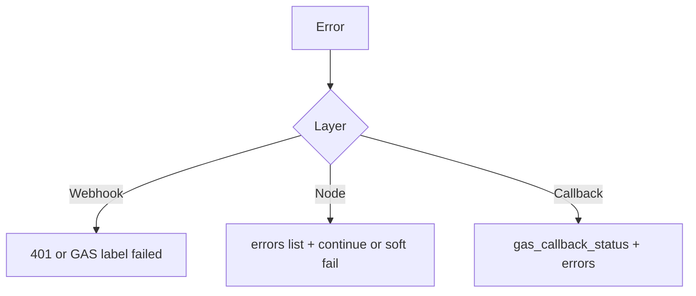
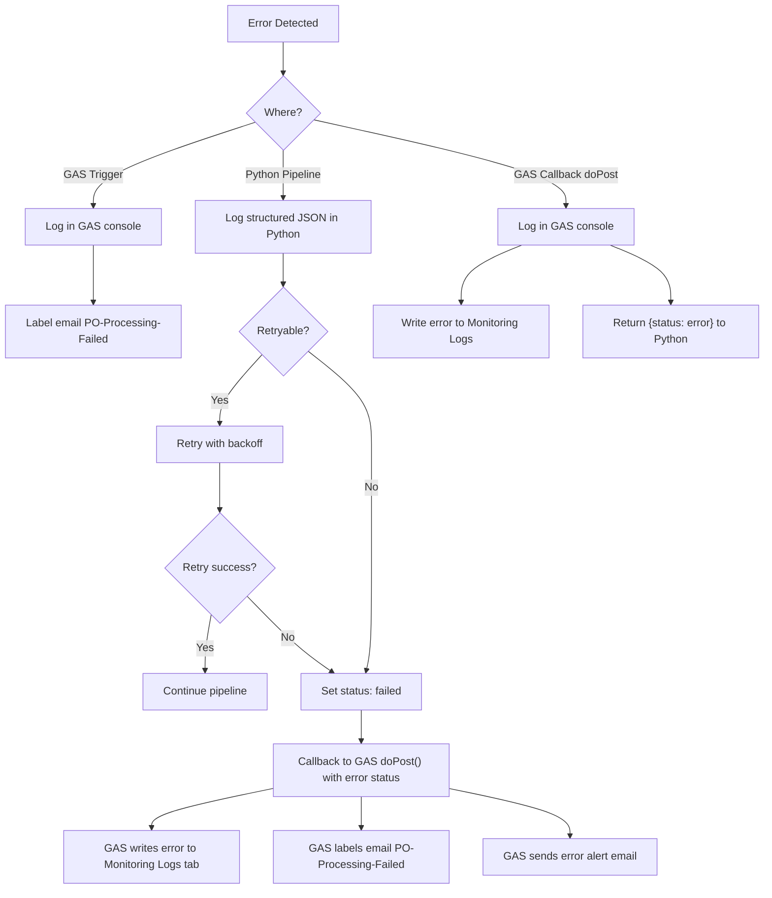

# Error handling

This file follows the **Documentation Plan** in [`.cursor/plans/po_parsing_ai_agent_211da517.plan.md`](../../.cursor/plans/po_parsing_ai_agent_211da517.plan.md) (`ERROR_HANDLING.md`).

## Categories (with examples)

| Category | Examples |
|----------|----------|
| **Network** | GAS `UrlFetchApp.fetch` fails (Python down); GAS callback POST fails (Web App down); **`httpx`** timeout / connection errors |
| **Authentication** | Invalid **`x-webhook-secret`** → **401**; invalid **OpenAI** key (`AuthenticationError`); invalid **Airtable** token (**403**); invalid **`GAS_WEBAPP_SECRET`** rejected in **`doPost`** |
| **Parsing** | Corrupt PDF (`pdfplumber` errors), **password-protected** PDF, bad Excel (`openpyxl` / `pandas`), **0-byte** file, unsupported type |
| **Extraction** | Non-JSON LLM output, JSON missing fields vs `ExtractedPO`, hallucinated PO numbers, LLM returning `null` for `currency` (handled by `@field_validator` coercing to `"USD"`) |
| **Validation** | Duplicate PO#, missing PO#, unreasonable quantities (plan: negative or **> 1M** — code focuses on **≤ 0** for set quantities) |
| **Output** | Airtable **429** rate limit (plan: retry once — **current `AirtableClient` does not implement 429 retry**; add if needed), wrong field name, **`SpreadsheetApp`** write error |

## Strategy (plan)

Nodes should **try/except**, **log**, append to **`state["errors"]`**, and either **continue** (non-fatal, e.g. one bad attachment) or return a state that leads to **validation/callback error** (fatal extraction).

## Per-layer behavior

**FastAPI**

- Webhook secret dependency raises **401** before the body is accepted for processing (header phase).

**LangGraph nodes**

- Many nodes **append** to `state["errors"]` and continue (e.g. one bad attachment).
- Critical gaps (no PO after extract) flow to **validation** / **callback** with `status: "error"` when extraction is unusable.

**OpenAI client**

- **One retry** after 2 seconds on `RateLimitError` for chat and vision.

**GAS callback client**

- **Two attempts** with 2s delay on transient failures; returns `{"status":"error", ...}` on exhaustion.

**GAS**

- Webhook non-2xx: log, apply **PO-Processing-Failed**, do not mark read.
- Callback error path: monitoring log, optional failed label, `sendErrorAlert`.

## Logging

- **Python:** `logging.getLogger(__name__)`, level from **`LOG_LEVEL`**. The plan suggests a structured line shape `{timestamp} | {level} | {node} | {message} | {context}` — the codebase uses conventional messages; enrich if you need uniform parsing.
- **GAS:** `Logger.log` in `processNewEmails` / `doPost` catch blocks.

## Retry logic (plan vs code)

| Layer | Plan | Implementation |
|-------|------|------------------|
| OpenAI | Retry once on rate limit (**2s**) | **Yes** in `OpenAIClient` |
| Airtable | Retry once on **429** | **Not implemented** in `AirtableClient` — add if you hit limits |
| GAS callback | Retry once on failure (**2s**) | **Yes** in `GASCallbackClient` |
| Auth errors | No retry | No retry |

## Gmail labels

- **PO-Processed:** success path in `doPost` after Sheets + notify.
- **PO-Processing-Failed:** webhook failure in `Code.gs`, or error branch in `doPost`.

## Monitoring

- **Monitoring Logs** tab (see [GAS_REFERENCE.md](GAS_REFERENCE.md)): plan columns include **Timestamp**, **Email ID**, **Subject**, **Status** (Success/Failed/Error), **Error Message**, **Processing Time (ms)** — align with [09_GOOGLE_SHEETS_SETUP.md](../setup/09_GOOGLE_SHEETS_SETUP.md) and `SheetsWriter.gs`.
- Every PO attempt should get a **log row** on the GAS side when the callback runs.

## Alert escalation

- **`Notifier.gs`** sends **error alert** email to **`NOTIFICATION_RECIPIENTS`** on failure paths (subject, error detail, timestamp in HTML body).

## Resolved bugs (reference)

- **Validator `AttributeError`:** module-level variable `_airtable` and function `_airtable()` shared the same name, causing `'function' object has no attribute 'enabled'`. Fixed by renaming to `_airtable_client` / `_get_airtable()` in `validator.py`.
- **Pydantic `currency` crash:** LLM sometimes returned `null` for `currency`, failing `str` validation. Fixed by making the field `Optional[str]` with a `@field_validator` in `po.py` that coerces `None`/empty to `"USD"`.
- **Airtable URL 404:** URLs were built as `/{base_id}/{record_id}` (missing table ID segment). Fixed by resolving table IDs at client init via `_resolve_table_ids()` and using `/{base_id}/{table_id}/{record_id}`.
- **GAS self-processing loop:** notification emails with subjects like "PO Processed: ..." matched the search query. Fixed by adding `-subject:"PO Processed:" -subject:"PO Processing FAILED:" -from:me` to `SEARCH_QUERY` in `Config.gs`.

## Operational notes

- LangSmith traces help debug LLM and graph steps when enabled.
- For Airtable **field name** mismatches, the API returns errors caught in `airtable_writer` and appended to `errors`.

## Diagram from project plan

Source: [`.cursor/plans/po_parsing_ai_agent_211da517.plan.md`](../../.cursor/plans/po_parsing_ai_agent_211da517.plan.md) (`ERROR_HANDLING.md` — error propagation).

