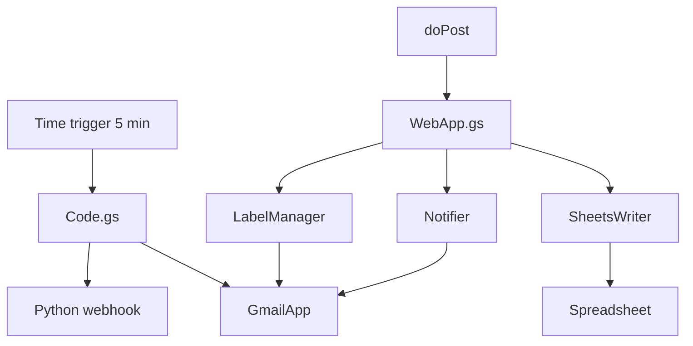
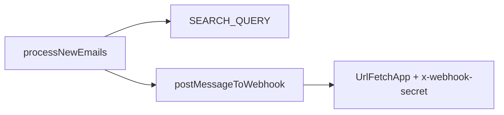
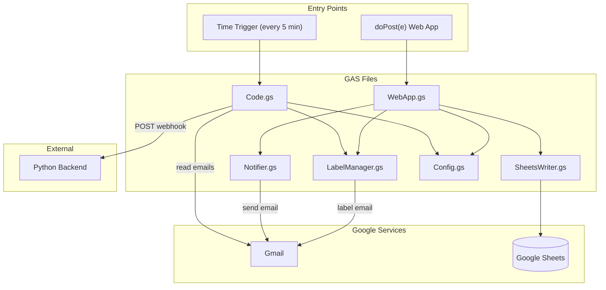
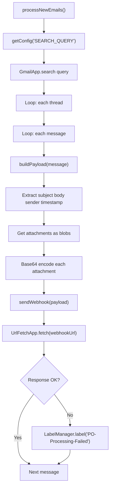
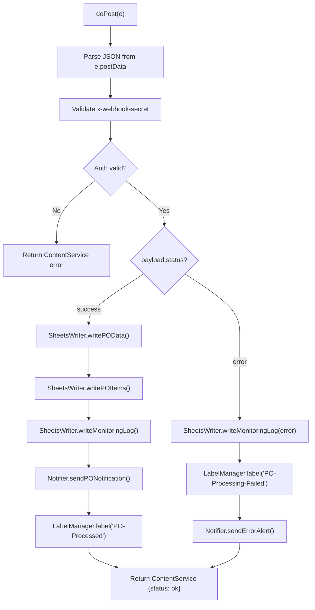
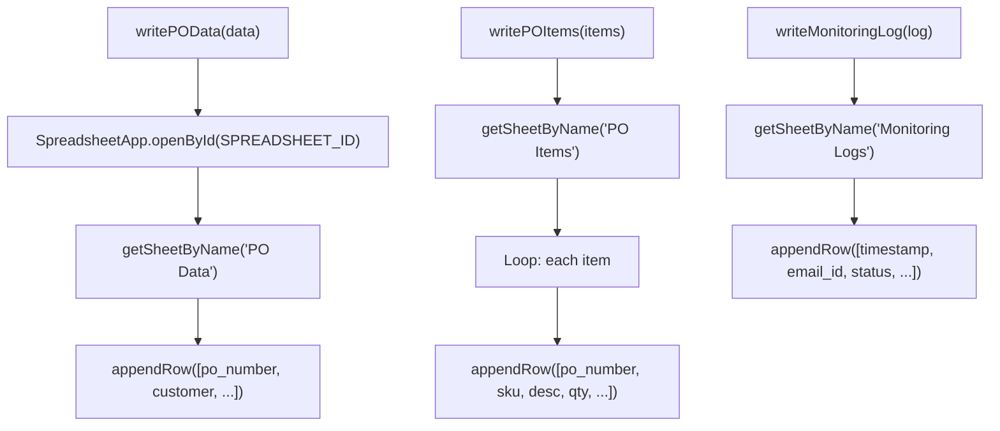

# Google Apps Script reference

All Google APIs (Gmail, Sheets, send mail) run in **GAS** under `gas/`. Python never calls Google APIs. This file follows the **Documentation Plan** in [`.cursor/plans/po_parsing_ai_agent_211da517.plan.md`](../../.cursor/plans/po_parsing_ai_agent_211da517.plan.md) (`GAS_REFERENCE.md` / Phase 1): functions, properties, limits, scopes, and timezones.

**Overview:** No GCP project, no service accounts, no Google API keys in Python. GAS uses **GmailApp**, **SpreadsheetApp**, **UrlFetchApp**, etc., as the **script owner**.

## `appsscript.json`

- **timeZone:** `Africa/Cairo` (display-oriented timestamps in Sheets).
- **oauthScopes** (7 in repo manifest; plan text sometimes says “6” — count the entries below):
  - **`script.scriptapp`** — create/delete **time-driven triggers** (`installFiveMinuteTrigger`).
  - **`gmail.readonly`** — search/read mail.
  - **`gmail.modify`** — mark messages read, modify threads.
  - **`gmail.labels`** — apply user labels.
  - **`gmail.send`** — send notification / alert mail.
  - **`script.external_request`** — `UrlFetchApp` to Python webhook and any external URL.
  - **`spreadsheets`** — open spreadsheet by id, append rows.

**`webapp` block:** execute as user deploying, anonymous access for `doPost` callback (see Web App deployment).

After changing scopes: `clasp push` and **re-authorize** the script.

## Script Properties

| Key | Purpose |
|-----|---------|
| `WEBHOOK_URL` | Full URL to Python `POST .../webhook/email` |
| `WEBHOOK_SECRET` | Sent as header `x-webhook-secret`; must match Python `WEBHOOK_SECRET` |
| `GAS_WEBAPP_SECRET` | Python puts the same value in JSON field `secret` on callback |
| `SPREADSHEET_ID` | Google Sheet ID |
| `NOTIFICATION_RECIPIENTS` | Comma-separated emails for HTML notifications |

## File map

| File | Role |
|------|------|
| `Config.gs` | `getConfig(key)`, `SEARCH_QUERY`, label/tab constants |
| `Code.gs` | `processNewEmails()`, `postMessageToWebhook()`, `installFiveMinuteTrigger()` |
| `WebApp.gs` | `doPost(e)` — parse JSON, validate `payload.secret`, dispatch |
| `SheetsWriter.gs` | `writePOData`, `writePOItems`, `writeMonitoringLog` |
| `Notifier.gs` | `sendPONotification`, `sendErrorAlert` |
| `LabelManager.gs` | `labelMessage` → `PO-Processed` / `PO-Processing-Failed` |

## Function reference (by file)

### `Config.gs`

- **`getConfig(key)`** — reads **Script Property** `key`; throws if missing (fail fast).
- **Constants:** `SEARCH_QUERY` (Gmail search string), `LABEL_PROCESSED` / `LABEL_FAILED`, `TAB_PO_DATA` / `TAB_PO_ITEMS` / `TAB_MONITORING` (sheet names — must match [09_GOOGLE_SHEETS_SETUP.md](../setup/09_GOOGLE_SHEETS_SETUP.md)).

### `LabelManager.gs`

- **`getOrCreateLabel(labelName)`** — returns existing `GmailLabel` or creates it.
- **`labelMessage(messageId, labelName)`** — loads message by id, gets **thread**, applies label to **thread** (labels are thread-level in Gmail).

### `Code.gs`

- **`processNewEmails()`** — loads `WEBHOOK_URL` / `WEBHOOK_SECRET`, `GmailApp.search(SEARCH_QUERY, 0, 10)`, loops threads/messages, skips read messages, calls posting helper, **6-minute** quota aware.
- **`postMessageToWebhook` / payload build** — plain body, attachments base64, `UrlFetchApp.fetch` with **`x-webhook-secret`** header; on non-2xx labels **PO-Processing-Failed**; on 2xx **`markRead()`**.
- **`installFiveMinuteTrigger()`** — removes old `processNewEmails` triggers, adds **every 5 minutes** trigger (requires `script.scriptapp` scope).

### `WebApp.gs`

- **`doPost(e)`** — `JSON.parse(e.postData.contents)`, compare **`payload.secret`** to **`GAS_WEBAPP_SECRET`**, branch on **`payload.status`** (`success` vs error), call Sheets + Notifier + LabelManager; returns JSON via **`ContentService.createTextOutput(...).setMimeType(ContentService.MimeType.JSON)`**.

### `SheetsWriter.gs`

- **`writePOData(payload)`** — opens `SPREADSHEET_ID`, appends **PO Data** row (see `appendRow` order in source; headers in setup doc). Uses **`cairoNowString()`** for timestamps.
- **`writePOItems(items, poNumber)`** — appends **PO Items** rows in a loop.
- **`writeMonitoringLog(payload, status)`** — appends **Monitoring Logs** row (timestamp Cairo, message id, status, confidence, processing time, errors JSON, etc.).

### `Notifier.gs`

- **`parseRecipients()`** — splits `NOTIFICATION_RECIPIENTS` on commas.
- **`sendPONotification(payload)`** / **`sendErrorAlert(payload)`** — **`GmailApp.sendEmail(recipients, subject, "", { htmlBody: ... })`** with PO fields, validation status, Airtable link, etc.

## `processNewEmails()` (`Code.gs`)

1. Read `WEBHOOK_URL`, `WEBHOOK_SECRET`.
2. `GmailApp.search(SEARCH_QUERY, 0, 10)` — max **10** threads per run.
3. For each thread/message: if unread, build JSON payload + base64 attachments, `UrlFetchApp.fetch` with `x-webhook-secret`.
4. On HTTP **2xx**, `message.markRead()`. On failure, log and apply **PO-Processing-Failed**.

**Search query** (constant in `Config.gs`):  
`subject:(PO OR "Purchase Order") is:unread -label:PO-Processed -label:PO-Processing-Failed -subject:"PO Processed:" -subject:"PO Processing FAILED:" -from:me`

The `-subject:` and `-from:me` exclusions prevent GAS from re-processing its own notification emails (whose subjects match the PO search).

## `doPost(e)` (`WebApp.gs`)

1. Parse `e.postData.contents` as JSON.
2. Compare `payload.secret` to `GAS_WEBAPP_SECRET` (not HTTP headers — `doPost` cannot rely on custom headers for GAS Web Apps the way Python clients send them).
3. `payload.status === 'success'`: write PO + items + monitoring log, notify, label **PO-Processed**.
4. Else: monitoring log (error path), label failed if `message_id` present, `sendErrorAlert`.
5. Return JSON `{"status":"ok"}` or error JSON via `ContentService`.

## Sheets columns

Authoritative header row: [09_GOOGLE_SHEETS_SETUP.md](../setup/09_GOOGLE_SHEETS_SETUP.md). `SheetsWriter.gs` `appendRow` order must stay aligned with those headers. **Note:** the current `writePOData` implementation leaves the **Email Subject** and **Sender** columns (sheet columns G–H) as empty strings; use Airtable or extend GAS if you need them in Sheets. Timestamps use `cairoNowString()` for human-readable logs.

## Web App deployment

- Deploy → New deployment → **Web app**, execute as **Me**, access **Anyone** (anonymous) per `appsscript.json` `webapp` block.
- URL shape: `https://script.google.com/macros/s/.../exec`
- **Important:** after `clasp push`, create a **new deployment version** if the Web App must pick up `doPost` changes.

## Limitations

- ~**6 minutes** per GAS execution.
- **`UrlFetchApp` ~50MB** payload limit (plan figure).
- **Gmail quotas:** consumer vs Workspace differ (plan: ~**100/day** send on free vs **~1500/day** Workspace — verify current Google quotas).
- **`doPost`** cannot depend on custom HTTP headers for Python→GAS auth — use **JSON `secret`**.
- Triggers: need `script.scriptapp` scope; run `installFiveMinuteTrigger()` once from the editor after auth.

## Timezone handling (plan)

- **`appsscript.json`:** **`Africa/Cairo`** for script timezone context.
- **Sheets:** `Utilities.formatDate(new Date(), "Africa/Cairo", "yyyy-MM-dd HH:mm:ss")` for human-readable log timestamps.
- **Python / callback:** business **`po_date` / `ship_date`** strings are **not** re-timezoned by GAS; **processing** timestamps in Airtable are **UTC** ISO from Python.

## clasp

Local edit under `gas/`, then `clasp push`. Open the cloud project with **`clasp open-script`** (clasp 3.x). See [07_GAS_CLASP_SETUP.md](../setup/07_GAS_CLASP_SETUP.md).

## Diagrams from project plan

Source: [`.cursor/plans/po_parsing_ai_agent_211da517.plan.md`](../../.cursor/plans/po_parsing_ai_agent_211da517.plan.md) (`GAS_REFERENCE.md`).

### GAS internal architecture (six files)

### Code.gs outbound flow (plan)

### WebApp.gs inbound flow (plan)

The plan diagram labels the auth step **“Validate x-webhook-secret”**; the **implemented** `doPost` checks **`payload.secret`** against **`GAS_WEBAPP_SECRET`** (JSON body), not an HTTP header.

### SheetsWriter.gs flow (plan)

