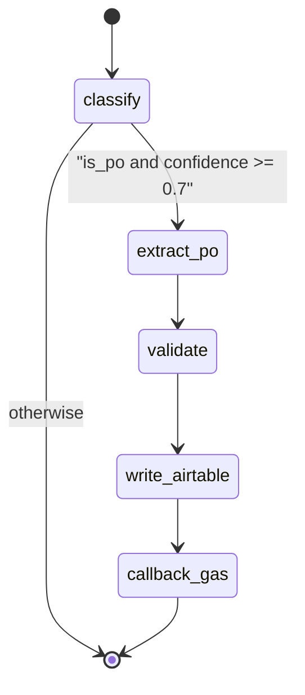
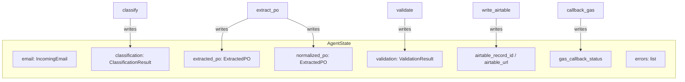
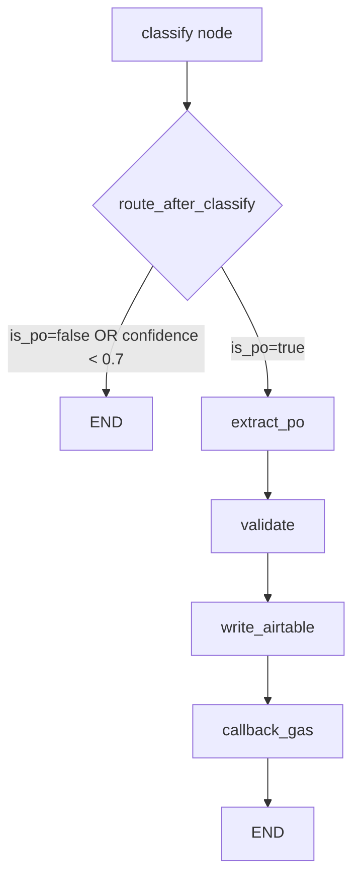
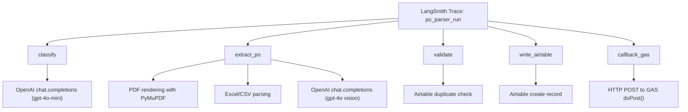
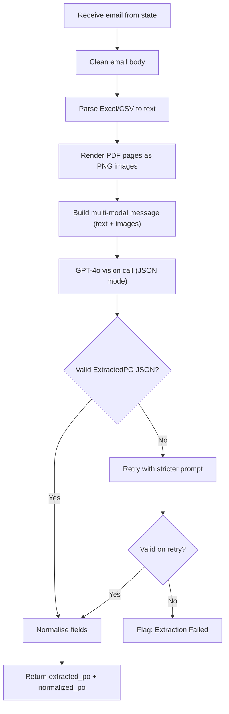

# LangGraph reference

## Why LangGraph (vs a simple script)

- **Typed state** (`AgentState`) shared across steps.
- **Conditional edges** after classification (PO vs skip).
- **LangSmith** can trace node boundaries when tracing env vars are set.
- **Studio** discovers the graph via root `langgraph.json`.

## `langgraph.json`

Must live at the **repository root**:

```json
{
  "graphs": {
    "po_parser": "./src/po_parser/po_parser.py:graph"
  },
  "env": "./.env",
  "python_version": "3.11",
  "dependencies": ["."]
}
```

Studio loads `graph` from `po_parser.py` (compiled graph from `build_graph()`). The `env` key auto-loads `.env` for Studio/CLI runs, `dependencies` tells the CLI where to find the local package, and `python_version` pins the runtime.

## Graph construction (`graph_builder.py`)

**Nodes (5):** `classify`, `extract_po`, `validate`, `write_airtable`, `callback_gas`.

**Edges:**

- `START` → `classify`
- `classify` → conditional `route_after_classify` → `extract_po` **or** `END`
- Linear chain: `extract_po` → `validate` → `write_airtable` → `callback_gas` → `END`

**Routing:** `route_after_classify(state)` in `nodes/routing.py` returns `"end"` if classification is missing, `is_po` is false, or `confidence < 0.7`; otherwise `"parse"`. Conditional map: **`{"parse": "extract_po", "end": END}`**.

## `AgentState`

```python
class AgentState(TypedDict):
    email: IncomingEmail
    classification: Optional[ClassificationResult]
    extracted_po: Optional[ExtractedPO]
    normalized_po: Optional[ExtractedPO]
    validation: Optional[ValidationResult]
    airtable_record_id: Optional[str]
    airtable_url: Optional[str]
    gas_callback_status: Optional[str]
    errors: list[str]
    processing_start_time: float
```

## Node-by-node reference

Signature pattern: **`(state: AgentState) -> dict`** — returned keys merge into state.

| Node (module) | Purpose | Reads (main) | Writes (main) | Dependencies |
|---------------|---------|--------------|---------------|--------------|
| `classify` (`classifier.py`) | PO vs non-PO + confidence | `email` | `classification`, `errors` | OpenAI JSON mode; rule fallback if no API key |
| `extract_po` (`extract_po.py`) | Parse all content + GPT-4o vision extraction + normalise | `email` | `extracted_po`, `normalized_po`, `errors` | fitz (PyMuPDF), openpyxl, pandas, OpenAI vision |
| `validate` (`validator.py`) | Rules + Airtable duplicate check | `normalized_po` | `validation` | `AirtableClient.find_po_by_number` |
| `write_airtable` (`airtable_writer.py`) | Persist PO + lines + files | `normalized_po`, `validation`, `email` | `airtable_record_id`, `airtable_url`, `errors` | pyairtable |
| `callback_gas` (`gas_callback.py`) | Notify GAS Web App | summary of state | `gas_callback_status`, `errors` | `GASCallbackClient.send_results` |

## Node specifications

### Shared pattern (every graph node)

- **Signature:** `def <name>_node(state: AgentState) -> dict`.
- **Reads:** use `state["key"]` / `state.get("key")`.
- **Writes:** return a **dict with only the keys that change** (LangGraph merges partial updates).
- **Errors:** use **try/except** where appropriate; append human-readable strings to **`errors`**.

### `route_after_classify` (`routing.py`)

- **Not** a graph node — a **routing function** passed to **`add_conditional_edges("classify", ...)`**.
- **Returns:** `"end"` or `"parse"` (keys must match the `add_conditional_edges` path map).
- **Logic:** if `classification` is **missing**, or **`is_po` is false**, or **`confidence < 0.7`** → **`"end"`** (pipeline stops). Otherwise **`"parse"`** → next node **`extract_po`**.

### `classify_node` (`classifier.py`)

- **Reads:** `email` — subject; body clipped to **500** chars for the user prompt; sender; attachment **filenames**.
- **OpenAI:** `chat_completion(..., model=settings.classification_model, json_mode=True)`. Parses JSON into `ClassificationResult` (`is_po`, `confidence`, `type`).
- **No API key / exception:** uses **`_rule_fallback`**: if subject contains **PO** or **PURCHASE ORDER** and an attachment name suggests **.pdf** / **.xlsx** / **.xls**, returns `is_po=True`, `confidence=0.6`; else `is_po=False`, `confidence=0.0`.

### `extract_po_node` (`extract_po.py`)

Single node replacing the old 6-node chain (`parse_body`, `parse_pdf`, `parse_excel`, `consolidate`, `extract`, `normalize`).

**Internals:**

1. **Clean email body** — strip HTML tags, normalise whitespace.
2. **Parse spreadsheets** — find Excel/CSV attachments, read with openpyxl/pandas, normalise headers, serialise to JSON text.
3. **Render PDFs** — find PDF attachments, use PyMuPDF to render each page at 150 DPI as PNG, base64-encode.
4. **Build multi-modal message** — system prompt with `ExtractedPO` JSON schema; user content array with text blocks (email body, spreadsheet JSON) and image blocks (PDF pages).
5. **Call GPT-4o** — `chat_completion(messages, model=extraction_vision_model, json_mode=True)`. Parse response into `ExtractedPO`. Retry once on parse failure.
6. **Normalise** — deterministic: dates → ISO, money → float, SKU → uppercase, customer → title case.

**Returns:** `extracted_po` (raw LLM output) + `normalized_po` (cleaned) + `errors`.

### `validator_node` (`validator.py`)

- **Reads:** `normalized_po`.
- **If None:** `ValidationResult(status=EXTRACTION_FAILED, issues=["No PO data extracted"])`.
- **Checks:** empty PO number or customer → issue; quantities ≤ 0 → issue.
- **Airtable duplicate** (when client enabled and PO# present): `find_po_by_number`; compare snapshot to stored `Raw Extract JSON`. Same → `DUPLICATE`. Different → `NEEDS_REVIEW`, `is_revised=True`.

### `airtable_writer_node` (`airtable_writer.py`)

- **Guards:** missing PO or validation → no write. Airtable not configured → `errors`, null ids.
- **Pure duplicate:** no new items; returns existing id and URL.
- **Revised:** `update_po_record`. **New:** `create_po_record` with standard fields + `create_po_items` for line items.
- **Attachments:** if `AIRTABLE_ATTACHMENTS_FIELD` set, upload per attachment.

### `gas_callback_node` (`gas_callback.py`)

- **Success flag:** `normalized_po` and `validation` exist and `validation.status != EXTRACTION_FAILED` → `"success"`; else `"error"`.
- **Payload:** `message_id`, `status`, `po_data`, `items`, `validation`, `confidence`, `airtable_url`, `processing_time_ms`, `errors`.
- **Call:** `send_results(payload)` — sync wrapper over async httpx.

---

## Graph diagrams

### State diagram



### AgentState flow



### Conditional routing



### LangSmith trace hierarchy



### extract_po internals



## Adding a node

1. Extend `AgentState` if new fields are needed.
2. Implement `(state: AgentState) -> dict` in `nodes/`.
3. `add_node` + `add_edge` / conditional edges in `graph_builder.py`.
4. Export from `nodes/__init__.py` if used by the builder.

## LangGraph Studio

1. Ensure **Docker** (or a local Python env) can run the project and that **`langgraph.json`** exists at the repo root.
2. Open **LangGraph Studio** from the LangSmith UI and connect to your dev server / project.
3. Select graph **`po_parser`** — nodes and edges match `graph_builder.py`.
4. Test by supplying an **`IncomingEmail`-shaped** initial state (same keys as `src/api/main.py` `initial` dict). Step through nodes and inspect merged state after each step.

## LangSmith tracing

- Auto-activates when **`LANGCHAIN_TRACING_V2=true`** and valid **`LANGCHAIN_API_KEY`** are set.
- Dashboard: [smith.langchain.com](https://smith.langchain.com) — traces show **node boundaries**, **LLM calls**, timing, and inputs/outputs.
- Use traces to **replay** or debug failed runs with adjusted inputs.
