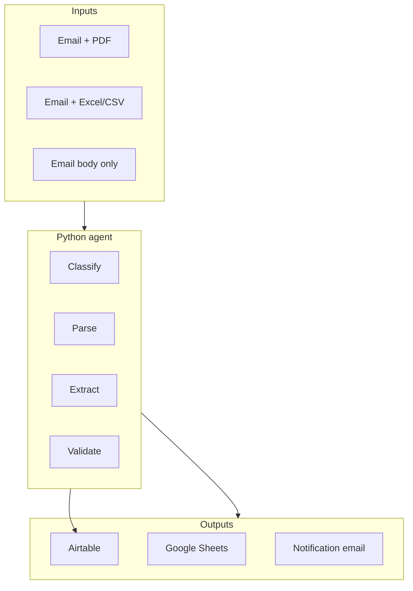
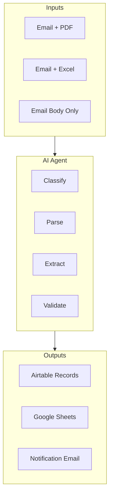

# Project overview

**Name:** PO Parsing AI Agent  
**Version:** 1.0.0 (application; docs track repo state)

This page aligns with the **Documentation Plan** in [`.cursor/plans/po_parsing_ai_agent_211da517.plan.md`](../../.cursor/plans/po_parsing_ai_agent_211da517.plan.md) (`PROJECT_OVERVIEW.md`).

## Business problem

Manual PO entry is slow, error-prone, and hard to scale. Teams often receive **50+ PO emails per day** in mixed formats (PDF, Excel, plain text). Manually copying into **Airtable** and tracking spreadsheets takes hours and introduces errors.

## Objective

Build an **AI-powered multi-format PO intake agent** that:

- Monitors **Gmail** (via GAS time-driven trigger).
- **Classifies** incoming emails with **GPT-4o-mini** (configurable).
- **Parses** PO documents: PDF, Excel/CSV, and **email body**.
- **Extracts** structured data with **GPT-4o-mini** (JSON), with **GPT-4o Vision** OCR fallback for scanned PDFs.
- **Writes** results to **Airtable** and **Google Sheets**, with **email notifications**.

Implementation path: **FastAPI** webhook → **LangGraph** `StateGraph` → OpenAI + Airtable → **HTTP callback** to GAS for Sheets, Gmail labels, and notifications.

## Scope (capabilities)

As specified in the project plan (Phase 1–4 scope):

- Email monitoring via **GAS** time-driven trigger.
- **PDF:** pdfplumber → PyMuPDF text → optional **OpenAI Vision** OCR.
- **Excel/CSV:** openpyxl + pandas; multi-sheet support.
- **Email body:** plain text from GAS; optional HTML stripping in `body_parser_node` when tags present.
- **AI:** classification and structured extraction (JSON mode); normalization; duplicate detection via Airtable.
- **Outputs:** Airtable **Customer POs** + **PO Items**; Google Sheets logging via GAS; Gmail notifications and labels.

## Success criteria (targets)

- **Classification:** high accuracy (plan target **>90%** on PO-like traffic); tune via prompts and models.
- **Parsing:** reliable across PDF (including OCR path), Excel/CSV, and body.
- **Data:** structured Airtable records **without manual entry** for the core fields; original attachments can be stored in Airtable when `AIRTABLE_ATTACHMENTS_FIELD` is set.
- **Workflow:** rows default to **Needs Review** (simple human-in-the-loop).
- **Observability:** full traceability via **LangSmith** when enabled.

## Out of scope / future (per plan)

- Multi-language POs as a first-class, fully tested feature.
- Auto-approval without review.
- ERP integration.
- Invoice-only / non-PO document product.
- Advanced analytics dashboard.

## Key principles (quoted from the plan)

1. *“This is not just a PDF parser. It is a multi-format intake agent that handles PDFs, Excel files, CSVs, and email body text — consolidating all sources for a single PO.”*

2. *“NO Google APIs from Python. ALL Google services go through GAS. Python only talks to OpenAI and Airtable.”*  
   (In practice, Python also **POSTs** to the GAS Web App URL — still no Google client libraries or GCP credentials in Python.)

## Tech stack summary

Python **3.11**, **FastAPI**, **LangGraph** `StateGraph`, **OpenAI** (**GPT-4o-mini** default for classification/extraction, **GPT-4o** for OCR), **GAS** + **clasp** (Gmail / Sheets / notifications), **Docker**, **Airtable**, **LangSmith**, **LangGraph Studio** (`langgraph.json` at repo root).

## Tech stack

| Layer | Technology |
|-------|------------|
| Runtime | Python 3.11 (Docker), Node 18+ (clasp) |
| API | FastAPI, Uvicorn |
| Orchestration | LangGraph `StateGraph` |
| LLM | OpenAI API (`gpt-4o-mini` default classify/extract, `gpt-4o` OCR) |
| Data | Airtable; Google Sheets via GAS |
| Dev tunnel | ngrok (local GAS → localhost) |

### Verbatim copy (project plan)

From `.cursor/plans/po_parsing_ai_agent_211da517.plan.md` — **Mermaid — High-Level System Overview** (labels as in the plan):

