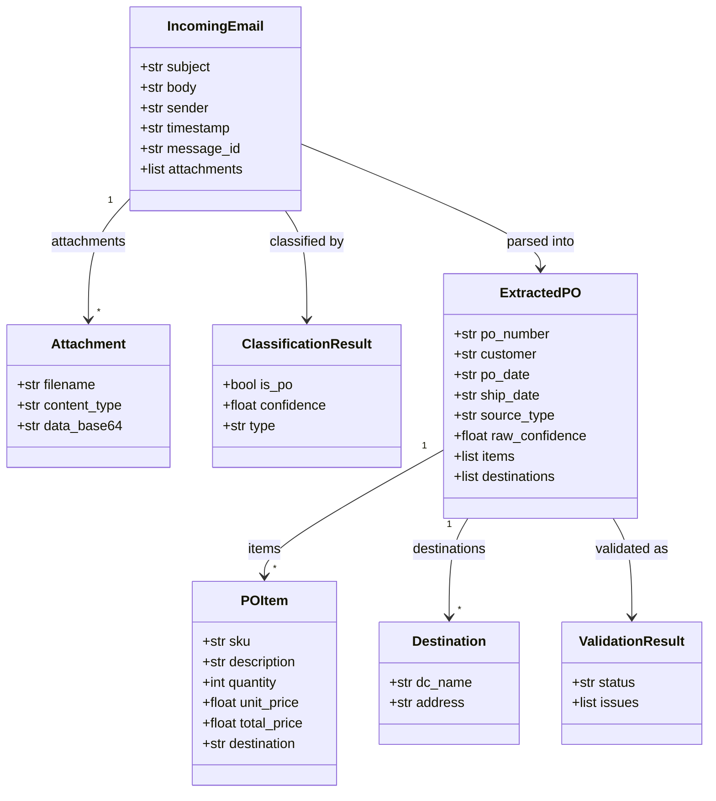

# Schemas reference

Source: `src/po_parser/schemas/` and `src/po_parser/schemas/states.py`. This file implements the **Documentation Plan** in [`.cursor/plans/po_parsing_ai_agent_211da517.plan.md`](../../.cursor/plans/po_parsing_ai_agent_211da517.plan.md) (`SCHEMAS_REFERENCE.md` / Phase 2.4): exact field names, types, defaults, JSON examples, and validation notes.

## `Attachment` (`email.py`)

| Field | Type | Required | Notes |
|-------|------|----------|--------|
| `filename` | `str` | Yes | Original attachment name |
| `content_type` | `str` | Yes | MIME type from GAS |
| `data_base64` | `str` | Yes | Standard base64 (not URL-safe) |

**Example:**

```json
{
  "filename": "PO_12345.pdf",
  "content_type": "application/pdf",
  "data_base64": "JVBERi0xLjQKJeLjz9MKMy..."
}
```

## `IncomingEmail` (`email.py`)

Webhook payload from GAS. All top-level string fields are **required** by the model; `attachments` defaults to **`[]`**.

| Field | Type | Required |
|-------|------|----------|
| `subject` | `str` | Yes |
| `body` | `str` | Yes |
| `sender` | `str` | Yes |
| `timestamp` | `str` | Yes (ISO 8601 from GAS) |
| `message_id` | `str` | Yes |
| `attachments` | `list[Attachment]` | No (default `[]`) |

**Example:**

```json
{
  "subject": "PO 00011830728",
  "body": "Attached is our PO.",
  "sender": "edi@customer.com",
  "timestamp": "2026-04-05T12:00:00.000Z",
  "message_id": "msg-xyz",
  "attachments": []
}
```

## `ClassificationResult` (`classification.py`)

| Field | Type | Required / constraint |
|-------|------|------------------------|
| `is_po` | `bool` | Yes |
| `confidence` | `float` | Yes, **0.0–1.0** (Pydantic `Field`) |
| `type` | `str \| None` | Optional — e.g. `purchase_order`, `invoice`, `shipping`, `other` |

Routing uses **`confidence >= 0.7`** and **`is_po`** in `route_after_classify`.

**Example:**

```json
{ "is_po": true, "confidence": 0.95, "type": "purchase_order" }
```

## `POItem` / `Destination` / `ExtractedPO` (`po.py`)

**`POItem`:** `sku`, `description`, `quantity`, `unit_price`, `total_price`, `destination` — all **optional** (`None` allowed).

**`Destination`:** `dc_name`, `address` — both optional.

**`ExtractedPO`:**

| Field | Type | Default / notes |
|-------|------|-----------------|
| `po_number` … `cancel_date` | optional `str` | Date strings as extracted |
| `items` | `list[POItem]` | default `[]` |
| `destinations` | `list[Destination]` | default `[]` |
| `source_type` | optional `str` | `pdf` / `spreadsheet` / `email` / `mixed` |
| `raw_confidence` | optional `float` | Model self-report |
| `total_amount` | optional `float` | |
| `currency` | `Optional[str]` | default **`"USD"`**; `@field_validator("currency", mode="before")` coerces `None` or empty string to `"USD"` (fixes LLM returning `null`) |
| `payment_terms`, `ship_to`, `bill_to` | optional `str` | |

**Example (Greenbrier-style, multi-line):** use multiple `items` and `destinations` as needed. **Example (Family Dollar–style, single line):** one `items` element with a single SKU.

```json
{
  "po_number": "FD-2026-001",
  "customer": "Family Dollar",
  "po_date": "2026-04-01",
  "ship_date": null,
  "cancel_date": null,
  "items": [
    {
      "sku": "FD-SKU-1",
      "description": "Retail product",
      "quantity": 500,
      "unit_price": 2.1,
      "total_price": 1050.0,
      "destination": null
    }
  ],
  "destinations": [],
  "total_amount": 1050.0,
  "currency": "USD",
  "payment_terms": null,
  "ship_to": null,
  "bill_to": null,
  "source_type": "pdf",
  "raw_confidence": 0.9
}
```

## `ValidationResult` (`validation.py`)

**`ValidationStatus` (enum):** `Ready for Review`, `Needs Review`, `Duplicate`, `Extraction Failed`.

| Field | Type | Default |
|-------|------|---------|
| `status` | `ValidationStatus` | Required |
| `issues` | `list[str]` | `[]` |
| `is_duplicate` | `bool` | `False` |
| `is_revised` | `bool` | `False` |
| `existing_record_id` | `str \| None` | `None` |

## `AgentState` (`states.py`) — LangGraph state (14 fields)

Plan: document every field, type, and **which node writes** it. `processing_start_time` is set once at graph entry (`src/api/main.py` initial state).

| Field | Type | Written by | Read by (typical) |
|-------|------|------------|-------------------|
| `email` | `IncomingEmail` | (input) | All nodes that need context |
| `classification` | `ClassificationResult \| None` | `classify` | Routing, `callback_gas` |
| `pdf_texts` | `list[str]` | `parse_pdf` | `consolidate` |
| `excel_data` | `list[dict]` | `parse_excel` | `consolidate` |
| `body_text` | `str \| None` | `parse_body` | `consolidate` |
| `consolidated_text` | `str \| None` | `consolidate` | `extract` |
| `extracted_po` | `ExtractedPO \| None` | `extract` | `normalize` |
| `normalized_po` | `ExtractedPO \| None` | `normalize` | `validate`, `write_airtable`, `callback_gas` |
| `validation` | `ValidationResult \| None` | `validate` | `write_airtable`, `callback_gas` |
| `airtable_record_id` | `str \| None` | `write_airtable` | `callback_gas` (indirect via state) |
| `airtable_url` | `str \| None` | `write_airtable` | `callback_gas` |
| `gas_callback_status` | `str \| None` | `callback_gas` | — |
| `errors` | `list[str]` | many nodes append | `callback_gas` |
| `processing_start_time` | `float` | API initial state | `callback_gas` (timing) |

Nodes return **partial dicts** that LangGraph merges into state.

## Diagram from project plan

Source: [`.cursor/plans/po_parsing_ai_agent_211da517.plan.md`](../../.cursor/plans/po_parsing_ai_agent_211da517.plan.md) (schema relationships — conceptual; `AgentState` is a `TypedDict`, not a Pydantic model).


