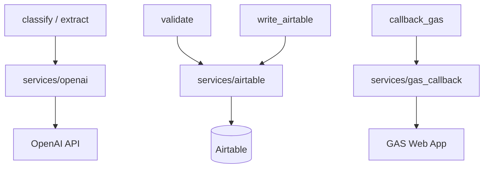
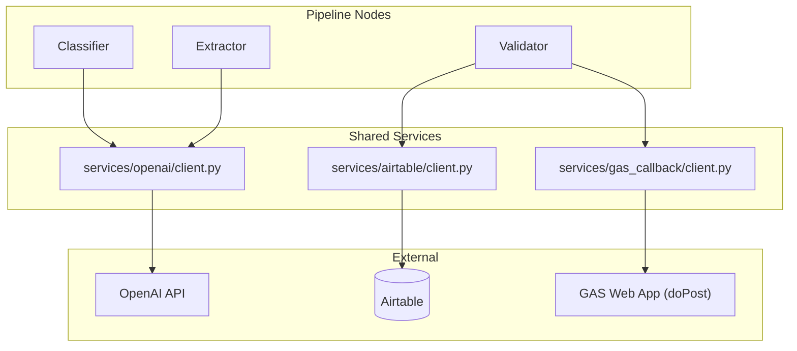

# Services reference

Implementation: `src/services/`. Used by LangGraph nodes, not by GAS. This file follows the **Documentation Plan** in [`.cursor/plans/po_parsing_ai_agent_211da517.plan.md`](../../.cursor/plans/po_parsing_ai_agent_211da517.plan.md) (`SERVICES_REFERENCE.md` / Phases 3.0–3.2): methods, settings, and which nodes call them.

## OpenAI (`services/openai/`)

**Settings** (`OpenAISettings`, env prefix `OPENAI_`):

| Field | Env | Default |
|-------|-----|---------|
| `api_key` | `OPENAI_API_KEY` | `""` (disabled if empty) |
| `classification_model` | `OPENAI_CLASSIFICATION_MODEL` | `gpt-4o-mini` |
| `extraction_model` | `OPENAI_EXTRACTION_MODEL` | `gpt-4o-mini` |
| `ocr_model` | `OPENAI_OCR_MODEL` | `gpt-4o` |
| `max_tokens` | `OPENAI_MAX_TOKENS` | `4096` |
| `temperature` | `OPENAI_TEMPERATURE` | `0.0` |

**`OpenAIClient`**

- `enabled` — true when API key present.
- `chat_completion(messages, model=None, json_mode=False) -> str`  
  - Default model when omitted: `classification_model`.  
  - `json_mode=True` sets `response_format` to JSON object.  
  - **Rate limit:** one retry after 2s on `RateLimitError`.
- `vision_completion(messages) -> str` — uses `ocr_model`; same rate-limit retry.

**LangSmith instrumentation:** At init, the raw `OpenAI` client is wrapped with **`langsmith.wrappers.wrap_openai`** when `LANGCHAIN_TRACING_V2=true`. This automatically captures token usage, inputs, and outputs for every OpenAI call in LangSmith traces. The helper function `_wrap(client)` handles this; if wrapping fails, tracing is silently disabled and the unwrapped client is used. A separate `_log_tokens(response, label)` helper logs token counts to Docker console logs.

**Used by:** `classifier` (passes `settings.classification_model`), `extractor` (passes `settings.extraction_model`), `pdf_parser` / OCR (uses `vision_completion` → `settings.ocr_model`).

**Error handling:** `RateLimitError` → **one retry** after **2s**; other **`openai.APIError`** subclasses propagate (fail the node unless caught upstream).

**Rate limits (indicative Tier 1, verify with OpenAI):** GPT-4o-mini ~**500 RPM** / **200K TPM**; GPT-4o ~**500 RPM** / **30K TPM** — PO volume is unlikely to exhaust these; OCR is the main 4o cost driver.

**Cost (plan ballpark):** ~**$0.01–0.03** per PO for classify + extract on mini models; **~$0.05–0.10 per page** when GPT-4o Vision OCR runs.

**Vision image part shape:**

```json
{
  "type": "image_url",
  "image_url": { "url": "data:image/png;base64,..." }
}
```

## Airtable (`services/airtable/`)

**Settings** (`AirtableSettings`):

- `AIRTABLE_API_KEY`, `AIRTABLE_BASE_ID`, `AIRTABLE_PO_TABLE`, `AIRTABLE_ITEMS_TABLE`
- `AIRTABLE_ATTACHMENTS_FIELD` — optional attachment field name on the PO table

**`AirtableClient`**

- **Init:** on construction, calls **`_resolve_table_ids()`** which fetches the base schema once via `base.schema().tables` and caches a **`name → tblXXX`** mapping in `self._table_ids`. This lets `record_url` produce valid Airtable web links.
- `enabled` — API key + base id present.
- `create_po_record(po_data: dict) -> str` — record id
- `update_po_record(record_id, po_data) -> str`
- `create_po_items(po_record_id, items: list[dict]) -> list[str]` — adds `Linked PO`
- `find_po_by_number(po_number) -> dict | None` — formula on `{PO Number}`; uses `first()`
- `upload_file_to_field(record_id, field_name, filename, content, content_type?)` — uses pyairtable **`upload_attachment`**
- `record_url(table_name, record_id) -> str` — looks up the real table ID (`tblXXX`) from the cached `_table_ids` map, producing URLs of the form `https://airtable.com/{base_id}/{table_id}/{record_id}` (three-segment format required by Airtable web app).

**Field names are case-sensitive** and must match the base (e.g. **`PO Number`**, **`Customer`**, **`Linked PO`** on line items).

**Linked records:** item rows include **`{"Linked PO": [po_record_id]}`** (array of parent record ids).

**Used by:** `validator` (`find_po_by_number`), `airtable_writer` (create/update/items/upload).

**Rate limits:** Airtable REST ~5 req/s per base; pyairtable may batch; writer does sequential creates.

## GAS callback (`services/gas_callback/`)

**Settings** (`GASCallbackSettings`):

- `GAS_WEBAPP_URL` → `webapp_url`
- `GAS_WEBAPP_SECRET` → `webapp_secret`
- `timeout` — default **30** seconds (not exposed in `.env.example`; override in code if needed)

**`GASCallbackClient`**

- **`async send_results_async(payload: dict) -> dict`** — copies `payload`, sets **`secret`** = `webapp_secret`, **`POST`**s JSON to `webapp_url` with `httpx.AsyncClient` and `follow_redirects=True`. On failure, **retries once** after **2s**; then returns an error-shaped dict.
- **`send_results(payload) -> dict`** — sync wrapper: **`asyncio.run(send_results_async(...))`** for LangGraph nodes.

**Important:** GAS **`doPost`** cannot rely on custom HTTP headers for auth. The **shared secret is in the JSON body** as **`secret`**, not as `x-webhook-secret` on this request. (The older plan snippet mentioning an `x-webhook-secret` header on the Python→GAS call is **incorrect** for this codebase.)

**Callback JSON contract (after merge of `secret`):** see plan §3.2 / [DATA_FLOW.md](DATA_FLOW.md). Minimal shape:

| Field | Role |
|-------|------|
| `secret` | Must match `GAS_WEBAPP_SECRET` |
| `message_id` | Gmail id for labeling |
| `status` | `"success"` or `"error"` (pipeline-derived) |
| `po_data` | Dump of normalized PO or `{}` |
| `items` | Line items list |
| `validation` | `{ "status", "issues" }` |
| `confidence` | Classifier confidence |
| `airtable_url` | Link when known |
| `processing_time_ms` | Wall time from `processing_start_time` |
| `errors` | List of pipeline strings |

**Used by:** `callback_gas` node only.



**Note:** Gmail and Google Sheets are **only** accessed from GAS. See [GAS_REFERENCE.md](GAS_REFERENCE.md).

## Diagram from project plan

Source: [`.cursor/plans/po_parsing_ai_agent_211da517.plan.md`](../../.cursor/plans/po_parsing_ai_agent_211da517.plan.md) (service interaction map). The **`Validator → GAS callback`** edge is conceptual in the plan; in code, **`write_airtable`** and **`callback_gas`** nodes perform Airtable writes and the GAS HTTP callback.


