# Testing guide

This file follows the **Documentation Plan** in [`.cursor/plans/po_parsing_ai_agent_211da517.plan.md`](../../.cursor/plans/po_parsing_ai_agent_211da517.plan.md) (`TESTING_GUIDE.md`).

## Layout (`tests/`)

| Folder | Purpose |
|--------|---------|
| **`tests/unit/`** | Node-level tests with **mocked** services — **no** live OpenAI/Airtable/GAS |
| **`tests/integration/`** | Full or partial pipeline with **real** APIs — requires valid `.env` |
| **`tests/sample_pos/`** | Sample PO PDFs/Excel/text for fixtures |

## Running pytest

```bash
pytest tests/unit/ -v
pytest tests/integration/ -v
pytest --cov=src tests/
```

Use Docker if your host lacks deps, e.g. `docker compose --profile production run --rm po-parser pytest tests/ -q` (service name from `docker-compose.yml`).

## Unit test strategy (plan — target modules)

| Module / focus | What to assert |
|----------------|----------------|
| `test_classifier.py` | Mock OpenAI: PO-like email → `is_po=true`; non-PO → `is_po=false`; optional rule-fallback path |
| `test_pdf_parser.py` | Sample PDFs: pdfplumber path, PyMuPDF fallback, OCR mocked |
| `test_excel_parser.py` | Multi-sheet, CSV, header alias mapping |
| `test_consolidator.py` | Given `body_text`, `pdf_texts`, `excel_data` → expected `consolidated_text` sections |
| `test_extractor.py` | Mock OpenAI JSON → valid `ExtractedPO`; malformed JSON → retry / errors |
| `test_normalizer.py` | Date strings `01/15/2026`, `January 15, 2026`, `2026-01-15` → ISO dates |
| `test_validator.py` | Mock `find_po_by_number`: new, duplicate, revised, missing PO# |
| `test_airtable_writer.py` | Mock create/update/upload — field names match Airtable |
| `test_gas_callback.py` | Mock `httpx` — payload includes **`secret`**, correct URL |

**Mocking:** `unittest.mock.patch` on **`OpenAIClient`**, **`AirtableClient`**, **`GASCallbackClient`**; shared fixtures in **`tests/conftest.py`** (add as tests grow).

## Integration test (plan)

- POST a **realistic `IncomingEmail`** JSON (or invoke `graph.invoke` with full initial state), then assert **Airtable** row(s) and that **GAS callback** was invoked (or use mock server capturing POST).

## Sample data

- Use **`tests/sample_pos/`** and any **`Description/Sample POs/`** (or equivalent) PO files referenced in the plan.

## Coverage goal

- Plan target: **≥ 80%** line coverage on **`src/`** for unit tests when the suite is mature.

## Mock E2E (Phase 1.5)

1. `.env` with `WEBHOOK_SECRET`, `GAS_WEBAPP_URL`, `GAS_WEBAPP_SECRET` (and GAS Script Properties aligned).
2. `docker compose --profile mock up` — runs `scripts/test_e2e_mock.py` on port **8000**.
3. `GET /health` should include `"mode":"mock"` (this is **not** returned by production `src.api.main`).
4. Expose with ngrok; set GAS `WEBHOOK_URL` to `https://<host>/webhook/email`.
5. Follow [14_PHASE_1_5_VERIFICATION.md](../setup/14_PHASE_1_5_VERIFICATION.md).

## Production pipeline (Docker)

1. Fill `.env` from `.env.example` (OpenAI, Airtable, LangSmith optional, secrets).
2. `docker compose --profile mock down` if running.
3. `docker compose --profile production up --build` — service **`po-parser`**, command `uvicorn src.api.main:app`.
4. `GET /health` → `status` + UTC `timestamp` only (no `mode` field).  
   **Windows PowerShell note:** use `curl.exe http://localhost:8000/health` or `Invoke-RestMethod http://localhost:8000/health` — bare `curl` in PowerShell is an alias for `Invoke-WebRequest` which produces verbose output (see [12_DOCKER_PRODUCTION_SETUP.md](../setup/12_DOCKER_PRODUCTION_SETUP.md)).
5. `POST /webhook/email` with valid `IncomingEmail` JSON and header `x-webhook-secret`.

## Local script (without full Docker production)

- `python scripts/test_e2e_mock.py` — useful for quick HTTP behavior checks; same mock health behavior as mock profile.

## Unit / integration tests

- Layout under `tests/unit`, `tests/integration`, `tests/sample_pos` (see each **README.md**). Expand pytest coverage as features grow.
- Run inside the container if dependencies match the image, e.g.  
  `docker compose --profile production run --rm po-parser pytest tests/ -q`  
  (adjust if you add a compose service for tests).

## LangGraph Studio

- Ensure `langgraph.json` at repo root with full config (`graphs`, `env`, `python_version`, `dependencies`).
- Use [06_LANGGRAPH_STUDIO_SETUP.md](../setup/06_LANGGRAPH_STUDIO_SETUP.md).
- Start with `langgraph dev` (requires local venv with `langgraph-cli[inmem]` installed and `PYTHONPATH` set to repo root).

## LangSmith

- Set `LANGCHAIN_TRACING_V2=true` and `LANGCHAIN_API_KEY`; open the project in the LangSmith UI to inspect runs.

## Checklist

| Check | Mock | Production |
|-------|------|------------|
| Health | `mode: mock` | UTC timestamp, no mode |
| Webhook | 202 + stub behavior | Full graph + OpenAI/Airtable |
| Secrets | Same as GAS | Same as GAS |

## Diagram from project plan (curriculum overview)

The **runtime curriculum** lives under [`docs/curriculum/`](../curriculum/README.md) (numbered walkthroughs 01–12). This Mermaid is the **Curriculum Overview** from [`.cursor/plans/po_parsing_ai_agent_211da517.plan.md`](../../.cursor/plans/po_parsing_ai_agent_211da517.plan.md) — use it as a step index when reading walkthrough docs.

```mermaid
flowchart LR
    subgraph step01 ["01: GAS Trigger"]
        Gmail[Gmail] --> GASCode[Code.gs]
    end
    subgraph step02 ["02: API Intake"]
        GASCode --> FastAPI[main.py]
    end
    subgraph step03 ["03: Graph Init"]
        FastAPI --> Graph[po_parser.py]
    end
    subgraph step04 ["04: Classification"]
        Graph --> Classify[classifier.py]
    end
    subgraph step05 ["05: Parsing"]
        Classify --> Parsers[body/pdf/excel]
    end
    subgraph step06 ["06: Consolidation"]
        Parsers --> Consolidate[consolidator.py]
    end
    subgraph step07 ["07: Extraction"]
        Consolidate --> Extract[extractor.py]
    end
    subgraph step08 ["08: Normalization"]
        Extract --> Normalize[normalizer.py]
    end
    subgraph step09 ["09: Validation"]
        Normalize --> Validate[validator.py]
    end
    subgraph step10 ["10: Airtable"]
        Validate --> AirtableW[airtable_writer.py]
    end
    subgraph step11 ["11: GAS Callback"]
        AirtableW --> Callback[gas_callback.py]
        Callback --> GASWebApp[WebApp.gs]
    end
    subgraph step12 ["12: Errors"]
        ErrorNode["Error paths"]
    end
```


