# Multi-Agent Platform -- Architecture Overview

This document provides a comprehensive visual guide to the entire platform: how both AI agents share a single backend, how GAS triggers and callbacks flow, and the internal LangGraph pipeline of each agent.

---

## 1. System-Level Architecture

The platform has three deployment units: a unified Python backend, a Next.js frontend, and a Google Apps Script project (separate repo). All communication between GAS and Python is via HTTP webhooks.

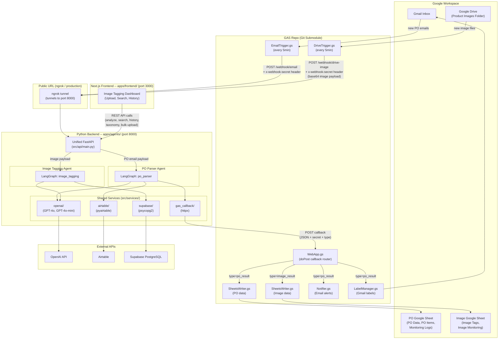

---

## 2. Port and URL Map

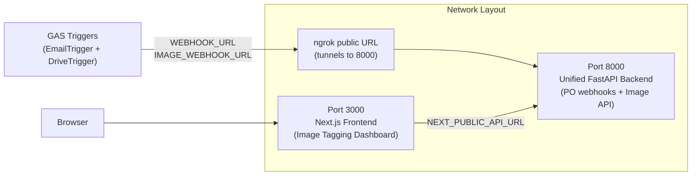

Both GAS triggers use the **same ngrok tunnel** (port 8000) with **different paths**:
- PO Parser: `https://<ngrok>/webhook/email`
- Image Tagger: `https://<ngrok>/webhook/drive-image`

---

## 3. API Endpoint Map

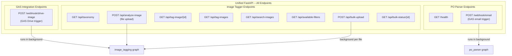

---

## 4. PO Parser Agent -- Full Pipeline

### 4a. End-to-End Sequence

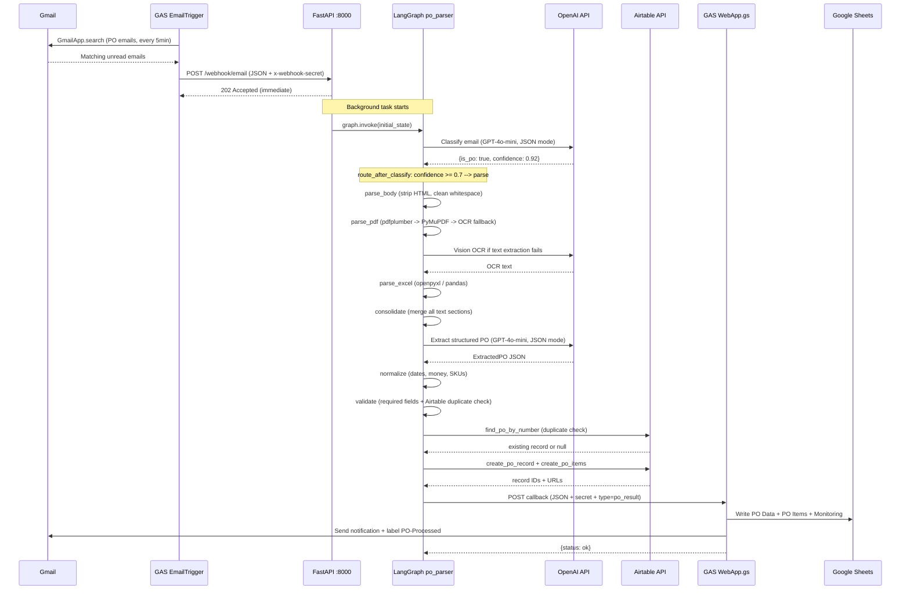

### 4b. LangGraph Node Flow

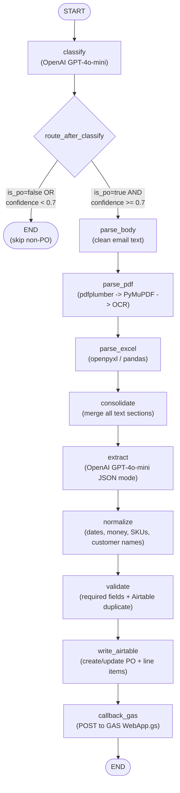

### 4c. PO Parser State Fields

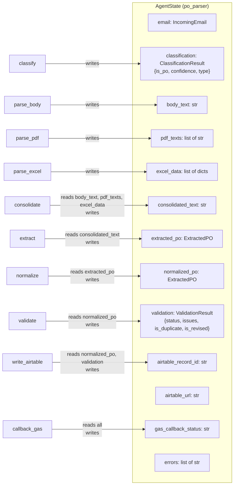

---

## 5. Image Tagging Agent -- Full Pipeline

### 5a. End-to-End Sequence (Browser Upload)

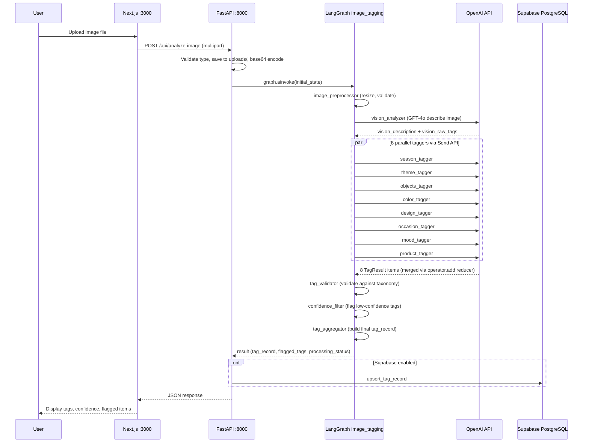

### 5b. End-to-End Sequence (GAS Drive Trigger)

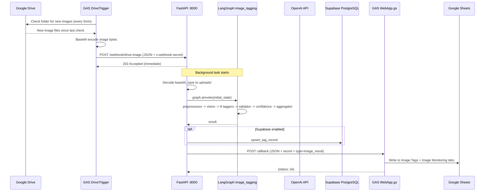

### 5c. LangGraph Node Flow

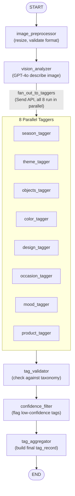

### 5d. Image Tagging State Fields

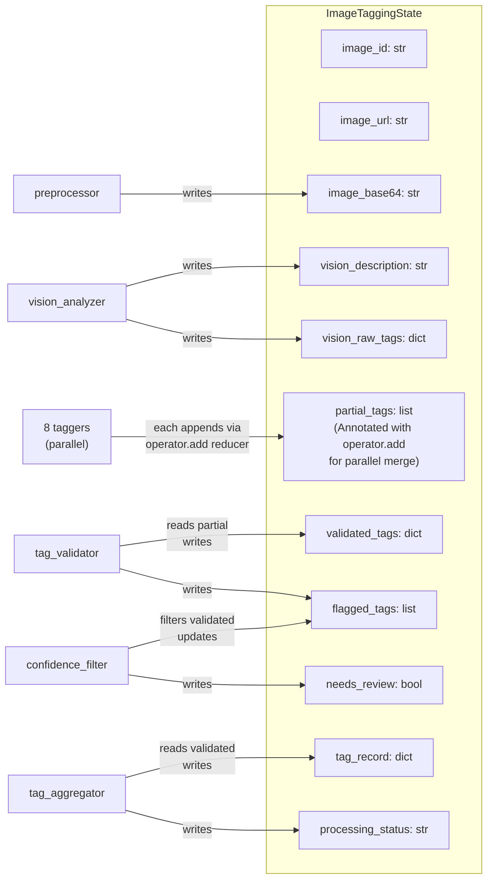

---

## 6. Shared Services Detail

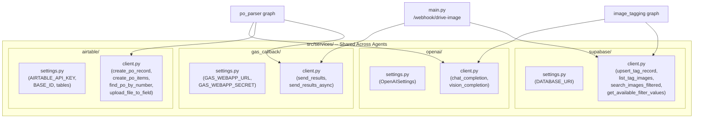

---

## 7. GAS Callback Routing

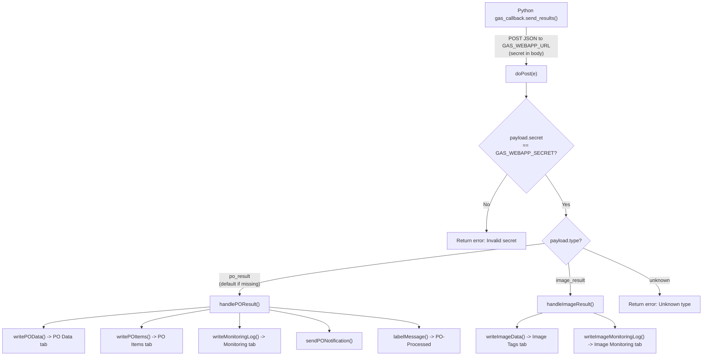

---

## 8. Data Persistence Map

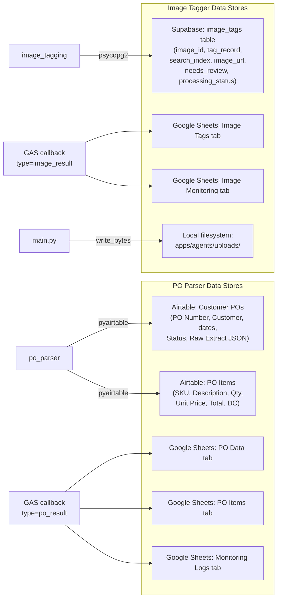

---

## 9. Security and Authentication

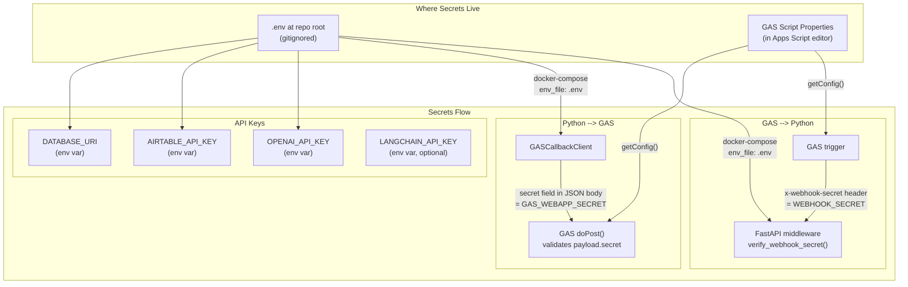

---

## 10. Deployment Architecture

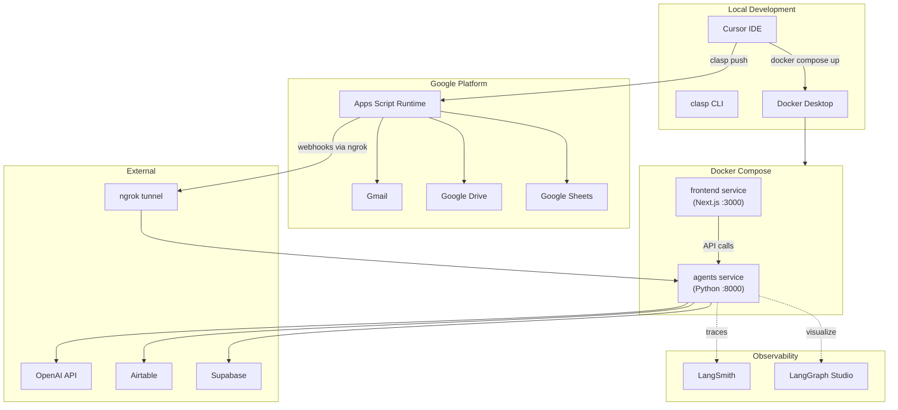